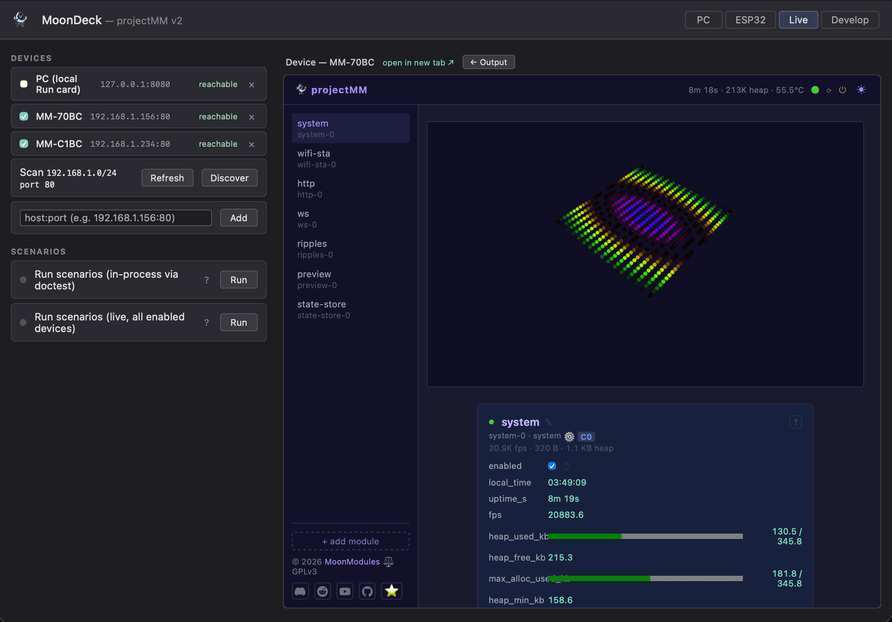

# projectMM

A modular runtime for real-time embedded systems — driving LED installations and DMX lighting. C++20, CMake, ESP32-first.

https://github.com/user-attachments/assets/b12b28ca-7e87-477a-942b-fcae601b721d

## What it is

**A modular runtime** for real-time, resource-constrained systems:

- **Fast and lean** — engineered for maximum speed and minimal resource usage; predictable frame timing on devices with as little as ~320 KB of RAM.
- **Modular** — effects, modifiers, layouts, drivers, and system services are all **MoonModules**, created and reconfigured at runtime.
- **Batteries included** — a browser UI, scheduling, and persistence are built in; control values and module configuration survive a reboot.
- **Generic web UI** — the [browser interface](docs/moonmodules/core/ui.md) renders any module from its declared controls; new modules need no UI code.
- **Multi-platform** — one source tree runs on low-cost ESP32 and Teensy, Raspberry Pi, and Windows / macOS / Linux desktops.

**Its main domain is lighting** — built on the runtime, extensible to other real-time domains:

- **Drives LED and DMX** — from a single matrix to large multi-fixture rigs and 3D structures.
- **Render pipeline** — a setup is composed from MoonModules (effects, modifiers, layouts, output drivers) into a pipeline, configured live from a browser.
- **Native 3D** — coordinates, effects, and layouts operate in 3D space, not only flat grids, with a real-time 3D preview.

The [commit history](https://github.com/ewowi/projectMM/commits/main) and [`docs/moonmodules/`](docs/moonmodules/) show what exists now.

## Architecture

The system is two layers, kept separate as much as practical:

- **Core** — a domain-neutral modular runtime. Everything is a [MoonModule](docs/moonmodules/core/MoonModule.md): effects, modifiers, layouts, drivers, and system services all share one class structure, lifecycle, and [control](docs/moonmodules/core/Control.md) mechanism. The core provides modules, a [Scheduler](docs/moonmodules/core/Scheduler.md), [persistence](docs/moonmodules/core/FilesystemModule.md), and platform abstraction — it knows nothing about lights. See [architecture.md](docs/architecture.md).
- **Light domain** — built on the core. Effects write into per-layer [buffers](docs/moonmodules/light/Buffer.md) → a [mapping LUT](docs/moonmodules/light/MappingLUT.md) translates logical to physical positions → [drivers](docs/moonmodules/light/DriverGroup.md) output to hardware or network. See [architecture-light.md](docs/architecture-light.md).

### Reference documents

| Document | Description |
|----------|-------------|
| [architecture.md](docs/architecture.md) | Core: the domain-neutral runtime — MoonModule, controls, scheduling, persistence, platform abstraction, build, testing |
| [architecture-light.md](docs/architecture-light.md) | Light domain: pipeline, [layouts](docs/moonmodules/light/LayoutGroup.md), [layers](docs/moonmodules/light/Layer.md), [effects](docs/moonmodules/light/EffectBase.md), modifiers, mapping, drivers, parallelism, memory strategy |
| [moonmodules/](docs/moonmodules/) | One spec page per module — [core](docs/moonmodules/core/) services and [light](docs/moonmodules/light/) effects, layouts, modifiers, drivers |
| [performance.md](docs/performance.md) | Per-module timing and memory, per platform |
| [testing.md](docs/testing.md) | Test inventory |
| [CLAUDE.md](CLAUDE.md) | Rules, constraints, and development process |

## How we work

projectMM is built with AI agents under tight human direction — the **product owner** decides what to build, reviews every line and every spec, and controls what gets committed. Agents write code in defined roles; they don't make decisions.

Meet the team: 🤖 Architect designs, 👽 Developer implements, 👾 Reviewer checks before merge, 🛸 Tester verifies, and 💀 Runner does quick build and check passes. Full team descriptions in [CLAUDE.md](CLAUDE.md).

A few principles run through everything:

- **Specs before code** — a module is documented in [`docs/moonmodules/`](docs/moonmodules/) — purpose, controls, behavior, edge cases, prior art — well enough to implement from before it is written.
- **One capability at a time** — each change is small, tested, and produces visible output.
- **Minimalism** — flat, predictable code; removing code beats adding it; every addition must pay for itself.
- **The system as it is** — code and docs describe the present; git history is the changelog.

The full rules and process are in [CLAUDE.md](CLAUDE.md).

## MoonDeck

Everything — build, flash, run, test, monitor, for both desktop and ESP32 — is driven from **MoonDeck**, a browser-based dev console:

```sh
uv run scripts/moondeck.py
```

Then open `http://localhost:8420`. See [scripts/MoonDeck.md](scripts/MoonDeck.md) for the full command reference.



## History

This is the current iteration of years of LED/light system development. Each prior project proved ideas this one builds on:

| Project | Description | Repo |
|---------|-------------|------|
| **WLED** | Open-source LED firmware (user/contributor since 2021) | [Aircoookie/WLED](https://github.com/Aircoookie/WLED) |
| **WLED-MoonModules** | WLED fork with advanced features | [MoonModules/WLED](https://github.com/MoonModules/WLED) |
| **StarLight** | Standalone LED firmware | [ewowi/StarLight](https://github.com/ewowi/StarLight) |
| **MoonLight** | Ground-up build: 60+ effects, memory-optimized mapping, 11 driver types | [MoonModules/MoonLight](https://github.com/MoonModules/MoonLight) |
| **projectMM v1** | First agentic build: proved the MoonModule pattern, 8 releases | [ewowi/projectMM-v1](https://github.com/ewowi/projectMM-v1) |
| **projectMM v2** | Lock-free buffers, multi-core scheduling, canvas UI | [ewowi/projectMM-v2](https://github.com/ewowi/projectMM-v2) |

Their lessons and proven patterns are distilled in [`docs/history/`](docs/history/) — the codebase this project cherry-picks from, never porting wholesale.

## Contributing

projectMM is a community project — built in the open, shaped by the people who use it. We'd love to hear from you:

- **Ideas and requests** — an effect, a layout, a driver, a fixture you want supported? [Open an issue](https://github.com/ewowi/projectMM/issues) and tell us.
- **Help build it** — pick something from the [issues](https://github.com/ewowi/projectMM/issues), or propose a MoonModule. See [How we work](#how-we-work) for the process.
- **Test on hardware** — run it on your panels, boards, and fixtures, and report what works and what doesn't.
- **Talk to us** — questions, show-and-tell, and design discussion happen on [Discord](https://discord.gg/TC8NSUSCdV).

Find the MoonModules community on [Discord](https://discord.gg/TC8NSUSCdV), [Reddit](https://reddit.com/r/moonmodules), [YouTube](https://www.youtube.com/@MoonModulesLighting), and [GitHub](https://github.com/MoonModules).

## License

See [LICENSE](LICENSE).
