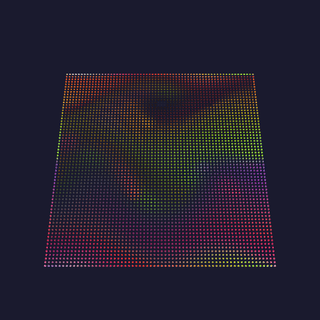
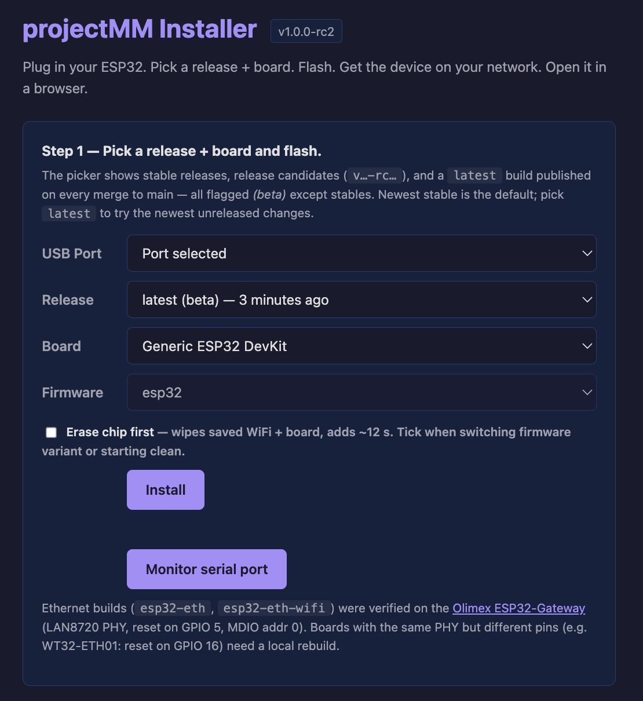

# projectMM

Drive large LED installations and DMX fixtures. One source tree drives ESP32, Teensy, Raspberry Pi, macOS, Windows and Linux.



**Flash an ESP32 from your browser and see lights in under a minute:** open the [web installer](https://moonmodules.org/projectMM/install/) in Chrome or Edge, plug in your device, and follow it. No toolchain, no recompile. The [Getting started guide](docs/gettingstarted.md) takes you from a blank board to a running light show.

No hardware handy? The [desktop build](https://github.com/MoonModules/projectMM/releases/latest) runs the same UI and effect pipeline on macOS, Windows and Linux, driving fixtures over Art-Net, DDP or E1.31.

If you like projectMM, give it a star, fork it, or open an issue. It helps the project get noticed.

## What you get

🎨 **Plug in, open a browser, see lights.** A live 3D preview of every effect, modifier and layout, controllable from the same tab. The interface renders any module from its declared controls.

🎛️ **A pipeline you build visually**: layouts, then layers of effects and modifiers, then drivers. Every change applies on the next frame, and settings persist across power cycles. Editing a pin map, a strand length or an output protocol on a running device needs no reboot.

🔵 **16,384 lights on a classic ESP32**, not only on an S3 or P4. Memory adapts from a 16x16 panel up to 128x128, degrading rather than crashing on tight devices.

🧊 **Native 3D throughout**: 2D and 1D are the cases where a dimension is size 1, so an effect never picks a mode.

💡 **DMX and addressable LEDs together**: RGB strips, RGBW pixels, par lights and moving heads through one pipeline.

🌐 **Industry protocols both ways**: send and receive [Art-Net](https://art-net.org.uk/), [E1.31/sACN](https://tsp.esta.org/tsp/documents/docs/ANSI_E1-31-2018.pdf) and [DDP](http://www.3waylabs.com/ddp/), interoperable with Falcon, Advatek, xLights, Resolume and LedFx.

🔌 **Parallel WS2812 output** over three ESP32 peripherals: RMT on every chip, the S3's LCD_CAM i80 bus, and the P4's Parlio engine, each with an on-device loopback test that bit-verifies the wire signal.

🎵 **Audio-reactive**: an I²S microphone drives a 16-band FFT spectrum and sound level.

🏠 **Home automation**: a device joins Homebridge and any MQTT hub for on/off, brightness and color. See [the MQTT module](docs/moonmodules/core/services.md#mqtt).

📁 **On-device file manager**: browse and edit the device filesystem from the browser, with drag-drop upload and [firmware update over the LAN](docs/moonmodules/core/services.md#firmware-update).

🛡️ **Robust to any input**: add, delete, replace or reconfigure any module in any order, at any grid size, and the device keeps running. Every crash found becomes a regression test.

Written against ESP-IDF directly with no third-party libraries, and with our own code rather than a fork: [why we write our own code](docs/why-we-write-our-own.md). How it is put together: [architecture.md](docs/architecture.md).

## Performance

A full render pipeline (effect, modifier, Art-Net output) on real hardware, at 128x128:

| Device | Lights | FPS |
|---|---:|---:|
| Desktop | 16,384 | 9,708 |
| Olimex `esp32` | 16,384 | 11 |
| LOLIN S3 N16R8 | 16,384 | 6 |

Smaller grids run far faster: a classic ESP32 holds over 1,500 FPS at 16x16 and 81 FPS at 64x64. Pick an Ethernet device when frame rate matters, and an S3 when you need PSRAM headroom for large buffers.

Per-grid and per-device tables, free-heap figures, and why WiFi costs what it does: [performance.md](docs/performance.md). The contracts CI enforces on every run live in [`test/scenarios/*.json`](test/scenarios/).

## Getting started

**ESP32**: open the [web installer](https://moonmodules.org/projectMM/install/) in Chrome or Edge. It walks you through device, firmware, flashing and network setup.



**Desktop**: download your build from the [releases page](https://github.com/MoonModules/projectMM/releases), then open `http://localhost:8080/`. Step by step with screenshots: [Installing projectMM on a desktop](docs/tutorials/installing-to-desktop.md).

- **macOS arm64**: `.dmg`, drag to Applications. Ad-hoc signed, so right-click and Open the first time.
- **Windows x64**: `-setup.exe` installs for your user without an admin prompt. Unsigned, so SmartScreen asks once.
- **Linux x64**: `.tar.gz`, or `.deb` on Debian, Ubuntu and Raspberry Pi OS.

**From source**: you need [uv](https://docs.astral.sh/uv/), CMake 3.20+ and a C++20 compiler, plus ESP-IDF v6.x for ESP32. Then launch MoonDeck, the browser-based dev console:

```sh
uv run moondeck/moondeck.py
```

Open `http://localhost:8420` to build, run, test, flash and discover devices. Full setup and every target: [building.md](docs/building.md).


## Documentation

| Document | What's in it |
|----------|--------------|
| [Getting started](docs/gettingstarted.md) | Blank board to running light show |
| [architecture.md](docs/architecture.md) | How the system is put together |
| [building.md](docs/building.md) | Build and flash for every target |
| [moonmodules/](docs/moonmodules/) | One page per module: [core](docs/moonmodules/core/) and [light](docs/moonmodules/light/) |
| [performance.md](docs/performance.md) | Timing and memory per platform |
| [testing.md](docs/testing.md) | What the tests cover |
| [coding-standards.md](docs/coding-standards.md) | How code here is written |
| [documentation-standards.md](docs/documentation-standards.md) | How docs here are written |
| [CLAUDE.md](CLAUDE.md) | Rules, constraints, and the process |

## How we work

projectMM is built by AI agents under tight human direction. Everything in this repository is authored by agents; the **product owner** writes none of it directly. What the product owner authors is the [process](CLAUDE.md), the [architecture](docs/architecture.md), and the [module specifications](docs/moonmodules/), then decides what to build, reviews every line, runs the hardware tests, and controls every commit and release. Agents write; the product owner thinks.

The roles, the principles and the full process: [CLAUDE.md](CLAUDE.md).

## History

This is the current iteration of years of LED and light-system development, and each prior project proved ideas this one builds on:

| Project | Description | Repo |
|---------|-------------|------|
| **WLED** | Open-source LED firmware (user and contributor since 2021) | [Aircoookie/WLED](https://github.com/Aircoookie/WLED) |
| **WLED-MoonModules** | WLED fork with advanced features | [MoonModules/WLED](https://github.com/MoonModules/WLED) |
| **StarLight** | Standalone LED firmware | [ewowi/StarLight](https://github.com/ewowi/StarLight) |
| **MoonLight** | Ground-up build: 60+ effects, memory-optimized mapping, 11 driver types | [ewowi/MoonLight](https://github.com/ewowi/MoonLight) |

We built and maintained these, so projectMM rests on our own hands-on experience. Their lessons are distilled in [`docs/history/`](docs/history/README.md). We carry the ideas forward and write our own code, crediting by name whoever inspired a feature.

## Credits

People whose work directly shaped parts of projectMM. We study their thinking with respect and write our own code against our architecture:

- **[WLED](https://github.com/wled/WLED) and [WLED-MM](https://github.com/MoonModules/WLED)**: projectMM is born out of WLED and takes the usermod idea further, where everything is a module. A projectMM device also acts as a WLED device and talks to WLED devices.
- **Frank ([softhack007](https://github.com/softhack007))**: main author of the WLED-MM audio-reactive usermod. The ideas behind [AudioService](docs/moonmodules/core/moxygen/AudioService.md), including the adaptive noise gate analyzed with his permission, descend from years of collaboration.
- **[troyhacks](https://github.com/troyhacks/WLED)**: reworked the WLED-MM audio DSP onto Espressif's [esp-dsp](https://github.com/espressif/esp-dsp) FFT, the same choice AudioService makes.
- **[Stefan Petrick](https://github.com/StefanPetrick)**: the generative-field vocabulary from [Animartrix](https://github.com/StefanPetrick/animartrix), [FunkyNoise](https://github.com/StefanPetrick/FunkyNoise) and [ColorTrails](https://github.com/StefanPetrick/ColorTrails). [Aurora](docs/moonmodules/light/effects.md#aurora), [PolarNoise](docs/moonmodules/light/effects.md#polarnoise), [Tunnel](docs/moonmodules/light/effects.md#tunnel) and [Trails](docs/moonmodules/light/effects.md#trails) sit in that tradition, written on the published algorithms underneath.
- **[hpwit](https://github.com/hpwit) (Yves Bazin)**: the clockless I2S, RMT and Parlio driver techniques, and the [ESPLiveScript](https://github.com/hpwit/ESPLiveScript) engine behind MoonLive.
- **Christophe Gagnier ([@Moustachauve](https://github.com/Moustachauve))**: author of the native [WLED-Android](https://github.com/Moustachauve/WLED-Android) and [WLED-iOS](https://github.com/Moustachauve/WLED-iOS) apps, whose source let projectMM devices appear in them.
- **The [Improv Wi-Fi](https://github.com/improv-wifi) project**: the open serial provisioning standard the web installer uses.
- **[FastLED](https://github.com/FastLED/FastLED)**: the canonical LED-effects library whose names and models projectMM carries forward (`scale8`, `sin8`, the gradient-palette model, the `beatsin8` family) so a contributor recognizes them on sight. The implementations are our own, integer-only and hot-path-tuned.
- **[FPP](https://github.com/FalconChristmas/fpp) (Falcon Player)**: the show player that prompted [PanelCardDriver](docs/moonmodules/light/drivers.md#panelcard): if a Linux host can feed a wall of HUB75 panels, so can the board already rendering them.
- **[Tasmota](https://github.com/arendst/Tasmota) and Mathieu Carbou's [MycilaSafeBoot](https://github.com/mathieucarbou/MycilaSafeBoot)**: the safeboot pattern behind [MoonBase](docs/architecture.md#moonbase-the-second-boot-image), our from-scratch minimal take on it.
- **Damian Schneider ([dedehai](https://github.com/DedeHai))**: author of the WLED Particle System, whose shape our [particle kernel](docs/moonmodules/light/power-functions.md#particles) follows in fixed point.
- **wladi ([myhome-control](https://shop.myhome-control.de))**: designer of the [MHC-WLED ESP32-P4 shield](https://shop.myhome-control.de/en/ABC-WLED-ESP32-P4-shield/HW10027), and the source of the pinout details that got its line-in audio working.

## Contributing

projectMM is a community project, shaped by the people who use it:

- **Ideas and requests**: an effect, a layout, a driver, a fixture you want supported? [Open an issue](https://github.com/MoonModules/projectMM/issues).
- **Help build it**: pick something from the [issues](https://github.com/MoonModules/projectMM/issues), or propose a module. The process is in [CLAUDE.md](CLAUDE.md).
- **Test on hardware**: run it on your panels and fixtures, and report what works.
- **Talk to us**: [Discord](https://discord.gg/TC8NSUSCdV), [Reddit](https://reddit.com/r/moonmodules), [YouTube](https://www.youtube.com/@MoonModulesLighting), [GitHub](https://github.com/MoonModules).

## License

See [LICENSE](LICENSE).
