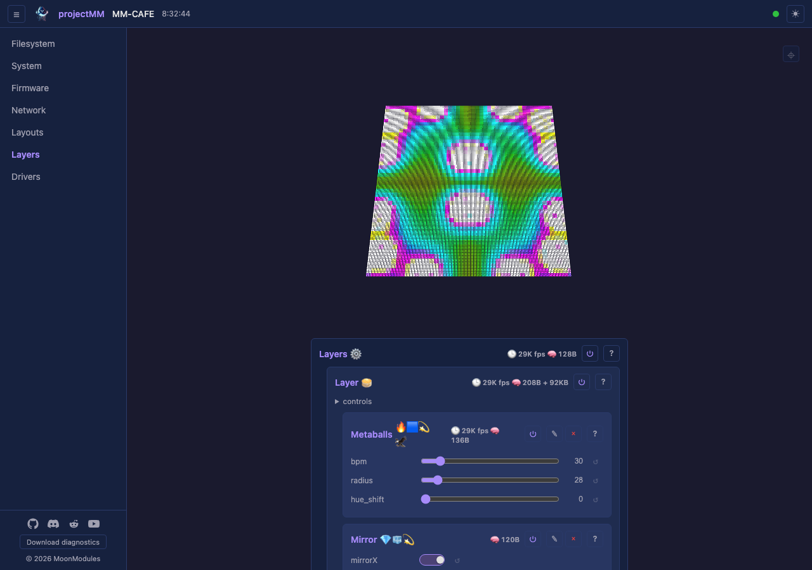

# Architecture

This document is the agreed-up-front **architecture contract**: what projectMM is designed to be. Most of it describes the system as it is today; a few load-bearing design decisions are settled but not yet implemented. Those are marked **🚧: designed, not implemented yet (high priority for release 2)**. The 🚧 marker means the design is committed (this is how it *will* work, and code should be written toward it), not that it's optional or undecided. Anything without the marker is live today.

Coding conventions live in [coding-standards.md](coding-standards.md); how to build and run lives in [building.md](building.md); what is tested lives in [testing.md](testing.md).

## Contents

- [Architecture](#architecture)
  - [Contents](#contents)
  - [The problem](#the-problem)
  - [Core and light domain](#core-and-light-domain)
- [Core](#core)
  - [MoonModules](#moonmodules)
    - [Lifecycle propagation to children](#lifecycle-propagation-to-children)
  - [Controls](#controls)
  - [Persistence](#persistence)
  - [Parallelism](#parallelism)
  - [Data exchange between modules](#data-exchange-between-modules)
  - [Event triggering between modules](#event-triggering-between-modules)
    - [Live reconfiguration: every change applies without a reboot](#live-reconfiguration-every-change-applies-without-a-reboot)
  - [Robustness](#robustness)
  - [Hot path discipline](#hot-path-discipline)
  - [Platform abstraction](#platform-abstraction)
  - [Firmware vs deviceModel vs board](#firmware-vs-devicemodel-vs-board)
  - [Peripherals](#peripherals)
  - [Multi-device runtime](#multi-device-runtime)
    - [Device name: one identity, every network name derives from it](#device-name-one-identity-every-network-name-derives-from-it)
- [Light domain](#light-domain)
  - [The pipeline](#the-pipeline)
  - [3D from the start](#3d-from-the-start)
  - [Layouts and Layout](#layouts-and-layout)
  - [Layers and Layer](#layers-and-layer)
  - [Effects](#effects)
    - [Dimensionality](#dimensionality)
    - [Robustness rules](#robustness-rules)
  - [Modifiers](#modifiers)
  - [Mapping and blending](#mapping-and-blending)
  - [Drivers](#drivers)
  - [Memory strategy](#memory-strategy)
    - [Buffer types](#buffer-types)
    - [Adaptive allocation](#adaptive-allocation)
    - [Degradation cascade](#degradation-cascade)
    - [Invariants](#invariants)
    - [Per-module reporting](#per-module-reporting)
    - [Scaling to available memory](#scaling-to-available-memory)
  - [Multi-device sync](#multi-device-sync)
- [Web UI](#web-ui)
  - [What we leave undesigned](#what-we-leave-undesigned)

## The problem

Build a modular runtime for resource-constrained embedded devices that the same source compiles for, unmodified, on ESP32, Teensy, desktop, and Raspberry Pi. The runtime must:

- Compose behaviour from small, uniform units (modules) that can be created, configured, reordered, and removed at runtime, including from a network API.
- Expose every module's parameters generically so a single web UI renders any module with zero per-module UI code.
- Run a hot loop with predictable timing and zero steady-state heap allocation on devices with as little as ~320 KB of RAM.
- Persist configuration across reboots, exploit multiple CPU cores where present, and keep all platform-specific code behind one boundary.

The first concrete use of this runtime is lighting: drive 10,000+ addressable LEDs and DMX fixtures (RGB(W) pars, moving heads, dimmers) across multiple synchronised devices at high frame rates. The runtime is general enough that other real-time domains (audio synthesis, motor control) could be layered on the same way; lighting is the only domain implemented today.

## Core and light domain

The system is two layers, separated as much as practical:

- **Core**: MoonModule base, controls, scheduling, persistence, platform abstraction, system services (HTTP, WiFi, filesystem). Domain-neutral. Knows nothing about lights.
- **Light domain**: light values, layouts, layers, mapping, blending, effects, modifiers, LED drivers, ArtNet/DDP. Built on top of the core.

When mixing is needed (for performance or simplicity), it must be an explicit decision: consciously choosing minimalism over separation, not accidentally blurring the boundary. Use domain-neutral naming in those cases ("producer buffer" not "LED buffer", "output driver" not "LED driver" in core interfaces) to keep the door open for future separation.

# Core

The core's job is the runtime: modules, their lifecycle, their parameters, how they're scheduled, how they're persisted, how they reach the platform underneath.

## MoonModules

The core building block is a **[MoonModule](moonmodules/core/MoonModule.md)**. Everything is a MoonModule, not just effects, modifiers, layouts, and drivers, but also system services (HTTP server, WebSocket server, file server, WiFi, mDNS, OTA updates) and [peripherals](#peripherals) (sensors and actuators bridging to hardware/network). The core itself is minimal: MoonModule base, buffer management, a [Scheduler](moonmodules/core/Scheduler.md).

This means:

- Every MoonModule shares the same class structure, lifecycle (`setup`, `loop`, `teardown`), and controls. Learn the pattern once, apply it everywhere.
- System services get controls for free: HTTP port, WiFi SSID, mDNS hostname are all configurable through the same UI as effect parameters.
- Capabilities are modular: no WiFi? don't load the WiFi MoonModule. No `#ifdef`s needed.
- System MoonModules that listen (HTTP, WebSocket) poll in their `loop()`, the standard pattern for embedded servers.
- The scheduler handles init-order dependencies between system MoonModules (e.g. WiFi before HTTP, HTTP before WebSocket).

Modules can be added, replaced, reordered, or removed at runtime. On removal (teardown), all allocated resources are cleaned up.

### Lifecycle propagation to children

A MoonModule that owns children gets the standard lifecycle methods propagated to them automatically:

- `setup()` and `teardown()`: chain into children. Teardown reverse-iterates so children clean up before the parent does.
- `loop()`, `loop20ms()`, `loop1s()`: tick each child gated by the same rule the Scheduler applies to top-level modules (`!respectsEnabled() || enabled()`, where modules that opted out of the enabled gate keep ticking, the rest tick only when enabled), with per-child timing accumulated into the child's own `loopTimeUs()`.
- `onBuildControls()` and `onBuildState()`: chain into children.

This means a container module gets correct lifecycle handling for its children without writing the iteration itself. Leaf modules (no children) pay one predicted-not-taken branch per call, sub-nanosecond. When a container overrides one of these methods to add its own work, the chain-to-base convention (parent-before vs child-before per callback) lives in [coding-standards.md § Override-and-chain convention](coding-standards.md#override-and-chain-convention).

**ModuleFactory** is a static registry mapping type names (strings) to create functions. The HTTP API uses it to create modules at runtime (`POST /api/modules {"type":"NoiseEffect"}`); the main pipeline in `main.cpp` constructs modules directly. Registration captures `sizeof(T)` for memory reporting:

```cpp
ModuleFactory::registerType<NoiseEffect>("NoiseEffect");
```

ModuleFactory is core infrastructure ([`src/core/ModuleFactory.h`](../src/core/ModuleFactory.h)), not itself a MoonModule.

**Dynamic over fixed-size.** Children, module lists, control sets, anything structural, grow on demand from the heap during `setup()`. Fixed-size arrays impose arbitrary limits, waste memory on instances that don't use the full capacity, and cost memory on instances that need none (e.g. leaf modules with zero children). The hot path only iterates these arrays: same pointer arithmetic as a fixed array, no performance difference.

**Self-reporting.** Every MoonModule reports its own footprint and cost: `classSize()` (the `sizeof` of the class instance, captured at registration), `dynamicBytes()` (heap allocated during `onBuildState`), and `loopTimeUs()` (average time its `loop` took, accumulated per tick). These surface in `/api/system`, console output, and scenario tests: the same numbers for an effect, a driver, or a system service, because they're a base-class feature, not a light-domain one.

Each MoonModule is documented in [`docs/moonmodules/`](moonmodules/) as it is built.

## Controls

Every MoonModule exposes **[controls](moonmodules/core/Control.md)**: runtime-configurable parameters visible in the web UI. A grid layout exposes width, height, depth. An ArtNet driver exposes destination IP and universe. A fire effect exposes speed, cooling, sparking.

Controls bind to MoonModule member variables. The variable's default is the control's default. The hot path reads the variable directly, no function call. When a control value changes, the system notifies the owning MoonModule for cold-path reactions: recompute a derived table, re-size a buffer, re-bind a socket (the three-tier mechanism is [§ Event triggering between modules](#event-triggering-between-modules)).

Controls are dynamic: when a value changes, the control set can be rebuilt. A select control that picks a mode can show/hide other controls based on the choice.

Prefer `uint8_t` (0–255) for slider controls. Minimises per-control memory, aligns with DMX channel values, keeps the UI range manageable.

Controls are the bridge between the [web UI](moonmodules/core/ui.md) and the running module tree: the UI renders a control from what the MoonModule declares, and a value the user changes there writes straight back into the module's member variable. The exact control types (slider, toggle, colour picker, text input, dropdown) are defined in the [UI spec](moonmodules/core/ui.md). The principle: modules declare what they need, the UI renders it.

## Persistence

Control values and each module's `enabled` flag are persisted to flash so settings survive a reboot. The mechanism lives in [FilesystemModule](moonmodules/core/FilesystemModule.md):

- **Storage**: one flat JSON file per top-level module under `/.config/<TypeName>.json`. Children are encoded positionally with `<index>.` key prefixes — a deliberately flat file shape loaded by the cheap first-match key helpers in `core/JsonUtil.h`. A control whose *value* is structured (a List control's array of objects) round-trips that array with the recursive reader in the same header, via the control's own restore hook; the file's top level stays flat, the structure lives inside one control's value.
- **Lifecycle**: `Scheduler::setup()` runs four phases: (1) `onBuildControls` binds every module's full control set, (2) the FilesystemModule load hook overlays persisted values onto the bound variables, (2b) `rebuildControls` re-evaluates conditional `hidden` flags against the loaded state, (3) each module's own `setup()` runs with persisted values already in member variables, (4) `onBuildState` sizes buffers. Modules themselves know nothing about persistence; they just bind their variables.
- **Save trigger**: HttpServerModule marks the target module dirty on every successful control mutation. FilesystemModule debounces 2 s in `loop1s()`, walks the tree, writes any subtree containing a dirty descendant via atomic write-and-rename.
- **Conditional controls**: every conditional control is always bound; the module sets a `hidden` flag (`controls_.setHidden(i, …)`) to tell the UI not to render it. The load path can therefore find persisted values regardless of the live conditional state.
- **Code-wired children survive a stale file**: some children aren't created by the user; `main.cpp`'s boot wiring attaches them (`ImprovProvisioningModule` under `NetworkModule`; `NetworkSendDriver`, `PreviewDriver` under their parents). Each such child calls `markWiredByCode()` after `addChild()`, a one-bit flag meaning *"I belong here because the code put me here, not because a saved file or a user asked for me."* The problem it solves: persistence reconciles the live tree to match the saved JSON, so a child that exists in code but is absent from an older saved file (written before that child was added) would be trimmed on load. The flag tells the apply step to keep it. Children added through the HTTP API or recreated from JSON stay unmarked; those follow the file's tree shape exactly, so UI deletes still take effect.

How persistence reaches the Scheduler without the Scheduler depending on it: the Scheduler exposes a **function-pointer hook** (`setLoadAllHook`) that the load phase calls if set. FilesystemModule registers its load routine through that hook at startup; the Scheduler never includes or names FilesystemModule (no circular dependency, and persistence is fully optional). With no FilesystemModule registered the hook is null, the load phase is a no-op, and the system runs with member-initialised defaults.

## Parallelism

On multi-core systems (ESP32 has 2 cores, desktop / RPi have many), the system exploits parallelism by assigning MoonModules to specific cores. Each MoonModule can declare a core affinity. The scheduler respects this when pinning tasks. On single-core or desktop systems, affinity is ignored and everything runs on available threads.

The model is **producers vs consumers**: producers generate data, consumers process and output it. The light domain instantiates it concretely: effects are producers, drivers are consumers.

Today the pipeline runs **single-threaded**: `Scheduler::tick()` runs the producers (effects), then the blend+map, then the consumers (drivers) in sequence on one core. With one thread there's no concurrent access and therefore no lock: the consumer always reads a fully-written frame because the producer already finished this tick.

**🚧 Two-core double-buffer handover.** The committed design runs producer and consumer on **separate cores** so the consumer transmits frame N while the producer fills frame N+1: the throughput win the single-thread loop leaves on the table. The hand-off is an **atomic double-buffer swap**, not a held lock: the producer fills buffer A; when done it atomically hands A to the consumer and starts filling B; the consumer copies/encodes A out (to its DMA buffer or socket) and, when finished, signals the producer that A is free to fill again. Neither side ever reads or writes the buffer the other currently owns, so the synchronisation is a single atomic flag/pointer swap rather than a lock around the whole frame. This matters because the consumer's copy-out (LED DMA encode, ArtNet packetise) is slow relative to a buffer fill: without the swap the producer would lap the consumer and the consumer would read a half-written frame (a visible glitch). Which buffers play the double-buffer role is covered in [§ Memory strategy](#memory-strategy).

## Data exchange between modules

When one module produces data another module reads on the hot path, the pattern is the same throughout the codebase. Two shapes, both core-defined and domain-neutral:

**Shared-struct (pull).** The reader holds a pointer to the producer's data and reads it when it needs it.

- The **producer owns a small POD struct** as a member, overwritten in place each tick. No allocation per frame.
- A **plain-data header** declares the struct. Both producer and consumer include it; neither needs to know the other's class.
- The producer exposes the struct via a `const`-returning getter (or a `setX(const Foo*)` setter on the consumer).
- The **consumer holds a `const Foo*`** received once at wiring time in `main.cpp`, and reads it on the hot path each frame.

No registry, no subscription, no event bus. The consumer reads the latest value when it needs it; if the producer wrote nothing this tick, the consumer sees the previous value (acceptable for the kinds of data this exchanges: small state structs, periodic captures). This pull pattern is lock-free **for a small POD struct overwritten in place**: a reader on another core might catch a half-updated struct, but the result is one slightly-inconsistent read of a few fields that self-corrects next tick, visually harmless for the gyro/sensor data this carries, and cheaper than a lock. That tolerance does **not** extend to a large frame buffer the consumer copies out wholesale (an LED DMA buffer, an ArtNet packet): there a half-written read is a visible glitch, so that hand-off uses the 🚧 two-core double-buffer swap from [§ Parallelism](#parallelism), not this lock-free pull.

**Push through a domain-neutral sink.** When the producer should hand bytes to a generic core service rather than expose a struct, the core defines a narrow interface and the producer pushes to it. The producer owns the data and its wire format; the core sink (the interface's implementer) knows only "take these bytes and do my generic job"; it has zero knowledge of what the bytes mean or which domain produced them. `BinaryBroadcaster` (`HttpServerModule` implements it: "broadcast these bytes to all WebSocket clients") is the example; the producer side lives in the light domain (see [§ The pipeline](#the-pipeline)).

Both shapes extend without ceremony to any future producer/consumer pair (a sensor module owning a state struct, an effect reading it through a `const Foo*` set at wiring time; or a module pushing bytes to a core sink). Neither is pub/sub: there's one producer per data kind and the consumer explicitly wants that specific data: the registry overhead and listener-lifecycle complexity of pub/sub buy nothing.

## Event triggering between modules

A control changes, or the module tree is mutated (a child added, deleted, replaced, moved), and other modules may need to react. The framework provides a three-tier split so each change costs only as much as it has to, from cheapest to most expensive:

1. **`onUpdate(controlName)`**: runs on *every* control change, but only on the module whose own control changed. A cheap, in-place, per-control reaction that touches nothing else: recompute a small derived table, re-bind a socket. Default no-op.
2. **`controlChangeTriggersBuildState(controlName)`**: a gate, default `false`. A module returns `true` only for controls that change the size or shape of its derived state (and thus may ripple to other modules); for controls that just tweak a value in place it stays `false`. When `true`, the framework runs the tree-wide rebuild; when `false`, it doesn't.
3. **`onBuildState()`**: the module (re)builds its derived state (buffers, tables) for the current control values. Reached via `Scheduler::buildState()`, the coordinator-driven sweep that walks every module's `onBuildState`.

`Scheduler::buildState()` fires from two triggers: a tier-2 gate returning true after a control change, **and** any tree mutation (HTTP add/delete/replace/move handlers all call it unconditionally, since a structural change is rare and unambiguously needs a rebuild). Both triggers funnel through the same sweep; each module's `onBuildState` is idempotent (e.g. an effect only reallocs when its grid count actually changed), so over-rebuilding is wasted work, not a correctness hazard.

This is the recognised layout/prepare-pass pattern: JUCE's `prepareToPlay` and UIKit's `layoutSubviews` work the same way: a framework-driven sweep over every object of the primary type, gated by per-object metadata (WPF's `AffectsMeasure`, here `controlChangeTriggersBuildState`). Not pub/sub: the publisher (HttpServerModule, or the mutation site) explicitly tells the coordinator to run the pass; the coordinator explicitly walks every module. The light domain consumes this mechanism for its mapping rebuild (see [§ Mapping and blending](#mapping-and-blending)) but the mechanism itself is core and applies to any module with derived state.

### Live reconfiguration: every change applies without a reboot

A direct consequence of the three tiers above is a property worth naming, because it sets projectMM apart from most LED-controller firmware (where changing a pin map, strand length, or output protocol means editing a config and **rebooting**): **every MoonModule reconfigures itself live the instant a control changes — no *configuration* change requires a restart to take effect.** A pin edit, a leds-per-pin edit, a swap of output protocol, a mic pin or sample-rate change — each flows control-write → `onUpdate` (tier 1) and, when it changes the module's shape, → `Scheduler::buildState()` → `onBuildState()` (tier 3), which tears down and rebuilds exactly the derived state that changed: an LED driver re-targets its RMT channels / DMA bus onto the new GPIOs, an audio module re-inits its I²S channel on the new pins, an effect re-sizes its buffer, the Layer rebuilds its mapping LUT. The hot-path render loop reads the rebuilt state on its very next tick. This holds for **all** module types — drivers, the audio peripheral, effects, layouts, modifiers, network I/O — because the rebuild chain is core, not per-module. It composes with the [robustness rule](#robustness): because any change can be applied at any time in any order, a running device tolerates being reconfigured arbitrarily and keeps running (degraded or idle, never crashed). The one thing that still needs a power cycle is a *firmware* OTA flash — a binary swap, not a configuration change, and the same physical boundary the robustness rule draws (power loss, OTA, brown-out are out of scope there too).

If a module needs to actively notify a specific other module of an event (rather than publish data for polling, or change its own controls), the pattern is a direct method call from the producer to a known consumer: `ImprovProvisioningModule::loop1s` calls `networkModule_->setWifiCredentials(...)` when credentials arrive over UART. No event bus; the producer holds a pointer to the consumer set at wiring time (`main.cpp`). Pub/sub becomes the right pattern only when there are multiple unknown subscribers per event; projectMM has none today.

## Robustness

A running device must tolerate **any sequence of UI actions or API calls** (add, delete, replace, move, or reconfigure any module in any order, at any grid size) and keep running. Degraded or idle is an acceptable outcome; a crash, a hang, or a boot loop is not. This is a defining strongpoint: the device is something an end user can poke at freely without bricking it.

The contract is bounded to **what the software accepts as input**. Power loss, a malformed OTA image, a brown-out, or electrical faults are out of scope; the firmware can't intercept those. Everything that arrives through the HTTP API, the WebSocket, or the UI is in scope.

Why this needs stating as its own guarantee: the mutation-driven rebuild above ([§ Event triggering](#event-triggering-between-modules)) means a single API call can free and rebuild a large slice of the module tree mid-render. The hazard is **stale references**: a module holding a pointer to something that was just torn down. The two patterns that keep it safe:

- **Resolve links at `onBuildState`, don't cache them across mutations.** A module that depends on another (a `Drivers` reading the active `Layer`, a `Layer` reading its `Layouts`) re-resolves that link from the tree at every rebuild rather than pinning a pointer once at wiring time. When the dependency is gone, the link resolves to null, not to freed memory.
- **Tolerate null at the point of use.** Every consumer of a resolved link null-checks it and falls back to an idle state (no buffer, zero lights, nothing sent) rather than dereferencing. A driver with no Layer sends nothing; a Layer with no Layouts reports zero lights. Idle, not crashed.

The enforcement is the test framework, not discipline alone (see the [Hard Rule](../CLAUDE.md#hard-rules)). When a sequence is found that crashes or wedges the device, the fix is **incomplete until a test reproduces that sequence**, so the same break can't return. Worked example: deleting the last Layer once left `Drivers` holding a dangling pointer to the freed Layer; `PreviewDriver` then read it and panicked (`LoadProhibited`), and because the tree persists, the device boot-looped. The fix made `Drivers` clear its drivers' Layer pointers to null when no Layer is active, and a regression test (`unit_PreviewDriver`, "tolerates the active Layer being deleted") drives a Layer delete + rebuild and asserts the driver ends up null, not dangling. The scenario layer adds the same coverage end-to-end: `clear_children` lets a scenario clear a container and rebuild its own pipeline from any starting tree, so the delete/rebuild path is exercised on real hardware, not just in unit tests.

## Hot path discipline

The render loop (`Scheduler::tick` and everything it calls: every effect, modifier, driver, layout) is the hot path. It runs roughly 50–10000 times per second depending on light count and CPU performance. Code there obeys three rules:

- **No heap allocations.** `new`, `malloc`, `push_back`, `std::string` constructors, `make_unique`, `make_shared`: none of them on the hot path. Heap fragmentation on a long-running ESP32 kills throughput in minutes. Allocate everything during `setup()` / `onBuildState()`; the loop only reads and writes pre-sized buffers.
- **No blocking.** No `delay`, no `sleep`, no `mutex.lock()`. If a mutex is unavoidable, use `try_lock` and skip the work this tick. Blocking the render task means a visible glitch on the LEDs.
- **Integer math preferred over `float` in per-light work.** ESP32's FPU is single-precision and not as cheap as integer ALU; per-light float compounds fast. Use fixed-point or scaled integer math where the visual difference doesn't justify the cost.

**Memory layout** is the corollary: allocate buffers as single contiguous blocks outside the hot path. Never allocate many small scattered objects in a loop; fragmentation catches up even off-path. On ESP32 with PSRAM, use `heap_caps_malloc(..., MALLOC_CAP_SPIRAM)` for large buffers; the `platform::alloc` wrapper does this automatically.

**Network input** follows the same discipline: process synchronously at a defined point in the frame loop. Async input with staging buffers is allowed when memory is plentiful (desktop, PSRAM-rich ESP32), but the default is synchronous to keep the loop's worst case predictable.

## Platform abstraction

Only abstract what you actually need. Currently:

- **Time**: `millis()`, `micros()`. Monotonic, microsecond resolution. (`esp_timer` / `std::chrono`)
- **Memory**: `alloc(size)`, `free(ptr)`. Prefers PSRAM on ESP32, falls back to regular heap. `freeHeap()`, `maxAllocBlock()` for diagnostics. (`heap_caps_malloc` / `std::malloc`)
- **Networking**: `UdpSocket` for ArtNet send. `TcpConnection` / `TcpServer` for HTTP + WebSocket; `TcpConnection::writeSome` is a non-blocking partial write (returns bytes written, 0 = would-block) so a backpressured browser can't stall the render loop. (lwIP sockets / BSD sockets)
- **Scheduling**: `yield()` (cooperative yield to OS/RTOS), `delayMs(ms)` (blocking sleep, off-path only), `delayUs(us)` (microsecond busy-wait, only for sub-millisecond hardware timing a driver owns — e.g. the WS2812 ≥300 µs inter-frame latch in `RmtLedDriver`; never for general pacing, which uses the non-blocking `millis()` gate), `reboot()`. (`vTaskDelay` / `esp_rom_delay_us` / `esp_restart` on ESP32; `std::this_thread::sleep_for` / `std::exit` on desktop)
- **Platform config**: `platform_config.h` per platform: compile-time constants like `hasPsram` and `hasWiFi`. Each platform provides its own version; `types.h` includes it without `#ifdef`. Core code branches on these via `if constexpr` (e.g. NetworkModule drops its WiFi cascade when `hasWiFi` is false), so the dead branch is removed from the binary with no `#ifdef` outside `src/platform/`.

Abstractions are added when a concrete implementation needs them, not pre-designed.

**Platform boundary (hard rule).** All `#ifdef`, `#if defined`, platform-specific `#include`s, and hardware API calls live exclusively in `src/platform/`. Everything outside `src/platform/` compiles on every target without modification. Compile-time platform branching uses `if constexpr` on `platform_config.h` flags, never a preprocessor `#ifdef`. The boundary is enforced by [`scripts/check/check_platform_boundary.py`](../scripts/check/check_platform_boundary.py), a commit gate (see [CLAUDE.md § Lifecycle Events](../CLAUDE.md#lifecycle-events)).

## Firmware vs deviceModel vs board

Three distinct things, kept distinct in the vocabulary:

- **firmware** — the compiled binary (chip target + which radios/peripherals are built in).
- **deviceModel** — the whole assembled product, identified by its catalog name (`Olimex ESP32-Gateway Rev G`). This is *which hardware this is*. It is distinct from **`deviceName`**, *which individual unit this is* (per-unit identity the user sets — see [§ Device name](#device-name-one-identity-every-network-name-derives-from-it)); a **device** (the umbrella term) has a `deviceName` and a `deviceModel`.
- **board** — the bare PCB *only*. The word survives in its literal sense: **on-board** LED, **on-board** peripherals, board-soldered pins — things physically *on the PCB*. (A deviceModel is a board plus whatever is wired onto it.)

**Firmware** is the compiled binary: chip target plus which radios/peripherals/sdkconfig fragments are included. Today's variants: `esp32` (classic, WiFi **and** RMII Ethernet in one binary — Ethernet comes up only when a PHY is present, pins/PHY per deviceModel), `esp32-eth` (classic, Ethernet only, WiFi excluded), `esp32-16mb` (classic with 16 MB flash, WiFi + Ethernet), `esp32s3-n16r8` / `esp32s3-n8r8` (S3 with WiFi + W5500 SPI Ethernet), `esp32p4-eth` (Waveshare ESP32-P4-NANO, Ethernet only), `esp32p4-eth-wifi` (the same P4 hardware with WiFi via its on-board ESP32-C6 over esp_hosted). Each chip's firmware carries the Ethernet *driver(s)* it can host (RMII EMAC for classic/P4, W5500 SPI for S3); which PHY/pins a deviceModel uses is runtime config. Selected by `build_esp32.py --firmware <key>`, reported by `SystemModule.firmware`, used as the contract target key in scenarios.

**deviceModel** is the physical hardware: chip + PCB + on-board peripherals (PHY, USB-serial, PSRAM, antenna), identified by its product name. Examples: `Olimex ESP32-Gateway Rev G`, `LOLIN D32`, `Generic ESP32 Dev`. A unit cannot identify its own deviceModel (no readable PCB ID on classic ESP32), so MoonDeck deduces it from the firmware where unambiguous (`esp32-eth*` ⇒ Olimex) and otherwise lets the user pick. It is stored on the unit as SystemModule's `deviceModel` Text control (display-only in the UI; HTTP `/api/control` writes still apply). MoonDeck mirrors the picked / deduced value to the unit via `POST /api/control` after each discover and after every dropdown change. The catalog of valid deviceModels lives at [docs/install/deviceModels.json](install/deviceModels.json), shared between MoonDeck and the web installer: MoonDeck reads it for its dropdown and HTTP push (plain REST on the LAN); the web installer reads it for its picker and pushes the whole entry — deviceModel plus every module/control — over serial during provisioning as REST ops (**"Improv = REST over serial"**, the `APPLY_OP` vendor RPC; see [ImprovProvisioningModule.md](moonmodules/core/ImprovProvisioningModule.md)). Pushing over serial sidesteps the mixed-content block that stops an HTTPS installer page from POSTing to an `http://` device; an already-running device is re-configured via MoonDeck on the LAN.

A deviceModel can run multiple firmwares (the Olimex Gateway runs both `esp32-eth` and the default `esp32`); a firmware can run on multiple deviceModels (`esp32` runs on any classic ESP32 dev kit). The `esp32s3-n16r8` firmware is S3-only and does not run on the Olimex Gateway or other classic-ESP32 hardware. The codebase reserves "deviceModel" exclusively for the physical product and "firmware" exclusively for the compiled binary.

### Config provenance: MCU → deviceModel

Firmware-vs-deviceModel is a **two-level** model for **where a pin or setting default legitimately comes from**. The installer and MoonDeck use it so a user picks their hardware instead of hand-typing every GPIO. A default belongs at the level that actually *fixes* it:

- **MCU → firmware.** The chip (classic / S3 / P4) and the compiled binary. Fixes silicon- and build-wired facts: native-radio presence, PSRAM, and **which Ethernet *driver* is compiled in** — RMII EMAC (classic/P4) vs W5500 SPI (S3), i.e. `hasEthernet` and the driver kind. These are the compile-time `hasI2sMic` / `hasWiFi` / `hasEthernet` constants in `platform_config.h`; the firmware variant *is* the MCU choice. The firmware also ships a **per-chip default eth pin *seed*** (`platform::ethConfigDefault`) — a fallback so an un-configured unit at least attempts a sensible map — but that is only a seed, *not* the truth for any specific product (see below).
- **deviceModel → the assembled product.** Everything physical about a specific product, *overriding the firmware seed where the product differs*. The **actual** Ethernet PHY pin map + PHY type + MDC/MDIO/clock for this product (the catalog entry pushes them via `setEthConfig`, replacing `ethConfigDefault` — e.g. the Olimex Gateway's `ethType:1, ethRstGpio:5, ethClockGpio:17` are Olimex-specific, not the generic-classic seed), plus C6 SDIO pins, button pins, the on-board status LED, **and** whatever else is wired on the product (a mic, LED strands, a loopback jumper). One catalog entry per deviceModel captures all of it.

So the Ethernet pins live at **both** levels, and that's not a contradiction: the firmware *seeds* a per-chip default, the deviceModel *fixes* the real map. The driver (which Ethernet stack) is firmware-only; the pin map is firmware-seeded but deviceModel-authoritative.

**The deviceModel is one level — there is no separate per-unit "device" provenance level.** Whether a control is PCB-fixed (the Ethernet PHY pins) or user-wired (a mic, LED strands) is not a taxonomy the code tracks; it falls out of **what the catalog entry lists**. A bare dev kit (`Generic ESP32 Dev`, `LOLIN D32`) lists few controls — the user wires the rest, so those stay unset; a finished product (`QuinLED Dig-2-Go`, an LED-controller shield) lists more, because its wiring is fixed. Same kind of catalog entry, different completeness — no `kind:` flag, no separate catalog.

**The governing rule — "default only where the hardware actually fixes it"** — is the [`assign defaults only when they cannot do harm`](history/decisions.md) rule applied to pin provenance. A control whose value the product fixes (Ethernet PHY pins, status LED) *should* default (and *omitting* it harms — a deviceModel with un-defaulted Ethernet pins can never connect); a control the *user* wires (mic pins, LED-driver pins) must not default — any guess can drive a pin the user wired elsewhere — so it stays unset until set. This is enforced purely by **what each catalog entry lists**: an entry defaults a control by *including* it, and leaves a user-wired control unset by *omitting* it. No level-tagging needed — the data carries the rule.

The rule covers **settings, not just pins**. `txPowerSetting` is the worked example: whether the assembled rig can *sustain* the current spike of full-power WiFi TX depends on the product's power regulation and how the user powers it (USB port, PSU, cable) — a brownout property of the physical product, not the chip. In-tree, the catalog sets `Network.txPowerSetting: 8` for the ESP32-S3 N16R8 Dev, which browns out at full power on typical USB; the entry *suggests* the safe floor, and a unit can lower it further for a weak supply. The general lesson: any setting whose safe value depends on the physical assembly or its power, not the chip, is set by the deviceModel's catalog entry. (The catalog is [`install/deviceModels.json`](install/deviceModels.json); see the [installer README](install/README.md) for its schema.)

## Peripherals

A **peripheral** is a MoonModule (role `ModuleRole::Peripheral`) that bridges to the outside world (hardware or network) *independently of the light pipeline*. Examples: a gyro/IMU over I²C, a microphone over I²S, a relay or GPIO toggled out, a status push to Home Assistant. Peripherals are **domain-neutral and live in core**; the platform transport they use (I²C, UART, GPIO) is itself a domain-neutral platform primitive.

> *"Peripheral" here means an external add-on the user wires up, not the ESP32's own on-chip peripherals (LCD_CAM, SPI, PARLIO, RMT). Those on-chip blocks are how **drivers** clock data out to LEDs, reached through the [platform layer](#platform-abstraction); the term is standard for both, but they're different things.*

The defining line is the **data relationship, not the connector**: *does the module consume the light output buffer?* If yes it's a **driver** (ArtNet, DMX, SPI-LED all consume the buffer, differing only in transport; a DMX sender uses a peripheral-style UART/RS-485 transport but is a driver because it sends the rendered buffer). If no, it's a **peripheral**.

Peripherals are **user-add/deletable children of SystemModule**: the firmware is identical whether or not the hardware is wired, so the user adds the module when they solder a gyro on and removes it later, reusing the generic child add/replace/delete + persistence machinery (SystemModule declares `acceptsChildRoles("peripheral")`). Direction is per-module, not a role: a peripheral may read (gyro), write (relay), or both, so one `Peripheral` role spans the category. Each is a header-only or `.h`+`.cpp` core module under `src/core/`, reaches hardware only through a domain-neutral platform primitive (`platform::i2c*`, `platform::audioMic*`, …), and gets a spec in `docs/moonmodules/core/` (enforced by `check_specs.py`). Most poll in `loop20ms`/`loop1s`; the exception is a peripheral whose data an effect consumes *every frame*: [AudioModule](moonmodules/core/AudioModule.md) reads + analyses its I²S microphone in `loop()` because the audio effects react per render tick, and its per-tick cost (one FFT) is part of the render budget. Automatic bus-probe detection is out of scope; the manual path is the foundation.

**An effect reads a peripheral's data** via the shared-struct pull pattern from [§ Data exchange](#data-exchange-between-modules), no new mechanism: the peripheral owns a small POD struct overwritten in place each poll/tick, and the consuming effect holds a `const` pointer to it. The first concrete case is audio: AudioModule produces an `AudioFrame` (level + 16-band spectrum + peak) that [AudioVolumeEffect](moonmodules/light/effects/AudioVolumeEffect.md) and [AudioSpectrumEffect](moonmodules/light/effects/AudioSpectrumEffect.md) consume. It reaches the frame through a static `AudioModule::latestFrame()` rather than a boot-time setter, a small variation on the pattern, because an audio effect can be added through the UI *after* boot and must still find the one live mic (a setter only wired the boot instance). The active mic registers itself in `setup()` and clears the pointer in `teardown()`, so add/remove in any order returns either the live frame or a static silent one, never null. A peripheral that only *displays* its readings (the gyro today) skips the consumer side entirely.

## Multi-device runtime

Two domain-neutral services let several controllers act as one installation. They're core because nothing about them is light-specific; any domain spanning multiple devices uses the same two.

- **Discovery**: devices find each other via mDNS. `NetworkModule` advertises each device today; this is live.
- **🚧 Clock sync**: one leader broadcasts its elapsed time (millis); followers compute their offset, targeting sub-millisecond accuracy. A shared monotonic clock is the foundation any cross-device coordination builds on. The committed design; not yet wired.

What the synced clock is *for* is a domain question; the light domain's use of it (synced animation across a wall) is in [§ Multi-device sync](#multi-device-sync).

### Device name: one identity, every network name derives from it

A device has **one** network name, `deviceName`, and every name the device presents on the network is that exact string: the mDNS hostname (`<deviceName>.local`), the SoftAP SSID (the captive-portal network shown when unprovisioned), and the DHCP hostname (what the router's client list shows). They are not three settings that happen to match — there is a single source and the others *read* it, so a device shows one identity everywhere and the three can never drift apart.

- **Sole owner: `SystemModule`.** `deviceName` is a control on `SystemModule` (default `MM-XXXX` from the MAC). It is the only place the name is stored or edited. Every consumer reads `SystemModule::deviceName()`; no other module holds a name of its own. `NetworkModule` reads it for the mDNS / AP / DHCP names; `main.cpp` reads it for the `MM_DEVICE=<deviceName>.local` boot-serial token the [web installer](install/README.md) uses to offer a clickable `.local` link. So to know what name a device advertises, you read one accessor — you never inspect NetworkModule or the platform to discover it.
- **Always a valid hostname.** Because all three uses are DNS/SSID names, `deviceName` must satisfy the RFC-1123 label rules (`[A-Za-z0-9-]`, no spaces, no leading/trailing hyphen). `SystemModule` enforces this at the source: it runs `mm::sanitizeHostname()` (in `core/Control.h`) on the value in `setup()` and every `loop1s()`, coercing whatever the user typed or persistence restored (`"My Living Room!"` → `"My-Living-Room"`) and falling back to the MAC-derived `MM-XXXX` if the result is empty. Sanitising *at the owner* means every consumer is correct for free — no per-consumer validation, no chance a raw name reaches mDNS. (`unit_sanitizeHostname` pins the rule.)
- **Follows a live rename.** Renaming the device re-advertises immediately, no reboot — the [live-reconfiguration](#live-reconfiguration-every-change-applies-without-a-reboot) rule applied to identity. `NetworkModule::syncMdns()` (called each `loop1s()`) compares the current name to the last-registered one and re-registers mDNS when it changed, so `<new-name>.local` resolves within a tick.

# Light domain

The light domain is everything specific to driving lights. **Light** here means any controllable light source: an addressable LED pixel (WS2812, APA102), a DMX fixture (RGB par, moving head, dimmer), or any other output that takes colour/intensity data. The term is used instead of "pixel" because the system controls both LEDs and conventional lighting fixtures.

## The pipeline

Modules in the light pipeline can be added, replaced, or removed dynamically at runtime.

```text
              Layouts (shared by every Layer in Layers)
                ├── GridLayout  ──→ coordinate iterator
                └── WheelLayout ──→ coordinate iterator
                        │
                    Layers
                ┌───────┼───────┐
                ▼       ▼       ▼
            Layer A  Layer B  Layer C
          Effect(s) Effect(s) Effect(s)
        Modifier(s) Modifier(s) Modifier(s)
        Buffer(own) Buffer(own) Buffer(own)
            LUT(own) LUT(own) LUT(own)
                │       │       │
                └── Blend+Map ──┘
                        │
                    Drivers          (owns Correction: brightness + lightPreset)
                ├── WS2812Driver  ─ apply Correction ─→ DMA buffer
                ├── ArtNetDriver  ─ apply Correction ─→ UDP packets
                └── PreviewDriver (raw buffer, no Correction) ─→ WebSocket
```

**Data flow.** The pipeline instantiates both core data-exchange shapes (see [§ Data exchange between modules](#data-exchange-between-modules)):

- *Shared-struct (pull):* `Drivers` hands every child driver a `Buffer*` (source) plus a `Correction*` (shared brightness/reorder/white), and `Layer` exposes its pixel buffer to `Drivers` directly on the identity-mapping fast path: each consumer holds a `const`-pointer and reads it per frame. The pointers are **(re)bound on every rebuild**, not just at boot: `Drivers::onBuildState()` re-resolves the active `Layer` (`Layers::activeLayer()`) and calls `passBufferToDrivers()`, which re-runs `setSourceBuffer()`/`setLayer()` on each child (clearing them to `nullptr` when there is no active Layer). So a held pointer is valid only until the next rebuild — which is exactly why the consumers re-read it each frame and tolerate a null (the [robustness rule](#robustness)): a Layer add/delete/replace re-binds or clears it live, no dangling reference.
- *Push to a core sink:* `PreviewDriver` owns the preview wire format (a one-time coordinate table + per-frame RGB point list) and pushes the bytes to a `BinaryBroadcaster` (the core HTTP server). The server broadcasts them over WebSocket without knowing they're a preview: the format and the light types stay entirely in the driver. See [PreviewDriver](moonmodules/light/drivers/PreviewDriver.md).

**Graceful degradation under transport backpressure.** The preview is the project's worked example of a property worth naming generically, because it is the transport-side sibling of the memory-side [§ Degradation cascade](#degradation-cascade): when a consumer can't keep up, **shed quality first** — degrade the stream rather than reach for a stall. The link to a browser is the slow consumer; a full-resolution frame (128² = 16384 lights = ~49 KB) may not drain in the budget one tick allows. Rather than block the loop until it drains, the producer **degrades**, shedding in the order video streaming does — frame rate first, then resolution: (1) the full-resolution frame streams from the driver buffer with no intermediate copy, drained a memory-adaptive chunk per transport tick (a **resumable** send), and the next frame starts only when the previous one finished — so the **effective frame rate self-limits** to what the link sustains, with no loop stall and no connection drop; (2) only when even one frame can't drain promptly does it shed **resolution** via a spatial-lattice downsample, the same congestion-responsive, adaptive-bitrate idea behind HLS/DASH/WebRTC applied to a binary WebSocket. The point budget is itself memory-derived (per [§ Scaling to available memory](#scaling-to-available-memory)), so a tighter board downsamples sooner. The render loop is charged only a bounded slice per tick; each delivered frame is a faithful **complete** frame at a lower rate or coarser sample — a WebSocket message is atomic to the browser, so a frame is whole or absent, never partial/torn. The coordinate table and the downsampled frames take a bounded synchronous send (begin/push/end): a client whose socket stays blocked past the spin budget is closed and reconnects (the browser re-handshakes and the next coordinate table re-primes it) — the bound caps tick occupancy, and a reconnect is a brief blip rather than a frozen preview. This is *graceful degradation*: a fast link sees every light at full rate, a slow link sees a faithful coarser sample at a few fps, and a wedged client is dropped and recovers rather than stalling the device. The mechanism (resumable cross-tick send + drop-new backpressure — a frame offered while one is in flight is dropped, the in-flight one is kept — plus adaptive frame rate + adaptive lattice) lives in `PreviewDriver` + `HttpServerModule`; it is payload-agnostic, so other bulky streams can ride the same transport.

**Naming convention.** Capital `Layouts`, `Layers`, `Drivers` are class names (always capitalised when referring to the class). Lowercase "layouts", "layers", "drivers" is the English plural, used freely when context makes it clear. Singular "layout", "layer", "driver" is an individual instance.

## 3D from the start

The system is natively 3D. Coordinates, effects, layouts, and mappings all operate in 3D space (x, y, z). 2D and 1D are simply the case where one or two dimensions have size 1. There is no separate 2D mode; everything is 3D, and lower dimensions fall out naturally.

Two numeric typedefs keep memory tight in LUT tables:

- **`nrOfLightsType`**: total light count, light indices, LUT destinations, `width * height * depth` products. `uint16_t` on devices without PSRAM (max 65 K), `uint32_t` with PSRAM (supports large hub75 panels). Selected at compile time via `platform_config.h`.
- **`lengthType`**: coordinates and dimensions. Always `int16_t` (max 32767 per axis, supports negatives for out-of-bounds effects).

For 12 K LEDs with a 1:1 LUT, the smaller `nrOfLightsType` on no-PSRAM devices saves 24 KB. All code uses the typedefs consistently to avoid casting.

## Layouts and Layout

**Layouts** (a MoonModule) is the top-level container for one or more layouts, defining the physical topology of the installation. It is shared by every layer: there is one Layouts describing the physical setup, and every layer renders into it. When a layout changes, every layer rebuilds its LUT.

A **layout** (a `LayoutBase` MoonModule, child of Layouts) defines the physical positions of lights in 3D space. It is a **coordinate iterator**: it yields `(physicalIndex, x, y, z)` for each light it defines. A layout does not own or build any mapping LUT.

Layouts cover both addressable LEDs and DMX fixtures. An LED-strip layout yields one coordinate per LED; a DMX-fixture layout yields one coordinate per fixture (a moving head is one point in 3D space).

Positions are computed algorithmically, not stored. Grid is the most commonly used layout, but any geometry works: spheres, rings, cones, spirals, arbitrary point clouds. Grid is full-density (every position maps to a light); a wheel is sparse (only spoke positions are mapped, gaps are unmapped).

Multiple layouts can live in one Layouts container. Each layout describes one light type; mixing light types in a single Layouts (e.g. LED strips + par lights) is listed in [§ What we leave undesigned](#what-we-leave-undesigned).

## Layers and Layer

**Layers** (a MoonModule) is the top-level container for one or more layers. Each layer renders independently into its own buffer; the Drivers container composes those buffers downstream.

**Multi-layer composition.** The container composes more than one Layer's buffer into the shared output: each enabled Layer renders into its own buffer, and the Drivers container's blend+map step composites them in container order (bottom→top) into the physical buffer (which is why that buffer is a *blend* buffer in [§ Memory strategy](#memory-strategy)). Each Layer carries a `blendMode` (alpha-over or additive) and an `opacity` — inert parameters the Layer never acts on; Drivers reads them and the container child order, and blends bottom→top. The bottom layer clears + overwrites the output; each layer above blends onto the accumulated frame per its mode and opacity. With a single enabled Layer this is the degenerate case: a thin pass-through that hands the driver the Layer's buffer directly (no composite), byte-for-byte the single-layer pipeline. The blend math is integer-only per the hot-path rule (8-bit alpha-over `(src·α + dst·(255−α))/255`, additive sum-with-clamp); cost scales with the enabled-layer count.

A **Layer** (a MoonModule, child of Layers) owns:

- A **buffer**: the light data effects write into (logical space).
- A **mapping LUT**: built by the layer from the shared Layouts and the layer's static modifiers.
- **Effects** (ordered list): write light values into the buffer.
- **Modifiers** (ordered list): transform the LUT or light values.

A layer can have **multiple effects**. Each effect writes to the buffer sequentially in its listed order, overwriting or adding to the previous — so the effects stack (a base-colour effect followed by a sparkle effect).

A layer applies its **first enabled modifier** during LUT build (`Layer::rebuildLUT`). Modifiers are **reorderable** in the UI, and order is meaningful (a multiply-then-checkerboard mask differs from checkerboard-then-multiply, just as mirror-then-rotate differs from rotate-then-mirror). Applying several modifiers in sequence (chaining) is on the [backlog](backlog/README.md).

Each layer references the shared Layouts. The layer builds its own LUT by iterating the Layouts container's coordinates and applying its static modifiers in order. Different layers in Layers can have different modifiers, producing different LUTs from the same Layouts.

## Effects

Effects produce light colours. They write into the Layer's buffer, which represents a logical grid. The Layer determines the buffer's dimensions (width, height, depth) from the Layouts and its modifiers. Effects receive these logical dimensions and elapsed time (millis) as their rendering context. They compute light positions from the buffer index (e.g. `x = i % width`, `y = i / width`).

Effects use elapsed time for animation, not frame count. Animation speed becomes frame-rate independent: an effect looks the same at 30 fps and 60 fps. This is also what makes the 🚧 cross-device clock sync work: a shared elapsed-time base means synced visuals across controllers (see [§ Multi-device sync](#multi-device-sync)).

Effects know nothing about hardware, protocols, physical LED layout, or mapping. They only see the logical grid the layer provides.

**Speed convention.** Effects with a speed control use BPM (beats per minute). `uint8_t`, default 60 (= 1 beat per second). Human-readable, musically meaningful, DMX-compatible. The effect converts BPM to animation rate internally using elapsed millis.

### Dimensionality

Every effect declares its native dimensionality through `EffectBase::dimensions()`, returning `Dim::D1`, `Dim::D2`, or `Dim::D3` (default: "I iterate every axis the layer gives me"). The Layer uses this to **extrude** lower-dimensional output across the unused axes after each effect's `loop()`:

- **D1**: the effect writes only the row at `(y=0, z=0)`. Layer copies that row across every other y in z=0, then copies z=0 across every z.
- **D2**: the effect writes only the z=0 slice. Layer copies z=0 across every z.
- **D3**: the effect writes every axis itself. Extrude is a one-comparison no-op.

D1/D2 are **opt-in promises**: declaring them tells the framework it can fill the missing axes, saving the per-effect work of iterating z (or y and z). Effects that don't make that promise stay at the D3 default and iterate the whole buffer.

Hot-path cost: extrude pays one comparison and returns for the D3 case. For D1/D2 on a layer whose unused axes are size 1 (a D2 effect on a 2D layer, a D1 effect on a 1D layer) the inner loops are guarded by `depth_ > 1` / `height_ > 1` and never run. Real `memcpy` work happens only for a D1 or D2 effect on a layer with more dimensions than the effect writes: exactly the case where you wanted the framework to do the duplication.

Each effect's `dimensions()` is a claim about which axes its loop iterates, not which axes its math could in principle vary along. A "D2 fire" can in future be promoted to D3 by adding z-aware heat propagation; until then declaring it D2 honestly describes what the loop does today.

The `dim` int is also emitted in `/api/types` so the UI derives the dimensional emoji (📏/🟦/🧊) per module; modules don't put dimensional emoji in their own `tags()` strings.

### Robustness rules

**Effects must run at every grid size.** Modifiers can shrink the logical grid to any size including 0×0×0 (e.g. every layout child is disabled). An effect's `loop()` must produce a correct result for any `(width, height, depth)`: no crashes, no divide-by-zero, no out-of-bounds writes. On a zero grid the loop is a clean no-op. Effects either gate at the top (`if (w <= 0 || h <= 0) return;`) or write their loops so an empty range is naturally a no-op (`for (y = 0; y < h; ...)`).

**Effects must animate at every tick rate.** Per-tick phase math computed as `dt * bpm * K / 60000` truncates to 0 on devices where `dt < 234/bpm` ms: desktop ticks every 0–1 ms, so even bpm=60 freezes. The fix is to keep the raw `dt * bpm` numerator in the phase accumulator and divide only at the read site:

```cpp
phase_num_ += static_cast<uint64_t>(dt) * bpm;
uint8_t t = static_cast<uint8_t>((phase_num_ * 256) / 60000);
```

See NoiseEffect / MetaballsEffect for the canonical pattern. Animation speed must depend only on `bpm` and wallclock, not on tick rate or grid size.

**An effect renders a pattern; it does not transform geometry.** When migrating or adding an effect, strip out anything that is really a *modifier* — mirroring, tiling, rotation, scrolling/offset, a kaleidoscope fold, masking, any remap of *where* pixels land — and add it as a separate [modifier](#modifiers) instead. WLED (and other sources we port from) routinely fold these into the effect's own loop (a "mirror" checkbox, a "2D" rotation, a built-in pinwheel), because WLED has no modifier concept; we do. Keeping them out of the effect is what lets any effect compose with any modifier (the same RotateModifier rotates Fire, Noise, or a network-received frame) instead of every effect re-implementing its own half-baked mirror. The test: an effect's `loop()` should only *write colours into the logical buffer for its own coordinates*; if it's reading or rewriting positions to move/fold/duplicate the image, that behaviour belongs in a modifier. (This is the light-domain face of *Complexity lives in core; domain modules stay simple* — geometry transforms are the modifier's job, shared once, not duplicated into every effect.)

## Modifiers

A modifier (MoonModule) lives inside a layer alongside its effects. Modifiers expose a virtual interface: the Layer calls modifier methods without knowing the concrete type (no `dynamic_cast`).

A modifier can:

- Transform the mapping LUT via `transformCoord()`: rebuilt on the cold path, zero render cost.
- Transform light values via `transformLights()` on the hot path: per-light cost, enables dynamic animations like rotation.

**Dimensionality** for modifiers defaults to `Dim::D3` (assumed to work in all three axes unless declared otherwise). Unlike for effects, this is purely advisory: the Layer doesn't extrude modifier output. It exists so the UI can render the 📏/🟦/🧊 chip on the card. **MultiplyModifier** is D3 (it has independent multiplyX/Y/Z + mirrorX/Y/Z toggles).

## Mapping and blending

The blend+map step walks each layer in turn: reads each logical light, uses that layer's LUT to find the physical position(s), blends the colour into the physical output buffer. This is where logical space meets physical space.

Each mapping LUT is a flat, contiguous lookup table allocated outside the hot path. It is built in `Layer::onBuildState()` and rebuilt whenever a Layout or Modifier control changes (the controls' `controlChangeTriggersBuildState` returns true) or a Modifier/Layout child is added/removed/replaced/moved; both triggers flow through the same core mechanism, see [§ Event triggering between modules](#event-triggering-between-modules).

The LUT supports four mapping types:

- **1:1 identical**: logical index equals physical index. No table needed (`hasLUT()` returns false, `setIdentity()` mode). Grid without serpentine, no modifiers.
- **1:1 shuffled**: logical maps to one physical, but reordered. Table needed. Grid with serpentine.
- **1:0 unmapped**: logical light has no physical output. Table needed. Sparse layouts (wheel).
- **1:N multimap**: logical maps to multiple physical positions. Table needed (CSR format). Mirror / clone modifier.

Because mapping and blending happen in a single pass over each layer, there is no intermediate "mapped but unblended" buffer. The physical buffer is the only output-side allocation.

## Drivers

**Drivers** (a MoonModule) is the top-level container for one or more drivers. It is the consumer side of the pipeline. The Drivers container owns a shared output buffer and performs blend+map from every layer's buffer into it each frame. Individual drivers then read from this buffer to push to hardware / network.

The shared output buffer is necessary when blend+map writes to arbitrary physical positions via the LUT: the output is not filled sequentially, so a driver cannot read chunk-by-chunk until the full buffer is populated. It is *not* needed for the single-layer, no-blend case (identity or serpentine-shuffle mapping): there a driver can fuse map + output correction + protocol encode into one pass straight into its own output (DMA buffer / packet), skipping the shared buffer. Full detail in [the LED-driver design doc](backlog/leddriver-analysis-top-down.md).

Each driver (a MoonModule) speaks one protocol:

- **LED drivers**: WS2812 via RMT (multi-pin), plus two parallel-output paths on the newer chips. The S3's LCD_CAM i80 bus ([LcdLedDriver](moonmodules/light/drivers/LcdLedDriver.md)) drives exactly 8 data GPIOs — the i80 bus claims every data line of its width, so a partial set is rejected. The P4's Parlio peripheral ([ParlioLedDriver](moonmodules/light/drivers/ParlioLedDriver.md)) drives 1–8 lanes — it takes the data GPIOs directly, so any count up to 8 is valid. Both are DMA-driven. Platform-specific; all behind the platform boundary.
- **DMX / ArtNet**: sends DMX over UDP. Supports addressable LEDs and conventional DMX fixtures (pars, moving heads, dimmers).
- **Preview**: streams light data to the web UI via WebSocket.
- **Desktop output**: SDL2 or terminal for visual preview. Desktop also serves as a high-speed processing node, driving lights via ArtNet/DDP over the network.

Each driver child reads from the Drivers container's output buffer. Everything before the Drivers container is platform-independent.

**Output correction** turns logical RGB into the physical signal every physical driver needs: **brightness** scaling, channel **reorder** (RGB→GRB etc. via a *light preset*), and **white** derivation for RGBW fixtures. The Drivers container owns the shared correction state, a brightness lookup table plus the light-preset, exposed as `brightness` and `lightPreset` controls. Each *physical* driver applies the correction per-light as it reads its source buffer, into its own output buffer/packet. Preview is exempt: it shows the raw logical buffer (the effect's true output, not the dimmed/reordered wire signal). Every physical driver consumes the correction via a `const Correction*` set by `Drivers`, the RMT / LCD_CAM / Parlio LED drivers and `NetworkSendDriver` alike; `Drivers` hands the same pointer to each child it wires. The brightness LUT rebuilds on the cheap `onUpdate` tier (see [§ Event triggering between modules](#event-triggering-between-modules)), so the slider stays fluent.

Network-based drivers (ArtNet, E1.31, DDP) pace their output with a **non-blocking elapsed-time gate**, never a blocking wait (no `delay`/`vTaskDelay` — that would stall the single-threaded tick, the hot-path rule). The gate is the `lastSendTime`/`millis()` pattern: `if (now − lastSendTime < interval) return;` early-exits the tick so every other module's loop keeps running, exactly how FPS limiting works (`NetworkSendDriver`, `fps` control). **Frame-rate pacing is required** and implemented this way. **Inter-packet pacing** (spacing the universes within one frame) uses the same non-blocking gate *if* a receiver drops packets under a burst — it is not needed by default (the bench ArtNet matrix test runs clean bursting the universes), so it is added only when a target requires it, never as a busy-wait between packets.

## Memory strategy

All buffers are allocated as single contiguous blocks outside the hot path, at startup or when configuration changes (LED count, layout size, layer count). They are then reused every frame with zero allocations in steady state. Measured per-module timing and memory for each platform: [performance.md](performance.md).

### Buffer types

- **Layer buffers**: one per active layer, holds the logical light data for one effect chain. Allocated in PSRAM when available. On memory-constrained devices, consumers may read from the layer buffer directly (no mapping, no blending, no physical buffer needed).
- **Physical buffer**: when present, holds the blended+mapped output. It is a *blend* buffer, needed only for compositing (>1 layer, or any alpha/additive blend); it is not what provides producer/consumer parallelism. Under the 🚧 [two-core handover](#parallelism), parallelism comes from the consumer's own working copy, the encoded DMA buffer for a clockless LED driver, or the kernel socket buffer for ArtNet, which decouples the producer (filling the next Layer frame) from the consumer (transmitting the previous one).
- **Mapping LUT**: flat lookup table for logical→physical. Read-only during rendering. PSRAM is fine: sequential reads are cache-friendly.

All buffers are raw `uint8_t*` arrays sized `channelsPerLight * nrOfLights`. There is no pre-allocated per-channel array and no fixed channel layout: `channelsPerLight` is a runtime value (a `uint8_t`, so 1–255), so RGB (3), RGBW (4), and multi-channel DMX fixtures all use the same code path; the buffer simply gets wider. Channel layout is configured via offsets (see MoonLight's [LightsHeader](https://github.com/MoonModules/MoonLight/blob/main/src/MoonLight/Layers/LightsHeader.h) pattern).

Network input (ArtNet receive, WebSocket) is processed synchronously at a defined point in the frame loop. Zero extra buffers, no race conditions. The trade-off is up to one frame of latency (~16 ms at 60 fps), imperceptible for LEDs.

### Adaptive allocation

The system checks available heap before each allocation and degrades gracefully when memory is insufficient. A minimum reserve (`HEAP_RESERVE = 32 KB`) is kept for stack, HTTP, WiFi, and overhead.

- **Mapping LUT** is created only if all of: modifiers exist on the layer; layout is not a simple non-serpentine grid (where physical == logical); enough heap available after the reserve.
- **Driver output buffer** (see [§ Drivers](#drivers) for what it's for) is created only when the pipeline must write into physical space rather than hand a driver a layer's logical buffer directly — that is, when **two or more layers are enabled** (they must be composited into one buffer) **or** a layer has a **mapping LUT** actually allocated (logical≠physical) — and enough heap is available. A single enabled layer with no LUT needs no output buffer: drivers read its buffer directly (the zero-copy fast path).

### Degradation cascade

Best to worst:

1. **Full pipeline**: LUT + driver output buffer. Modifier applied, clean separation.
2. **Skip LUT + driver buffer**: modifier not applied, forced 1:1 mapping. No intermediate buffers. (A LUT without a driver buffer to map into is useless; they're always skipped together.)
3. **Reduce layer dimensions**: halve width/height until the buffer fits, minimum 8×8.

Each degradation is observable via `lutSkipped()` and reported in `/api/system` per-module metrics.

### Invariants

Non-negotiable:

- Effects always write to their layer's logical buffer. Never to output, never to physical coordinates.
- Drivers always own the output path (blending, mapping, brightness correction, channel reordering).
- Layer buffer is mandatory: if it doesn't fit, reduce dimensions until it does ("at least see something").

### Per-module reporting

Every MoonModule self-reports `classSize()` / `dynamicBytes()` / `loopTimeUs()` (a core base-class feature; see [§ MoonModules](#moonmodules)). For the light pipeline specifically, memory scenarios use those numbers to verify that 1:1 pipelines allocate zero intermediate buffers and that the degradation cascade triggers at the right thresholds.

### Scaling to available memory

| Device | Memory | Typical capability |
|--------|--------|--------------------|
| ESP32 + OPI PSRAM | 2–8 MB | Many layers, 10K+ LEDs |
| ESP32, no PSRAM | ~320 KB internal | Full pipeline: double buffering, mapping, blending, parallelism. Proven up to 16 K lights (128×128 measured live on Olimex; see [performance.md](performance.md)). The degraded path (single Layer, 1:1 direct, no blending) is reserved for installations that grow beyond what the full pipeline fits. |
| Teensy 4.x | 1 MB internal, no PSRAM | Comfortable headroom for several layers; excellent DMA-based LED output (OctoWS2811). Ethernet built-in on 4.1, optional on 4.0. |
| Desktop / RPi | Abundant | No constraints |

The architecture does not assume PSRAM is present. Buffer counts and sizes are determined at runtime based on available memory and reallocated when configuration changes.

## Multi-device sync

How lighting uses the core [multi-device runtime](#multi-device-runtime) (discovery + clock sync) to drive an installation spanning multiple controllers:

- **🚧 Synced visuals from the shared clock.** Effects animate off elapsed time ([§ Effects](#effects)), so feeding them the leader's synced clock instead of each device's local one makes a wall of controllers animate in lockstep, regardless of each one's frame rate. This is the light-domain payoff of the core clock sync.
- **🚧 Light distribution**: one device sending rendered light data to another uses the existing ArtNet / E1.31 / DDP standards (the ArtNet *driver* already sends to fixtures today; device-to-device distribution as a sync topology is the part not yet wired). No bespoke protocol.

# Web UI



The UI is a handful of hand-maintained files: `index.html`, `app.js`, `style.css`, plus two focused ES modules `app.js` imports (`preview3d.js` for the WebGL 3D preview, `install-picker.js` shared with the web installer). No frameworks, no build tools, no npm. Served directly by the embedded HTTP server.

The UI is **MoonModule-driven**. It contains no hard-coded knowledge of specific effects, layouts, or drivers. It queries the system for the current MoonModule tree (layers, effects, modifiers, layouts, drivers, each with their controls) and renders generically:

- Each MoonModule shows as a card with its name and declared controls.
- Controls are auto-rendered by type (slider, toggle, colour picker, text input, dropdown).
- Modules can be switched (change which effect a layer uses) and linked (assign a layout to a layer).

Adding a new MoonModule with controls needs **zero changes** to the UI files. This extends to the tree-mutation affordances: which modules accept children (and of what role) comes from each type's `acceptsChildRoles()`, and whether a module can be deleted/replaced comes from its `userEditable()`: both declared on the C++ side and reported in `/api/types` + `/api/state`. The UI hardcodes no list of "which types are containers" or "which roles are editable"; a new container type or a fixed child is a one-line C++ override.

The light domain plugs into the UI at three points: a fixed top-level tree (Layouts / Layers / Drivers pinned in `main.cpp`, root reorder disabled while child reorder works via drag-and-drop), a binary WebSocket preview channel ([PreviewDriver](moonmodules/light/drivers/PreviewDriver.md): a `0x03` coordinate table sent once per LUT rebuild plus per-frame `0x02` RGB point lists, so sparse layouts preview at their real positions), and per-role emoji for the chip filter (the `ROLE_EMOJI` map in `app.js` is the single source of truth: `effect`, `driver`, …, `peripheral`). Full UI spec: [docs/moonmodules/core/ui.md](moonmodules/core/ui.md).

## What we leave undesigned

Genuinely open questions, *not* the same as a 🚧 marker. A 🚧 item is a committed design that simply isn't coded yet (multi-layer composition, two-core handover, time sync); the items here are ones where the *design itself* isn't settled, deferred until a concrete need forces the decision:

- **WiFi runtime disable**: today the eth-only build profile compiles WiFi out. Whether runtime gating should key off detected hardware presence, an explicit control, or a deviceModel-catalog field isn't decided; the eth-only build covers the need until one is.
- **Mixing light types in one Layouts**: each layout child describes one light type (all LED strips, or all par lights). Whether a single Layouts container should hold mixed types (LED strips + par lights together), and how the channel layout would reconcile across them, isn't designed; one Layouts per light type is the current model.
