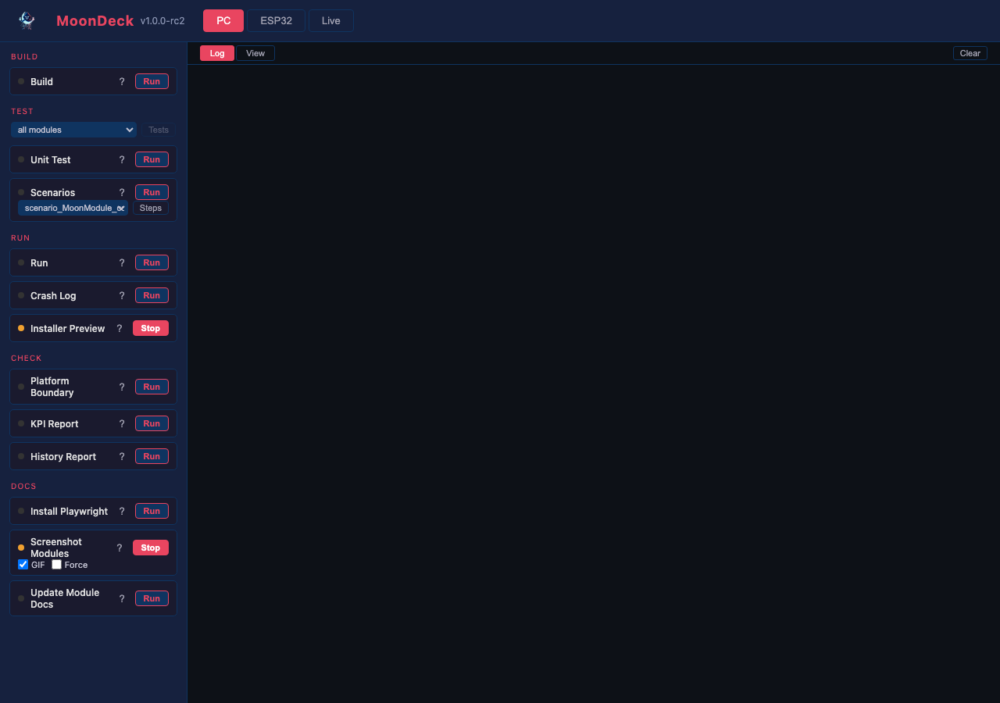

# Building, running, flashing

How to get the system running on a desktop, an ESP32, a Teensy, or a Raspberry Pi. Design rationale for the choices below lives in [architecture.md](architecture.md); coding conventions in [coding-standards.md](coding-standards.md); what is tested in [testing.md](testing.md).

## MoonDeck — the dev console

Everything that builds, flashes, runs, tests, monitors, or checks the project — for every target — lives as a script under `scripts/`. The full per-script reference is [scripts/MoonDeck.md](../scripts/MoonDeck.md).

The scripts have two front ends with the same code and arguments:

- **CLI** — `uv run scripts/<group>/<name>.py`. What agents use; what CI uses. Composes with shell, captures exit codes, parses output.
- **MoonDeck** — `uv run scripts/moondeck.py`, then open `http://localhost:8420`. A browser dev console wrapping the same scripts: status dots, run/stop toggles for long-running processes, grouped tabs, output panes. The human control deck.

Use whichever fits. Neither path is "more official" than the other; the scripts are the source of truth and the front ends are interfaces. New work adds a script first; both interfaces follow.

MoonDeck has three tabs:

- **PC** — desktop build, run, test. Fast iteration.
- **ESP32** — chip type and USB port selection. Build, flash, monitor.
- **Live** — device discovery and monitoring against running devices on the network.

Script definitions and configuration live in `scripts/moondeck_config.json` (committed). Script documentation lives in `scripts/MoonDeck.md`, one section per script. Runtime state (selected devices, ports) persists in `scripts/moondeck.json` (gitignored).

## Tooling overview

CMake is the sole build system. The source tree is shared across every platform, but build entry points are separate because ESP-IDF wraps CMake with its own conventions (`idf_component_register()` instead of `add_library()`).

```text
CMakeLists.txt                          ← standard CMake: desktop / RPi + tests
src/
  main.cpp                              ← shared pipeline wiring (mm_main), platform-neutral
  platform/
    desktop/
      main_desktop.cpp                  ← desktop entry point: int main() + SIGINT
      platform_config.h                 ← desktop platform constants
    esp32/
      platform_config.h                 ← ESP32 platform constants (reads sdkconfig)
esp32/
  CMakeLists.txt                        ← ESP-IDF project root (thin wrapper)
  main/
    CMakeLists.txt                      ← idf_component_register() pointing at src/
    main.cpp                            ← ESP32 entry point: app_main() + Ethernet init
  sdkconfig.defaults                    ← board-specific defaults
```

The shared `src/main.cpp` defines `mm_main(keepRunning, gridW, gridH)` — the full pipeline wiring. Each platform provides a thin entry point that does platform-specific init (SIGINT on desktop, Ethernet on ESP32) then calls `mm_main()`.

The project is structured as a small set of CMake libraries: a core library (platform-independent), a platform library (selected at configure time), an application target (links both, provides the entry point). Further decomposition (effects, networking, drivers as separate libraries) happens when the codebase is large enough to justify it.

## Desktop / Raspberry Pi

Desktop and RPi both build with the root `CMakeLists.txt`. RPi can cross-compile against the same tree or build natively on the device — same source.

```sh
uv run scripts/build/build_desktop.py        # build
uv run scripts/run/run_desktop.py            # run as detached background process
uv run scripts/test/test_desktop.py          # unit tests
```

Or use MoonDeck's PC tab for the same operations with a status dot per card. The desktop run detaches and outlives the launching script — the same model as flashing an ESP32, where the device runs independently afterwards.



Each host writes into its own build dir: `build/macos/`, `build/linux/`, `build/windows/`. The per-host layout mirrors the ESP32 side's `build/esp32-<board>/` shape — one directory per target, no cross-target clobbering on a multi-host dev machine.

### Prerequisites

Every host needs [uv](https://docs.astral.sh/uv/), CMake 3.20+, and a C++20 compiler.

- **macOS:** `xcode-select --install` for Clang, `brew install cmake uv`.
- **Linux:** distro packages for `cmake`, GCC 12+ / Clang 15+, and `uv` from astral's installer.
- **Windows:** Visual Studio 2022 Build Tools with the **MSVC v143** workload and **Windows 11 SDK**, plus CMake. Quickest install (run in an elevated terminal):

  ```powershell
  winget install Kitware.CMake
  winget install Microsoft.VisualStudio.2022.BuildTools --override "--passive --add Microsoft.VisualStudio.Workload.VCTools --includeRecommended"
  ```

  Build and test from a **Developer PowerShell for VS 2022** (Start Menu → "x64 Native Tools…") so `cl.exe` and the SDK paths are on `PATH`. The default CMake generator on Windows is Visual Studio multi-config, so `projectMM.exe` lands at `build/windows/Release/projectMM.exe` and `mm_scenarios.exe` at `build/windows/test/Release/`. `build_desktop.py` and `run_scenario.py` look in both the `Release/` subdir and the build root, so Ninja (single-config) also works if preferred.

## ESP32

The ESP32 target uses ESP-IDF directly, not the Arduino framework.

**Tested IDF version:** **release/v6.1** (internal `v6.1-dev-5215-g0d928780081`). CI builds against this branch (the `release-v6.1` Docker tag) and local builds should match (clone command below). The why, the alternatives, and how to check for a newer one are in [ESP-IDF version](#esp-idf-version) below.

### Prerequisites

You need [uv](https://docs.astral.sh/uv/) (Python launcher), CMake 3.20+, and a C++20 compiler. Clone ESP-IDF (~2 GB) into the expected location for your OS — the build scripts search this path first via `Path.home() / "esp" / "esp-idf"`:

**macOS / Linux:**

```sh
git clone --depth 1 --branch release/v6.1 https://github.com/espressif/esp-idf.git ~/esp/esp-idf
```

**Windows** (PowerShell — run once with admin to enable long paths if you haven't already):

```powershell
# IDF and its tooling have deeply nested paths; without longpaths the clone
# trips MAX_PATH (260 chars) inside the release/v6.1 tree.
git config --global core.longpaths true
git clone --depth 1 --branch release/v6.1 https://github.com/espressif/esp-idf.git "$env:USERPROFILE\esp\esp-idf"
```

Then run the one-time Python environment setup — either open MoonDeck (`uv run scripts/moondeck.py`), go to the ESP32 tab, and click **Setup ESP-IDF**, or run it directly:

```sh
uv run scripts/build/setup_esp_idf.py                                 # one-time
uv run scripts/build/build_esp32.py --firmware esp32                  # WiFi-only
uv run scripts/build/flash_esp32.py --firmware esp32 --port /dev/tty.usbserial-XXXX
uv run scripts/run/monitor_esp32.py --port /dev/tty.usbserial-XXXX
```

`setup_esp_idf.py` runs the upstream installer for the host: `install.sh` on macOS/Linux, `install.bat` on Windows. Both create the same `~/.espressif/python_env/...` venv and download the same toolchains (~1.5 GB more) — only the wrapper differs. The Windows installer needs roughly 5 minutes on a fast link. It also offers to move a drifted checkout onto the pinned commit (see [ESP-IDF version](#esp-idf-version)); pass `--no-checkout` to keep it warn-only.

**Building for the ESP32-S31** (a RISC-V *preview* target in v6.1) needs its toolchain fetched once — the default install only pulls the classic-`esp32` toolchains:

```sh
(cd ~/esp/esp-idf && ./install.sh esp32s31)   # one-time, adds the S31 RISC-V toolchain
```

Flash the S31 over USB with the CLI (`flash_esp32.py --firmware esp32s31 --port <port>`), **not** the web installer: the browser flasher (`esptool-js`) has no S31 chip definition, so a browser flash fails — the CLI's `esptool.py` supports it. The web installer surfaces the same guidance if you try. (Status + the condition to enable web flashing: [backlog](backlog/README.md).)

On Windows, the `--port` argument is a `COM*` name (e.g. `COM3`) instead of `/dev/tty.usbserial-XXXX`. MoonDeck's port picker enumerates `COM*` automatically.

The ESP32 tab in MoonDeck wraps the same steps as cards (Setup → Firmware → Build → Port → Flash → Run). The Network bar at the top is the same one shown on the Live tab — it remembers which serial port and WiFi credentials belong to the current LAN, so moving the laptop between networks doesn't require re-picking.


### ESP-IDF version

**Pinned to `v6.1-dev-5215-g0d928780081`** (a specific commit on the `release/v6.1` branch). `setup_esp_idf.py` holds the exact commit in `PINNED_IDF_VERSION`, warns loudly when the installed tree differs, and by default offers to check the pin out so a stray `git pull` or a fresh shallow clone landing on a newer commit converges back rather than silently building against the wrong tree (`--no-checkout` keeps it warn-only). Minimum is ESP-IDF v5.1 (C++20 needs GCC 12+); the project uses v6.x APIs (`esp_eth_phy_new_generic`, the component manager for mDNS, the modern RMT/parlio/LCD drivers) so v5.x would need adjustments.

**Why `release/v6.1` and not a stable tag.** As of June 2026 the v6.x line is: **v6.0 is the current stable** (GA 2026-02-27); **v6.1 is still pre-release** (beta1 2026-06-11, RC1 2026-07-23, GA 2026-07-31). We pin a commit on the `release/v6.1` *branch* (the stabilising line, not `master`) because it carries driver fixes we want on the newer SoCs (P4 parlio, RMT v2 on every chip) **and is the earliest IDF line that carries the `esp32s31` preview target** — and because v6.0 vs v6.1 is a small delta. The trade-off is honest: a pre-release branch gets **no support guarantee** and moves under you, which is exactly why the pin is a fixed commit, not a floating branch. The clean inflection point is **v6.1 GA (2026-07-31)**: re-pin to the `v6.1` tag then, which starts the 30-month support clock (see below). That move is a deliberate re-test pass, not a routine pull. Tracked in [backlog](backlog/README.md).

**v6.0 is the floor — don't depend on anything newer than it.** Because **v6.0 stable is our fallback** if the v6.1 line proves troublesome, the firmware and build tooling must stay buildable on v6.0. The rule is generic: **use no IDF API, component, Kconfig symbol, or tool that isn't present in v6.0.** A feature that exists only on the v6.1-dev branch (or arrives in a later minor) is off-limits until v6.0 is no longer the fallback. When adopting anything new from the IDF, confirm it shipped in v6.0 first (check the v6.0 docs / release notes, not `latest`); if it's v6.1-only, it waits.

**Explicit exceptions are allowed.** The floor is a default, not an absolute. A feature may step below it (depend on something not in v6.0) when the product owner decides so *explicitly* and the reason is documented at the point it's introduced — in the module spec, a code comment at the dependency, and the commit body. The bar is a conscious, recorded decision, not a silent drift: a floor you can consciously waive with a stated reason stays honest, whereas a rule quietly violated does not. Each such exception also narrows the v6.0 fallback (that target now needs the newer dependency too), so it states what the fallback loses. The known exception today is **P4 WiFi over the C6 co-processor**, which needs `esp_wifi_remote` / esp-hosted (a managed component outside mainline v6.0); it is an accepted, documented exception, scoped to the P4 target, tracked in the [backlog](backlog/README.md).

**v6.0 vs v6.1, and where the real change was.** The earthquake was **v5.x → v6.0**, not v6.0 → v6.1:

- **v6.0** (vs v5.x): the legacy peripheral drivers were **removed entirely** (ADC, DAC, I2S, Timer, PCNT, MCPWM, **RMT**, temp sensor), which is why the LED drivers use the modern RMT v2 / parlio / `esp_lcd` APIs (rationale at [RmtLedDriver.md](moonmodules/light/drivers/RmtLedDriver.md)); **picolibc** replaced newlib as the default C library; **warnings-as-errors** became the default (matches our own `-Werror`); the `CONFIG_ESP_WIFI_ENABLED` switch was dropped (forced on for WiFi SoCs, hence the `EXCLUDE_COMPONENTS` path documented under [Firmware variants](#firmware-variants)); plus the new install manager (EIM), a built-in MCP server, CMake Build System v2 (preview), `wifi_provisioning` → `network_provisioning`, PSA Crypto, and new chips (C5/C61 full, H21/H4 preview).
- **v6.1** (vs v6.0): an ordinary minor — bugfixes, more chip maturity, incremental features on the v6.0 baseline. No second mass-removal. Because it is still beta, its feature set isn't frozen until RC1.

**Support / EOL policy.** Each *stable* ESP-IDF release is supported for **30 months** from its GA date, split into a Service period (frequent bugfix releases, occasional regulatory features) and a Maintenance period (security and high-severity fixes only). Pre-release and dev snapshots get none of this. So pinning to a GA tag (v6.0 today, or v6.1 after 2026-07-31) is what buys the support window; riding `v6.1-dev` does not.

**How to check for a newer version.**

- **Latest stable + all tags:** the [releases page](https://github.com/espressif/esp-idf/releases), or from a clone: `git -C ~/esp/esp-idf fetch --tags && git -C ~/esp/esp-idf tag -l 'v6.*'`.
- **What our tree currently is:** `cat ~/esp/esp-idf/version.txt`, or `git -C ~/esp/esp-idf describe --tags`. `setup_esp_idf.py` prints this and flags drift from the pin.
- **The release schedule + EOL dates:** the upstream [`ROADMAP.md`](https://github.com/espressif/esp-idf/blob/master/ROADMAP.md) (beta/RC/GA dates per minor, and when each older minor reaches end-of-life).

Moving to a different release is never automatic: bump `PINNED_IDF_COMMIT` / `PINNED_IDF_VERSION` in `setup_esp_idf.py` (and the `esp_idf_version` Docker tag + cache key in `.github/workflows/release.yml`), re-clone or check out the new tag, then run the full ESP32 build + hardware re-test pass before committing the bump.

#### Adopting the v6.x ecosystem changes

v6.0 introduced ecosystem-level changes beyond the API surface. The stance, under [§ Principles → Industry standards](../CLAUDE.md#principles), is to **embrace these as the ESP32 standard** — if the IDF makes something the recognised way to build, install, provision, or ship, that's the path we want, not a bespoke one we maintain alone. We adopt them **step by step** (each its own commit + hardware re-test) rather than all at once, and only after they clear the **v6.0-floor rule** above, but the default is *yes, adopt*, with the burden on *why not* — not the reverse.

Two guardrails bound the "embrace everything" stance:

- **Platform-generic stays intact.** These are ESP32-specific gains; none may regress Teensy or the desktop (macOS / Windows / Linux) paths, which don't use ESP-IDF at all. An IDF feature is adopted *inside* the ESP32 platform layer / build tooling, never by leaking an IDF assumption into shared `src/` or the desktop build. If embracing a v6.x feature would touch a cross-platform seam, that seam stays abstracted (the existing platform-boundary rule).
- **The v6.0 floor.** Adopt only what's in v6.0 (see the rule above), so the v6.0 fallback keeps working.

Each row below states where we are and the trigger to move.

| Change | Where we are now | How / when to adopt |
|---|---|---|
| **EIM** (ESP-IDF Installation Manager) — the new default, cross-platform installer; Espressif says `install.sh` / `idf_tools.py` are "no longer needed" | `setup_esp_idf.py` drives the legacy `install.sh` / `install.bat`. Works, but is now the *old* documented path. | **Adopt any time** — EIM shipped *in v6.0*, so it clears the v6.0-floor rule, and it has a headless CI mode. This is the highest-priority alignment and doesn't need to wait for the re-pin. Add EIM as the **preferred** path in `setup_esp_idf.py` (CLI: `eim install`), keep `install.sh` as a documented fallback for one release. Keep the exact-commit pin: EIM's multi-version management *helps* reproducibility, it doesn't replace the pin. |
| **PSA Crypto** — legacy mbedTLS crypto APIs deprecated in favour of the PSA API | No direct exposure: we never call mbedTLS ourselves; OTA uses `esp_https_ota` + `esp_crt_bundle_attach` ([platform_esp32_ota.cpp](../src/platform/esp32/platform_esp32_ota.cpp)), which wrap crypto internally. | Nothing to migrate while we stay on high-level components. **Watch** only: if a future feature needs hashing/signing directly (e.g. signed-OTA verification, a device identity), write it against the **PSA API** from the start, not legacy mbedTLS. Trigger: first direct crypto use. |
| **`network_provisioning`** — Espressif's Unified Provisioning subsystem, renamed from `wifi_provisioning` in v6.0. Transports: **BLE (GATT)** + **Wi-Fi SoftAP**. Clients: official iOS/Android apps for both, plus `esp_prov` (a Python CLI on Linux/macOS/Windows). Transport-agnostic but ships no web/serial client. | We provision over [Improv](../src/core/ImprovProvisioningModule.h) — serial (USB) + BLE, driven from the **browser** (ESP Web Tools) or a serial CLI. That covers the *web-installer / no-app* onboarding well. What we **don't** have is the IDF-native **phone-app + SoftAP** flow (open the ESP app, pick the device's AP, hand it credentials) that most shipping ESP32 products offer. So this is a real coverage gap, not a duplicate: the two standards meet only on BLE and own different front-ends. | **Adopt to close the gap — this is a planned capability, not a maybe.** `network_provisioning` is in v6.0 (clears the floor) and is *the* IDF-native standard, so embracing it is exactly the stance above. Add it as a **sibling provisioning module** beside ImprovProvisioning (both live as Peripheral/System modules; the device can offer whichever transports its chip supports), reusing the same WiFi-credential plumbing. Not a replacement for Improv — they cover different front-ends (browser vs phone-app), and a product can want either. The phone-app + SoftAP path is the part that makes ESP32 deployment feel product-grade. Trigger: scheduled as one of the v6.0-adoption iterations (see below). |
| **CMake Build System v2** — the named successor to the current build system; technical preview in v6.0/6.1, has its own migration guide | Standard `idf.py` build (v1). Our component is a thin `idf_component_register()` wrapper, so the migration surface is small. | **Watch until it's GA** (not while it's preview — adopting a preview build system would be the opposite of "common patterns first"). Trigger: v2 ships as the default. Then dry-run a build under v2, fix any `idf_component_register()` / Kconfig-dependency fallout, switch. Low risk given how little custom CMake we have. |
| **Built-in MCP server** (`idf.py mcp-server`) — lets an AI assistant drive build/flash/monitor/debug directly | Not used. Agents and humans both go through the `scripts/<group>/*.py` layer (the uniform interface in [scripts/MoonDeck.md](../scripts/MoonDeck.md)), which wraps pin-drift checks, per-firmware build dirs, and KPI collection. | **Evaluate, don't default to it.** The risk is a *second control path* that bypasses our script policy, and it's ESP32-only (no desktop), so it can't be the uniform path. If adopted, wrap it *behind* a script (`scripts/run/idf_mcp.py`) so the policy layer still applies, rather than pointing the agent at raw `idf.py`. Trigger: a concrete debug workflow the scripts can't cover. |

The general rule: **anything already in v6.0 we adopt proactively** (it clears the floor, so there's no reason to wait — EIM and `network_provisioning` are both here), while **preview / not-yet-in-v6.0 features wait** until they're stable *and* in our floor. Each adoption is its own commit with its own hardware re-test, and none may regress the Teensy / desktop paths.

**Adoption iterations (the step-by-step plan).** We close the v6.0 gaps one at a time, picked up as normal feature commits:

1. **EIM installer** — rework `setup_esp_idf.py` to prefer `eim install`, keep `install.sh` as a one-release fallback. Smallest and lowest-risk (build-path only, no firmware change, no hardware re-test), and EIM's multi-version management is what cleanly supports the v6.0-floor / v6.1-fallback juggling — so it sequences first as an enabler for the rest.
2. **`network_provisioning`** — the headline capability: a sibling provisioning module beside ImprovProvisioning adding the phone-app + SoftAP onboarding flow. Its own plan (spec before code), a `Peripheral`/System module reusing the WiFi-credential plumbing, BLE-stack cost weighed per chip.
3. Further v6.0 items (PSA-native crypto, CMake v2, MCP) are pulled in as their triggers fire (first direct crypto use; v2 GA; a debug need), per the rows above.

Tracked in [backlog](backlog/README.md).

### Firmware variants

`build_esp32.py --firmware` selects one of the shipping variants. The key combines chip name + feature flags + (for SKU-sensitive chips) module. ("Firmware" here is the compiled binary; the physical product (deviceModel) is a separate concept — see [architecture.md § Firmware vs deviceModel vs board](architecture.md#firmware-vs-devicemodel-vs-board).) `build_esp32.py --help` lists the full set.

The canonical list is the **`FIRMWARES` dict** in [`scripts/build/build_esp32.py`](../scripts/build/build_esp32.py) — the single source of truth, carrying each variant's `chip`, sdkconfig `fragments`, `eth_only`, `ships`, and `description`. Its machine-readable projection is [`docs/install/firmwares.json`](install/firmwares.json) (generated by `generate_firmwares.py`, drift-guarded by `check_firmwares.py`), which the CI release matrix, the ESP Web Tools manifest loops, and MoonDeck all read — so the list lives in exactly one place. `esp32p4-eth-wifi` has `ships: false` (its C6-slave Kconfig isn't reproducible in CI yet), so it builds from the CLI but stays out of the release matrix.

ESP-IDF v6.x has no `CONFIG_ESP_WIFI_ENABLED` switch (the symbol is forced on for WiFi-capable SoCs), so dropping WiFi at compile time happens via `EXCLUDE_COMPONENTS` plus `MM_NO_WIFI` (set when `MM_ETH_ONLY=1`, applied in `esp32/main/CMakeLists.txt`). The `esp32-eth` variant takes this path; the default `esp32` keeps both stacks compiled in and uses the runtime cascade in `NetworkModule` (Ethernet first, WiFi fallback when no PHY responds).

Each firmware has its own build dir at `build/esp32-<firmware>/`, so all variants can coexist on disk. `build_esp32.py` points `idf.py -B` at the per-firmware dir; switching firmwares is just a different `--firmware` argument, no clean rebuild penalty. Same-firmware rebuilds stay incremental, as before. Disk usage scales with the number of firmwares built (≈100 MB each), and a future rename would orphan the old dir — clean with `scripts/build/clean_esp32.py --firmware <name>` or `--all`.

If a firmware *key* changes its feature set (e.g. the classic `esp32` collapse turned a WiFi-only key into WiFi+Ethernet), its existing build dir would otherwise keep the old `MM_NO_ETH` / `MM_ETH_ONLY` in `CMakeCache.txt` — CMake `-D` flags are written to the cache, and omitting one on a later configure does *not* clear it, so the stale value would silently build the old feature set (Ethernet stubbed out, no link, no LED, and a flash erase wouldn't help because it's a compile-time define). `build_esp32.py` guards this: before reusing a dir it compares the cached feature flags to what the firmware wants and wipes the dir for a clean reconfigure on a mismatch (printing the reason). Same-feature rebuilds are untouched, so the incremental fast path is preserved.

Each ESP32-S3 SKU has its own firmware key because the sdkconfig fragment encodes flash size, partition table, and PSRAM mode — flashing an `n16r8` binary onto a different module (e.g. N8R2) either misaligns the partition table (boot loop) or fails PSRAM init. New SKUs become new keys (e.g. `esp32s3-n8r8`); there is no generic `esp32s3` shortcut.

The Ethernet PHY type and pin map are runtime config, not baked into the build: each firmware carries the driver(s) its chip can host (RMII EMAC for classic/P4, W5500 SPI for S3), and `deviceModels.json` supplies the per-board PHY/pins (pushed into NetworkModule's eth controls at provision). The classic chip default is the common LAN8720 RMII wiring (reset GPIO 5, MDIO addr 0, clock GPIO 17 — e.g. the Olimex ESP32-Gateway), so a board with the same PHY but a different pinout (e.g. WT32-ETH01 with reset on GPIO 16) just needs a different `deviceModels.json` entry — no rebuild.

`--profile` is accepted one release for migration: `--profile default` → `--firmware esp32`, `--profile eth-only` → `--firmware esp32-eth`. The legacy `build_esp32_ethonly.py` wrapper still works (it now forwards `--firmware esp32-eth`).

### Why not Arduino

The ESP32 target uses ESP-IDF directly for three reasons:

- **Direct hardware control.** RMT peripheral for LED protocols, FreeRTOS task pinning with explicit stack sizes, `heap_caps_malloc` with SPIRAM/8BIT caps, `esp_timer` microsecond timing. Arduino wraps these with abstractions that add overhead and hide control.
- **Native CMake.** ESP-IDF's build system *is* CMake (`idf.py` wraps it). No impedance mismatch. Arduino-on-ESP-IDF adds a compatibility layer that complicates the build.
- **Version stability.** ESP-IDF APIs are stable. Arduino-esp32 version churn caused recurring breakage in MoonLight.

Arduino can be added as an ESP-IDF component later if a specific Arduino library is needed; this is officially supported by Espressif and doesn't require restructuring.

### Third-party libraries

The platform abstraction layer replaces what libraries typically provide. Today no third-party libraries are pulled in:

| Library | Why not | What replaces it |
|---|---|---|
| [FastLED](https://github.com/FastLED/FastLED) | Arduino-dependent. LED protocol drivers (RMT, SPI) are available natively in ESP-IDF; FastLED's colour math is small enough to reimplement. | Own colour math in core. Own LED drivers per platform in `src/platform/`. |
| [ESPAsyncWebServer](https://github.com/ESP32Async/ESPAsyncWebServer) | Arduino-dependent. Past memory-leak issues. Ties us to Arduino. | Own HTTP server via ESP-IDF's `esp_http_server` (ESP32) or BSD sockets (desktop). Reconsider if Arduino-as-component is added. |
| [ArduinoJson](https://github.com/bblanchon/ArduinoJson) | Works on ESP-IDF, but heavy: dynamic allocation, large footprint. | Own fixed-size control storage. JSON only for API serialisation, not internal state. |

When a library is genuinely needed (e.g. FastLED for specific hardware support), it lives inside `src/platform/` and is not referenced from core or light-domain code.

## Teensy

Teensy 4.x is in the supported target list. Buffers and pipeline configuration scale to 1 MB of internal RAM; OctoWS2811 gives excellent DMA-based LED output. Ethernet is built in on Teensy 4.1 and optional on 4.0.

Build flow is via the root `CMakeLists.txt` with a Teensy toolchain file. The platform layer for Teensy is added when the first hardware target is wired in.

## Pre-compilation steps

CMake runs these automatically before compilation when their source files change:

| Step | Source | Generated | Trigger |
|------|--------|-----------|---------|
| `build_info_gen` | `library.json` | `src/core/build_info.h` | `library.json` changes |
| `ui_embed` | `src/ui/index.html`, `app.js`, `style.css`, `preview3d.js`, `install-picker.js`, logo | `src/ui/ui_embedded.h` | any UI file changes |

Both are defined in the root `CMakeLists.txt` (desktop) and `esp32/main/CMakeLists.txt` (ESP32). Generated files are gitignored — rebuilt on every clean build.

## After it's running

The system serves the web UI from its embedded HTTP server. Open `http://<device-ip>/` in a browser; on desktop that's typically `http://localhost:8080/`. From the UI you can change effects and modifiers, configure controls, see the 3D preview. The settings persist across reboot.

To run the test suite or any of the checks (platform boundary, specs, KPI), see the MoonDeck reference linked above. The release-readiness gates that wrap these into a checklist live in [CLAUDE.md § Lifecycle Events](../CLAUDE.md#lifecycle-events).
