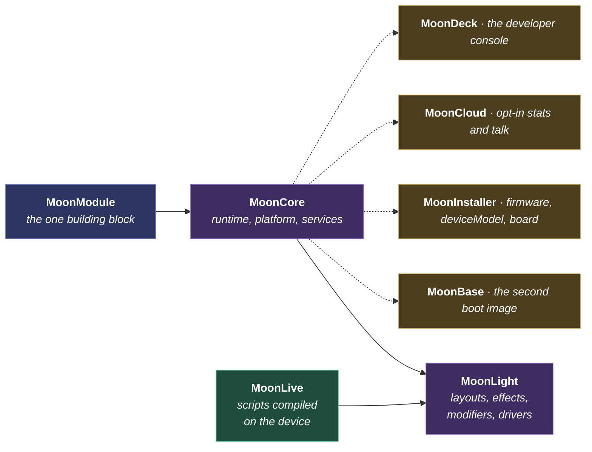

# Architecture

The agreed-up-front **architecture contract**: what MoonLight is designed to be. A design described here is committed, meaning this is the intended behavior and code is written toward it, rather than optional or undecided.

Coding conventions live in [coding-standards.md](../../contributing/coding-standards.md); how to build and run lives in [building.md](../../how-to/building.md); what is tested lives in [testing.md](../../reference/testing.md).

## The problem

Driving a large LED installation sets three constraints at once.

- **Scale**: tens of thousands of lights, refreshed fifty times a second, on a chip with a few hundred kilobytes of RAM.
- **Variety**: strips, panels, DMX fixtures and moving heads, each with its own wire protocol and its own definition of a pixel.
- **Change**: you rearrange the show while it runs, with no reboot and no recompile.

A fixed pipeline holds the frame rate but cannot be rearranged. A scriptable one rearranges but cannot hold the frame rate. MoonLight meets all three with one uniform building block on a known lifecycle, a domain-neutral core that owns the hard constructs once, and a light domain that stays simple on top of it.

## The parts, and how they sit

| Part | What it decides |
|---|---|
| [MoonModule](moonmodule.md) | The one building block: lifecycle, controls, persistence, how modules exchange data and trigger each other |
| [MoonCore](mooncore.md) | The domain-neutral runtime: platform abstraction, services, several devices as one system |
| [MoonLight](moonlight.md) | The light domain: the pipeline, 3D, effects, modifiers, drivers, and the memory strategy that bounds them |
| [MoonLive](moonlive.md) | Scripts compiled to native code on the device |
| [MoonBase](moonbase.md) | The second boot image, and why an update cannot leave a half-written app |
| [MoonInstaller](mooninstaller.md) | Firmware, deviceModel and board: three words for three different things |
| [MoonCloud](mooncloud.md) | The opt-in server side, and the only server a device talks to |
| [MoonDeck](moondeck.md) | One script per task, two front ends |

## Core and light domain

The system is two layers, separated as much as practical.

**[MoonCore](mooncore.md)** owns the MoonModule base, controls, scheduling, persistence, the platform abstraction and the system services. It is domain-neutral and knows nothing about lights.

**[MoonLight](moonlight.md)** owns light values, layouts, layers, mapping, blending, effects, modifiers, LED drivers and the network protocols. It is built on top of the core.

When mixing is needed for performance or simplicity it is an explicit decision, choosing minimalism over separation rather than blurring the boundary by accident. Core earns growth only by gaining a recognizable, reusable primitive that many modules lean on: a streaming write, a positional read, a bounded arena, a recursive JSON reader. A one-off helper for a single caller belongs with that caller.

## Tag emoji legend

Catalog pages tag each module with its role and its origin. The legend lives with the pages that use it, in [the light catalog](../../moonmodules/light/effects.md).
