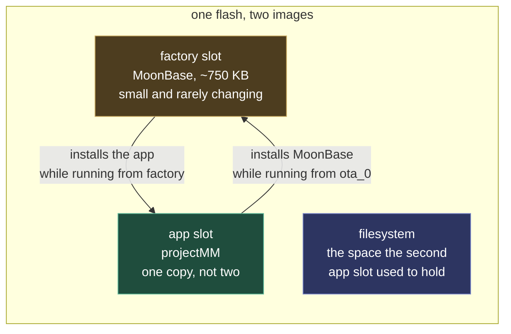

# MoonBase

A small maintenance image in the factory slot that installs updates into one large app slot, instead of spending half the flash on a second copy of the firmware. A power cut mid-update lands back in MoonBase rather than a half-written app.

What it replaces comes first, then the update cycle, then how MoonBase itself is updated and how the two images are told apart.

Neither image can rewrite the partition it is executing from, so each installs the other. That is the whole scheme: the arrows are the only two write paths, and the app is the only thing that can repair a broken recovery image. The two directions fail differently, and both fail safe. An app update points the bootloader at MoonBase first, so a power cut anywhere in it lands in MoonBase, which a user retries from over the network. A MoonBase update writes and verifies the factory slot without touching otadata, so a cut there leaves the still-valid app in `ota_0` to boot and try again.

## What it replaces

Dual-OTA spends half the app area on a second copy of the firmware that is idle except during an
update. **MoonBase** replaces it: a small, rarely-changing image in the partition table's
`factory` slot that owns the device while the application is being replaced, since a board
cannot rewrite the partition it is executing from. One app slot then suffices, and the flash the
second slot held goes elsewhere.

A 4 MB board has no choice, having room for one application and not two, and its app slot grows
by a third in exchange. On a **16 MB** board the choice is deliberate rather than forced, and the
freed 4 MB goes to the filesystem, 11 MB rather than 7.

Which boards use MoonBase is a per-variant decision recorded in
`moondeck/build/build_esp32.py` rather than a property of flash size. Today the 4 MB classic, the
S3-Zero and `esp32-16mb` use it, and it may become the default everywhere.

## The update cycle

The update cycle runs in three moves. The app stages the install URL in NVS, or nothing for a
browser upload, points the bootloader at MoonBase and reboots. MoonBase joins the network with
the app's stored credentials, falling back to an AP at 4.3.2.1, and installs into the single app
slot, either from the staged URL unattended or from an upload. Then it reboots back. The UI covers the whole cycle with one
"updating firmware" overlay, telling the two images apart via `GET /moonbase` (MoonBase answers
with its live status; the app 404s it). Pointing the bootloader at a factory partition *erases*
otadata, so a power cut anywhere mid-install boots MoonBase and the user retries over the
network, a stronger power-fail story than dual-OTA's. A failed install deliberately stays in
MoonBase, visibly, rather than silently reverting to the old app; the way back is its explicit
"Boot the app" action, which only boots an image that validates.

## Updating MoonBase itself

**Updating MoonBase itself** runs the same cycle backwards: the app writes the factory slot while
running from `ota_0`, exactly as MoonBase writes the app slot while running from factory. Neither
image can rewrite the partition it executes from, so each installs the other and the app is the
only thing that can repair a broken recovery image. Without it a bad MoonBase means a cable, which
is the failure MoonBase exists to prevent.

Two things make that safe enough to offer. `esp_ota_*` refuses a factory partition, so this is a
raw `esp_partition_erase_range` + `esp_partition_write`, which also forfeits the validation
`esp_ota_end` performs: `esp_image_verify` replaces it after the write. A 4 MB board also has nowhere to stage 743 KB before erasing, so the image streams straight in.
Everything that can reject it is therefore decided from its FIRST CHUNK, before a byte is erased:
the image magic, the chip id, and the descriptor naming `projectMM-moonbase` rather than the app.
The chip id matters because there is one MoonBase per chip, one paste apart, and a checksum does
not catch a swap. Those rules live in `src/core/FirmwareImage.h` so
a host test can drive them. What remains is a window, during the write, in which the device holds
no recovery image; the app keeps running throughout, so the answer to a failure is to retry.

## Telling the two images apart

Each image reports its version from the app descriptor IDF puts in every binary, with
`PROJECT_VER` set to the same computed version for both. The app can therefore read the factory
partition's version without booting it, and say when the two were built apart. A device that cannot name its
own recovery image cannot be diagnosed: two boards that looked identical, one of which could not
install firmware, took a bisect of the git log to tell apart.

MoonBase is a standalone ESP-IDF project (`moonbase/`, ~750 KB against an 896 KB slot) sharing
no sources with the app, the deliberate trade for an image that must stay small and, once
working, hardly change. `moondeck/build/build_esp32.py` builds it alongside every variant that opts in, and owns the
flash-layout helpers every consumer uses: serial flash, mooninstaller manifests, release preview
and the QEMU image. IDF's own `flasher_args.json` knows nothing of the two-image scheme and
stages the app at the factory offset, so each of those paths applies the same correction from one
place. Prior art: Tasmota's safeboot scheme and
[MycilaSafeBoot](https://github.com/mathieucarbou/MycilaSafeBoot) proved the single-slot +
recovery-image pattern; MoonBase is our from-scratch, minimal take on it.
