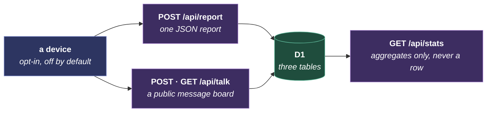

# MoonCloud

The opt-in server side, and the only server a device talks to. What it stores, and what it deliberately does not, is in [the privacy policy](../../legal/privacy-policy.md); what a user sees is [MoonCloud](../mooncloud.md). It is one Worker, one database and one deploy.
The endpoints come first, then the decisions that shape them, then what it costs a device and what it leaves running outside this repository.

## One server, three endpoints

The device talks to one origin and nothing else.

## The decisions that shape it

**An unknown field is dropped, never rejected.** A device running old firmware sends an old shape, and its report still counts. The alternative, rejecting on an unrecognised field, would silently stop counting exactly the installations least likely to update.

**Aggregates are the only read.** `GET /api/stats` returns totals and counts by version, chip, device model, country and role. There is no endpoint that returns a row, so a report cannot be read back out, by us or by anyone.

**Column names come from an allowlist in the Worker**, never from the query string, and every value is bound. A filter narrows the whole answer rather than selecting a column, which is what makes a chart slice clickable without exposing the schema.

**The country never comes from an address.** Cloudflare resolves it at the edge as `request.cf.country`, so no code here sees an IP. The privacy promise is structural rather than a log configuration someone has to maintain.

**The primary key is `(installationId, version)`.** A device re-reporting the same upgrade overwrites its row, so a row count counts installations rather than retries.

**The sender id is never published.** A message shows the shared device name when consent said to share it, otherwise the first eight characters of the id, which groups a device's messages without naming it.

## What it costs a device

12,832 bytes of flash, 0.77%, and about 800 bytes of static RAM on a classic ESP32, measured by building the same tree with and without it. The TLS stack was already linked for firmware updates, so the HTTPS call adds call-site code rather than a library.

## State that lives outside the repository

Reverting the code removes the client and leaves the account, the database, the Worker and the DNS exactly as they are. `mooncloud/README.md` lists each one with the command that undoes it, because infrastructure that only exists in someone's browser is the kind that outlives the project that created it.
