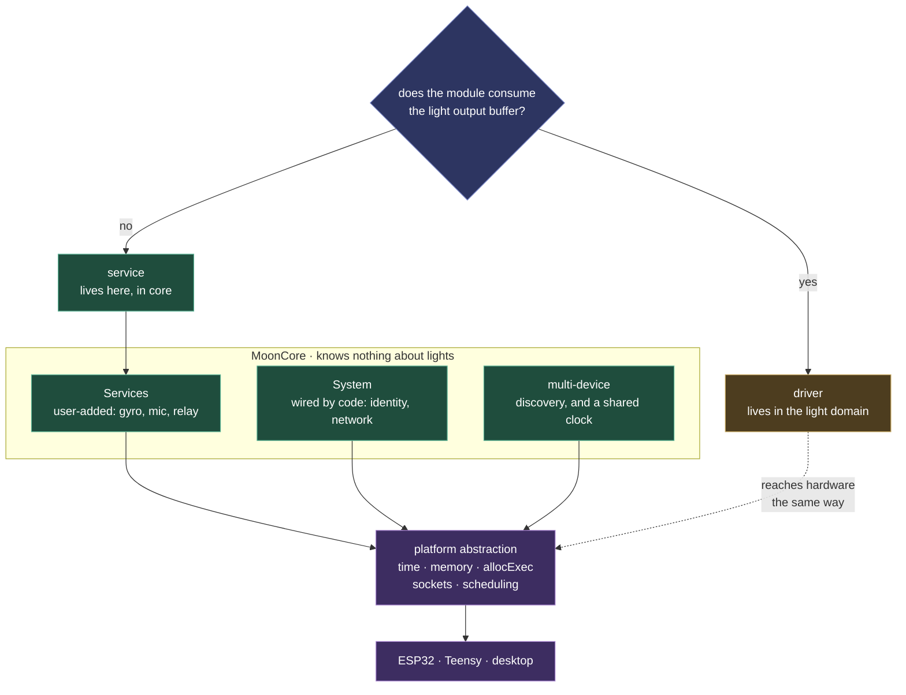
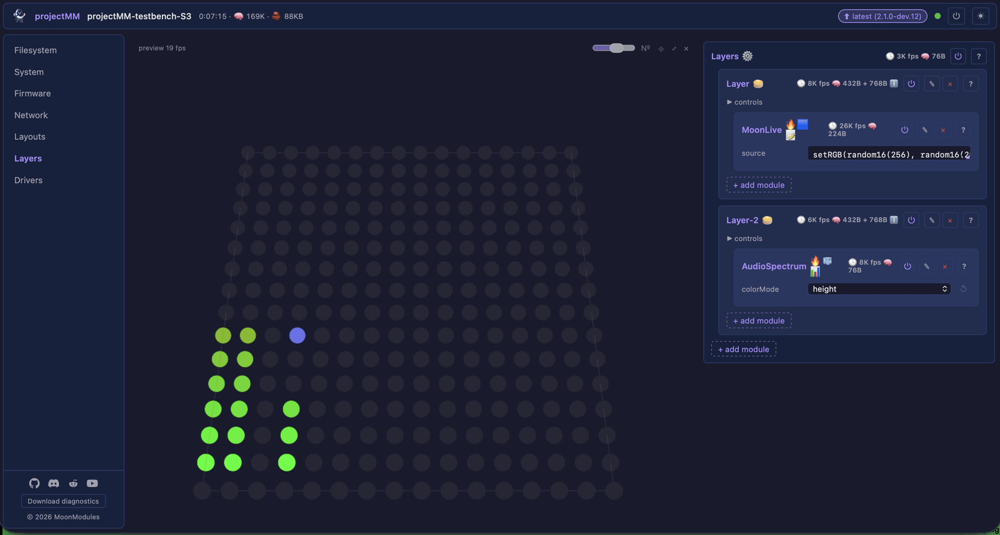

# MoonCore

The domain-neutral runtime: the platform abstraction, the services that bridge to hardware, and how several devices behave as one system. It knows nothing about lights, which is what lets [MoonLight](moonlight.md) stay simple on top of it.

The runtime is described from the outside in: what a service is, how several devices behave as one, how a device is named, and last the platform layer every one of them calls through.

One question sorts every module, and it is about the data relationship rather than the connector: a DMX sender speaks over a UART and is still a driver, because it sends the rendered buffer. Everything below the seam is reached only through the platform layer, which is why the same tree runs on a board and on a laptop.

## Services

A **service** is a MoonModule (role `ModuleRole::Service`) that bridges to the outside world (hardware or network) *independently of the light pipeline*. Examples: a gyro/IMU over I²C, a microphone over I²S, a relay or GPIO toggled out, a status push to Home Assistant. Services are **domain-neutral and live in core**; the platform transport they use (I²C, UART, GPIO) is itself a domain-neutral platform primitive.

> *"Service" here means a user-added capability bridge, not the ESP32's own on-chip peripherals (LCD_CAM, SPI, PARLIO, RMT). Those on-chip blocks are how **drivers** clock data out to LEDs, reached through the [platform layer](#platform-abstraction).*

The defining line is the **data relationship, not the connector**: *does the module consume the light output buffer?* If yes it's a **driver** (ArtNet, DMX, SPI-LED all consume the buffer, differing only in transport; a DMX sender uses a UART/RS-485 transport but is a driver because it sends the rendered buffer). If no, it's a **service**.

Services are **user-add/deletable children of the `Services` container**, the core-domain twin of the light pipeline's `Effects`/`Drivers`: a top-level container holding user-added children of one role. The firmware is identical whether or not the hardware is wired. The user adds the module when they solder a gyro on and removes it later, reusing the generic child add, replace, delete and persistence machinery; `Services` declares `acceptsChildRoles("service")`. Fixed device infrastructure lives under **System** instead, wired by code rather than user-added: identity, network, and the inspection tools Tasks and I2cScan. That is the System/Services split. Direction is per-module, not a role: a service may read (gyro), write (relay), or both, so one `Service` role spans the category. Each is a header-only or `.h`+`.cpp` core module under `src/core/`, reaches hardware only through a domain-neutral platform primitive (`platform::i2c*`, `platform::audioMic*`, …), and gets a spec in `docs/moonmodules/core/services.md` (enforced by `check_specs.py`). Most poll in `tick20ms` or `tick1s`. The exception is a service whose data an effect consumes *every frame*: [AudioService](../../moonmodules/core/moxygen/AudioService.md) reads + analyses its I²S microphone in `tick()` because the audio effects react per render tick, and its per-tick cost (one FFT) is part of the render budget. Automatic bus-probe detection is out of scope; the manual path is the foundation.

**An effect reads a service's data** through the shared-struct pull pattern from [Data exchange](moonmodule.md#data-exchange-between-modules), with no new mechanism. The service owns a small POD struct overwritten in place each poll or tick, and the consuming effect holds a `const` pointer to it. The first concrete case is audio: AudioService produces an `AudioFrame` (level + 16-band spectrum + peak) that [AudioSpectrumEffect](../../moonmodules/light/effects.md) and the other audio effects consume. It reaches the frame through a static `AudioService::latestFrame()` rather than a boot-time setter. That variation exists because an audio effect can be added through the UI *after* boot and must still find the one live mic (a setter only wired the boot instance). The active mic registers itself in `setup()` and clears the pointer in `release()`, so add/remove in any order returns either the live frame or a static silent one, never null. A service that only *displays* its readings (the gyro today) skips the consumer side entirely.

## A lossy channel drops at the source

On a lossy stream, drop at the source and let TCP pace the rest. Write only what the socket takes now, skip the frame when the previous one has not drained, report the skip to the receiver as its one honest congestion signal, and close only on a real error or a FIN.

Treating a slow socket as a fault is the trap: it converts ordinary congestion into disconnects, disconnects into re-primed state, and re-primed state into more congestion. Every give-up budget must bound *lack of progress* rather than elapsed total, or a slow-but-healthy transfer is truncated.

## Multi-device runtime

Two domain-neutral services let several controllers act as one installation. They're core because nothing about them is light-specific; any domain spanning multiple devices uses the same two.

- **Discovery**: devices find each other via mDNS. `NetworkModule` advertises each device today; this is live.
- **Clock sync**: a shared monotonic clock is the foundation any cross-device coordination builds on. The design is filed in [backlog-core](../../work/future/backlog-core.md).

What the synced clock is *for* is a domain question; the light domain's use of it (synced animation across a wall) is in [Multi-device sync](moonlight.md#multi-device-sync).

## Device name: one identity, every network name derives from it

A device has **one** network name, `deviceName`, and every name it presents on the network is that exact string. That covers the mDNS hostname (`<deviceName>.local`), the SoftAP SSID shown as the captive portal when unprovisioned, and the DHCP hostname the router's client list shows. They are not three settings that happen to match, there is a single source and the others *read* it, so a device shows one identity everywhere and the three can never drift apart.

- **Sole owner: `SystemModule`.** `deviceName` is a control on `SystemModule` (default `MM-XXXX` from the MAC). It is the only place the name is stored or edited. Every consumer reads `SystemModule::deviceName()`; no other module holds a name of its own. `NetworkModule` reads it for the mDNS / AP / DHCP names; `main.cpp` reads it for the `MM_DEVICE=<deviceName>.local` boot-serial token the [web installer](../../mooninstaller/README.md) uses to offer a clickable `.local` link. So to know what name a device advertises, you read one accessor, you never inspect NetworkModule or the platform to discover it.
- **Always a valid hostname.** Because all three uses are DNS/SSID names, `deviceName` must satisfy the RFC-1123 label rules (`[A-Za-z0-9-]`, no spaces, no leading/trailing hyphen). `SystemModule` enforces this at the source: it runs `mm::sanitizeHostname()` (in `core/Control.h`) on the value in `setup()` and every `tick1s()`, coercing whatever the user typed or persistence restored (`"My Living Room!"` → `"My-Living-Room"`) and falling back to the MAC-derived `MM-XXXX` if the result is empty. Sanitising *at the owner* means every consumer is correct for free, no per-consumer validation, no chance a raw name reaches mDNS. (`unit_sanitizeHostname` pins the rule.)
- **Follows a live rename.** Renaming the device re-advertises immediately, no reboot, the [live-reconfiguration](moonmodule.md#live-reconfiguration-every-change-applies-on-the-next-frame) rule applied to identity. `NetworkModule::syncMdns()` (called each `tick1s()`) compares the current name to the last-registered one and re-registers mDNS when it changed, so `<new-name>.local` resolves within a tick.

**A machine-facing identity that an external system binds to is never the editable name.** An MQTT topic prefix, a Home Assistant discovery `unique_id`, an API key path: anything a foreign system keys off must derive from an immutable hardware id such as the MAC or chip-id, as in `projectMM/<last6-of-MAC>`. A live `deviceName` rename would otherwise repoint every topic silently and orphan the peer's config. The human-readable name rides a *separate*, published-but-non-identifying field (WLED, Tasmota, ESPHome, and HA discovery all anchor identity this way). `deviceName` above is the network-presentation identity (mDNS / AP / DHCP, where the name *is* the address); an external-integration identity is the opposite case and stays decoupled from it.

## Web UI

The UI is a handful of hand-maintained files: `index.html`, `app.js`, `style.css`, plus two focused ES modules `app.js` imports (`preview3d.js` for the WebGL 3D preview, `install-picker.js` shared with the web installer). No frameworks, no build tools, no npm. Served directly by the embedded HTTP server.

The UI is **MoonModule-driven**. It contains no hard-coded knowledge of specific effects, layouts, or drivers. It queries the system for the current MoonModule tree (layers, effects, modifiers, layouts, drivers, each with their controls) and renders generically:

- Each MoonModule shows as a card with its name and declared controls.
- Controls are auto-rendered by type (slider, toggle, color picker, text input, dropdown).
- Modules can be switched (change which effect a layer uses) and linked (assign a layout to a layer).

Adding a new MoonModule with controls needs **zero changes** to the UI files. This extends to the tree-mutation affordances: which modules accept children (and of what role) comes from each type's `acceptsChildRoles()`, and whether a module can be deleted/replaced comes from its `userEditable()`: both declared on the C++ side and reported in `/api/types` + `/api/state`. The UI hardcodes no list of "which types are containers" or "which roles are editable"; a new container type or a fixed child is a one-line C++ override.

The light domain plugs into the UI at three points. **A fixed top-level tree**: Layouts, Effects and Drivers are pinned in `main.cpp`, so root reorder is disabled while child reorder works by drag-and-drop. **A binary WebSocket preview channel**, [PreviewDriver](../../moonmodules/light/moxygen/PreviewDriver.md), sending a `0x03` coordinate table once per LUT rebuild plus per-frame `0x02` RGB point lists, so sparse layouts preview at their real positions. **Per-role emoji for the chip filter**, where the `ROLE_EMOJI` map in `app.js` is the single source of truth. Full UI spec: [docs/moonmodules/core/ui.md](../../moonmodules/core/ui.md).

## Platform abstraction

Only abstract what you need:

- **Time**: `millis()`, `micros()`. Monotonic, microsecond resolution. (`esp_timer` / `std::chrono`)
- **Memory**: `alloc(size)`, `free(ptr)`. Prefers PSRAM on ESP32, falls back to regular heap. `freeHeap()`, `maxAllocBlock()` for diagnostics. (`heap_caps_malloc` / `std::malloc`)
- **Executable memory**: `allocExec(size)` / `freeExec(ptr, size)` allocate memory the CPU can *fetch and execute* from, and `writeExec(dst, src, len)` copies emitted machine code into it safely. Used by the MoonLive live-script engine (below) to place the native code it compiles. All the W^X and instruction-cache quirks live behind these three functions. On ESP32 that is IRAM via `MALLOC_CAP_EXEC`, with 32-bit-aligned stores and a cache sync so the core fetches fresh code. On POSIX desktops it is an `mmap` `PROT_EXEC` page, with `MAP_JIT` and a write-protect toggle on macOS-arm64. On Windows it is a `VirtualAlloc` `PAGE_EXECUTE_READWRITE` page plus `FlushInstructionCache`. (`heap_caps_malloc(MALLOC_CAP_EXEC)` / `mmap` / `VirtualAlloc`)
- **Networking**: `UdpSocket` for ArtNet send. `TcpConnection` / `TcpServer` for HTTP + WebSocket; `TcpConnection::writeSome` is a non-blocking partial write (returns bytes written, 0 = would-block) so a backpressured browser can't stall the render loop. (lwIP sockets / BSD sockets)
- **Scheduling**: `yield()` (cooperative yield to OS/RTOS), `delayMs(ms)` (blocking sleep, off-path only), `delayUs(us)` (a microsecond busy-wait, only for sub-millisecond hardware timing a driver owns, such as the WS2812 300 µs inter-frame latch in `RmtLedDriver`), and `reboot()`. General pacing uses the non-blocking `millis()` gate instead. (`vTaskDelay` / `esp_rom_delay_us` / `esp_restart` on ESP32; `std::this_thread::sleep_for` / `std::exit` on desktop)
- **Platform config**: `platform_config.h` per platform: compile-time constants like `hasPsram` and `hasWiFi`. Each platform provides its own version; `types.h` includes it without `#ifdef`. Core code branches on these via `if constexpr` (such as NetworkModule drops its WiFi cascade when `hasWiFi` is false), so the dead branch is removed from the binary with no `#ifdef` outside `src/platform/`.

Abstractions are added when a concrete implementation needs them, not pre-designed.

**Platform boundary (hard rule).** All `#ifdef`, `#if defined`, platform-specific `#include`s, and hardware API calls live exclusively in `src/platform/`. Everything outside `src/platform/` compiles on every target without modification. Compile-time platform branching uses `if constexpr` on `platform_config.h` flags, never a preprocessor `#ifdef`. The boundary is enforced by [`moondeck/check/check_platform_boundary.py`](../../moondeck/check/check_platform_boundary.py), a commit gate (see [CLAUDE.md § The Process](../../CLAUDE.md#the-process)).

**The desktop build runs everything (hard rule).** Every module, effect and driver in the repo
links and runs on the host, the platform layer has no silicon behind the call. Where a
peripheral is absent the host *emulates* it rather than declaring itself incapable: the parallel
WS2812 buses are backed by heap buffers, `lcdLanes` / `parlioLanes` / `rmtTxChannels` report a
real chip's counts, and `hasLcdCam` is true. Code excluded from the host binary is code that cannot be unit-tested and cannot be seen by any
AST-based check. It only ever runs where it is hardest to debug, which is what the LED drivers
were until they were linked here.

A capability flag therefore answers *"can this build exercise the path?"*, not *"is this real
hardware?"*. Where a flag must mean the latter (`hasLcdCam` gating the pin expander), that is a
deliberate, commented exception. Timing, wire protocol and pin state are NOT emulated: they need
silicon, and faking them would let a self-test report on hardware it never touched.
