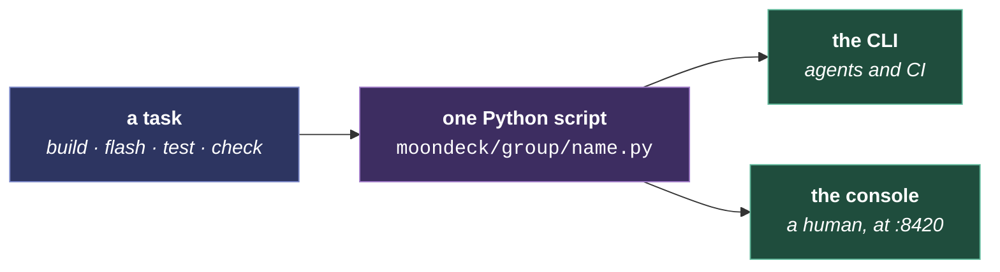

# MoonDeck

The developer console: one page that builds, flashes, runs, tests and monitors across every target, and discovers devices on the network. The per-script reference is [MoonDeck.md](../../moondeck/MoonDeck.md). What follows is why it is shaped this way.

The shape comes first, then why the scripts are ours, then where the state lives.

## One script per task, two front ends

Every action the console offers is a thin wrapper around a script, so `uv run moondeck/build/build_desktop.py` and the button run the same code. That is the whole design: one implementation, two ways in, and no path where a human and an agent measure something differently.

**The script is the contract.** It picks the right per-host build directory, applies the flags the gate expects, and tees its output where the report reads it. Reaching past it to `cmake` or `idf.py` produces a number measured differently, or a stale binary the script would have rebuilt.

## Why our own scripts

The firmware builds vendor-native against pinned ESP-IDF versions, and the tooling covers far more than compile-and-flash: desktop builds, unit and scenario runs, spec and boundary checks, KPI collection, provisioning, multi-board bench orchestration. A wrapper toolchain would cover one of those and still need the scripts around it. The full reasoning is in [building.md](../../how-to/building.md#moondeck-the-dev-console).

## State, and where it lives

Script definitions are committed in `moondeck/moondeck_config.json`. Runtime state, meaning the selected network, the known devices and the last-used serial port, lives in `moondeck/moondeck.json` and is gitignored: it describes one developer's bench rather than the project.

**Networks are the unit of bench state.** Each holds its own device list, serial port and WiFi credentials, and the console auto-selects the network whose subnet matches the host, so moving a laptop between networks usually needs no clicks.

**The device-model picker reads the installer's catalog.** The same `deviceModels.json` the web installer uses, so a device configured through either route ends up with the same module tree. Selecting a model pushes its full config: add the modules, then set their controls.

Logs and run counts under `build/moondeck-logs/` are derived state. Deleting `build/` resets them, and a missing file costs the count rather than the run.
