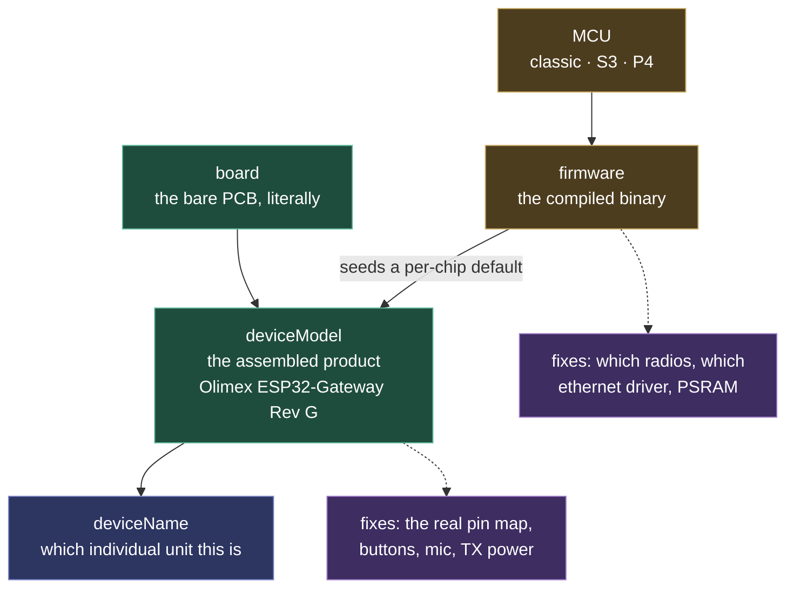

# MoonInstaller

Three words name three different things, and a device is configured by all of them: the firmware it runs, the deviceModel it is, and the board it sits on. Getting a device onto the network is the installer's job; knowing what it is afterwards is this vocabulary.

The three words come first, then where a default legitimately comes from.

A default belongs at the level that fixes it, which is the whole rule. The firmware seeds what the silicon decides; the deviceModel overrides it with what the product wired. So the ethernet pins appear at both levels without contradiction: the firmware offers a fallback, the catalog entry states the truth. A control nobody fixed is omitted, and stays unset for the user to wire.

## The three words

Three distinct things, kept distinct in the vocabulary:

- **firmware**, the compiled binary (chip target + which radios/peripherals are built in).
- **deviceModel**, the whole assembled product, identified by its catalog name (`Olimex ESP32-Gateway Rev G`). This is *which hardware this is*. It is distinct from **`deviceName`**, *which individual unit this is* (per-unit identity the user sets, see [Device name](mooncore.md#device-name-one-identity-every-network-name-derives-from-it)); a **device** (the umbrella term) has a `deviceName` and a `deviceModel`.
- **board**, the bare PCB *only*. The word survives in its literal sense: **on-board** LED, **on-board** peripherals, board-soldered pins, things physically *on the PCB*. (A deviceModel is a board plus whatever is wired onto it.)

**Firmware** is the compiled binary: chip target plus which radios, peripherals and sdkconfig fragments are included. One chip's firmware carries every Ethernet driver that chip can host; which PHY and pins a device model uses is runtime configuration. The variants themselves are listed in [firmware variants](../../reference/hardware/firmware-variants.md#firmware-variants).

**deviceModel** is the physical hardware: chip + PCB + on-board peripherals (PHY, USB-serial, PSRAM, antenna), identified by its product name. Examples: `Olimex ESP32-Gateway Rev G`, `LOLIN D32`, `Generic ESP32 Dev`. A unit cannot identify its own deviceModel (no readable PCB ID on classic ESP32), so MoonDeck deduces it from the firmware where unambiguous (`esp32-eth*` ⇒ Olimex) and otherwise lets the user pick. It is stored on the unit as SystemModule's `deviceModel` Text control (display-only in the UI; HTTP `/api/control` writes still apply). MoonDeck mirrors the picked / deduced value to the unit via `POST /api/control` after each discover and after every dropdown change. The catalog of valid deviceModels lives at [mooninstaller/deviceModels.json](../../mooninstaller/deviceModels.json), shared between MoonDeck and the web installer. MoonDeck reads it for its dropdown and HTTP push over plain REST on the LAN. The web installer reads it for its picker and pushes the whole entry, deviceModel plus every module/control, over serial during provisioning as REST ops (**"Improv = REST over serial"**, the `APPLY_OP` vendor RPC; see [ImprovProvisioningModule.md](../../moonmodules/core/moxygen/ImprovProvisioningModule.md)). Pushing over serial sidesteps the mixed-content block that stops an HTTPS installer page from POSTing to an `http://` device; an already-running device is re-configured via MoonDeck on the LAN. **`SET_BOARD` carries only the board name**, and every other field ships over HTTP after WiFi association. Do not extend its wire format: that couples unrelated controls to the board-name lifecycle and hides the timing constraint. A pre-association control gets either its own vendor RPC dispatched before the credentials, or a board-specific sdkconfig fragment when the value is truly board-static.

A deviceModel can run multiple firmwares (the Olimex Gateway runs both `esp32-eth` and the default `esp32`); a firmware can run on multiple deviceModels (`esp32` runs on any classic ESP32 dev kit). The `esp32s3-n16r8` firmware is S3-only and does not run on the Olimex Gateway or other classic-ESP32 hardware. The codebase reserves "deviceModel" exclusively for the physical product and "firmware" exclusively for the compiled binary.
## Config provenance: MCU → deviceModel

Firmware-vs-deviceModel is a **two-level** model for **where a pin or setting default comes from**. The installer and MoonDeck use it so a user picks their hardware instead of hand-typing every GPIO. A default belongs at the level that *fixes* it:

- **MCU → firmware.** The chip (classic / S3 / P4) and the compiled binary. Fixes silicon- and build-wired facts: native-radio presence, PSRAM, and **which Ethernet *driver* is compiled in**, RMII EMAC (classic/P4) vs W5500 SPI (S3), i.e. `hasEthernet` and the driver kind. These are the compile-time `hasI2sMic` / `hasWiFi` / `hasEthernet` constants in `platform_config.h`; the firmware variant *is* the MCU choice. The firmware also ships a **per-chip default eth pin *seed*** (`platform::ethConfigDefault`), a fallback so an un-configured unit at least attempts a sensible map, but that is only a seed, *not* the truth for any specific product (see below).
- **deviceModel → the assembled product.** Everything physical about a specific product, *overriding the firmware seed where the product differs*. The **actual** Ethernet PHY pin map, PHY type and MDC/MDIO/clock for this product. The catalog entry pushes them via `setEthConfig`, replacing `ethConfigDefault`: the Olimex Gateway's `ethType:1, ethRstGpio:5, ethClockGpio:17` are Olimex-specific rather than the generic-classic seed. The same entry carries the C6 SDIO pins, the button pins, the on-board status LED, **and** whatever else is wired on the product, such as a mic, LED strands or a loopback jumper. One catalog entry per deviceModel captures all of it.

So the Ethernet pins live at **both** levels, and that's not a contradiction: the firmware *seeds* a per-chip default, the deviceModel *fixes* the real map. The driver (which Ethernet stack) is firmware-only; the pin map is firmware-seeded but deviceModel-authoritative.

**The deviceModel is one level, there is no separate per-unit provenance level.** Whether a control is PCB-fixed or user-wired is not a taxonomy the code tracks; it falls out of what the catalog entry lists. A bare dev kit lists few controls (the user wires the rest, so those stay unset); a finished product lists more (its wiring is fixed). Same kind of entry, different completeness, no `kind:` flag.

**The governing rule is "default only where the hardware fixes it"**, the [Defaults rule](../../contributing/coding-standards.md#defaults) applied to pin provenance. An entry defaults a control by *including* it and leaves a user-wired control unset by *omitting* it, so the data carries the rule with no level-tagging. It covers settings as well as pins. `txPowerSetting` is set per entry because whether a rig sustains full-power WiFi TX is a brownout property of the assembly and its power supply rather than the chip. The catalog pins `Network.txPowerSetting: 8` for the ESP32-S3 N16R8 Dev, which browns out at full power on typical USB. The catalog is [`mooninstaller/deviceModels.json`](../../mooninstaller/deviceModels.json) (schema in the [installer README](../../mooninstaller/README.md)).
