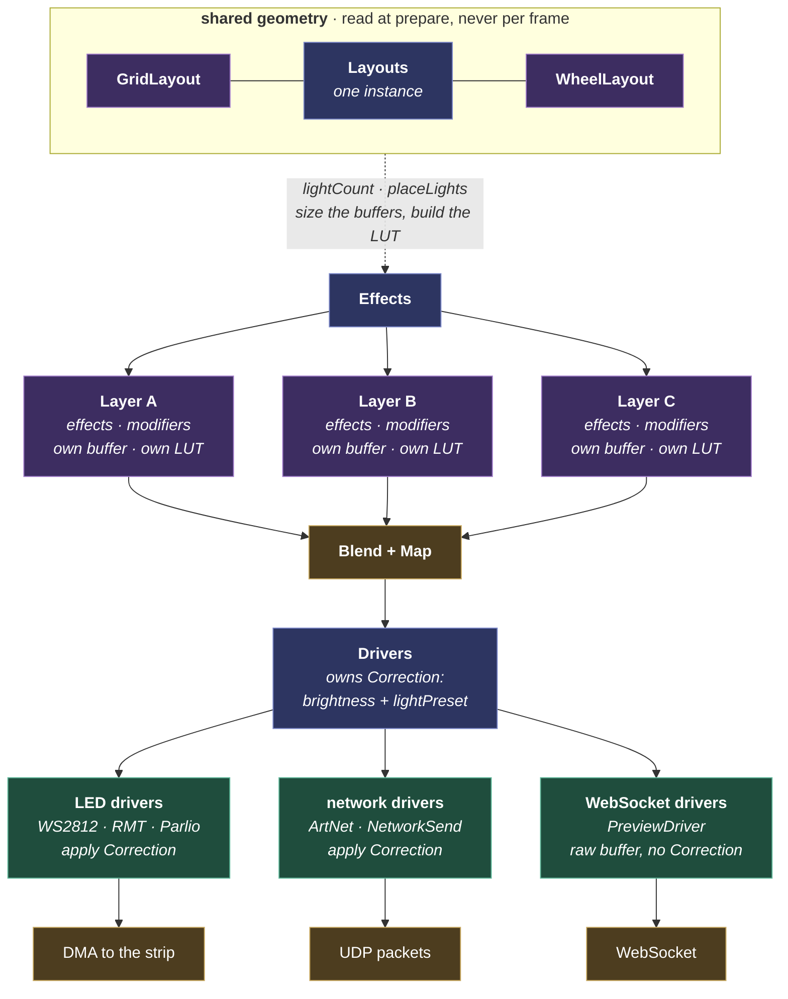

# MoonLight

The light domain, and the larger half of the code: light values, layouts, layers, mapping, blending, effects, modifiers and the LED drivers. This is what a light show is built from, stacking a layout, then layers of effects and modifiers, then a driver.

The pipeline comes first, then each stage in the order light flows through it, and last what all of it costs in memory.

## The pipeline

Modules in the light pipeline can be added, replaced, or removed dynamically at runtime.




**Data flow.** The pipeline instantiates both core data-exchange shapes (see [data exchange between modules](moonmodule.md#data-exchange-between-modules)):

- *Shared-struct (pull):* `Drivers` hands every child driver a `Buffer*` (source) plus a `Correction*` (shared brightness/reorder/white), and `Layer` exposes its pixel buffer to `Drivers` directly on the identity-mapping fast path: each consumer holds a `const`-pointer and reads it per frame. The pointers are **(re)bound on every rebuild**, more than at boot: `Drivers::prepare()` re-resolves the active `Layer` (`Effects::activeLayer()`) and calls `passBufferToDrivers()`, which re-runs `setSourceBuffer()`/`setLayer()` on each child (clearing them to `nullptr` when there is no active Layer). So a held pointer is valid only until the next rebuild. That is why consumers re-read it each frame and tolerate a null, per the [robustness rule](moonmodule.md#robustness): a Layer add, delete or replace re-binds or clears it live, with no dangling reference.
- *Push to a core sink:* `PreviewDriver` owns the preview wire format (a one-time coordinate table + per-frame RGB point list) and pushes the bytes to a `BinaryBroadcaster` (the core HTTP server). The server broadcasts them over WebSocket without knowing they're a preview: the format and the light types stay entirely in the driver. See [PreviewDriver](../../moonmodules/light/moxygen/PreviewDriver.md).

**Two WebSocket channels, by traffic class.** `/ws` carries the control plane (JSON state and patches); `/wsp` carries lossy binary streams (the preview). They are separate TCP connections on purpose. Preview frames are large and droppable while state messages are small and latency-sensitive, so sharing one connection makes the small ones queue behind the big ones. That head-of-line blocking surfaced as a flickering connection indicator and an unresponsive UI on large layouts. Separate connections is the standard remedy for that mixed-criticality case.

`BinaryBroadcaster` stays domain-neutral through this: the core still only takes bytes and broadcasts them, with no knowledge that they are a preview. One query serves the producer, `subscriberCount()` for the status line; the work gate is the pull model itself (no standing request, no work). Inbound client frames are unmasked by the transport (framing is its job) and the payload bytes are handed opaquely to the registered `ClientMessageSink`; only the producer knows a `[0x51][stride][fps]` standing request or a `[0x52][stride]` table request from any other bytes. The two channels have separate caps (`MAX_WS_CLIENTS` 8, `MAX_PREVIEW_CLIENTS` 4) because both draw on one `CONFIG_LWIP_MAX_SOCKETS` budget of 16, shared with HTTP, mDNS, Art-Net, MQTT and OTA.

**Graceful degradation under transport backpressure.** The preview is a PULL channel: a client posts a standing `[0x51][stride][fps]` request plus one-shot `[0x52]` table requests, and the device serves the most conservative standing request, building nothing at all when none stands. Every `/wsp` message rides one resumable per-client-cursor drain. Each socket takes bytes at its own TCP pace on the transport tick, and a frame offered while the slot still drains is dropped at the source. A client is closed only on a real error or a FIN, never for slowness. Congestion therefore costs preview frames, never LED time and never a disconnect. Each frame header reports the drops since the last delivered one. The browser's controller reads only that signal. Persistent drops coarsen the lattice, drop-free windows refine it a rung at a time, and a refine that brings drops back is taken back with exponentially growing patience. That is the abandon-fast, retry-slowly rule of adaptive-bitrate players. Geometry is cached client-side per (epoch, stride), so a stride change to a known rung costs no table traffic. There is no display cap: the bounds are device memory and the index type, and everything else degrades where it binds. The channel machinery is core and domain-neutral (opaque request bytes forwarded to a registered producer sink); `PreviewDriver` is one producer, so other bulky streams can ride the same transport.

**Naming convention.** Capital `Layouts`, `Effects`, `Drivers` are class names (always capitalised when referring to the class). Lowercase "layouts", "layers", "drivers" is the English plural, used freely when context makes it clear. Singular "layout", "layer", "driver" is an individual instance.

## 3D from the start

The system is natively 3D. Coordinates, effects, layouts, and mappings all operate in 3D space (x, y, z). 2D and 1D are the case where one or two dimensions have size 1. There is no separate 2D mode; everything is 3D, and lower dimensions fall out naturally.

Two numeric typedefs keep memory tight in LUT tables:

- **`nrOfLightsType`**: total light count, light indices, LUT destinations, `width * height * depth` products. `uint16_t` on devices without PSRAM (max 65 K), `uint32_t` with PSRAM (supports large hub75 panels). Selected at compile time via `platform_config.h`.
- **`lengthType`**: coordinates and dimensions. Always `int16_t` (max 32767 per axis, supports negatives for out-of-bounds effects).

For 12 K LEDs with a 1:1 LUT, the smaller `nrOfLightsType` on no-PSRAM devices saves 24 KB. All code uses the typedefs consistently to avoid casting.

## Layouts and Layout

**Layouts** (a MoonModule) is the top-level container for one or more layouts, defining the physical topology of the installation. It is shared by every layer: there is one Layouts describing the physical setup, and every layer renders into it. When a layout changes, every layer rebuilds its LUT.

A **layout** (a `LayoutBase` MoonModule, child of Layouts) defines the physical positions of lights in 3D space. It is a **coordinate iterator**: it yields `(physicalIndex, x, y, z)` for each light it defines. A layout does not own or build any mapping LUT.

Layouts cover both addressable LEDs and DMX fixtures. An LED-strip layout yields one coordinate per LED; a DMX-fixture layout yields one coordinate per fixture (a moving head is one point in 3D space).

Positions are computed algorithmically, not stored. Grid is the most commonly used layout, but any geometry works: spheres, rings, cones, spirals, arbitrary point clouds. Grid is full-density (every position maps to a light); a wheel is sparse (only spoke positions are mapped, gaps are unmapped).

Multiple layouts can live in one Layouts container. Each layout describes one light type: the model is one light type per layout (LED strips, or par lights), not mixed in a single Layouts.

## Effects and Layer

**Effects** (a MoonModule) is the top-level container for one or more layers. Each layer renders independently into its own buffer; the Drivers container composes those buffers downstream.

**Multi-layer composition.** The container composes more than one Layer's buffer into the shared output. Each enabled Layer renders into its own buffer, and the Drivers container's blend and map step composites them bottom to top in container order into the physical buffer. That is why it is a *blend* buffer in [Memory strategy](#memory-strategy). Each Layer carries a `blendMode` (alpha-over or additive) and an `opacity`, inert parameters the Layer never acts on; Drivers reads them and the container child order, and blends bottom→top. The bottom layer clears + overwrites the output; each layer above blends onto the accumulated frame per its mode and opacity. With a single enabled Layer this is the degenerate case: a thin pass-through that hands the driver the Layer's buffer directly (no composite), byte-for-byte the single-layer pipeline. The blend math is integer-only per the hot-path rule (8-bit alpha-over `(src·α + dst·(255−α))/255`, additive sum-with-clamp); cost scales with the enabled-layer count.

A **Layer** (a MoonModule, child of Effects) owns:

- A **buffer**: the light data effects write into (logical space).
- A **mapping LUT**: built by the layer from the shared Layouts and the layer's static modifiers.
- **Effects** (ordered list): write light values into the buffer.
- **Modifiers** (ordered list): transform the LUT or light values.

A layer can have **multiple effects**. Each effect writes to the buffer sequentially in its listed order, overwriting or adding to the previous, so the effects stack (a base-color effect followed by a sparkle effect).

A layer applies **all its enabled modifiers as a chain** during the mapping build (`Layer::rebuildLUT`): each modifier is a coordinate fold, and they compose in child order (M₁∘M₂∘…). Modifiers are **reorderable** in the UI, and order is meaningful (a multiply-then-checkerboard mask differs from checkerboard-then-multiply, as mirror-then-rotate differs from rotate-then-mirror). The fold contract (the three hooks, the physical→logical build, the live pass) is documented in [ModifierBase](../../moonmodules/light/moxygen/ModifierBase.md).

Each layer references the shared Layouts. The layer builds its mapping by walking the Layouts container's **physical** coordinates and folding each through the static modifier chain to its logical cell. N physical lights folding onto one logical cell is the fan-out, as in a Multiply kaleidoscope, so the build never produces a fan-out overflow. Different layers in Effects can have different modifiers, producing different mappings from the same Layouts.

## Effects

Effects produce light colors. They write into the Layer's buffer, which represents a logical grid. The Layer determines the buffer's dimensions (width, height, depth) from the Layouts and its modifiers. Effects receive these logical dimensions and elapsed time (millis) as their rendering context. They compute light positions from the buffer index (such as `x = i % width`, `y = i / width`).

Effects use elapsed time for animation, not frame count. Animation speed becomes frame-rate independent: an effect looks the same at 30 fps and 60 fps. This is also what makes the cross-device clock sync work: a shared elapsed-time base means synced visuals across controllers (see [Multi-device sync](#multi-device-sync)).

Effects know nothing about hardware, protocols, physical LED layout, or mapping. They only see the logical grid the layer provides.

**Speed convention.** Effects with a speed control use BPM (beats per minute). `uint8_t`, default 60 (= 1 beat per second). Human-readable, musically meaningful, DMX-compatible. The effect converts BPM to animation rate internally using elapsed millis.

## Buffer persistence: the layer keeps what it drew

The Layer's buffer **persists** frame to frame: `Layer::tick()` does not clear it before running effects. It is zeroed once on allocation/resize, and once more in `Layer::prepare()` after `rebuildLUT()`, so a rebuild starts from black and persistence then holds between frames. Each effect owns its background:

- A **full-grid** effect (Plasma, Rainbow, Fire, Noise) writes every pixel each frame.
- A **trail** effect calls `layer()->fadeToBlackBy(amt)` to decay the previous frame, so a comet leaves a fading tail.
- A **read-prior** effect (FreqMatrix scroll, Game-of-Life, a blur) reads last frame's pixels via `draw::get` / `draw::blur`; the persistence *is* its state.
- A **sparse** effect that wants a clean frame calls `draw::fill(buf, {0,0,0})` itself (such as RubiksCube).

Fade is a Layer operation. Effects register an amount, and the Layer keeps the MIN across them and applies one whole-buffer pass at the next frame's start. N fading effects therefore cost one pass rather than N, and never darken each other's fresh pixels.

## Dimensionality

Every effect declares its native dimensionality through `EffectBase::dimensions()`, returning `Dim::D1`, `Dim::D2`, or `Dim::D3` (default: "I iterate every axis the layer gives me"). The Layer uses this to **extrude** lower-dimensional output across the unused axes after each effect's `tick()`:

- **D1**: the effect writes only the column at `(x=0, z=0)`, **1D runs along Y**. Layer copies that column across every other x in z=0, then copies z=0 across every z.
- **D2**: the effect writes only the z=0 slice (the front `(x, y)` face). Layer copies z=0 across every z.
- **D3**: the effect writes every axis itself. Extrude is a one-comparison no-op.

D1/D2 are **opt-in promises**: declaring them tells the framework it can fill the missing axes, saving the per-effect work of iterating z (or x and z). Effects that don't make that promise stay at the D3 default and iterate the whole buffer.

**Why 1D runs along Y, and the unified expand rule.** A lower-D effect occupies the low axes and the framework expands across the next: **1D → 2D adds columns across X**, **2D → 3D adds slices across Z**. 1D-along-Y, shared with MoonLight, makes a 1D effect the natural first column of its 2D form, so expanding to a panel is "repeat the column" with the same math. 1D-along-X would make it a row expanding downward, a worse fit since a strip is a column. A 1D effect therefore renders correctly on a `1 × N` grid (width 1, height N), but on `N × 1` the extrude runs the wrong way and flattens it. How a physical output (a strip, a row of [Hue lights](../../moonmodules/light/moxygen/HueDriver.md)) maps to `1 × N` is a layout concern.

Hot-path cost: extrude pays one comparison and returns for the D3 case. For D1/D2 on a layer whose unused axes are size 1 (a D2 effect on a 2D layer, a D1 effect on a 1D `1 × N` layer) the inner loops are guarded by `depth_ > 1` / `width_ > 1` and never run. Real `memcpy` work happens only for a D1 or D2 effect on a layer with more dimensions than the effect writes: exactly the case where you wanted the framework to do the duplication.

Each effect's `dimensions()` is a claim about which axes its loop iterates, not which axes its math could in principle vary along. A "D2 fire" can in future be promoted to D3 by adding z-aware heat propagation; until then declaring it D2 honestly describes what the loop does today.

The `dim` int is also emitted in `/api/types` so the UI derives the dimensional emoji (📏/🟦/🧊) per module; modules don't put dimensional emoji in their own `tags()` strings.

## Robustness rules

**Effects run at every non-empty grid shape.** Modifiers can reshape the logical grid to any size, so an effect's `tick()` produces a correct result for any `(width, height, depth)` of at least one light, a 1×1, a strip, a tall column, a cube. The empty case is the Layer's: `Layer::tick()` skips the effect pass entirely when an extent is 0 or the buffer holds no lights, so that check lives in one place for all effects rather than at the top of each.

**The Layer decides whether a frame runs; the effect decides what it paints.** The modifier pass still runs when the effect pass is skipped: a beat-driven modifier advances its per-frame state through the empty interval, so the chain is in the right phase when the grid returns. An effect owns the checks about *itself*, and returns early for:

- **Its own resources**: `if (!heat_) return;`, a ScratchBuffer it allocated.
- **Its own controls and timing**: `if (speed == 0) return;`, a rate limiter, a divide-by-zero guard on a control value.
- **Producer input**: `if (!f) return;`, no audio frame to react to.

The test: *would the Layer know to skip this?* If yes (an empty grid, a disabled module), it belongs to the Layer. If no (this effect's buffer, this effect's control), it belongs to the effect.

**Effects render at every channel count.** An effect writes per channel, the way `draw::pixel` does (`if (write >= 1) …r; if (write >= 2) …g;`), so a light carries as much of the color as it has channels, RGB on three, R+G on two, R on one. Channels the effect doesn't set belong to the driver. Every light has at least one channel: `Layer::setChannelsPerLight` enforces that at the setter.

**Effects must animate at every tick rate.** Per-tick phase math computed as `dt * bpm * K / 60000` truncates to 0 on devices where `dt < 234/bpm` ms: desktop ticks every 0–1 ms, so even bpm=60 freezes. The fix is to keep the raw `dt * bpm` numerator in the phase accumulator and divide only at the read site:

```cpp
phase_num_ += static_cast<uint64_t>(dt) * bpm;
uint8_t t = static_cast<uint8_t>((phase_num_ * 256) / 60000);
```

See NoiseEffect / MetaballsEffect for the canonical pattern. Animation speed must depend only on `bpm` and wallclock, not on tick rate or grid size.

**Everything that changes over time is driven by elapsed time, never by the frame count.** The rule above is one half of it, a phase that truncates to zero and freezes. The other half is the mirror image and as wrong: state advanced by a fixed amount *per frame* runs at whatever speed the hardware happens to render. The same gravity setting is an explosion on a desktop at 5,000 fps and a drift on an ESP32 at 470. This applies to every per-frame quantity, more than phase: a force, a velocity, a trail fade, a decay, a drop rate, a simulation step. The user sets a speed; the hardware must not get a vote.

**A faster device renders the same motion more smoothly, not more motion.** Quantising to a fixed 60 Hz and skipping the frames in between is wrong here: it discards the smoothness those extra frames were rendered for. Instead scale the work by the fraction of a reference frame that elapsed, so a device rendering ten times as fast takes ten steps a tenth the size: the same trajectory at ten times the resolution. `particles::FrameTime` is the shared implementation (8.8 fixed point, 256 = one reference frame, whose rate is the constructor's `referenceHz`, 60 by default). It carries the undivided numerator and divides late, for the same reason `BeatPhase` does. One unit is a fraction of a millisecond, so a remainder held in whole milliseconds cannot represent it and the truncated time, which differs by render rate, becomes a framerate dependency of its own.

The check is mechanical: **run the effect at two different framerates over the same span of simulated time and compare.** If the result differs, something is counting frames. `unit_Effects_framerate.cpp` runs exactly that sweep over every registered effect at 60 and 1200 fps.

**It applies to modifiers too, and to anything else on the tick path.** A modifier that scrolls, rotates or animates its fold is state advanced per call, so the same rule holds: a scroll driven by a per-tick increment moves at the render rate. Anything whose output changes between two ticks with identical inputs is animating and owes elapsed time; a modifier that only folds coordinates from its controls is a pure function and owes nothing.

**Where the machinery lives, and why it is not in the effects.** A trail fade is the case with the most callers, so it is the worked example: `Layer::fadeToBlackBy` takes a RATE per reference frame and the Layer scales it once, for every effect at once. An effect carrying that conversion itself drifts: a version that carries the fraction and a version that floors to 1 apply different decay at the same rate, which is the duplication the one-home rule exists to prevent. Every amount is a rate, with no exception: an effect that wants the buffer blank NOW calls `draw::fill`, since a clear is not a fast fade. Giving 255 a second meaning put a discontinuity in kind at the top of six user-facing fade sliders.

Two traps worth naming. A quantity already gated by wallclock must not ALSO be scaled: an effect that requests its fade only on stepping frames has the Layer scale each request again, throttling it twice. And a COMPOUNDING spatial operation is not a rate: `draw::blur` applied twice at half strength is not one blur at full strength, so the carry pattern that fits a fade does not transfer to it.

**An effect renders a pattern; it does not transform geometry.** When migrating or adding an effect, strip out anything that is a *modifier* (mirroring, tiling, rotation, scrolling/offset, a kaleidoscope fold, masking, any remap of *where* pixels land), and add it as a separate [modifier](#modifiers) instead. WLED (and other sources we port from) routinely fold these into the effect's own loop (a "mirror" checkbox, a "2D" rotation, a built-in pinwheel), because WLED has no modifier concept; we do. Keeping them out of the effect is what lets any effect compose with any modifier (the same RotateModifier rotates Fire, Noise, or a network-received frame) instead of every effect re-implementing its own half-baked mirror. The test: an effect's `tick()` should only *write colors into the logical buffer for its own coordinates*; if it's reading or rewriting positions to move/fold/duplicate the image, that behavior belongs in a modifier. (This is the light-domain face of *Complexity lives in core; domain modules stay simple*: geometry transforms are the modifier's job, shared once, not duplicated into every effect.)
## Modifiers

A modifier (MoonModule) lives inside a layer alongside its effects. Modifiers expose a virtual interface: the Layer calls modifier methods without knowing the concrete type (no `dynamic_cast`). A layer applies **all** its enabled modifiers as a chain, in child order, each a coordinate fold composed into one mapping (see [Effects and Layer](#effects-and-layer)).

A modifier is a coordinate transform, applied in one of two ways (the fold contract is in [ModifierBase](../../moonmodules/light/moxygen/ModifierBase.md)):

- **Static** (`modifyLogicalSize` + `modifyLogical`): folded into the mapping during the cold-path build, so it costs nothing per frame (Region crop, Multiply tile/mirror, a mask).
- **Live** (`modifyLive`): a per-frame coordinate remap for animation (rotation), run only when an enabled modifier needs it, a static-only chain pays nothing.

**Dimensionality** for modifiers defaults to `Dim::D3` (assumed to work in all three axes unless declared otherwise). Unlike for effects, this is purely advisory: the Layer doesn't extrude modifier output. It exists so the UI can render the 📏/🟦/🧊 chip on the card. **MultiplyModifier** is D3 (it has independent multiplyX/Y/Z + mirrorX/Y/Z toggles).

## Mapping and blending

The blend+map step walks each layer in turn: reads each logical light, uses that layer's LUT to find the physical position(s), blends the color into the physical output buffer. This is where logical space meets physical space.

Each mapping LUT is a flat, contiguous lookup table allocated outside the hot path. It is built in `Layer::prepare()` and rebuilt whenever a Layout or Modifier control changes (the controls' `affectsPrepare` returns true) or a Modifier/Layout child is added/removed/replaced/moved; both triggers flow through the same core mechanism, see [Event triggering between modules](moonmodule.md#event-triggering-between-modules).

The LUT supports four mapping types:

- **1:1 identical**: logical index equals physical index. No table needed (`hasLUT()` returns false, `setIdentity()` mode). Grid without serpentine, no modifiers.
- **1:1 shuffled**: logical maps to one physical, but reordered. Table needed. Grid with serpentine.
- **1:0 unmapped**: logical light has no physical output. Table needed. Sparse layouts (wheel).
- **1:N multimap**: logical maps to multiple physical positions. Table needed (CSR format). Mirror / clone modifier.

Because mapping and blending happen in a single pass over each layer, there is no intermediate "mapped but unblended" buffer. The physical buffer is the only output-side allocation.

## Drivers

**Drivers** (a MoonModule) is the top-level container for one or more drivers. It is the consumer side of the pipeline. The Drivers container owns a shared output buffer and performs blend+map from every layer's buffer into it each frame. Individual drivers then read from this buffer to push to hardware / network.

The shared output buffer is necessary when blend+map writes to arbitrary physical positions via the LUT: the output is not filled sequentially, so a driver cannot read chunk-by-chunk until the full buffer is populated. The single-layer, no-blend case needs none of it, whether the mapping is identity or a serpentine shuffle. There a driver fuses map, output correction and protocol encode into one pass straight into its own DMA buffer or packet, skipping the shared buffer.

Each driver (a MoonModule) speaks one protocol:

- **LED drivers**: WS2812 over RMT for multi-pin output, plus one DMA-driven parallel driver, [ParallelLedDriver](../../moonmodules/light/drivers.md#parallelled). Its `peripheral` control picks the backend the chip supports: the `i80` bus, our own-GDMA MoonI80, or the P4's Parlio. The `i80` bus is LCD_CAM on the S3, P4 and S31, and the classic ESP32's I2S peripheral in i80 mode, which is that chip's only route past 8 lanes; IDF's `esp_lcd` picks the backend per chip. MoonI80 adds the streaming ring and the 74HCT595 expander. All are DMA-driven and behind the platform boundary; the driver rounds an i80 bus up around whatever pin count is configured (any count from 1) and parks unused lanes on a pin already driven.
- **DMX / ArtNet**: sends DMX over UDP. Supports addressable LEDs and conventional DMX fixtures (pars, moving heads, dimmers).
- **Preview**: streams light data to the web UI via WebSocket.
- **Desktop output**: SDL2 or terminal for visual preview. Desktop also serves as a high-speed processing node, driving lights via ArtNet/DDP over the network.

Each driver child reads from the Drivers container's output buffer. Everything before the Drivers container is platform-independent.

**Output correction** turns logical RGB into the physical signal: **brightness** scaling, channel **reorder** (RGB→GRB via a *light preset*), and **white** derivation for RGBW. The Drivers container owns the global `brightness`; each driver picks its own light preset (its `preset` control) and applies the correction per-light into its own buffer/packet, so two strips on one device can be wired differently. Preview is exempt (it shows the raw logical buffer). The brightness LUT rebuilds on the cheap `onControlChanged` tier ([Event triggering](moonmodule.md#event-triggering-between-modules)), so the slider stays fluent.

**An effect drives a fixture's non-color channels through role setters.** A light is as wide as its fixture ([Buffer types](#buffer-types)), with color at offset 0 and the fixture's other roles wherever its light preset puts them. `setPan()`, `setTilt()` and `setZoom()` write those, and each is a **no-op when the fixture has no such channel**. One effect is therefore valid on a moving head and on a strip alike: on the strip the pan write does not land, and the effect paints color.

Two rules separate those channels from color, and both matter:

- **Brightness never scales them.** Brightness is a light-output setting; scaling pan by it would swing a moving head toward 0/0 as the rig dims.
- **They interpolate but never accumulate** (the rule; the additive half is NOT yet implemented, see below). A blend op that INTERPOLATES (opacity, a crossfade) is meaningful on any channel, and on pan it is a genuine feature: the head sweeps smoothly from the old aim to the new one as a layer fades in. A blend op that ACCUMULATES (additive) is meaningful only on emissive channels, where summing two lights models two sources lighting one surface. Summing two aims models nothing, since it points at neither and saturates at hard-over as soon as both layers are positioned, so an accumulating op should fall back to assignment on a motion channel with the topmost writer winning. **Today `blendMap` treats a light as opaque bytes and adds motion channels along with color**; it only bites with two enabled layers on a fixture that carries motion, and the fix is [backlogged](../../work/future/backlog-light.md).

**DMX fixtures are addressed as a daisy chain of IDENTICAL fixtures**, the same model addressable LEDs already impose. A strip is N identical pixels at a fixed stride, and a DMX run is N identical fixtures at a fixed stride. One light preset describes one fixture, its channel count is the stride, and fixture *n* starts at `start + n x channelCount`. Twenty-five channels per fixture puts them at DMX 1, 26, 51, and so on, and the driver's `count` says how many are on the chain.

This is what makes a moving head reachable by the same pipeline as a pixel: the light domain produces one logical light per fixture, and the driver expands each into that fixture's channel block through the preset. It is also the cheapest thing to configure, since only the start address and the fixture type are needed, never a per-fixture address table.

The trade is deliberate: **a chain must be homogeneous**. Mixing fixture types on one universe, or leaving gaps between fixtures, has no expression in this model, and neither does a fixture whose address does not sit on the stride. Those need a per-fixture address map, which is the fixture-model work ([backlog](../../work/future/backlog-light.md)); until then, a mixed rig is served by giving each fixture type its own driver instance with its own preset, start address and count.

## Multicast and IGMP snooping

Three things projectMM sends to more than one listener, and they do not all use the same transport, because the protocol's owner decides it and not us:

| | transport | why |
|---|---|---|
| WLED audio sync | multicast `239.0.0.1` | WLED's usermod both sends and receives there, never on broadcast |
| Device discovery | multicast `239.255.77.77`, plus broadcast when `wledCompatible` | WLED apps browse the discovery port on broadcast |
| E1.31 / sACN output | unicast by default, multicast opt-in | multicast is the spec's native mode, but see below |

**Broadcast** reaches every device on the subnet. Each one takes the interrupt, walks up the stack, finds nothing listening on the port and discards the packet. At LED frame rates that is real work imposed on every phone, laptop and printer on the LAN.

**Multicast** is addressed to a group, and only the devices that joined it (via IGMP) accept the packet. The rest never see it, which is what makes it the better neighbour in principle.

**In principle**, because the win depends on the switch. A switch with **IGMP snooping** watches those join messages and learns which of its ports want the group, then forwards the traffic only there: the saving is real and happens in hardware. A switch **without** snooping cannot know, so it does the safe thing and floods the group out of every port, exactly like broadcast. WiFi is worse than that: multicast and broadcast alike go out at the lowest basic rate so every station can hear them, which is far slower than a unicast frame to one associated station.

Firmware cannot detect which kind of network it is on. That is why **multicast is never an automatic upgrade here**. sACN multicast and dropping the discovery broadcast are both opt-in choices for someone who knows their switch. Unicast, or broadcast where a protocol demands it, stays the portable default.

Network-based drivers (ArtNet, E1.31, DDP) pace their output with a **non-blocking elapsed-time gate**, never a blocking wait (no `delay`/`vTaskDelay`, that would stall the single-threaded tick, the hot-path rule). The gate is the `lastSendTime`/`millis()` pattern: `if (now − lastSendTime < interval) return;` early-exits the tick so every other module's loop keeps running, exactly how FPS limiting works (`NetworkSendDriver`, `fps` control). **Frame-rate pacing is required** and implemented this way. **Inter-packet pacing**, spacing the universes within one frame, uses the same non-blocking gate where a receiver drops packets under a burst. It is off by default, since the bench ArtNet matrix test runs clean while bursting the universes, so it is added only when a target requires it, never as a busy-wait between packets.
## Multi-device sync

How lighting uses the core [multi-device runtime](mooncore.md#multi-device-runtime) (discovery + clock sync) to drive an installation spanning multiple controllers:

- **Synced visuals from the shared clock.** Effects animate off elapsed time ([Effects](#effects)), so a synced clock is what makes a wall of controllers animate in lockstep regardless of each one's frame rate. This is the light-domain payoff of the core clock sync.
- **Light distribution**: one device sending rendered light data to another uses the existing ArtNet / E1.31 / DDP standards. The ArtNet *driver* sends to fixtures; device-to-device distribution as a sync topology is filed in [backlog-core](../../work/future/backlog-core.md). No bespoke protocol.

## What bounds a parallel driver

Three hardware limits decide how many lights one board can drive, and the driver architecture exists to respect them. The measurements behind each are in [performance.md](../../reference/performance.md#multi-pin-led-driving-all-three-peripherals-128128-grid).

**Parlio's single-shot transfer caps at 65,535 bytes in total, not per lane.** A light costs `channels x 24 x slotBytes`, so the ceiling is 897 lights per lane at 8 lanes RGB, and halves again at 16 lanes because a wider bus doubles the slot. Past it the driver reports the overflow and keeps running.

**The classic ESP32's I2S backend cannot DMA from PSRAM.** `esp_lcd_i80_alloc_draw_buffer` rejects external memory outright, so the frame buffer is internal DMA RAM only and the ceiling is 2,048 lights at 8 lanes. The S3's LCD_CAM allocates the same buffer from PSRAM and reaches 16,384, which is the single largest difference between the two backends.

**A contiguous block, not total memory, is what runs out.** The P4 has 33 MB of heap and a largest contiguous internal block of about 368 KB, and a single-shot DMA buffer needs one block, so Parlio caps at 4,096 lights long before its byte limit bites. Reaching the full grid needs the transfer split across bursts.

Each backend degrades rather than crashing: the init fails, the driver says so, and the render keeps running at full grid size while the output is capped.

## Memory strategy

All buffers are allocated as single contiguous blocks outside the hot path, at startup or when configuration changes (LED count, layout size, layer count). They are then reused every frame with zero allocations in steady state. Measured per-module timing and memory for each platform: [performance.md](../../reference/performance.md).

### Pay for what you use

A module holds heap **only for capabilities it is exercising**, the same zero-overhead principle C++ applies to abstractions ("you don't pay for what you don't use"). Concretely, for every module:

- **A module not in the tree costs nothing.** Modules are heap-allocated through `MoonModule::operator new` when added (via the factory or boot wiring), so a deviceModel that omits a module pays zero, not even its `classSize()`. This is the base case the rest of the rule extends inward.
- **A feature's buffer allocates on first use, not at `setup()`.** When a module *is* present but a given capability is dormant (a driver with no output attached, an MQTT client with HA discovery toggled off), that capability's buffer is `nullptr` until the code path that needs it runs. Allocating eagerly at `setup()` for a path that may never execute is the anti-pattern this rule forbids, it charges every instance for the worst case.
- **The allocation frees in `release()`** (and on the transition that makes the capability dormant again, a disable, a toggle-off), and is reported through `dynamicBytes()` so `/api/system` and the memory scenarios see the real ladder. `MoonModule::release()` reverse-recurses into children, so a subtree's memory unwinds bottom-up with no leak.

The result is a memory ladder that tracks configuration exactly: module-absent → 0; module-present-but-feature-off → the class instance; feature-active → `+dynamicBytes()`. The LED driver's output buffer and the MQTT module's discovery-config scratch are the worked examples; the rule governs every module. It matters most on a no-PSRAM ESP32, where the internal-heap reserve (`HEAP_RESERVE`) is the tightest constraint, so a buffer held but unused spends the reserve the render loop, WiFi, and HTTP depend on.

### Buffer types

- **Layer buffers**: one per active layer, holds the logical light data for one effect chain. Allocated in PSRAM when available. On memory-constrained devices, consumers may read from the layer buffer directly (no mapping, no blending, no physical buffer needed).
- **Physical buffer**: when present, holds the blended+mapped output. It is a *blend* buffer, needed only for compositing (>1 layer, or any alpha/additive blend); it is not what provides producer/consumer parallelism. Under the [two-core handover](moonmodule.md#parallelism), parallelism comes from the consumer's own working copy: the encoded DMA buffer for a clockless LED driver, or the kernel socket buffer for ArtNet. That decouples the producer filling the next Layer frame from the consumer transmitting the previous one.
- **Mapping LUT**: flat lookup table for logical→physical. Read-only during rendering. PSRAM is fine: sequential reads are cache-friendly.

All buffers are raw `uint8_t*` arrays sized `channelsPerLight * nrOfLights`. There is no pre-allocated per-channel array and no fixed channel layout. `channelsPerLight` is a runtime `uint8_t`, so 1 to 255, which means RGB, RGBW and multi-channel DMX fixtures all use the same code path and the buffer gets wider. Channel layout is configured via offsets (see MoonLight's [LightsHeader](https://github.com/ewowi/MoonLight/blob/main/src/MoonLight/Layers/LightsHeader.h) pattern).

Network input (ArtNet receive, WebSocket) is processed synchronously at a defined point in the frame loop. Zero extra buffers, no race conditions. The trade-off is up to one frame of latency (~16 ms at 60 fps), imperceptible for LEDs.

### Adaptive allocation

The system checks available heap before each allocation and degrades gracefully when memory is insufficient (allocate on demand with a cascade, rather than fixed buffers). A minimum reserve (`HEAP_RESERVE = 32 KB`) is kept for stack, HTTP, WiFi, and overhead.

- **Mapping LUT** is created only if all of: modifiers exist on the layer; layout is not a simple non-serpentine grid (where physical == logical); enough heap available after the reserve.
- **Driver output buffer**, described under [Drivers](#drivers), exists only when the pipeline must write into physical space rather than hand a driver a layer's logical buffer directly. Two conditions trigger it: **two or more layers are enabled**, so they must be composited into one buffer, **or** a layer has a **mapping LUT** allocated, meaning logical and physical differ. Both also need the heap to be available. A single enabled layer with no LUT needs no output buffer: drivers read its buffer directly (the zero-copy fast path).

### Degradation cascade

When memory is short the pipeline steps down rather than failing to start, and each step is observable, so a device that cannot afford the full pipeline still shows something and says what it dropped. The steps, best to worst, are in [firmware variants](../../reference/hardware/firmware-variants.md#degradation-cascade).

### Invariants

Non-negotiable:

- Effects always write to their layer's logical buffer. Never to output, never to physical coordinates.
- Drivers always own the output path (blending, mapping, brightness correction, channel reordering).
- Layer buffer is mandatory: if it doesn't fit, reduce dimensions until it does ("at least see something").

### Per-module reporting

Every MoonModule self-reports `classSize()` / `dynamicBytes()` / `tickTimeUs()` (a core base-class feature; see [MoonModules](moonmodule.md)). For the light pipeline specifically, memory scenarios use those numbers to verify that 1:1 pipelines allocate zero intermediate buffers and that the degradation cascade triggers at the right thresholds.

### Scaling to available memory

What each class of device can run is tabulated in [firmware variants](../../reference/hardware/firmware-variants.md#scaling-to-available-memory). The architecture does not assume PSRAM is present. Buffer counts and sizes are determined at runtime based on available memory and reallocated when configuration changes.
