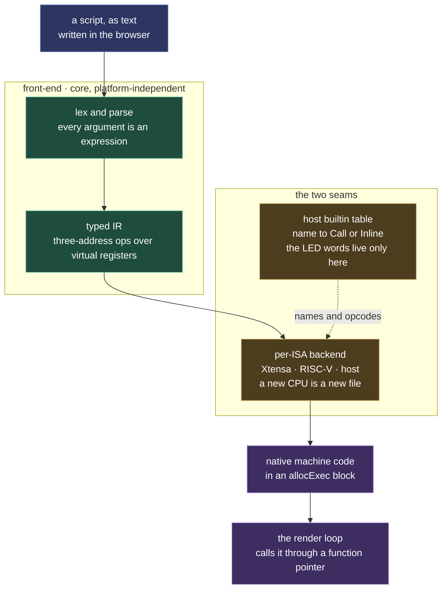

# MoonLive

Scripts compiled to native machine code on the device. An effect written as text in the browser runs at the speed of compiled code rather than an interpreter, on ESP32 and desktop alike.

The engine comes first, then how a script reaches the device, and last the one place the lifecycle does not yet fit.

The IR is the seam, and it is what keeps the three tiers from knowing about each other: it names operations, never an instruction set and never a domain. The front-end never branches on CPU, the core never learns an LED word, and the compiled result is called like any other function. Adding a CPU is a backend file; adding a domain function is a table entry.

## A native-codegen compiler

MoonLive lets you author an effect (later: a layout, modifier, driver, or core rule) as **text** and run it on a running device, with no recompile-and-flash cycle. Its standout property is *how* it runs the script. It is a **native-codegen compiler** rather than a bytecode interpreter: source text is lexed, parsed, lowered to a typed IR, and assembled to real machine code. The render loop calls that through a plain function pointer, so a scripted effect runs at near-hand-written speed in the hot path. This is the core construct; a scripted effect (`MoonLiveEffect`) is the thin binding that gives it the MoonModule lifecycle.

The engine is a **domain-neutral core** with one narrow seam, structured as three tiers so adding a CPU is additive, never a rewrite:

- **Front-end** (`src/core/moonlive/`, platform-independent): a recursive-descent lexer and parser over an expression grammar, where every function argument is a literal or a nested call. It lowers each statement to a typed **IR**, a flat list of three-address ops over virtual registers. The IR is the seam: it knows *operations*, never an ISA and never a domain. It is compile-time only, consumed during lowering and discarded, so it costs nothing at run time. The CPU executes only the final native instructions.
- **Host builtin table** (the domain seam): the core owns no function names. A *host* registers `{name → descriptor}`, `setRGB`/`fill`/`random16` for LEDs (`src/light/moonlive/`), something else for a display or sensor. A descriptor is either a `Call` (a generic call to a host C function pointer, a pure helper like `random16`) or an `Inline` op (a neutral opcode tag the backend emits inline, a buffer writer, no per-pixel call). This is the ESPLiveScript / ARTI bound-function model; it is what keeps the core LED-free while the hot path stays inline. The LED *names* and the "an element is 3 RGB bytes" meaning live only in the light-domain registration and the per-ISA lowering, never in core.
- **Per-ISA backend** (`src/platform/`, behind the boundary): a tiny named-instruction MacroAssembler (the textbook V8 / LLVM / asmjit shape, append one instruction, back-patch label offsets) plus the IR→bytes lowering that drives it. Xtensa (classic ESP32 / S3), RISC-V (P4), and the host ISA (desktop arm64/x86-64) each are *a new backend file behind the unchanged IR*, the front-end and IR never branch on ISA. Emitted code goes into an `allocExec` block (see [Platform abstraction](mooncore.md#platform-abstraction)) and is called each tick.

## The domain seam

**The core knows expressions plus a generic call mechanism; the host registers its functions.** Every argument parses as an expression, so a literal and a nested call are the same shape, and the LED names and RGB meaning live only in the light-domain registration. The core sees a neutral `BuiltinTable` of `{name -> Call(fn ptr) | Inline(opcode tag)}`: a buffer writer is `Inline` (the hot-path fast path), a pure helper is `Call`. Adding a domain function is a table entry, never a change to the language.

## A script reaches the device like any other control change

A recompile is the normal cold-path rebuild. Editing the `source` control routes through the same `prepare()` sweep every control change uses, so a new script swaps in live with no reboot. A parse error surfaces in the module status while the layer renders dark, which is the robustness rule applied to text a user typed. The module contract is [MoonLiveEffect](../../moonmodules/light/MoonLiveEffect.md).

## A scripted module is still a module

**A scripted module differs from a compiled one in one thing only: where its behavior comes from.** Everything else is the same mechanism: the same base class, the same `prepare()`/`release()` lifecycle, the same controls, the same status and memory reporting, the same container contract. A `MoonLiveLayout` is a `LayoutBase` that answers `lightCount()` and `placeLights()` like any other; it answers them by running compiled machine code instead of arithmetic over its members. When a scripted binding needs a mechanism its compiled sibling does not, that is a finding: either the mechanism belongs in the base for everyone, or the divergence needs its reason stated where it is introduced. A binding that drifts into its own lifecycle stops being a module and becomes a second system to maintain.

The one place this is not yet clean: `applyState()` prepares parent-before-child, so a container asks its children for their extent before those children have prepared. A compiled layout computes its count from its members and does not notice. A scripted one has nothing to answer with until it compiles, so it compiles on demand from a `const` method. The `const_cast` and `mutable` members in `MoonLiveLayout` exist for that and nothing else. Removing them means giving core a way for children to prepare before a container aggregates them, which is a lifecycle change for every module.
