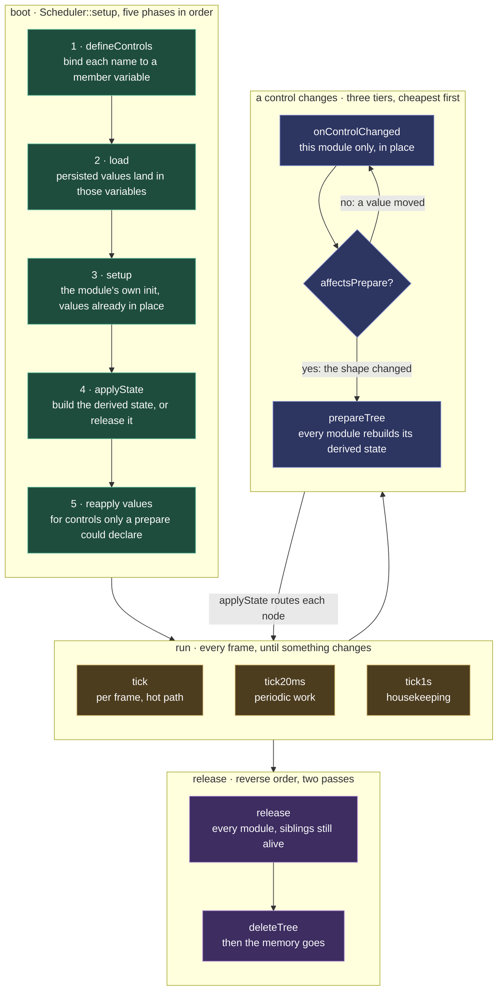

# MoonModule

The one building block. Every effect, modifier, layout, driver and service is a MoonModule: the same base class, the same lifecycle, and controls each module declares for itself. That uniformity is why the interface renders any module with no per-module code, and why a new capability is a new file rather than a new framework.

The lifecycle comes first, then what a module exposes and persists, then how modules reach each other, and last the two rules every module is held to: robustness and the hot path.



Four states, and the arrows are the only way between them. Boot runs its five phases once, in that order, because each depends on the one before. A control cannot take a persisted value before it is bound, and a buffer cannot size itself before the value that sizes it has arrived. After that the module ticks until something changes, and a change re-enters the build phase rather than taking a path of its own. Teardown reverses the order so a module's `release` still sees live siblings.

## What counts as a module

The core building block is a **[MoonModule](../../moonmodules/core/moxygen/MoonModule.md)**. Everything is a MoonModule, more than effects, modifiers, layouts, and drivers, but also system infrastructure (HTTP server, WebSocket server, file server, WiFi, mDNS, OTA updates) and [services](mooncore.md#services) (sensors and actuators bridging to hardware/network). The core itself is minimal: MoonModule base, buffer management, a [Scheduler](../../moonmodules/core/moxygen/Scheduler.md).

This means:

- Every MoonModule shares the same class structure, lifecycle (`setup`, `tick`, `release`), and controls. Learn the pattern once, apply it everywhere.
- System services get controls for free: HTTP port, WiFi SSID, mDNS hostname are all configurable through the same UI as effect parameters.
- Capabilities are modular: no WiFi? don't load the WiFi MoonModule. No `#ifdef`s needed.
- System MoonModules that listen (HTTP, WebSocket) poll in their `tick()`, the standard pattern for embedded servers.
- The scheduler handles init-order dependencies between system MoonModules (such as WiFi before HTTP, HTTP before WebSocket).

Modules can be added, replaced, reordered, or removed at runtime. On removal (release), all allocated resources are cleaned up.

## Lifecycle propagation to children

A MoonModule that owns children gets the standard lifecycle methods propagated to them automatically:

- `setup()` and `release()`: chain into children. Teardown reverse-iterates so children clean up before the parent does.
- `tick()`, `tick20ms()`, `tick1s()`: tick each child under the same gate the Scheduler applies to top-level modules, `!respectsEnabled() || enabled()`. Modules that opted out of the enabled gate keep ticking; the rest tick only when enabled. Per-child timing accumulates into the child's own `tickTimeUs()`.
- `defineControls()` and `prepare()`: chain into children.

This means a container module gets correct lifecycle handling for its children without writing the iteration itself. Leaf modules (no children) pay one predicted-not-taken branch per call, sub-nanosecond. When a container overrides one of these methods to add its own work, the chain-to-base convention (parent-before vs child-before per callback) lives in [coding-standards.md § Override-and-chain convention](../../contributing/coding-standards.md#override-and-chain-convention).

**ModuleFactory** is a static registry mapping type names (strings) to create functions. The HTTP API uses it to create modules at runtime (`POST /api/modules {"type":"NoiseEffect"}`); the main pipeline in `main.cpp` constructs modules directly. Registration captures `sizeof(T)` for memory reporting:

```cpp
ModuleFactory::registerType<NoiseEffect>("NoiseEffect");
```

ModuleFactory is core infrastructure ([`src/core/ModuleFactory.h`](../../src/core/ModuleFactory.h)), not itself a MoonModule.

**Dynamic over fixed-size.** Children, module lists, control sets, anything structural, grow on demand from the heap during `setup()`. Fixed-size arrays impose arbitrary limits, waste memory on instances that don't use the full capacity, and cost memory on instances that need none (such as leaf modules with zero children). The hot path only iterates these arrays: same pointer arithmetic as a fixed array, no performance difference.

**Self-reporting.** Every MoonModule reports its own footprint and cost: `classSize()` (the `sizeof` of the class instance, captured at registration), `dynamicBytes()` (heap allocated during `prepare`), and `tickTimeUs()` (average time its `tick` took, accumulated per tick). These surface in `/api/system`, console output, and scenario tests: the same numbers for an effect, a driver, or a system service, because they're a base-class feature, not a light-domain one.

Each MoonModule has two documentation surfaces under `docs/moonmodules/`. An end-user **summary page** gives it one 4-column table row in its group's page, and a **generated technical page** is built from the header's `///` comments. See [documentation-standards § Module pages](../../contributing/documentation-standards.md#module-pages) for the full model.

## Disabling a module releases its resources

`applyState()` is the sole resource-lifecycle router: it calls `onBuildState()` on an effectively-enabled node and `teardown()` otherwise, recursing the tree so each child is routed by its own effective-enabled state. A module's `onBuildState()` therefore contains no `enabled()` check. It builds, and core decides whether to build or tear down.

`effectivelyEnabled()` walks the parent chain, so a disabled parent releases its whole subtree: a disabled Layer frees its effects' heap. An ancestor that does not respect enabling, such as Network or HttpServer, stays neutral and never forces a child on.

This is what makes the pin map truthful. A freed pin is genuinely reusable, because releasing it is one primitive in core rather than bookkeeping each module has to remember.

## Controls

Every MoonModule exposes **[controls](../../moonmodules/core/moxygen/Control.md)**: runtime-configurable parameters visible in the web UI. A grid layout exposes width, height, depth. An ArtNet driver exposes destination IP and universe. A fire effect exposes speed, cooling, sparking.

Controls bind to MoonModule member variables. The variable's default is the control's default. The hot path reads the variable directly, no function call. When a control value changes, the system notifies the owning MoonModule for cold-path reactions: recompute a derived table, re-size a buffer, re-bind a socket (the three-tier mechanism is [Event triggering between modules](#event-triggering-between-modules)).

Controls are dynamic: when a value changes, the control set can be rebuilt. A select control that picks a mode can show/hide other controls based on the choice.

Prefer `uint8_t` (0–255) for slider controls. Minimises per-control memory, aligns with DMX channel values, keeps the UI range manageable.

Controls are the bridge between the [web UI](../../moonmodules/core/ui.md) and the running module tree: the UI renders a control from what the MoonModule declares, and a value the user changes there writes straight back into the module's member variable. The exact control types (slider, toggle, color picker, text input, dropdown) are defined in the [UI spec](../../moonmodules/core/ui.md#control-types). The principle: modules declare what they need, the UI renders it.

## Persistence

Control values and each module's `enabled` flag are persisted to flash so settings survive a reboot. The mechanism lives in [FilesystemModule](../../moonmodules/core/moxygen/FilesystemModule.md):

- **Storage**: one flat JSON file per top-level module under `/.config/<TypeName>.json`. Children are encoded positionally with `<index>.` key prefixes, a deliberately flat file shape loaded by the cheap first-match key helpers in `core/JsonUtil.h`. A control whose *value* is structured, such as a List control's array of objects, round-trips that array with the recursive reader in the same header through its own restore hook. The file's top level stays flat, and the structure lives inside one control's value.
- **Lifecycle**: the five phases the diagram above draws, read from persistence's side. `defineControls` binds every module's control set. The load hook then overlays persisted values onto those variables, and `rebuildControls` re-evaluates conditional `hidden` flags against the loaded state. Each module's own `setup()` runs with the values already in place, and `applyState` sizes the buffers. The fifth phase exists for persistence alone: a control that appears only once `prepare` has run, such as one a MoonLive script declares, had nothing to land on during the load, so saved values are re-applied once at the end. Modules themselves know nothing about persistence; they bind their variables.
- **Save trigger**: HttpServerModule marks the target module dirty on every successful control mutation. FilesystemModule debounces 2 s in `tick1s()`, walks the tree, writes any subtree containing a dirty descendant via atomic write-and-rename.
- **Conditional controls**: every conditional control is always bound; the module sets a `hidden` flag (`controls_.setHidden(i, …)`) to tell the UI not to render it. The load path can therefore find persisted values regardless of the live conditional state.
- **Code-wired children survive a stale file**: some children aren't created by the user; `main.cpp`'s boot wiring attaches them (`ImprovProvisioningModule` under `NetworkModule`; `NetworkSendDriver`, `PreviewDriver` under their parents). Each such child calls `markWiredByCode()` after `addChild()`, a one-bit flag meaning *"I belong here because the code put me here, not because a saved file or a user asked for me."* The problem it solves is a trim on load. Persistence reconciles the live tree against the saved JSON, so a child that exists in code but is absent from an older file, written before that child was added, would be dropped. The flag tells the apply step to keep it. Children added through the HTTP API or recreated from JSON stay unmarked; those follow the file's tree shape exactly, so UI deletes still take effect.

Persistence reaches the Scheduler through a **function-pointer hook**, `setLoadAllHook`, which the load phase calls when set. FilesystemModule registers its load routine there at startup, so the Scheduler never names FilesystemModule: no circular dependency, persistence stays optional, and a null hook means defaults only. The format is a flat POD image rather than JSON, and the load runs before setup.

## Parallelism

On multi-core systems (ESP32 has 2 cores, desktop / RPi have many), the system exploits parallelism by assigning MoonModules to specific cores. Each MoonModule can declare a core affinity. The scheduler respects this when pinning tasks. On single-core or desktop systems, affinity is ignored and everything runs on available threads.

The model is **producers vs consumers**: producers generate data, consumers process and output it. The light domain instantiates it concretely: effects are producers, drivers are consumers.

**The render↔output split.** `Drivers` owns one switch, `multicore`, on by default. When it engages, a **core-1 task runs the whole output stage**, meaning every driver's `tick()`. The LED encode, the ArtNet packet build and the preview frame build all leave the render core, while **core 0** renders the next frame and services HTTP, WiFi and WebSocket. A frame therefore costs `max(render, output)` instead of `render + output`. There is deliberately **no per-driver opt-out**: the container owns the mechanism (the handoff buffer, the task, the frame boundary), so there is one split, not one per driver.

The hand-off is a **single shared output buffer plus a frame boundary** rather than a held lock. Core 0 waits on an atomic `encodeDone_` before overwriting the buffer, so the cheap composite is the only serialization point and the two heavy stages, render and encode, overlap. It is allocate-and-degrade: the split engages only when a driver exists *and* the handoff buffer allocates. A memory-tight board therefore never lands in a half-split state. It runs every driver inline on core 0 as before, and the split re-engages by itself once the memory is there.

Two contracts make it safe against a live, mutating tree, and both live in **core** so no module has to remember them:

- **`MoonModule::quiesce()`**, core calls it on the parent before every structural mutation (`addChild` / `removeChild` / `replaceChildAt`), because a mutation frees or reallocates memory the worker may be walking. See [Controls](#controls) above.
- **`BinaryBroadcaster::tryAcquireSend()` / `releaseSend()`**, the WebSocket sender has **two producers on two cores** once the split engages. Core 0 runs the transport's own `tick20ms` drain, the 1 Hz state push and connect/disconnect; core 1 runs the offloaded `PreviewDriver`, which arms a frame and streams its coordinate table. A producer brackets its whole message in the lease, so a multi-call stream (`begin`/`push`/`end`) can't have another core's write land between its parts, and a frame arm can't race the drain reading the slot. It is **try-acquire rather than blocking**, since the hot-path rule forbids a render or encode thread waiting on a peer. Whoever loses the race **skips its slot**, which for the preview is the same back-off its adaptive frame rate already takes when the link is behind. A lost race costs one preview frame; a blocked encode thread would stall the LEDs.

A driver that writes a socket still hands its bytes to lwIP on **core 0** (that is where the stack is pinned): the CPU half offloads, the send itself does not move. That is the intent, not a leak, the measured cost is ~100 µs/frame against ~13,000 µs of output work removed.

Which buffers play the double-buffer role is covered in [Memory strategy](moonlight.md#memory-strategy).

## Data exchange between modules

When one module produces data another module reads on the hot path, the pattern is the same throughout the codebase. Two shapes, both core-defined and domain-neutral:

**Shared-struct (pull).** The reader holds a pointer to the producer's data and reads it when it needs it.

- The **producer owns a small POD struct** as a member, overwritten in place each tick. No allocation per frame.
- A **plain-data header** declares the struct. Both producer and consumer include it; neither needs to know the other's class.
- The producer exposes the struct via a `const`-returning getter (or a `setX(const Foo*)` setter on the consumer).
- The **consumer holds a `const Foo*`** received once at wiring time in `main.cpp`, and reads it on the hot path each frame.

No registry, no subscription, no event bus. The consumer reads the latest value when it needs it; if the producer wrote nothing this tick, the consumer sees the previous value (acceptable for the kinds of data this exchanges: small state structs, periodic captures). This pull pattern is lock-free **for a small POD struct overwritten in place**. A reader on another core might catch a half-updated struct, but that is one slightly-inconsistent read of a few fields, and it self-corrects on the next tick. For the gyro and sensor data this carries it is visually harmless, and cheaper than a lock. That tolerance stops at a large frame buffer the consumer copies out wholesale, such as an LED DMA buffer or an ArtNet packet. There a half-written read is a visible glitch, so that hand-off uses the two-core double-buffer swap from [Parallelism](#parallelism), not this lock-free pull.

**Push through a domain-neutral sink.** When the producer should hand bytes to a generic core service rather than expose a struct, the core defines a narrow interface and the producer pushes to it. The producer owns the data and its wire format; the core sink (the interface's implementer) knows only "take these bytes and do my generic job"; it has zero knowledge of what the bytes mean or which domain produced them. `BinaryBroadcaster` (`HttpServerModule` implements it: "broadcast these bytes to all WebSocket clients") is the example; the producer side lives in the light domain (see [The pipeline](moonlight.md#the-pipeline)).

Both shapes extend to any future producer/consumer pair (a sensor owning a state struct read through a `const Foo*`; a module pushing bytes to a core sink). Neither is pub/sub: with one producer per data kind and a consumer that wants that specific data, a registry and listener lifecycles buy nothing.

## Event triggering between modules

A control changes, or the module tree is mutated (a child added, deleted, replaced, moved), and other modules may need to react. The framework provides a three-tier split so each change costs only as much as it has to, from cheapest to most expensive:

1. **`onControlChanged(controlName)`**: runs on *every* control change, but only on the module whose own control changed. A cheap, in-place, per-control reaction that touches nothing else: recompute a small derived table, re-bind a socket. Default no-op.
2. **`affectsPrepare(controlName)`**: a gate, default `false`. A module returns `true` only for controls that change the size or shape of its derived state (and thus may ripple to other modules); for controls that tweak a value in place it stays `false`. When `true`, the framework runs the tree-wide rebuild; when `false`, it doesn't.
3. **`prepare()`**: the module (re)builds its derived state (buffers, tables) for the current control values. Reached via `Scheduler::prepareTree()`, the coordinator-driven sweep that walks every module's `prepare`.

`Scheduler::prepareTree()` fires from two triggers: a tier-2 gate returning true after a control change, **and** any tree mutation (HTTP add/delete/replace/move handlers all call it unconditionally, since a structural change is rare and unambiguously needs a rebuild). Both triggers funnel through the same sweep; each module's `prepare` is idempotent (such as an effect only reallocs when its grid count changed), so over-rebuilding is wasted work, not a correctness hazard.

**`quiesce()`, the structural path's thread guard.** A module may hand work to another thread: `Drivers` ticks its Driver children on a core-1 task, see [Parallelism](#parallelism). That makes a *structural* mutation dangerous in a way a control change is not. `addChild` reallocates the child array a worker may be walking, and `removeChild` is followed by the caller's `release()` and `deleteTree()`, which frees a module a worker may be inside `tick()` on. So `MoonModule` declares `virtual void quiesce()` (default no-op) and **core calls it on the parent before every child-array mutation** (`addChild` / `removeChild` / `replaceChildAt`); a module owning a worker overrides it to park that worker. The control path already funnels through `applyState()`/`prepareTree()`, where the owner quiesces itself, this is the same rule extended to the sibling (structural) path, and it lives in core so no HTTP handler has to remember it (CLAUDE.md § *when core already owns a mechanism for one path, extend it to the sibling path*). Deleting a driver from the UI mid-encode is therefore safe by construction, not by handler discipline.

This is the recognized layout/prepare-pass pattern (JUCE `prepareToPlay`, UIKit `layoutSubviews`, gated by per-object metadata like WPF's `AffectsMeasure`, here `affectsPrepare`). The light domain consumes it for the mapping rebuild ([Mapping and blending](moonlight.md#mapping-and-blending)); the mechanism itself is core.

## Live reconfiguration: every change applies on the next frame

**Every MoonModule reconfigures live the instant a control changes.** No configuration change needs a restart. This falls out of the three tiers. Most LED-controller firmware requires a reboot to change a pin map, a strand length or a protocol.

A pin, leds-per-pin, protocol or mic-rate edit flows control-write to `onControlChanged` at tier 1, and when it changes shape, on to `prepare()` at tier 3. That rebuilds the derived state that changed, and nothing else: an LED driver re-targets its RMT or DMA onto the new GPIOs, an audio module re-inits I²S, an effect re-sizes, the Layer rebuilds its LUT. The render loop reads the result on the next tick. This holds for every module type because the rebuild chain is core, and it composes with the [robustness rule](#robustness): any change, any order, keeps the device running. Only a *firmware* OTA flash needs a power cycle, the same physical boundary the robustness rule draws.

A module that must notify one specific other module of an event, rather than publish data for polling or change its own controls, makes a direct method call to a known consumer. `ImprovProvisioningModule::tick1s` calls `networkModule_->setWifiCredentials(...)` when credentials arrive over UART. No event bus; the producer holds a pointer to the consumer set at wiring time (`main.cpp`). Pub/sub becomes the right pattern only when there are multiple unknown subscribers per event; projectMM has none today.

## Robustness

A running device must tolerate **any sequence of UI actions or API calls** (add, delete, replace, move, or reconfigure any module in any order, at any grid size) and keep running. Degraded or idle is an acceptable outcome; a crash, a hang, or a boot loop is not. This is a defining strongpoint: the device is something an end user can poke at freely without bricking it.

The contract is bounded to **what the software accepts as input**. Power loss, a malformed OTA image, a brown-out, or electrical faults are out of scope; the firmware can't intercept those. Everything that arrives through the HTTP API, the WebSocket, or the UI is in scope.

Why this needs stating as its own guarantee: the mutation-driven rebuild above ([Event triggering](#event-triggering-between-modules)) means a single API call can free and rebuild a large slice of the module tree mid-render. The hazard is **stale references**: a module holding a pointer to something that was torn down. The two patterns that keep it safe:

- **Resolve links at `prepare`, don't cache them across mutations.** A module that depends on another (a `Drivers` reading the active `Layer`, a `Layer` reading its `Layouts`) re-resolves that link from the tree at every rebuild rather than pinning a pointer once at wiring time. When the dependency is gone, the link resolves to null, not to freed memory.
- **Tolerate null at the point of use.** Every consumer of a resolved link null-checks it and falls back to an idle state (no buffer, zero lights, nothing sent) rather than dereferencing. A driver with no Layer sends nothing; a Layer with no Layouts reports zero lights. Idle, not crashed.

The enforcement is the test framework, not discipline alone (see the [Robustness principle](../../CLAUDE.md#principles)). When a sequence is found that crashes or wedges the device, the fix is **incomplete until a test reproduces that sequence**, so the same break can't return. Worked example: deleting the last Layer once left `Drivers` holding a dangling pointer to the freed Layer; `PreviewDriver` then read it and panicked (`LoadProhibited`), and because the tree persists, the device boot-looped. The fix made `Drivers` clear its drivers' Layer pointers to null when no Layer is active, and a regression test (`unit_PreviewDriver`, "tolerates the active Layer being deleted") drives a Layer delete + rebuild and asserts the driver ends up null, not dangling. The scenario layer adds the same coverage end-to-end: `clear_children` lets a scenario clear a container and rebuild its own pipeline from any starting tree, so the delete/rebuild path is exercised on real hardware, more than in unit tests.

## Hot path discipline

The render loop (`Scheduler::tick` and everything it calls: every effect, modifier, driver, layout) is the hot path. It runs roughly 50–10000 times per second depending on light count and CPU performance. Code there obeys three rules:

- **No heap allocations.** `new`, `malloc`, `push_back`, `std::string` constructors, `make_unique`, `make_shared`: none of them on the hot path. Heap fragmentation on a long-running ESP32 kills throughput in minutes. Allocate everything during `setup()` / `prepare()`; the loop only reads and writes pre-sized buffers.
- **No blocking.** No `delay`, no `sleep`, no `mutex.lock()`. If a mutex is unavoidable, use `try_lock` and skip the work this tick. Blocking the render task means a visible glitch on the LEDs.
- **Integer math preferred over `float` in per-light work.** ESP32's FPU is single-precision and not as cheap as integer ALU; per-light float compounds fast. Use fixed-point or scaled integer math where the visual difference doesn't justify the cost.

**Memory layout** is the corollary: allocate buffers as single contiguous blocks outside the hot path. Never allocate many small scattered objects in a loop; fragmentation catches up even off-path. On ESP32 with PSRAM, use `heap_caps_malloc(..., MALLOC_CAP_SPIRAM)` for large buffers; the `platform::alloc` wrapper does this automatically.

**Network input** follows the same discipline: process synchronously at a defined point in the frame loop. Async input with staging buffers is allowed when memory is plentiful (desktop, PSRAM-rich ESP32), but the default is synchronous to keep the loop's worst case predictable.

**Data over objects.** The hot path is designed around plain contiguous data: flat buffers one stage writes and the next stage reads, no per-element objects, no virtual calls per light. The module tree is the one deliberate class hierarchy, because uniform polymorphism is what lets the UI render any module generically, see [Web UI](mooncore.md#web-ui). Off the hot path a proven adapter interface is fine, such as `ListSource`, the textbook data-source shape behind UITableView and Qt's `QAbstractItemModel`.

**The sub-hot path is a hot path too.** `tick20ms()` and `tick1s()` run inline on the render thread between two frames, so any code on a timer is on the hot path the moment it fires. A heavy periodic step shows as a stutter at that tick's cadence, a 1 Hz hitch for `tick1s`. Periodic work is therefore *cheap per firing* (bounded, no O(tree) serialize of unchanging data), *amortized* across ticks (drain a chunk per tick, like the preview/state resumable sender), or *gated on a real change signal* so the common case is near-zero. Never re-serialize data that doesn't change: the canonical example is the WS control `optionSets`, emitted once per list and referenced by `optionsRef` rather than re-inlined every `tick1s` (which would be a ~20 KB/s serialize spike on the render thread). The KPI tick timing is the guard; a spike at a tick's cadence is the tell.
