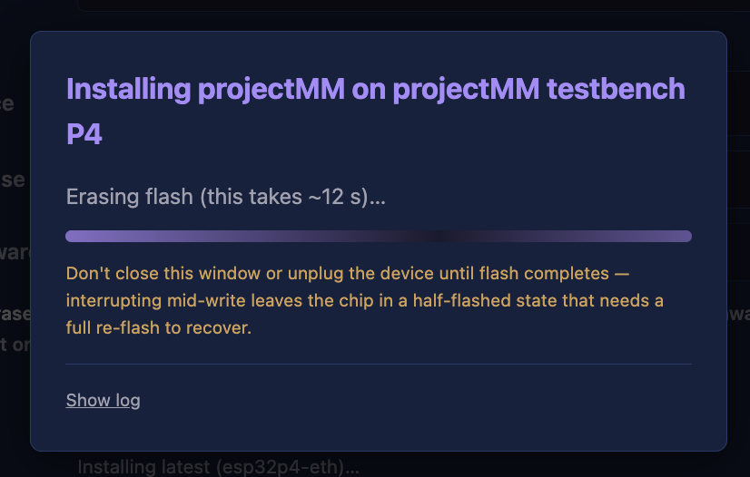
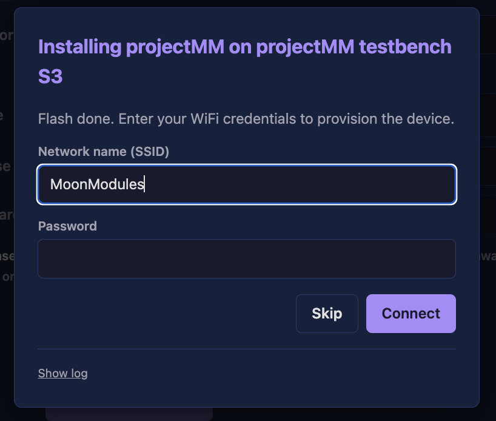
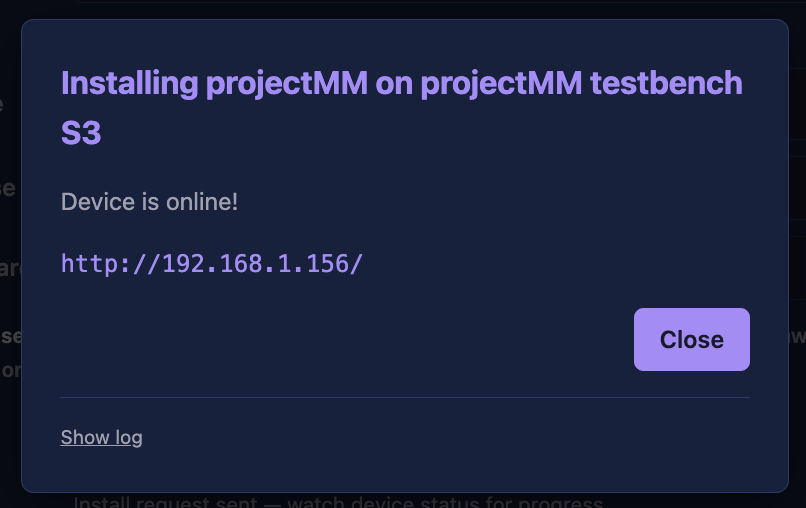

# Getting started

New to ESP32 or flashing firmware? You don't need to be. projectMM installs
straight from your web browser — no software to download, no command line. In a
few minutes you'll have lights running and the device on your network.

**You need:** an ESP32 board, a USB cable that carries data (not charge-only),
and **Google Chrome or Microsoft Edge** on a computer (the installer uses a
browser feature only those two support).

> Want the bigger picture of what projectMM is first? See the
> [project overview](../README.md).

---

## 1. Open the installer and plug in

Open the **[web installer](https://moonmodules.org/projectMM/install/)** in
Chrome or Edge, then plug your ESP32 into a USB port.

## 2. Pick the USB port

Click **USB Port → Pick a port…**. Your browser shows a small list of connected
devices — choose the one that appeared when you plugged in the ESP32. (Not sure
which? Unplug, look at the list, plug back in — the new entry is your board.)

## 3. Pick your device

Choose your board from the **Device** picker. Click **details** on any card to
see exactly what it is and what gets set up on it.

Leave **Release** and **Firmware** at their suggested values (the newest stable
build, and the firmware that matches your device). Tick **Erase chip first** only
if you're starting clean or switching firmware.

## 4. Click Install

The installer erases (if you asked it to) and writes the firmware. Just watch —
it takes under a minute.

## 5. Get it on your network

What happens next depends on your board:

- **WiFi:** enter your network name and password when prompted, then **Connect**.
  (Click **Skip** to set WiFi up later from the device itself.)

  

- **Ethernet:** plug in the cable — it connects on its own, no password needed.

## 6. Open your device

When it's online, the installer shows a link. Click it.

That's it — you're looking at your device's own web interface, served straight
from the ESP32. You'll see lights, a live 3D preview, and controls to build your
own light setup (layouts → effects → outputs), all in the browser.

---

## Where to go next

- **Build a light setup** — layouts, effects, modifiers and drivers, previewed in
  3D: [architecture overview](architecture.md#the-pipeline).
- **Run it on your computer** instead of (or alongside) an ESP32 — macOS, Windows,
  Linux: [project overview → Getting started](../README.md#getting-started).
- **Manage several devices, build, and flash from one console** with MoonDeck, our
  developer tool: [MoonDeck guide](../scripts/MoonDeck.md).
- **Build from source** or target Teensy / Raspberry Pi: [building.md](building.md).

Stuck, or something didn't work? Open an
[issue](https://github.com/MoonModules/projectMM/issues) — and tell us what board
you used and where it stopped.
