# Getting started

New to ESP32 or flashing firmware? You don't need to be. projectMM installs
straight from your web browser — no software to download, no command line. In a
few minutes you'll have lights running and the device on your network, and the
device's own web interface open in your browser ready to play with.

This guide has two chapters. **Chapter 1** gets projectMM onto your board.
**Chapter 2** is a tour of the interface you land in afterwards, so you know what
every part does and where to start building your own light show.

**You need:** an ESP32 board, a USB cable that carries data (not charge-only),
and a **Chromium-based browser** on a computer — Google Chrome, Microsoft Edge,
or Opera (the installer uses the Web Serial API, which Safari and Firefox don't
support).

> Want the bigger picture of what projectMM is first? See the
> [project overview](../README.md).

---

# Chapter 1 — Install projectMM

## 1. Open the installer and plug in

Open the **[web installer](https://moonmodules.org/projectMM/install/)** in
Chrome or Edge, then plug your ESP32 into a USB port.

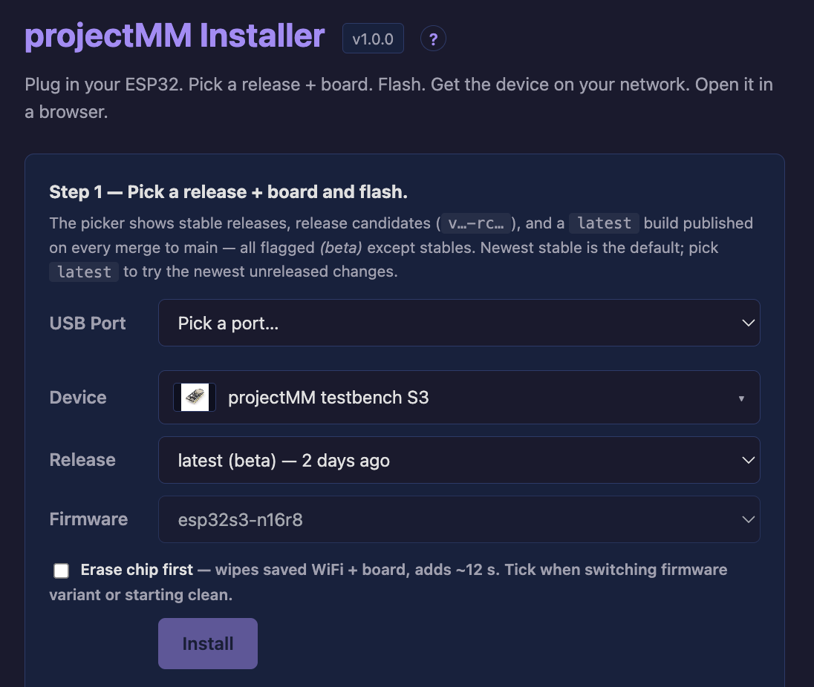

## 2. Pick the USB port

Click **USB Port → Pick a port…**. Your browser shows a small list of connected
devices — choose the one that appeared when you plugged in the ESP32. (Not sure
which? Unplug, look at the list, plug back in — the new entry is your board.)

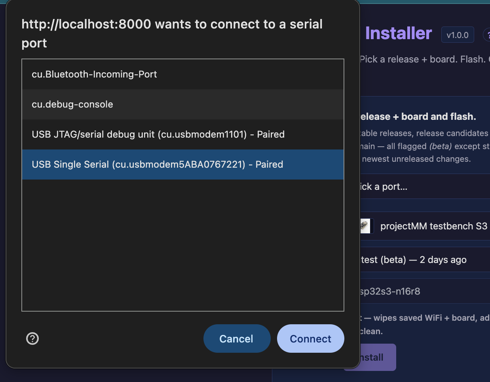

Once a port is chosen, the installer recognises the chip and tells you how many
boards match it, so you know you're on the right track before you pick one.

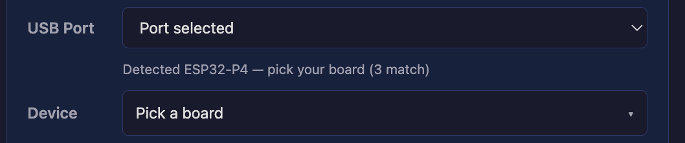

## 3. Pick your device

Choose your board from the **Device** picker. Each card shows a picture, the
chip, and what the board can do (LEDs, WiFi, a button, a microphone…); click
**details** on any card to see exactly what it is and a link to its product page.

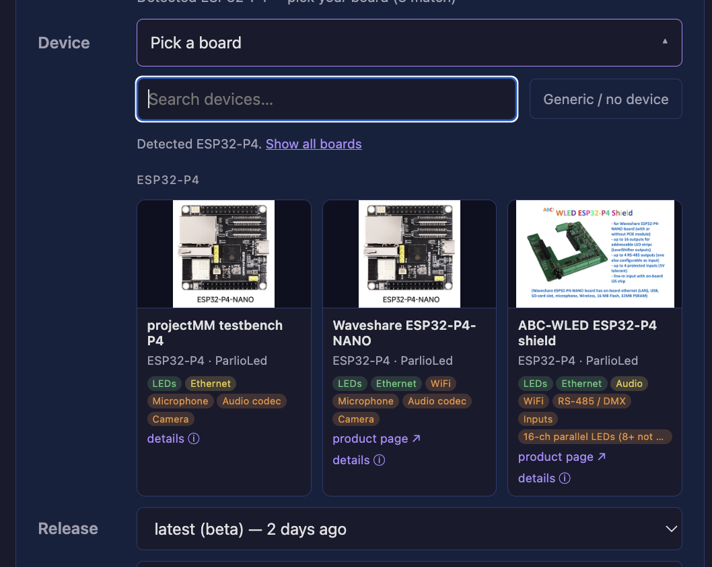

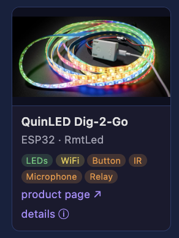

The little coloured pills are the board's capabilities, and the colour tells you
how ready each one is:

- 🟢 **Green** — set up and working the moment you install. This capability is
  supported *and* already wired into the device's configuration.
- 🟡 **Yellow** — the firmware supports it, but it isn't pre-configured. It works
  once you add and set up the matching module yourself in the UI (Chapter 2).
- 🟠 **Amber** — planned. The hardware has it, but there's no module for it yet —
  it's on the to-do list. (Want to help? Building one is our usual loop: read the
  product page and datasheet, pin the behaviour as tests, then write the code to
  pass them — [see how we work](../CLAUDE.md#principles).)

So a green pill is "just works", a yellow one is "works, with a bit of setup", and
an amber one is "coming later".

The setup panel then shows how your device is configured out of the box — the
modules and settings applied automatically when you install.

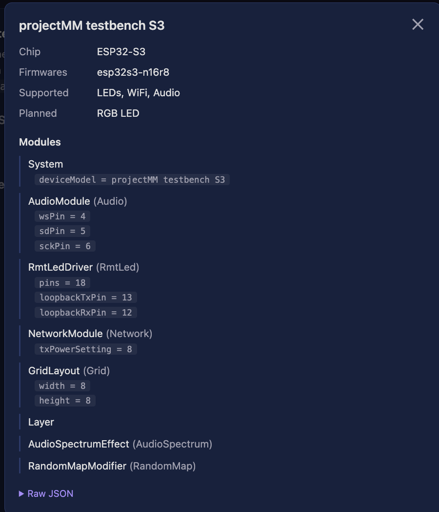

Nothing is locked in: once the device is running you can change any of it later
in the UI (that's what Chapter 2 is all about).

Leave **Release** and **Firmware** at their suggested values (the newest stable
build, and the firmware that matches your device). Tick **Erase chip first** only
if you're starting clean or switching firmware.

## 4. Click Install

The installer erases (if you asked it to) and writes the firmware. Just watch —
it takes under a minute.

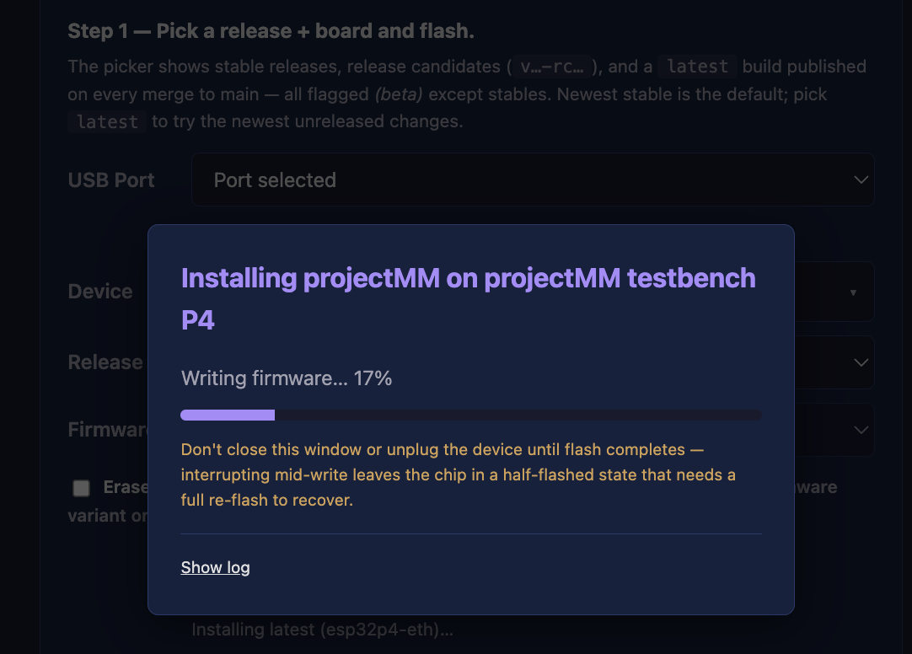

## 5. Get it on your network

What happens next depends on your board:

- **WiFi:** enter your network name and password when prompted, then **Connect**.
  (Click **Skip** to set WiFi up later from the device itself.)

  

- **Ethernet:** plug in the cable — it connects on its own, no password needed.

## 6. Open your device

When it's online, the installer shows a link — your device's address on your
network. Click it.

You'll see this same "Device is online!" box however your board connected — over
Ethernet, or when it rejoins a network it already knows:

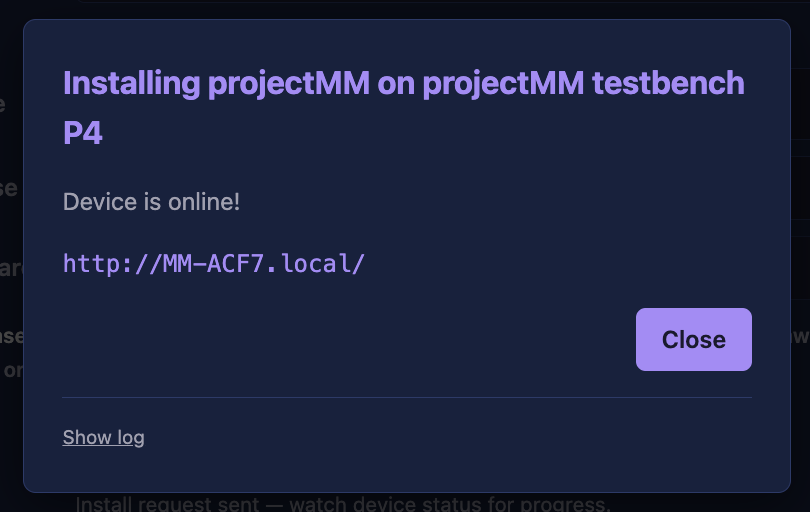
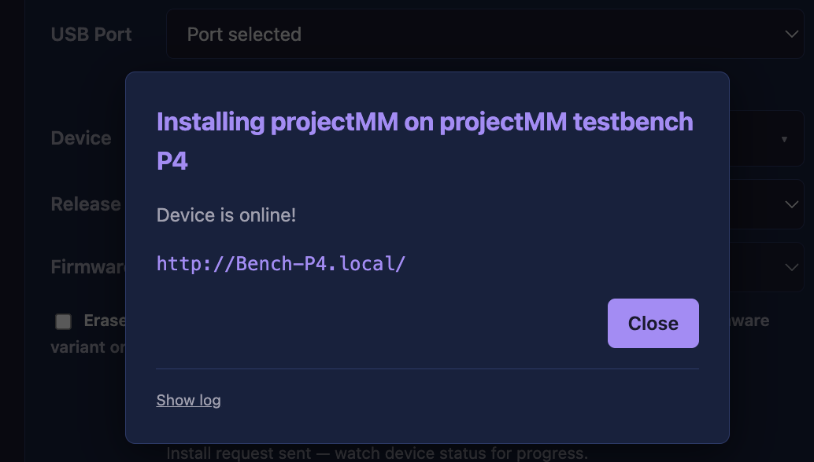

That's it — projectMM is installed and on your network. The link opens the
device's own web interface, served straight from the ESP32. Let's look around.

---

# Chapter 2 — Your projectMM interface

Everything below runs **in your browser, live from the device**. There's no app,
no account, no cloud — the ESP32 itself serves this page, and every change you
make takes effect on the lights immediately. Open the link from step 6 and follow
along; you can't break anything by exploring.

## The layout: list, preview, controls

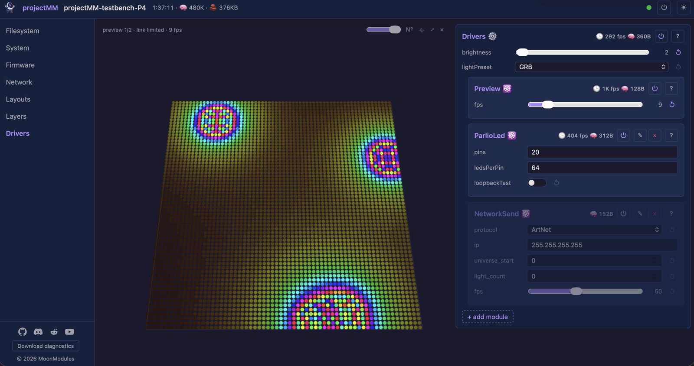

Three regions, left to right:

- **The module list** (left) — every part of your device, from system info at the
  top to your light setup at the bottom. Click a name to jump to it.
- **The 3D preview** (centre) — a live picture of your lights in their real shape,
  updating as the effects run. This is what your physical LEDs are doing, right now.
- **The controls** (right) — the settings for each module. Drag a slider or pick an
  option and the lights react instantly.

Every module header carries a **⏻ power button** — it turns that module on or off.
Bright (accent-coloured) means on; dimmed means off. A switched-off module simply
stops running — it stays in place with all its settings, so flicking it back on
picks up right where it left off. It's the quick way to mute an effect or an output
for a moment without deleting anything.

You'll also spot two little read-outs in each header: **🕒** is how fast that module
runs (its loop speed — click it to flip between fps and microseconds), and **🧠** is
how much memory it uses. They let you see at a glance what each part is costing.

The interface adapts to your window. On a narrower screen the controls take the
full width and the preview tucks into a floating thumbnail you can move around:

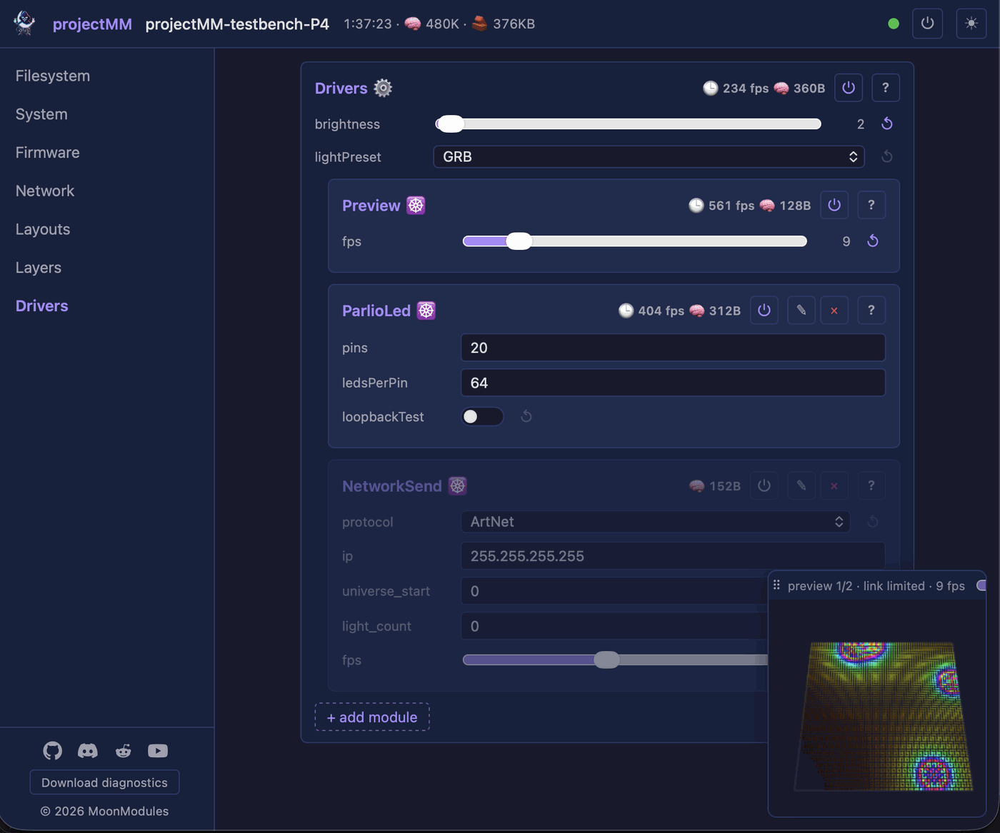

Narrower still, it stacks into a single scrollable column — so it works on a
phone, standing next to your lights:

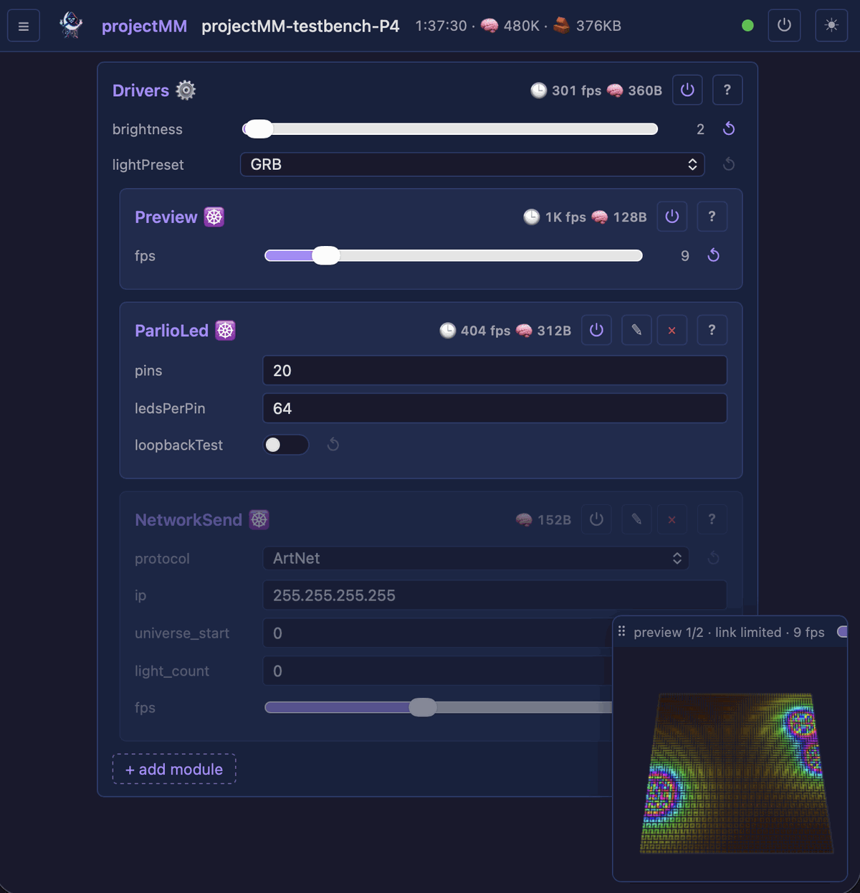

## The 3D preview

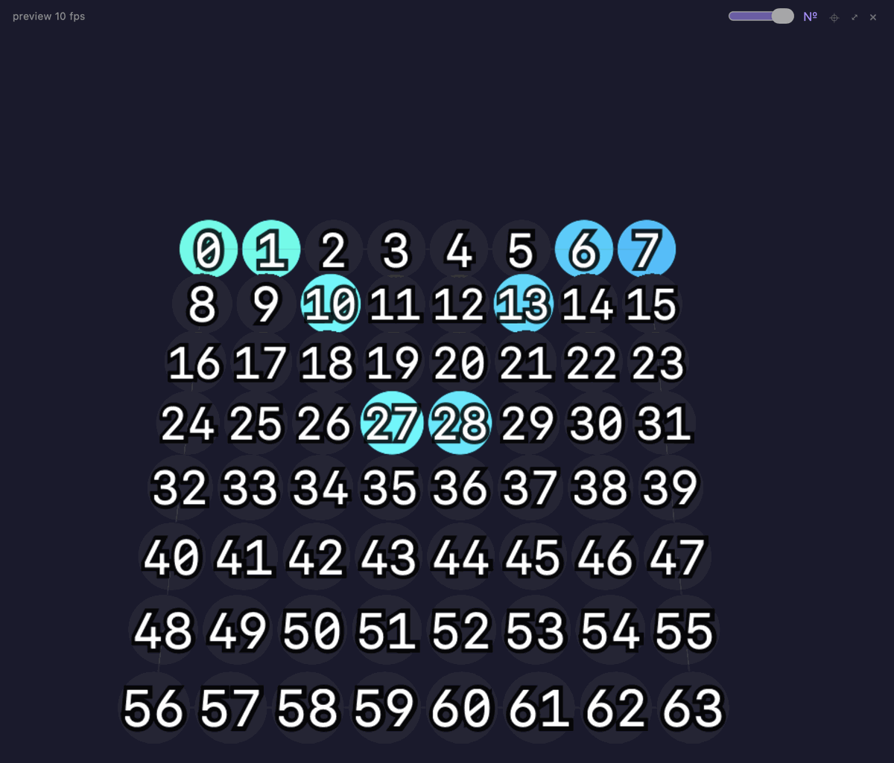

Drag to rotate, scroll to zoom. Each dot is one light at its real position, lit
with the colour it's showing this instant. Turn on the numbers to see each light's
index — handy when you're wiring or mapping a layout. The preview is a *view* of
the device; it never slows the lights down, and it gracefully eases off (fewer
updates, then fewer points) on a slow connection rather than stalling.

> More on how the preview streams from the device:
> [PreviewDriver](moonmodules/light/drivers/PreviewDriver.md).

## The system modules

The top of the list is your device's "about" section — read-outs and connection
settings. You rarely need to touch these, but they're the first place to look if
something seems off.

**System** — who this device is and how it's doing: its name, the board model,
uptime, frame rate, and live memory / storage bars. You may also see an **Audio**
module here — boards with a built-in mic come with it set up for you, and on any
board you can add it yourself (it's how sound-reactive effects hear the music).
Audio is just the first of many: any sensor or input — from hardware or over the
network — lives here as its own module, and we're adding more all the time.

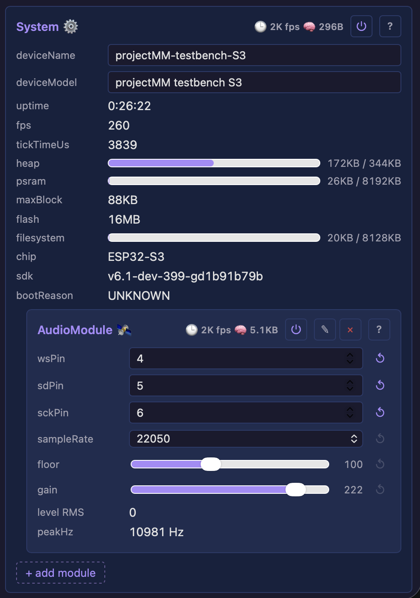

> [SystemModule](moonmodules/core/SystemModule.md) ·
> [AudioModule](moonmodules/core/AudioModule.md)

**Firmware** — which build you're running, and where you update it. The
**Install** button here does an over-the-air update straight from the device — no
USB cable needed once it's on your network.

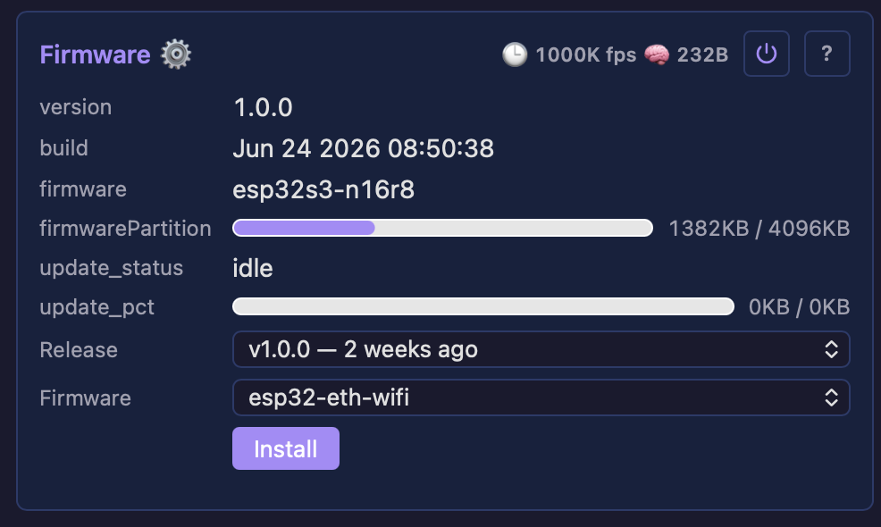

> [FirmwareUpdateModule](moonmodules/core/FirmwareUpdateModule.md)

**Network** — your connection: WiFi or Ethernet, signal strength, and the
address others reach it at. The **Devices** section underneath finds other
projectMM boards on the same network, so a roomful of them can discover each
other.

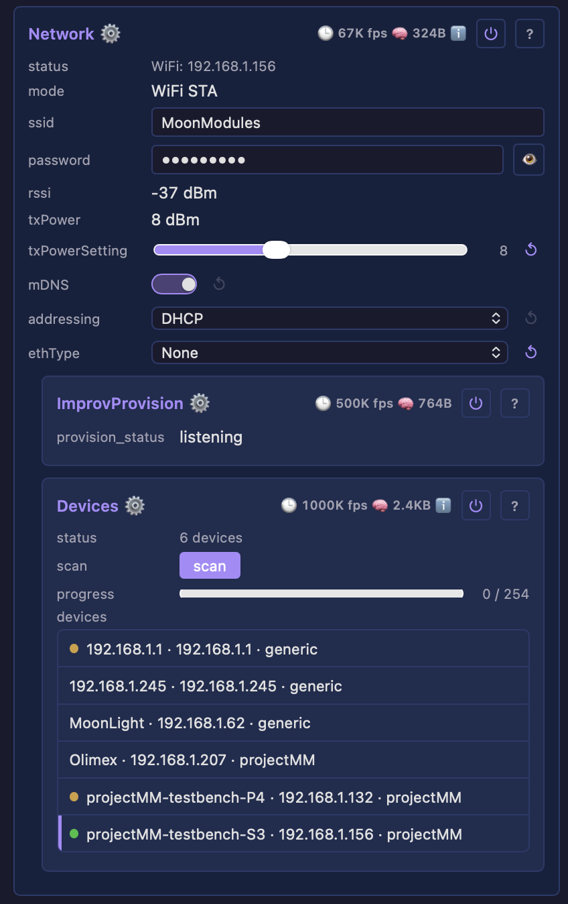

> [NetworkModule](moonmodules/core/NetworkModule.md) ·
> [DevicesModule](moonmodules/core/DevicesModule.md)

## Building a light show: layouts → layers → drivers

The bottom three modules are where the fun is. They form a simple pipeline: a
**layout** says where your lights are, **layers** decide what colours play on
them, and **drivers** send the result out to the real world. Add modules with the
dashed **+ add module** button under each one.

**Layouts** — the shape of your lights. The default **Grid** is a width × height
(× depth) of pixels; change the numbers and the preview reshapes instantly. Turn
on **serpentine** if your strip zig-zags back and forth.

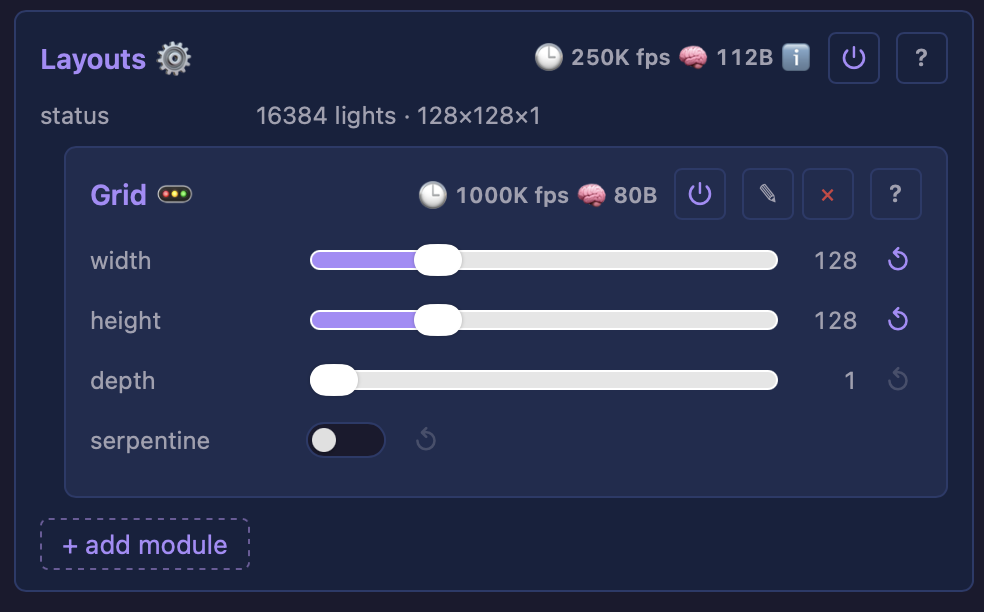

> [Layouts](moonmodules/light/Layouts.md)

**Layers** — what plays on the lights. Add an **effect** (a moving pattern), stack
several to blend them, and reshape them with **modifiers** (mirror, rotate, and
more). Each effect has its own controls — speed, colour mode, and so on — that you
tweak live.

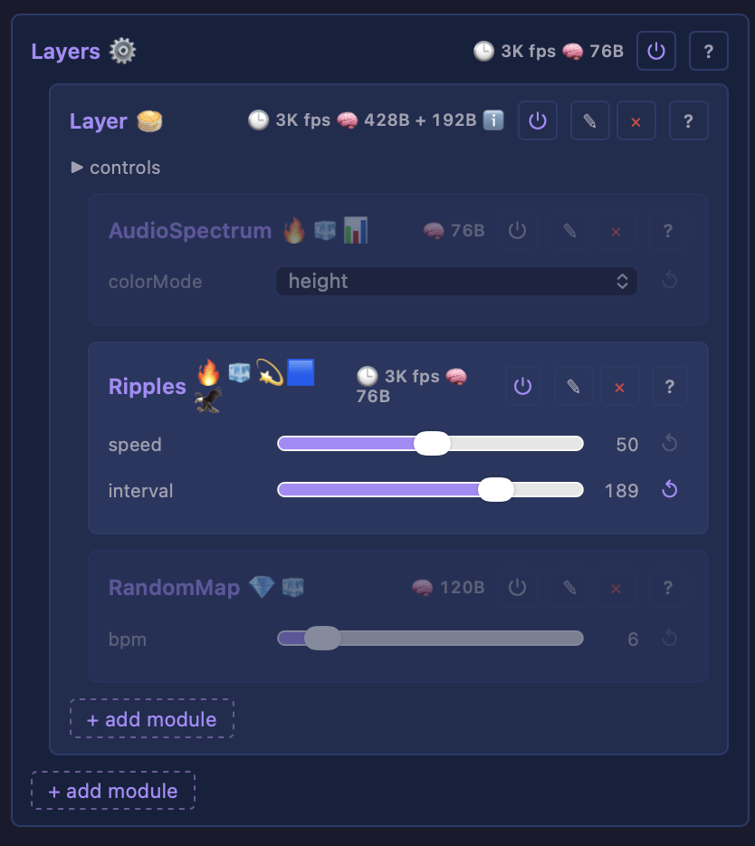

> [Layers](moonmodules/light/Layers.md) · [Layer](moonmodules/light/Layer.md)

**Drivers** — where the colours go. Set overall **brightness** and colour order,
then add an output: real LED strips on a pin, or send the frame over the network
(ArtNet, E1.31/sACN, DDP) to other devices or lighting software.

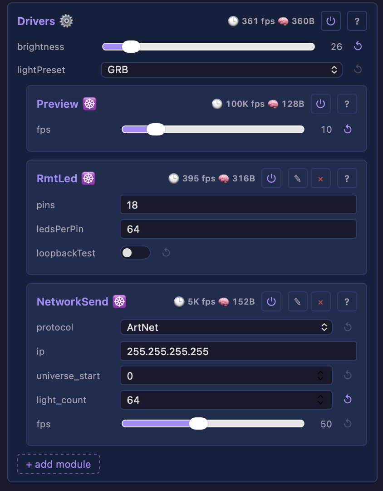

> [Drivers](moonmodules/light/Drivers.md) ·
> [NetworkSendDriver](moonmodules/light/drivers/NetworkSendDriver.md)

That's the whole picture: **layout → layers → drivers**, previewed in 3D, all
tuned live in your browser. Pick an effect, drag a slider, watch the lights — then
keep going.

---

## Where to go next

- **Understand the pipeline** — how layouts, layers, effects, modifiers and
  drivers fit together: [architecture overview](architecture.md#the-pipeline).
- **Run it on your computer** instead of (or alongside) an ESP32 — macOS, Windows,
  Linux: [project overview → Getting started](../README.md#getting-started).
- **Manage several devices, build, and flash from one console** with MoonDeck, our
  developer tool: [MoonDeck guide](../scripts/MoonDeck.md).
- **Build from source** or target Teensy / Raspberry Pi: [building.md](building.md).

Stuck, or something didn't work? Open an
[issue](https://github.com/MoonModules/projectMM/issues) — and tell us what board
you used and where it stopped.
