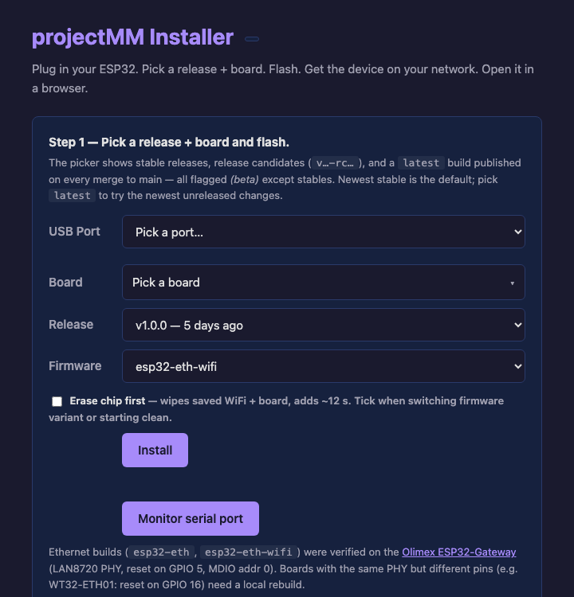
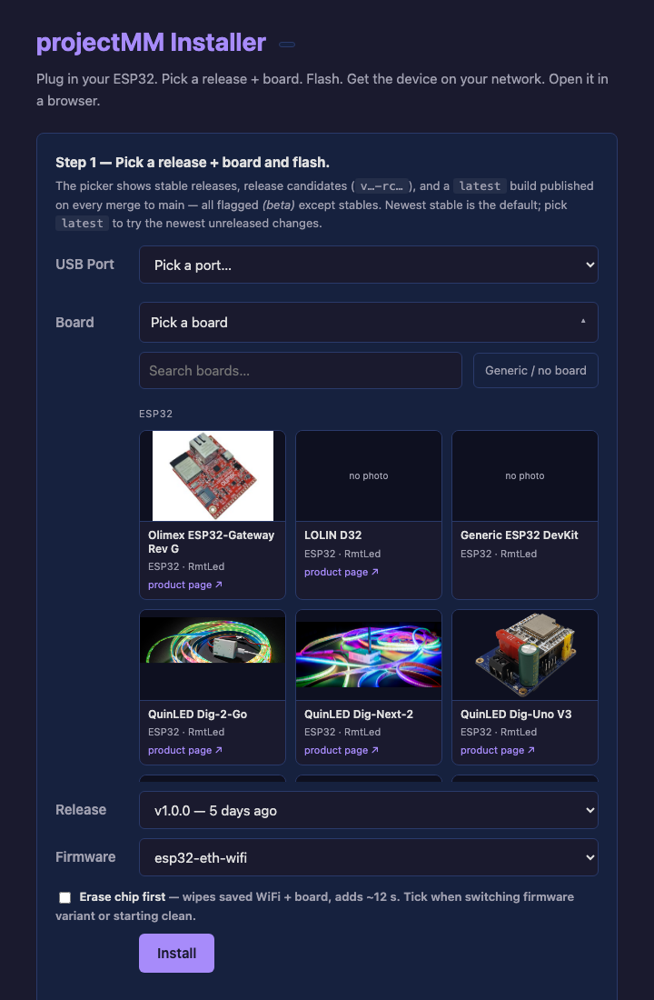

# projectMM web installer

This directory holds the source for the **custom installer page** (driven by
`install-orchestrator.js`, not ESP Web Tools) at
<https://moonmodules.org/projectMM/install/>.

End users land here, pick a channel + device, click Install. The browser flashes
the device over USB (Web Serial → ESP32), runs Improv-Serial provisioning, then
pushes the picked device-model's whole config over the **same serial port** as REST
operations (**"Improv = REST over serial"**: `APPLY_OP` frames, one per control/module) — all from
the same orchestrator, no ESP Web Tools dependency. Pushing over serial (not HTTP)
is what makes the deployed HTTPS installer work: a browser blocks an HTTPS page from
POSTing to a plain-`http://` device (mixed-content), so the old HTTP fan-out + the
`?deviceModel=` browser handoff are gone; serial bypasses the network entirely.

## What's in this directory

- [`index.html`](index.html) — the installer page. Imports the shared
  [`install-picker.js`](../../src/ui/install-picker.js) module and rewrites
  the picker's GitHub-release URLs to same-origin Pages URLs before handing
  them to the custom orchestrator (Web Serial is CORS-bound).
- [`install-orchestrator.js`](install-orchestrator.js) — owns the
  SerialPort across flash → reboot → Improv provision → config push. Replaces the
  ESP Web Tools install button (EWT 10.x's `state-changed` event fires inside a
  shadow DOM invisible to the host page; the orchestrator owns the whole flow so it
  can write its own vendor RPC frames). After provisioning it pushes the picked
  device-model's catalog over serial as APPLY_OP ops (a `clearChildren` pre-pass for
  any `replaceChildren` container, then an `add` per module + a `set` per control) —
  same operations the HTTP REST API does, applied by the same device-side core. An
  **Apply device defaults** checkbox gates that push: it auto-ticks with **Erase chip
  first** (a clean slate wants defaults) and starts unticked otherwise, so re-flashing
  a configured device keeps its current modules/controls. The board's `txPower`
  brown-out cap is still sent via its own `SET_TX_POWER` RPC **before** provisioning
  (it must land before the first association on weak-power boards). When the device
  doesn't speak Improv back (typed-IP / eth-only path), no serial push happens — apply
  the defaults later from MoonDeck on the LAN (plain HTTP REST, no mixed-content).
- [`devices.js`](devices.js) — the *Your devices* list. Stores devices the
  user provisioned from this page so they can re-visit / erase / forget them
  (Visit / Erase / Forget). The device-model defaults are applied during the install
  over serial, so there is no "inject" button here — to re-apply a model to an
  already-running device, use MoonDeck on the LAN.
- [`deviceModels.json`](deviceModels.json) — the device-model catalog (name → firmware
  variants + the modules/controls). The installer walks it to emit the APPLY_OP ops;
  MoonDeck and the picker also read it. Schema below.
- [`favicon.png`](favicon.png) — moon-man, same as the device UI.
- [`README.md`](README.md) — this file.

## Picture board picker

The board picker is a visual card grid driven by each board's `image` and
(optional) `url` catalog fields (see the schema below — both are optional; a card
without an `image` just shows no photo, without a `url` shows no product link) plus
its `supported`/`planned` capability chips. It reuses the installer's flash machinery unchanged — the grid drives the
shared [`install-picker.js`](../../src/ui/install-picker.js) through a hidden board
`<select>`, so the firmware-narrowing and flash flow are identical to a plain
dropdown pick. Board images are a Pages-only asset (staged from
`docs/assets/boards/`), never flashed.

The picker is a collapsed row consistent with the other fields; clicking it
expands the searchable card grid, and picking a board collapses it back to a
labelled summary with a thumbnail:

| Collapsed | Expanded |
|---|---|
|  |  |

## Catalog schema (`deviceModels.json`)

A flat JSON array of catalog entries. Each entry is the single source of truth
for one piece of hardware and what to set up on it at install time. Two clients
consume it identically — the web installer (`install-orchestrator.js`, which emits
the entry's units as APPLY_OP ops over serial) and MoonDeck (`scripts/moondeck.py`,
which POSTs them over HTTP REST on the LAN) — so **adding another module-with-controls
unit needs no client change** (both walk the same entry; only the transport differs).

```json
{
  "name": "projectMM testbench S3",
  "chip": "ESP32-S3",
  "firmwares": ["esp32s3-n16r8"],
  "modules": [
    { "type": "System", "id": "System",
      "controls": { "deviceModel": "projectMM testbench S3" } },
    { "type": "AudioModule", "id": "Audio", "parent_id": "System",
      "controls": { "wsPin": 4, "sdPin": 5, "sckPin": 6 } },
    { "type": "RmtLedDriver", "id": "RmtLed", "parent_id": "Drivers",
      "controls": { "pins": "18", "loopbackTxPin": 13, "loopbackRxPin": 12 } },
    { "type": "GridLayout", "id": "Grid", "controls": { "width": 8, "height": 8 } },
    { "type": "Layer", "id": "Layer", "replaceChildren": true },
    { "type": "AudioSpectrumEffect", "id": "AudioSpectrum", "parent_id": "Layer" },
    { "type": "RandomMapModifier", "id": "RandomMap", "parent_id": "Layer" }
  ]
}
```

Each entry is a **list of module-with-controls units** — "create this module (if
not already present), then set its controls" as one unit. This is the same shape
the scenario test format expresses with `add_module` + `set_control`, so a catalog
entry reads like a scenario's setup phase. The `deviceModel` identity is a unit too:
`System` is boot-wired, so its add is an idempotent no-op and only its `deviceModel`
control applies.

**`replaceChildren`** (optional, on a container unit like `Layer` / `Layouts` /
`Drivers`): set it `true` to *replace* the container's boot-wired defaults instead of
adding alongside them. The inject is otherwise add-only, and a `Layer` renders only
its FIRST enabled effect/modifier — so a catalog entry that wants its own effect to
show (the testbench above swaps the default `NoiseEffect` for `AudioSpectrumEffect` +
`RandomMapModifier`) marks the container `replaceChildren`, which DELETEs the
container's current children before the entry's children are added. Without it, the
entry's effect would sit behind the boot default and never render.

**LED drivers are catalog-added, not boot-wired.** The only driver the firmware
creates at boot is `Preview` (it needs the HTTP-server broadcaster the catalog
can't supply); every other driver — `RmtLedDriver`, `LcdLedDriver`,
`ParlioLedDriver`, `NetworkSendDriver` — is added per board through its `modules`
block (to the `Drivers` container), so a device only carries the outputs its board
actually has instead of every driver the chip is capable of. The default LED
driver per chip: **classic ESP32 → `RmtLedDriver`**, **S3 → `RmtLedDriver`** (LCD
needs the full 8-lane bus — see the [LcdLedDriver spec](../moonmodules/light/drivers/LcdLedDriver.md);
1..8-pin LCD is a future extension), **P4 → `ParlioLedDriver`** (runs 1–8 lanes).

The `RmtLed` `controls` block presets the loopback self-test pins so a bench
operator just flips the `loopbackTest` switch — no re-typing. **`loopbackTxPin` and
`loopbackRxPin` are the test jumper (tx→rx), separate from the operational `pins`**:
on the S3 the strip runs on `pins`=18 while the loopback transmits on 13 and
captures on 12. (Without `loopbackTxPin` the test would fall back to transmitting on
`pins[0]` — fine when the jumper is on the LED pin, but the testbench's jumper is on
a dedicated pin, which is exactly why the override is stored.) `loopbackTest` is left
off (presetting pins doesn't auto-run the blocking test). The sibling
`projectMM testbench ESP32-16MB` adds `RmtLedDriver` (`pins`=18, loopback tx=4/rx=5);
the `…P4` adds `ParlioLedDriver` (`pins`=20–27, `ledsPerPin`=64, loopback tx=33/rx=32).
Only the S3 bench has a mic wired, so only it carries `AudioModule`. Each entry
declares only what is actually on that board.

| Field | Required | Meaning |
|---|---|---|
| `name` | yes | identifier **and** display label (no key/label split) |
| `chip` | yes | the MCU family, for the picker's chip filter |
| `firmwares` | yes | the firmware variants flashable on this hardware; **the first entry is the default** the picker pre-selects (reorder the array to change the default) |
| `image` | no | board photo for the picker — a local path under `assets/boards/`, named for the board's slug (e.g. `assets/boards/quinled-dig-2-go.jpg`). Host our own copy, never a vendor hotlink — see [§ Board images & links](#board-images--links) below |
| `url` | no | product-page link the picker shows next to the board (the vendor's own page, e.g. `https://quinled.info/quinled-dig2go/`). A remote URL is fine here — it's a click-through link, not an asset the installer fetches |
| `supported` | no | short capability labels the firmware drives on this board *today* (e.g. `["LEDs", "WiFi", "Ethernet"]`), grounded in the modules the entry actually adds. Rendered as solid chips on the picker card |
| `planned` | no | short labels for peripherals the board physically has but no module drives *yet* (e.g. `["IR receiver", "Onboard button"]`) — the backlog seed for future spec + test work. Rendered as dashed "(soon)" chips on the picker card |
| `modules` | yes | the list of module-with-controls units that set the board up |

Each `modules[]` unit is `{ type, id, parent_id?, controls? }`:

| Module field | Meaning |
|---|---|
| `type` | factory type to create (e.g. `RmtLedDriver`, `AudioModule`, `AudioSpectrumEffect`) |
| `id` | the module's name — used both as the `POST /api/modules` id **and** as the `module` in every `POST /api/control`, so the two stay in sync |
| `parent_id` | the container to add it under (`Drivers`, `System`, `Layer`). **Omitted** for a module that already exists at boot (e.g. `Network`, `System`, `Grid`, `Layer`) — the client then skips the add and only sets controls |
| `controls` | the controls to set on that module after it exists |
| `replaceChildren` | optional bool on a container unit (`Layer` / `Layouts` / `Drivers`): when `true`, the inject DELETEs the container's current children before adding this entry's, so the entry's effects/modifiers replace the boot defaults rather than stack behind them |

`type` and `parent_id` are spelled out even though `id` could imply them
(`RmtLed`→`RmtLedDriver` under `Drivers`). Kept explicit on purpose: the two
consumers of this shape — the offline in-process scenario runner (C++) and the
online installer clients (JS/Python over HTTP) — can't share an `id`→`type`
inference table without triplicating it across three languages, which is worse
duplication than the field repetition. So a unit stays fully self-describing, the
same way a scenario `add_module` op is. The bloat is the honest cost of that.

**Add-then-configure, per module.** For each unit the client adds the module
(when it has a `parent_id` — a fresh flash has no user-added modules like
`AudioModule`, so a control write would 404), then sets its `controls`.
`POST /api/modules` is idempotent (an existing `id` returns 200), so re-running an
inject is safe. The `id` is what the controls address, so it is set explicitly
(factory display names disambiguate on collision).

**Injection is opportunistic and partial.** A module's `controls` (and the units
list itself) carry **only what is known and hardware-fixed** (vendor-soldered mic
pins, board-fixed Ethernet pins). A bare board whose LED or mic pins the *user*
wires omits them; the user adds the module and sets the pins manually later.
Inject nothing you don't know. (This is the
MCU/Board/Device provenance rule from
[architecture.md § Config provenance](../architecture.md#config-provenance-mcu--board--device):
default a pin only at the level that fixes it.) The `projectMM testbench S3`
entry above adds an `AudioModule` with the real, verified INMP441 mic pins
(WS=4/SD=5/SCK=6, matching the bench wiring in
[`AudioModule.h`](../../src/core/AudioModule.h)) plus an `RmtLedDriver`
(LEDs on `pins`=18, loopback jumper tx=13→rx=12) — a known-hardware Device on the
maintainer's desk, so the inject is testable end-to-end. The `ESP32-16MB` sibling
adds `RmtLedDriver` (LEDs=18, loopback tx=4/rx=5); the `P4` sibling adds
`ParlioLedDriver` (LEDs=20–27, loopback tx=33/rx=32). Only the S3 has a mic
wired. Each carries only what is physically present (LCD is not preset on the S3
testbench — its 8-lane bus would clash with the mic pins 4/5/6).

**Specific boards/devices: spec 'n test first.** A real product entry only grows
a peripheral/pin unit once that hardware has its own spec (with the product-page
link + grabbed images for installer selection and pin layout) and a test pinning
it — the project's *Specs before code* applied to catalog hardware. So vendor
entries (the QuinLED Dig-2-Go, the Serg shields, …) carry only their **`System`
unit (with the `deviceModel` control) plus the default LED driver** until spec'n'tested for more; e.g. whether the
Dig-2-Go's *onboard* mic is even supported is an open spec'n'test question, so its
entry adds no `AudioModule`. The per-board capability loop that drives this — read
capabilities off the image/link, wire what we support, propose+test what we don't —
is recorded in [decisions.md § catalog-driven installer branch](../history/decisions.md).

### Board images & links

The `image` (board photo, eventually pin-annotated) and `url` (product page) are
the picker's visual layer **and** the inputs to the per-board capability loop above.

- **`image` — host our own copy, never hotlink a vendor URL.** Three reasons:
  (1) a hotlink breaks whenever a vendor reshuffles their CDN, and the installer must
  keep working same-origin/offline (the same constraint that bundles firmware
  manifests into Pages); (2) we want pin-annotated overlays anyway, which means a
  *derived* image, not the raw shot; (3) third-party product photos are the vendor's
  copyright — redistributing them needs permission. So: use the `url` to *find* the
  reference photo, then either shoot/redraw our own **or** check a local copy into
  [`docs/assets/boards/`](../assets/boards/) **with permission**, named for the
  board's slug. The catalog stores a local path, never a remote image URL.
- **`url` — a remote link is fine.** It's a click-through to the vendor's own page,
  not an asset the installer fetches.
- **Deploy** stages only the *referenced* images (not the whole `docs/assets/boards/`
  library, which also holds photos for boards not yet in the catalog) into
  `install/assets/boards/`, so an `image: "assets/boards/<slug>.jpg"` resolves
  same-origin from `/install/deviceModels.json`.

**One entry type, no Board/Device split.** A "Device" (a finished rig like the
`projectMM testbench S3` — board + a wired mic) is just an entry with *more* of
`modules`/`controls` filled in than a bare "Board". Same schema; there is no
separate `devices.json`.

**`extends` (reserved, not yet resolved).** The carrier/shield pattern is
literal extension (a Serg shield = a D1-Mini32 board *plus* the shield's pins),
so a future optional **`extends: "<parent entry name>"`** lets an entry inherit
another's `modules`/`controls` (multi-level MCU→carrier→device; child overrides
parent at the same `{module, control}`; `modules` concatenate, deduped by `id`).
The resolver is a client-side pre-pass to be built at the first real shared-base
collision — today every entry is self-contained, so it isn't implemented yet.
Don't author duplicated pin blocks expecting `extends` to dedupe them until it
ships.

**Shared op vocabulary.** A catalog entry's `modules` list is a test
[scenario](../../test/scenarios/) setup phase minus the `measure` asserts — the
same two operations per module: `add_module {type, id, parent_id}` (==
`POST /api/modules`) and set-control (== `POST /api/control`). Both express
"create a module, then configure it." (A scenario keeps a separate `props` block
for in-process C++ construction wiring — `setLayouts`/`setChannelsPerLight`/grid
dims that aren't control writes — which the catalog never needs, so the catalog
unit carries only `controls`.) `scripts/scenario/run_live_scenario.py` already
runs these ops over HTTP against a live device, the same channel the installer uses.

## What's *not* in this directory

- **The install-picker module** (`install-picker.js`) lives at
  [`src/ui/install-picker.js`](../../src/ui/install-picker.js) because the
  same file is also embedded into the device firmware UI (see
  [`docs/moonmodules/core/FirmwareUpdateModule.md`](../moonmodules/core/FirmwareUpdateModule.md)).
  The release workflow copies it into the Pages root next to `index.html`
  on every deploy.

- **Per-release binaries and manifests.** The release workflow keeps the last
  five stable + five prerelease releases under `releases/<tag>/` on Pages,
  and the install page's `toLocalUrl()` rewrites the picker's
  `releases/download/<tag>/<file>` URLs to `./releases/<tag>/<file>`.
  Self-hosting is necessary because GitHub release-asset URLs don't return
  CORS headers, so the browser can't fetch them cross-origin during a Web
  Serial flash. The on-device OTA path doesn't have this problem and reads
  the assets directly from GitHub.

## Local preview

Three recipes, in increasing fidelity to production. Each runs the picker
against the real GitHub Releases API (CORS-friendly) but differs in whether
the install button can actually flash.

### Render-only (no flash)

Quickest. In MoonDeck: **PC tab → Preview Installer**. Or from the CLI:

```bash
uv run scripts/run/preview_installer.py
# open http://localhost:8000/ in Chrome / Edge / Opera
```

Both forms stage `index.html` + `install-picker.js` into
`build/install-preview/` and serve them. Picker populates, dropdowns
work, but clicking Install fails because the local server has no
`releases/` tree. Useful when iterating on the install page's
HTML/CSS/JS — the `?nocache=1` query parameter forces the picker to
bypass its 5-minute sessionStorage cache while you edit.

### End-to-end with CI-built firmware

The closest you can get without tagging. Pulls the latest branch CI run's
artifacts (the 4 firmware bundles produced by `release.yml`'s `build-esp32`
matrix), stages them under `releases/v<branch-tag>/` so the install page's
`toLocalUrl()` can find them.

```bash
DIST=/tmp/mm_install_ci
rm -rf "$DIST"; mkdir -p "$DIST/releases"

# Use the version from library.json as the pretend tag.
V=$(jq -r .version library.json)
TAG="v$V"
mkdir -p "$DIST/releases/$TAG"

# Pick the most recent successful release.yml run on this branch.
RUN_ID=$(gh run list --workflow=release.yml --branch=$(git branch --show-current) \
  --status=success --limit=1 --json databaseId --jq '.[0].databaseId')
[ -z "$RUN_ID" ] && { echo "no successful CI run on this branch"; exit 1; }
echo "Using run $RUN_ID"

# Download the 4 firmware artefacts, flatten, regenerate Pages-relative manifests.
for F in esp32 esp32-eth esp32s3-n16r8; do
  TMP=$(mktemp -d)
  gh run download "$RUN_ID" -n "esp32-$F" -D "$TMP"
  cp "$TMP"/*.bin "$DIST/releases/$TAG/"
  python3 scripts/build/generate_manifest.py \
    --firmware "$F" --version "$V" \
    --release-url . \
    --flasher-args "$TMP/flasher-$F.json" \
    --out "$DIST/releases/$TAG/manifest-$F.json"
  rm -rf "$TMP"
done

# Drop the install page + shared picker module in place.
cp docs/install/index.html "$DIST"/
cp src/ui/install-picker.js "$DIST"/

cd "$DIST" && python3 -m http.server 8000
# open http://localhost:8000/
```

Caveats:

- The picker fetches releases from api.github.com (the real list), so it
  shows every published release. Only the one you staged locally
  (`releases/$TAG/`) flashes — others 404. Switch the picker to "Pick
  specific release" and choose the local tag to avoid this.
- 60 API requests/hour anonymous rate limit; sessionStorage caches for 5
  minutes so dev iteration stays well under.

### Full release dry-run (RC tag)

When the local recipes pass, tag a release-candidate. Per the plan-18
design, RC tags now also publish to Pages (no `-rc` gate) so beta testers
can self-serve from the dropdown. End users default to Stable, so the RC
release is visible only to those who opt into the Pre-release channel.

```bash
# Bump library.json to "1.0.0-rcN", commit, tag v1.0.0-rcN, push tag.
# Workflow:
#   - 4 ESP32 builds + macOS build + Windows build run.
#   - release job stages cumulative content (last 5 stable + 5 prerelease)
#     under pages/install/releases/<tag>/ on Pages.
#   - Publishes a GitHub Release flagged "Pre-release".
#   - Deploys Pages with the new release available immediately.
```

Web Serial requires Chrome, Edge, or Opera on desktop. Firefox and Safari
don't ship the API.

## Deployment

`release.yml` does this automatically on every `v*` tag (stable + RC):

1. `build-esp32` matrix produces four firmware bundles + four
   `flasher_args.json` files. `build-macos` produces the macOS tarball;
   `build-windows` produces the Windows zip.
2. The `release` job:
   - Generates manifests in two flavours: absolute URLs (for GitHub release
     assets, used by the OTA picker) and relative URLs (for the Pages copy,
     used by the web installer).
   - Pulls the last 5 stable + 5 prerelease releases' assets via
     `gh release download` and stages them under
     `pages/install/releases/<tag>/`.
   - Publishes the GitHub Release (binaries + absolute manifests as assets).
   - Deploys Pages with `index.html` + `install-picker.js` + the staged
     `releases/` tree.

Manual setup, one-time per repo: **Settings → Pages → Source: GitHub Actions**.

No deploy-from-branch — the workflow is the only producer. A separate
`docs/install/`-only Pages deploy was considered and rejected: it would
have to re-run the same cumulative-content dance, so a docs-only deploy
buys nothing.
