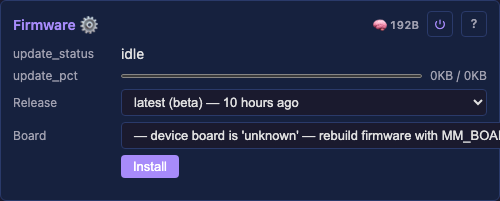

# FirmwareUpdateModule



OTA flash progress + the `/api/firmware/url` endpoint, surfaced as two read-only controls in the UI.

The module itself is a thin status surface. The actual flash is driven by the HTTP route `POST /api/firmware/url` in `HttpServerModule`, which hands the URL to `mm::platform::http_fetch_to_ota`. That function spawns a FreeRTOS task that downloads the binary (via `esp_https_ota`) and writes it to the next OTA partition. Three file-scope globals — `g_otaStatus` (char buffer), `g_otaBytesRead` (uint32_t) and `g_otaBytesTotal` (uint32_t) — carry progress between the task and this module's `loop1s()` poll. The UI renders the byte pair as "X KB / Y KB".

## Controls

| Name | Type | Description |
|---|---|---|
| `update_status` | read-only string (64 chars) | One of: `idle`, `starting`, `downloading`, `flashing`, `rebooting`, `error: <reason>`. |
| `update_pct` | progress (bytes/total) | Live byte counters — `value` = bytes downloaded so far, `total` = full image size (0 until `esp_https_ota_get_image_size` reports it just after TLS handshake). The UI renders both fields as "X KB / Y KB". The control name is historical (`update_pct` predates the percent → bytes migration); the wire shape and UI rendering are bytes throughout. |

Both controls update via the WebSocket state push at 1 Hz — the module's `loop1s()` polls the globals and copies into the bound buffers, the existing WS broadcast picks up the change with no extra wiring. The `total` snapshot is captured at control-bind time, so when the OTA task reports the real image size mid-task, `loop1s()` calls `rebuildControls()` once to refresh the descriptor.

## Wire contract

### `POST /api/firmware/url`

Request body:

```json
{ "url": "https://github.com/ewowi/projectMM/releases/download/v1.0.0/firmware-esp32-eth-wifi-v1.0.0.bin" }
```

Response:

- `202 Accepted` `{"ok":true}` — task spawned; UI polls `update_status` for progress.
- `400` — missing URL, or URL doesn't start with `http://` / `https://`.
- `500` — task failed to spawn (rare; out of memory).
- `501` — platform doesn't support OTA (desktop returns this; `if constexpr (mm::platform::hasOta)`).

The route returns immediately. Real progress streams via `update_status` + `update_pct` over the same WebSocket the UI uses for everything else.

### Compatibility

The OTA caller is responsible for picking a binary compatible with the running device. The web UI's release-picker enforces this via `src/ui/release-picker.js`'s `isCompatible()` — strip `-eth*` from both sides, equal identities are compatible. So `esp32` / `esp32-eth` / `esp32-eth-wifi` are mutually OTA-compatible (same chip, different feature flags); `esp32s3-n16r8` is only itself. Flashing the wrong board's binary fails at `esp_https_ota_begin` (chip family mismatch) or boot (partition table mismatch) — recoverable by re-flashing over USB, not the brick.

## Lifecycle on flash

1. UI sends `POST /api/firmware/url`. Route writes `"starting"` to `g_otaStatus`, resets `g_otaPct` to 0.
2. Platform task starts. Sets status to `"downloading"`.
3. `esp_https_ota_begin` opens the connection, follows redirects (GitHub release URLs 302-redirect to `release-assets.githubusercontent.com`). Status flips to `"flashing"`.
4. `esp_https_ota_perform` loops; `update_pct` advances 0 → 100.
5. `esp_https_ota_finish` commits the new image to the next OTA partition and flips the boot pointer.
6. Status flips to `"rebooting"`. 600 ms delay (HTTP response makes it to the browser first). `esp_restart()`.
7. Device boots into the new firmware. UI auto-reconnects via WS, picks up the new `version` + `board` on the SystemModule card.

## Errors

The status buffer surfaces any failure with the prefix `error: ` followed by the underlying cause:

- `error: ota begin <ESP-IDF error name>` — connection or partition-init failure (DNS, TLS, no OTA partition).
- `error: ota perform <ESP-IDF error name>` — mid-download failure (network drop, server error).
- `error: incomplete download` — image size doesn't match what was claimed.
- `error: ota finish <ESP-IDF error name>` — commit / boot-pointer-flip failure.
- `error: task create failed` — `xTaskCreate` returned non-`pdPASS` (out of memory). No retry; reboot.

After an error, `update_status` stays on the error message until the next `/api/firmware/url` POST clears it back to `"starting"`. `update_pct` is left at the last value.

## Prior art

- **projectMM-v1** had this module + the route + the platform helper, structured the same way: `src/modules/system/FirmwareUpdateModule.h` (display surface), `src/core/OtaState.h` (shared globals), `src/core/AppRoutes.cpp:174-210` (the route), `src/pal/Pal.h` (`pal::http_fetch_to_ota`).
- **`esp_https_ota`** is the standard ESP-IDF OTA-from-HTTP component, used by every OTA flow on ESP32 since IDF v4.x. The release-picker UI is the new layer on top.
