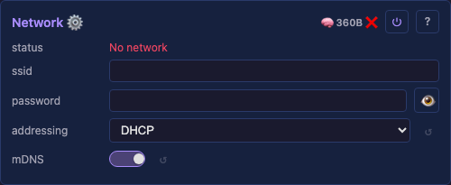

# NetworkModule



Manages all device connectivity with automatic fallback: Ethernet → WiFi STA → WiFi AP. One MoonModule, one UI card — the user sees "Network", not three separate technologies.

## Priority cascade

| Priority | Mode | When active | Teardown when superseded |
|----------|------|-------------|------------------------|
| A | Ethernet | Hardware detected, cable plugged | Never (always preferred) |
| B | WiFi STA | SSID configured, Ethernet unavailable | Yes — free WiFi memory when Ethernet connects |
| C | WiFi AP | STA fails or no SSID configured | Yes — free AP memory when STA connects |

When a higher-priority connection becomes available, lower ones are torn down to reclaim memory. When a higher-priority connection drops, the next one activates automatically. AP is always the last resort.

**AP shutdown delay**: when STA connects successfully, AP stays active for 10 seconds with a message in the UI ("AP shutting down, switch to your local network") before tearing down. This gives the user time to reconnect via STA.

## Controls

- `mode` (read-only) — current state of the cascade: `Ethernet`, `WiFi STA`, `WiFi AP`, `Ethernet (waiting)`, `WiFi STA (waiting)`, or `Idle`. Always present (every firmware variant has a mode, even Ethernet-only).
- `ssid` (text) — WiFi STA network name
- `password` (password) — WiFi STA password. Serialized to the API XOR-obfuscated + base64-encoded, not in plaintext — a first line of defence only, trivially reversible. See [ui.md § Control types](ui.md#control-types).
- `rssi` (display-int, dBm) — current WiFi STA signal strength (e.g. `-58 dBm`). 1-byte storage on the device; the unit suffix lives in the descriptor, not in a per-control buffer. Hidden in every state except `ConnectedSta` — Ethernet/AP/Idle have no STA association to read from.
- `txPower` (display-int, dBm) — current WiFi transmit power (e.g. `19 dBm`). 1-byte storage. Hidden when the radio is off (Ethernet, Idle); shown for STA (waiting + connected) and AP modes.
- `txPowerSetting` (int16, 0..21 dBm) — user-settable cap on WiFi transmit power. 0 = no override (default). Applied after `esp_wifi_start()` and re-applied on change. Used by the weak-power / brown-out WiFi cap: `boards.json` injects `8` for boards whose on-module LDO brown-outs at full power (e.g. the `ESP32-S3 N16R8 Dev`).
- `addressing` (dropdown: DHCP / Static) — IP addressing mode (applies to both Ethernet and WiFi STA)
- When Static: `ip`, `gateway`, `subnet`, `dns` (ipv4 controls — 4 bytes of storage each, not 16-char strings; the wire shape is still a dotted-quad string). Shown dynamically via onBuildControls.
- `mDNS` (bool) — enable/disable mDNS responder

**Ethernet PHY/pin controls** (only on builds with an Ethernet driver — `platform::hasEthernet`). The PHY *driver* is compiled into the firmware per chip (internal-EMAC RMII on classic/P4, W5500 SPI on the S3); these controls pick *which* PHY a board uses and *on which pins* — runtime config, set per board in [`boards.json`](../../install/boards.json) (→ `setEthConfig` → `ethInit`), seeded from the per-chip default in `platform_config.h`. `ethType` is the switch: with it at 0 no pin rows show; choosing a type reveals only that type's pins (RMII rows for LAN8720/IP101, SPI rows for W5500). A W5500 change applies **live** (the SPI driver tears down + re-inits, no reboot); an RMII change saves and applies on the next boot (status hints "restart to apply"). See [architecture.md § Config provenance](../../architecture.md#config-provenance-mcu--board--device).
- `ethType` (select) — PHY type dropdown, options `None` / `LAN8720` / `IP101` / `W5500` (stored as the index 0..3, matching the `EthPhyType` enum: 0 = none, 1 = LAN8720 RMII, 2 = IP101 RMII, 3 = W5500 SPI).
- `ethPhyAddr` (pin) — SMI/PHY address (typically 0 or 1).
- `ethRstGpio` (pin) — PHY reset GPIO (−1 = none / module self-resets).
- `ethMdcGpio`, `ethMdioGpio` (pin) — RMII SMI clock / data GPIOs (−1 = IDF default). RMII only.
- `ethClockGpio` (pin) — RMII 50 MHz reference-clock GPIO. RMII only.
- `ethClockExtIn` (bool) — RMII clock direction: on = clock fed IN by the board, off = chip drives it OUT. RMII only.
- `ethSpiMiso`, `ethSpiMosi`, `ethSpiSck`, `ethSpiCs`, `ethSpiIrq` (pin) — W5500 SPI pins (`ethSpiIrq` −1 = polling). W5500 only.

(The `pin` controls are `ControlType::Pin` — a one-byte `int8_t` rendered as a plain number input, not a slider: a GPIO has no meaningful range to drag, and the P4 uses pins up to 52. −1 marks an unused/default pin.)

No `status` *control*; the module surfaces its state via the generic `MoonModule::status()` slot — "Eth: 192.168.1.210", "WiFi: 10.0.0.5", "AP: MM-XXX @ 4.3.2.1", or "No network". The UI renders it as a chip in the card header (ℹ️ when connected, ❌ when no network) rather than a control row.

Dynamic controls: `addressing` toggling shows/hides the static-IP fields. State transitions (cascade up to Ethernet, fall back to AP, STA reconnect) trigger a rebuildControls() so the rssi/txPower hidden flags re-evaluate. The metric strings refresh every loop1s() tick — same buffer addresses, so no rebuild is needed for value updates, only for visibility.

AP always uses fixed IP `4.3.2.1` (easy to remember, avoids 192.168.x.x conflicts with home routers).

## Device name

NetworkModule reads the deviceName from SystemModule (see [SystemModule.md](SystemModule.md)) for:
- **mDNS**: device responds to `name.local`
- **AP SSID**: when in AP mode, the network name is the deviceName

## mDNS

Included in NetworkModule (not separate). Registers the deviceName on whichever interface is active. Re-registers when the active interface changes. Uses ESP-IDF's `mdns_init()` / `mdns_hostname_set()`.

## `MM_IP=` boot token (web-installer contract)

`NetworkModule::currentIp(out)` writes the device's current LAN IP as octets into a caller-owned `uint8_t[4]` (all-zero when not connected — the module holds no IP of its own; the IP already lives as the netif binding). `main.cpp` formats it with `formatDottedQuad` and appends the token to its tick line **for the first 60 s of uptime only** — long enough for the installer (which reads at ~3–15 s after boot), after which the IP comes from the REST API and the perf line stays clean. `main.cpp`'s once-per-second tick log appends it as a machine-parseable `MM_IP=<ip>` token whenever there's an IP — so it reaches the USB-CDC console via `std::printf` (unlike `ESP_LOGI`, which on some chips goes only to the UART pins) and re-emits every second for the whole uptime:

```
tick: 412us (FPS: 60)  free: 184320  maxBlock: 110592  MM_IP=192.168.1.210
```

The web installer reads this token from the device's boot serial log right after flashing (`readBootIp` in `install-orchestrator.js`): a device that comes up on Ethernet, or boots with saved WiFi credentials, announces its own IP — so the installer auto-adds it to *Your devices* and skips the "type the device's IP" prompt, with no mDNS/hostname guessing (works on every OS, survives a renamed `deviceName`). Because the token rides the already-periodic tick line, the read is timing-independent — whenever the installer reopens the port, the next tick carries the IP. Deliberately IP-only — once the installer has the IP it reads anything else (chip, firmware, modules) from the live REST API. A fresh device with no credentials never connects, so the token never appears, and the installer falls back to Improv provisioning + manual entry.

## Ethernet

Ethernet init is part of `NetworkModule::setup()`, which calls `syncEthConfig()` (pushes the eth controls above into `platform::setEthConfig`) then `platform::ethInit()`. The PHY type and pins are **runtime** config (the `ethType` + pin controls above), not compile-time — see the controls list and [architecture.md § Config provenance](../../architecture.md#config-provenance-mcu--board--device).

Which Ethernet *driver* is compiled in is per chip (the firmware variant): classic/P4 carry the internal-EMAC RMII driver, the S3 the W5500 SPI driver; a build with no Ethernet driver (`MM_NO_ETH`) stubs `ethInit()` to return false. When no PHY responds (no cable, or no hardware), `ethInit()` returns false and the cascade falls through to WiFi STA → AP — no GPIO grab, no hang.

## Memory

| Mode | Heap cost | Notes |
|------|----------|-------|
| Ethernet only | ~20KB | lwIP + Ethernet driver |
| WiFi STA only | ~40KB | WiFi driver + lwIP |
| WiFi AP only | ~30KB | AP driver + DHCP server |
| STA + AP (during transition) | ~60KB | Both active during AP shutdown delay |
| After teardown | 0 | Memory fully reclaimed |

### Boot order: network before light buffers

NetworkModule must be registered with the Scheduler **before** Layer and Drivers. The Scheduler runs setup() sequentially by registration order. This ensures network memory is claimed first, and the light pipeline's adaptive allocation (`canAllocate()`) sees the actual remaining heap — not an optimistic number that shrinks later when WiFi starts.

### Runtime transitions

When the network mode changes (e.g. STA drops → AP starts, or Ethernet connects → WiFi torn down), the available heap changes significantly. The transition follows a safe sequence:

1. **Check heap**: estimate memory needed for the new network mode
2. **If heap is tight**: tear down light buffers first (free Layer buffer, LUT, driver buffer) — display goes dark temporarily
3. **Start new network mode**: WiFi/AP init claims its memory
4. **Rebuild light pipeline**: `scheduler.buildState()` re-runs `onBuildState()` — adaptive allocation uses whatever heap remains

This ensures the system never crashes from out-of-memory during WiFi init. Temporarily dropping light buffers (going dark for a few seconds) is acceptable — crashing is not.

After the transition settles:
- If heap shrank (AP started, +30KB used): pipeline may run degraded (smaller buffers, no LUT)
- If heap grew (WiFi torn down, +40KB freed): pipeline restores full capability

During the AP shutdown delay (STA+AP both active, ~60KB), the pipeline runs degraded. After AP teardown, rebuild restores full buffers.

NetworkModule reports its memory via the standard per-module system (classSize, dynamicBytes, loopTimeUs). dynamicBytes is updated after each mode change to reflect the current network stack allocation.

## Lifecycle

- `setup()` — init Ethernet (if hardware present). If Ethernet connects, done. Otherwise init WiFi STA. If STA fails within timeout (~10s), start AP at 4.3.2.1.
- `loop1s()` — check connection status. If active connection drops, cascade to next priority. If higher-priority becomes available, switch up (with AP shutdown delay).
- `teardown()` — disconnect all, free WiFi/Ethernet memory, stop mDNS.

## Credential injection

Before persistence (item 11), credentials are lost on reboot. To solve this:
- **REST API**: `POST /api/control` with module=Network, control=ssid/password — same as any control change via HTTP
- **MoonDeck**: Live tab adds a "Set WiFi" button that injects credentials into the selected device via the REST API. MoonDeck also adds a WiFi credential injection card for initial device setup.

After persistence (item 11), credentials survive reboot automatically.

## ESP32 only

This module is ESP32-specific (and Teensy later). Desktop and RPi use OS-level networking — no NetworkModule loaded. The HTTP server and ArtNet work regardless because they use the platform socket abstraction which works on any connected interface.

## Hardware availability

Not every ESP32 has WiFi (e.g. ESP32-C2, ESP32-H2 ship without it) and not every board has Ethernet (classic ESP32 dev boards don't have a PHY). The cascade adapts to whatever the platform layer reports as present:
- If Ethernet hardware is detected (PHY responds during init), the cascade starts at Ethernet. Otherwise Ethernet is skipped.
- If WiFi hardware is present, STA + AP fallback are available. Otherwise the cascade ends after Ethernet.

The cascade tries each interface unconditionally and relies on the platform init calls to fail fast when the hardware isn't present: `platform::ethInit()` returns false on boards without a PHY, and the WiFi STA/AP init paths return false on chips without WiFi. `onBuildControls()` binds the controls applicable to the build target: `mode` always, and the WiFi controls (`ssid`, `password`, `rssi`, `txPower`, the TX-power cap) only when `platform::hasWiFi` is true — they're compiled out of the Ethernet-only build. (`deviceName` is bound by [SystemModule](SystemModule.md), not here — NetworkModule only reads it for the AP SSID / mDNS hostname.) The gate is compile-time (the build target), not a runtime `ethInit()` result. Within a WiFi-capable build, `rssi` / `txPower` are bound but `hidden` while the radio is off (Ethernet / Idle), since the value would be stale. Cards for absent interfaces show as "no link" / "no IP" rather than hiding, because the device exposes no hardware-presence signal to the UI.

## Ethernet-only build

The Ethernet-only build (`build_esp32.py --firmware esp32-eth`) compiles WiFi out entirely — the platform layer reports `mm::platform::hasWiFi == false`. NetworkModule branches on that constant via `if constexpr`, so in this build:

- The cascade is **Ethernet-only**: no STA/AP states are reachable. `setup()` enters `WaitingEth` on a successful `ethInit()`; if Ethernet fails or the cable is absent, the status reads "No network (Ethernet only)" and the module keeps polling for a cable (replug works; no reboot needed once a link appears via `WaitingEth`).
- `onBuildControls()` does **not** bind the `ssid` / `password` controls — they are absent from the UI card.
- The `addressing` selector (DHCP / Static) and the static-IP controls **remain** — static IP is valid on Ethernet. The `mDNS` toggle also remains (mDNS is interface-agnostic).

The `ssid_` / `password_` member buffers still exist (unconditional struct layout keeps persistence stable) — they are simply never displayed or used.

## Security

- AP mode: open (no password) — fallback for initial setup only
- STA password stored in controls (persisted after item 11)
- No HTTPS — embedded device, local network only

## Tests

- Desktop: no NetworkModule tests (OS networking)
- ESP32: live scenario verifies device is reachable via the active interface
- Memory: verify WiFi teardown reclaims heap (monitor freeHeap before/after)
- Cascade: verify fallback from Ethernet → STA → AP when connections drop

## Prior art

### projectMM v1

- `Network.h` — mode selection (STA/AP/OFF)
- `WifiSta.h` — STA connection with timeout + fallback
- `WifiAp.h` — soft AP setup
- `DeviceDiscovery.h` — UDP broadcast (separate module)

### MoonLight

- mDNS hostname advertising
- REST API for network config
- Credentials persisted to SPIFFS

### ESP-IDF

- `esp_wifi.h` — WiFi STA/AP init
- `mdns.h` — mDNS service
- `esp_netif.h` — network interface management
- `esp_event.h` — connection/disconnection events

## Source

[NetworkModule.h](../../../src/core/NetworkModule.h)
