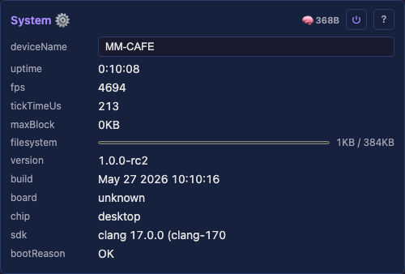

# SystemModule

System-level diagnostics and device identity. Always loaded, always visible in the UI.

## Controls (ordered by change frequency)

**Dynamic (updates every second):**
- `uptime` (read-only, progress) — seconds since boot
- `fps` (read-only) — derived from Scheduler tickTimeUs
- `tickTimeUs` (read-only) — average tick time in microseconds
- `freeHeap` (read-only, progress) — current free heap / total heap
- `freeInternal` (read-only, progress) — current free internal heap / total internal
- `maxBlock` (read-only) — largest contiguous allocatable block

**Configurable:**
- `deviceName` (text, default `MM-XXXX` where XXXX = last 4 hex of MAC) — the device's network identity (*which unit this is*). Used as hostname for mDNS, AP SSID, and UI display. Persisted.
- `deviceModel` (text, read-only in the UI) — the physical-hardware identity (*which product this is*, e.g. `Olimex ESP32-Gateway Rev G`), the entry name from the device-model catalog ([deviceModels.json](../../install/deviceModels.json)). The device can't self-identify its hardware, so this is *pushed* by tooling — just like any other catalog default: the web installer sends it as one of the `APPLY_OP` `set` ops during provisioning (see [ImprovProvisioningModule.md](ImprovProvisioningModule.md)), or MoonDeck over HTTP `/api/control` on the LAN. The printable-ASCII rule (1..31 chars, 0x20–0x7E, no NUL) is a per-control validator on the descriptor (`ControlDescriptor::validate`), so *every* write path — HTTP, serial APPLY_OP, persistence load — runs it in the backend. Display-only in the UI (pushed, never user-typed at the device); persisted.

**Static (set at boot):**
- `chip` (read-only) — chip model (ESP32, ESP32-S3, etc.)
- `sdk` (read-only) — ESP-IDF version string (or compiler on desktop)
- `wifiCoproc` (read-only) — WiFi co-processor firmware status, shown only on boards whose radio is a separate chip (the ESP32-P4 with its on-board [ESP32-C6](https://www.espressif.com/en/products/socs/esp32-c6) over [esp_hosted](https://github.com/espressif/esp-hosted-mcu)). Reports the detected slave firmware version (`C6 fw 2.12.9`) when the link is up, or `not detected` when the C6 never completes its handshake / reports 0.0.0, which is the signature of absent or incompatible C6 slave firmware. Absent on native-radio targets (the platform returns an empty string and the control is not added).
- `flash` (read-only) — total flash chip size
- `psram` (read-only, progress) — used / total PSRAM (only if present)
- `bootReason` (read-only) — human-readable reset reason from `platform::resetReason()` (e.g. `POWERON`, `SW`, `PANIC`, `INT_WDT`, `TASK_WDT`, `BROWNOUT`, `DEEPSLEEP`). Desktop always reports `OK`. The UI flags the reboot button with a red border (`data-crashed="true"`) when the value is one of PANIC / INT_WDT / TASK_WDT / BROWNOUT, indicating the prior boot ended unexpectedly.

On desktop these show "desktop" / "N/A" for hardware-specific fields.

## Device name

`deviceName` is the device's identity across the system: NetworkModule uses it as the mDNS hostname (`deviceName.local`) and the AP SSID, and MoonDeck shows it in the device list. The default `MM-XXXX` derives from the last 4 hex of the MAC.

## Tests

- Unit test: MAC-to-name conversion
- Scenario: verify /api/system returns valid metrics

## Prior art

### projectMM v1

- System info displayed in web UI (heap, FPS, chip info)
- Device name configurable and persisted

### MoonLight

- System diagnostics via REST API
- Device name used for mDNS

## Source

[SystemModule.h](../../../src/core/SystemModule.h)
