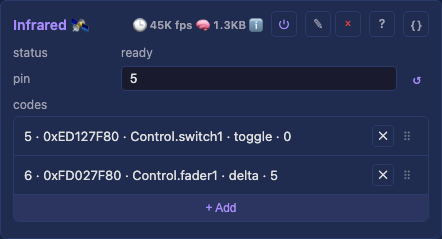
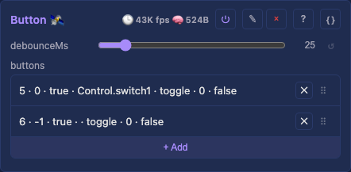
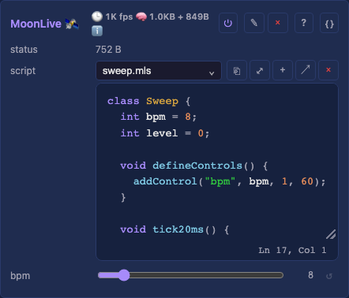

# Core services

The user-added **Service** modules — capability bridges the device provides or consumes, added and removed at runtime in the `Services` container (the core-domain twin of the light domain's `Effects`/`Drivers`). Fixed device infrastructure (identity, network, inspection tools) lives under **System** — see [core/system.md](system.md). Every row links to its generated technical page (the full API, from the `.h`) and its tests.

<a id="services"></a>

## Services

The top-level container the Service modules hang under — a grouping node with no controls of its own, the same shape as `Effects`/`Drivers` in the light domain. Adds/removes its children (Audio, OSC, Infrared, Button, Analog, MoonLiveService) at runtime via the generic module machinery.

Detail: [technical](moxygen/Services.md)

<a id="audio"></a>

### Audio

A user-added Service: the audio source the audio-reactive effects consume. `mode` is its identity, and each mode shows only its own controls. Wire, modes and loopback: ⌄ details.


<video src="../../assets/uiscenarios/react-to-sound.webm" autoplay loop muted playsinline width="720" title="An audio-reactive effect following the room through the board's own microphone"></video>

- `mode` — Local audio, Receive network or Simulate, each showing only its own controls below.
- `micMode`: (Local, I²S targets) `I2S` for a three-wire part, `PDM` for a two-wire one.
- `sckPin` / `wsPin` / `sdPin`: (Local, I²S targets) the bus GPIOs, unset until entered.
- `mclkPin`: (Local, I²S targets) the master clock a line-in ADC may need; unset for a plain mic.
- `device`: (Local, desktop) the OS capture input, `default` following the system setting.
- `sampleRate` — (Local) mic/ADC sample rate.
- `levels` — (Local) who sets the display window: `manual`'s two sliders, or `automatic`, a learner.
- `floor`: (Local) the **silence threshold**: below it a band reads zero, and the learner ignores it.
- `gain`: (Local, manual) the width of the display window: higher is narrower, so it runs hotter.
- `send audio` — (Local, network build) send the local analysis as audio-sync packets.
- `simulate` — (Simulate) the pattern: `music`, a plausible song, or `sweep`, a test march.
- `syncPort` — (network build) the UDP port, 11988 by default; `sync status` reports the state.
- read-only — `level` (RMS), `peakHz` (the audio driving effects, from any source).

Detail: [technical](moxygen/AudioService.md) · [the sync packet](../light/moxygen/WLEDAudioSyncPacket.md) · [the lock-free ring](moxygen/SpscRing.md)

[Tests](../../reference/tests/unit-tests.md#audioservice)

<a id="osc"></a>

### OSC


Receives [OSC](https://opensoundcontrol.stanford.edu/) over UDP and writes it onto this device's controls, so a fader in Resolume, TouchDesigner or TouchOSC drives projectMM directly. It owns no surface of its own: everything lands in the same control writes the HTTP API and the UI use, so every validator still runs. Addresses, feedback and setup: ⌄ details.

- `listen` — receive OSC (default **off**). This opens an unauthenticated UDP port that writes
  controls, on the same LAN-trust basis as the Art-Net and audio-sync receivers, so it is a
  capability you turn on rather than one every device carries.
- `port` — the UDP port (default 9000, what TouchOSC uses). Applies live.
- `status` — listening, off, or why the port could not be opened.

Detail: [technical](moxygen/OscModule.md)

<a id="infrared"></a>

### Infrared

A Service added per board: an infrared receiver whose **rows** map learned codes onto other modules' controls, through the same primitive every other input uses. A remote press and an OSC message are indistinguishable to whatever they drive.



**A row is the binding**: a remote has twenty keys, so it has twenty rows. ⌄ details.

- `pin`: the receiver GPIO, unset until entered.
- `codes`: the mapping rows, each with its learned `code`, a `learn` arm, and a target below.

Detail: [technical](moxygen/InfraredService.md)

<a id="button"></a>

### Button

A Service added per board: **a list of buttons**, each on its own GPIO, each driving a control through the same primitive the infrared service uses. A press and a UI click are the same thing to whatever they drive. A **foot pedal needs no module of its own**: electrically it is a momentary switch.



- `debounceMs`: how long a level must hold before it counts as a real press.
- `buttons`: the rows, each with a `pin`, an `activeLow` for the wiring, and a live `pressed` readout.

`activeLow` is on for the usual wiring, a switch to ground with an internal pull-up, and off for a switch feeding 3V3. The readout lets you see a button work before binding it.

- `target`, `kind` and `value`: what the row drives, how, and with what. ⌄ details.

Detail: [technical](moxygen/ButtonService.md)

### Analog

A Service added per board: **a list of ADC pins**, each driving a control with a value rather than an event. The continuous twin of Button, which drives the same controls from a contact.

An **expression pedal** is the shape this is built around, and why a row carries more than a pin.


- `smoothing`: how hard the running average pulls toward each reading, as a percentage.
- `deadband`: how far the value must move before the control is written.
- `inputs`: the rows, each with a `pin`, the raw counts its travel spans, and an `invert`.

The travel is mapped into **the control's own range**, so a pedal is configured once and works on any target. ⌄ details.

Detail: [technical](moxygen/AnalogService.md)

### MoonLiveService

A Service added per board: **a MoonLive script that reads hardware and drives controls**. The flexible half of the input story, and the twin of a scripted effect.



Why a script rather than another module: a mapping row is right for a button and wrong for anything with a condition in it. A script holds state and chooses between outcomes.

- `script`: which `.mls` file to run, picked from the script library. Naming a different one
  recompiles live; a compile error shows on the status line and the service does nothing until it is
  fixed.
- Everything the script declares appears as a real control on the card, so a slider move lands
  without a recompile.

A script runs on the 50 Hz poll rather than the render tick, so a heavy one costs its own tick.

Detail: [technical](moxygen/MoonLiveService.md)

## Analog, details
The travel maps into the control's own range: a Select with five options takes 0..4, a bool takes on and off. A row pointed at a pad does nothing, since there is no sensible reading of a pedal held at 40% of a preset. Live `raw` and `value` readouts let a pedal be calibrated by watching it move, and reversed bounds mean inverted rather than being an error, since calibrating by moving to each end sets whichever was reached first. Without a `deadband` a resting pedal rewrites its target fifty times a second forever. Scripts reach the same hardware with `adcRead(pin)` and `adcMax()`, which is the path for a sensor whose mapping is a condition rather than a range.

## Button, details
Debouncing happens here rather than in the platform layer, because a bouncing contact is a property of the switch. Rows are polled at 50 Hz, since a contact closes for tens of milliseconds.

Both input services share three row fields, because what happens after an input fires is the same whichever input fired it.

- `target`: `Module.control`. Pointing at `Control.switch1` puts the input on the control surface, where OSC, MQTT and the web UI reach the same switch; pointing at `Drivers.on` drives that control directly. The surface is the recommended path, not a rule.
- `kind`: `toggle` reads the target and writes its inverse (a light switch); `set` writes `value` while held and 0 on release (hold-to-activate, a pedal); `delta` adds `value`, clamped to the control's own bounds (a brightness nudge, a palette step). **`set` is Button-only**: it needs a release to write the 0, and a remote reports a press with no release.
- `value`: what `set` writes, or the signed nudge `delta` applies. Unused by `toggle`.

Only a `set` row acts on the release. A toggle or a delta acting on both edges would fire twice for one push.

## Audio, details
#### Microphone wiring

`I2S` suits a three-wire part, the INMP441 and most MEMS mics, and line-in ADCs. `PDM` suits a two-wire one, a clock and a data line, as on the QuinLED Dig-Next-2's onboard microphone: it uses `wsPin` as its clock and `sdPin` as its data, and hides the two clock pins it does not have.

#### Setting the levels

`automatic` measures each band's own floor and typical loudest level and maps that range onto the window, which is what makes a treble band read level with a bass one. The choice picks which controls are shown, so the mode is one decision rather than four interacting sliders.

`floor` is the silence threshold in both modes, and its second half matters as much as its first: a learner that studies an empty room maps its noise floor onto the whole display and shows silence at full scale. Raise it until a quiet room reads still. It depends on the part and the room, so it is the knob to reach for first.

`gain` sizes the band window directly and scales the level's own, which is wider because a block RMS covers more dB than a single bin's peak. The default suits a quiet MEMS mic, so turn it down hard for a loopback device or everything clips.

#### The three modes

Local runs an input of its own, a microphone or line-in on a board and a capture device on desktop, and analyzes it locally. Receive network is a pure sink a peer's WLED-compatible audio drives. Simulate is a synthesized source for demos and tests. On board targets Local idles until real GPIOs are entered; on desktop it captures the picked device right away. A desktop in Local mode with `send audio` on is an audio-sync source: one machine's microphone or loopback drives a whole fleet of boards in Receive mode. The Receive mode and every network-sync control exist only on a network-capable build.

#### Capturing what the machine plays (loopback), per OS

macOS has no native loopback: install [BlackHole](https://existential.audio/blackhole/), create a **Multi-Output Device** in Audio MIDI Setup (your speakers first plus BlackHole, with drift correction on BlackHole) and set it as the system output; the speakers keep playing while an identical copy lands in BlackHole, which this control captures. The Mac's volume keys go dead on a multi-output device, so set volume in the player. Windows usually needs nothing: enable **Stereo Mix** in the Recording tab and pick it here (VB-Cable is the fallback where a driver lacks it). Linux PulseAudio and PipeWire expose a **Monitor of <output>** source natively.

A desktop device is picked by list position, so re-pick if the OS reorders them; `default` is order-stable.

#### WLED audio sync: what is on the wire

Sending and receiving both use the **multicast address 239.0.0.1**, which is what WLED's own
usermod does (`beginMulticast` on both ends). It never uses broadcast, so a broadcast sender is
inaudible to WLED and a receiver that only binds the port never hears WLED. This is a
network-layer address, unrelated to any device grouping.

**Port 11988 is the WLED contract**, and `syncPort` defaults to it. The port is configurable for
projectMM peers that want a private stream, but a custom port is no longer WLED-compatible: the
endpoint WLED speaks is 239.0.0.1:11988 specifically.

Multicast is also the better neighbour, with a caveat worth knowing: a switch or access point that
does **IGMP snooping** forwards the group only to the ports that joined it, so the other hosts
never see the traffic at all. Without snooping the switch floods it exactly like broadcast, and on
WiFi it goes out at the lowest basic rate to every station. So multicast can reduce how many hosts
have to process ~40 packets a second, but it does not guarantee it. See
[multicast and IGMP snooping](../../explanation/architecture/moonlight.md#multicast-and-igmp-snooping).

The 44-byte v2 packet is byte-compatible with WLED, with one field that is not yet equivalent:

| field | projectMM | WLED | status |
|---|---|---|---|
| `sampleRaw` / `sampleSmth` | level / smoothed level | same | compatible |
| `samplePeak` | latched beat, 80 ms refractory | same rule | compatible |
| byte 17 | zero | zero (`reserved2`) | compatible |
| `fftResult[16]` | bands, clamped to 254 | `constrain(…, 0, 254)` | compatible |
| `FFT_MajorPeak` | peak frequency in Hz | same | compatible |
| `FFT_Magnitude` | 0..255 internally, x16 on the wire | ~0..4096 | compatible |

**The magnitude scale differs, so it is converted at the wire.** WLED sends the raw magnitude of
its FFT's dominant bin, scaled so that "the end result is linear and ~4096 max" (its own comment
where it divides the input samples by 16). Its effects then divide that by 4, 8 or 16 depending on
the effect and treat the result as a byte, which is why their thresholds read `< 48` squelch and
`> 144` full brightness. projectMM byte-scales the peak magnitude to 0..255 instead, through the
same noise floor and gain conditioning as the 16 bands, so one pair of knobs governs the whole
spectrum.

projectMM keeps its own units internally and multiplies by 16 on send, dividing by 16 on receive.
The factor is exact rather than a fudge: it is the divisor WLED's effects apply, so our full-scale
255 arrives as 4080, right on WLED's own ~4096 design target, and every effect's thresholds land
where they were tuned to. Adopting WLED's range internally was the alternative, and was rejected
because that range is an artifact of FFT size and input scaling rather than a specification (WLED's
own fallback path admits "no idea if 10000 is a good value"), and importing it would cost the
property that one floor/gain pair conditions every value the service publishes, in exchange for
resolution the receiving effects discard anyway when they divide back down to a byte.

A received magnitude is clamped to 255, since a real WLED source reaches ~9500 and an unclamped
value would drive effects harder than locally analyzed audio ever could.

Prior art: the WLED-MM audio-reactive usermod by **Frank ([@softhack007](https://github.com/softhack007))**, the most-used open-source audio-reactive LED implementation, whose adaptive noise-gate concept the analysis here descends from (analyzed with his permission); and **[@troyhacks](https://github.com/troyhacks/WLED)**, who reworked that DSP onto Espressif's [esp-dsp](https://github.com/espressif/esp-dsp) FFT, the same choice this service makes. The line-in path exists because **wladi ([myhome-control](https://shop.myhome-control.de))** supplied the hardware and pinout for the [MHC-WLED ESP32-P4 shield](../../reference/hardware/mhc-wled-esp32-p4-shield.md): its onboard PCM1808 I2S ADC is what `mclkPin` is for.

## OSC, details
**Feedback: the device answers.** With `feedback` on, a control that changes anywhere (the web UI, a
preset recall, an audio-reactive effect) is mirrored back to the surface, which is what keeps a
client honest and what moves a motorised fader. `feedbackTo` names the receiver, or is left empty to
answer whoever last wrote to us; `feedbackPort` is where that client LISTENS, which is not the port
we listen on (Open Stage Control calls its own `osc-port`).

A client learns the current state three ways: when it first writes to us from a new address, when
its address changes, and whenever it sends **`/mm/hello`**. The last one exists because a client
restarting on the SAME address is invisible to the other two, and most controllers send nothing of
their own on load, so every widget would show its layout file's defaults until the user moved one.
The shipped session has a `sync from device` button for exactly this.

**Setting one up**, from installing the app to using it from a phone, is its own page:
[Driving projectMM from a phone or tablet](../../how-to/control-surface.md). It needs no
checkout and no tooling, just the app and the session file from the latest release.

**Addresses.** These are a public contract: a TouchOSC layout built against them keeps working, so
they stay small and boring.

| address | argument | drives |
|---|---|---|
| `/mm/fader/1` .. `/mm/fader/8` | float 0..1 or int 0..255 | the Control surface's faders |
| `/mm/encoder/1` .. `/mm/encoder/8` | float 0..1 or int 0..255 | its rotary encoders |
| `/mm/switch/1` .. `/mm/switch/8` | float 0..1 or int 0..255 | its on/off switch row (nonzero = on) |
| `/mm/hello` | anything, or nothing | resend every value to the sender |
| `/mm/control/<Module>/<control>` | float 0..1 or int 0..255 | any control directly |

Both argument forms are accepted because controllers disagree: apps send a float in 0..1, hardware
bridges send an int in the target's range. Out-of-range values are clamped rather than ignored, so
a controller sending 0..127 does something sensible instead of appearing dead.

Send one from the bench with `uv run moondeck/check/send_osc.py <ip> /mm/fader/1 0.75`.

Origin: projectMM original

**One command to a working surface** (with the repo checked out). Install
[Open Stage Control](https://openstagecontrol.ammd.net/) (free, macOS / Windows / Linux), then:

```sh
uv run moondeck/run/run_open_stage_control.py                   # device on this machine
uv run moondeck/run/run_open_stage_control.py --host 192.168.1.42
```

Open **http://127.0.0.1:8088** and the surface is there. On the device, turn `listen` and `feedback`
on; nothing else needs configuring, because the launcher passes the session, the send address and
the listen port as arguments rather than leaving them to be typed into a settings panel. The session
itself sends `/mm/hello` when the page loads, so every widget shows the device's real values straight
away instead of its layout file's defaults, and a browser refresh re-reads them.

It runs **headless**: a web server rather than a desktop window. That is deliberate. The surface is
then reachable from a phone or another laptop on the same network (the launcher prints those URLs),
and on macOS it sidesteps the quarantine dialog an unsigned download otherwise raises.

| | |
|---|---|
| `--host` / `--port` | the device and its OSC `port` (default `127.0.0.1:9000`) |
| `--listen` | where we receive feedback, the device's `feedbackPort` (default 9001) |
| `--ui-port` | the surface's web UI (default 8088; 8080 is projectMM's own) |
| `--app` | the Open Stage Control binary, when it is not on PATH or in the usual place |
| `--gui` | also open the desktop window; by default it is the server alone |

The launcher looks on PATH first, then in each platform's default install location. **Windows and
Linux are untested**: the paths are the ones those installers use, but only macOS has been run. If
it cannot find the app, `--app` takes the full path and that always works.

**A ready-made control surface.** A session of the switches, encoders and faders ships as a release
asset (`projectMM-control-surface.json`) and lives in the repo at
[`docs/reference/examples/open-stage-control.json`](../../reference/examples/open-stage-control.json).
Editing the layout needs `read-only` off in the launcher.


Driving the device from that session, beside the Control card it mirrors.

It binds only to `/mm/switch/N`, `/mm/encoder/N` and `/mm/fader/N`, N being 1 to 8, on purpose. A surface should
address the SURFACE, and [Control](system.md#control) decides what each one drives, so one layout keeps
working as assignments change and a hardware desk lands on the same bindings. Reaching past it to
`/mm/control/<Module>/<control>` also works and is the right answer for a one-off, but it hard-codes
into the layout a mapping that belongs on the device. Two have targets today, `switch1`
(`Drivers.on`) and `fader1` (`Drivers.brightness`); the rest wait for a target picker.

The session also carries a **pad grid**, and those pads are inert: `/mm/pad/N` has no route in the
OSC module yet, so pressing one sends a message nothing reads. It ships anyway because the grid is
the layout a preset launcher wants and the addresses are the ones it will use; treat it as a
placeholder rather than as part of the contract above.

**It does not reach a Mackie desk.** The X-Touch and QCon Pro G2 speak Mackie Control over MIDI,
not OSC: see [control surfaces](../../reference/hardware/control-surfaces.md) for what would.

## Infrared, details
Set a row's `learn` and the next code received binds to it, which is how any remote works without a shipped code table. Arming one row disarms any other, so a code cannot bind twice. A fresh service starts with no rows: add one, learn a key, pick a target. The status line reports whether the channel actually opened, not merely that a pin is set; on some boards the receiver shares its pin with another peripheral through a board switch.

Nothing is fixed in firmware. A row IS the binding: learn a key onto it, pick what it drives from
the target dropdown, and pick whether the press toggles that control, or nudges it by a value. A
handset with twenty keys is twenty rows. `set` is offered only where an input reports a release, so
it is unavailable here: a remote code is a single event, and a `set` row would latch the control
with nothing able to clear it.

One key binds to one row. Learning a key that another row already holds moves the binding rather
than duplicating it, because dispatch fires the first row holding a code and a duplicate could
never run.

The status line reports setup state ("set pin to receive" / "ready"), the learn prompt, a binding
("learned 0x..."), what a press did or why it did not, and an unbound code ("received 0x...
(unassigned)").
