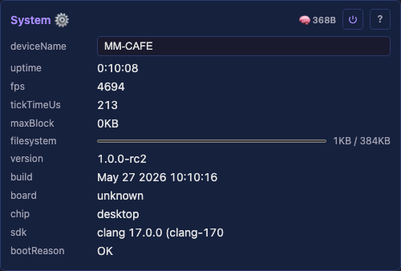
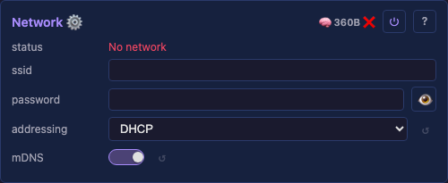
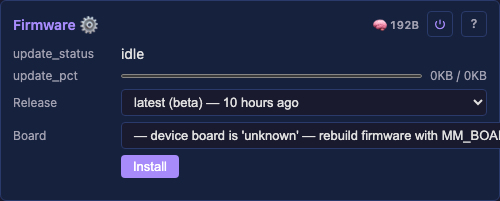

# Core system

The device's fixed infrastructure — identity, network, provisioning, firmware, and the inspection tools. These modules are **always present and wired by code**, not user-added; the user does not add or delete them. User-added capability modules (Audio, IR) live in the `Services` container instead — see [core/services.md](services.md). Every row links to its generated technical page (the full API, from the `.h`) and its tests. Cross-cutting rationale that no single `.h` owns lives in the prose sections below the table.

## System modules

<a id="system"></a>

### System

The device's identity and vitals — name (behind mDNS `<name>.local`, the SoftAP SSID, the DHCP hostname), uptime, heap, and per-module footprint reporting. Its fixed inspection children (Tasks, I2C scan) hang beneath it.



- `deviceName` — the identity behind mDNS, the SoftAP SSID and the DHCP hostname.
- `deviceModel` — the board model (drives the installer catalog entry).
- `expertMode` — reveals advanced tuning/diagnostic controls (marked 🔧) across the UI; off by default.
- `logLevel` — serial verbosity, defaulting to Warn. The first 60 s always logs at Info.
- read-only vitals — `uptime`, `fps`, `heap`, `psram`, `flash`, `chip`, and per-module footprint.

Detail: [technical](moxygen/SystemModule.md)

[Tests](../../reference/tests/unit-tests.md#systemmodule)

<a id="network"></a>

### Network

WiFi / Ethernet connectivity, static-IP configuration, RSSI and TX-power reporting. Brings the device onto the LAN before the HTTP and WebSocket servers start.



- `mode` — WiFi / Ethernet / off.
- `ssid` / `password` — WiFi credentials.
- `mDNS` — the `<name>.local` hostname.
- `addressing` — DHCP or static; static exposes IP / gateway / subnet / DNS fields.
- `ethType` / `ethPhyAddr` / `ethRstGpio` / … — Ethernet PHY configuration.
- read-only — `rssi` (dBm), `txPower` (dBm).

Detail: [technical](moxygen/NetworkModule.md)

[Tests](../../reference/tests/unit-tests.md#networkmodule)

<a id="improv-provisioning"></a>

### Improv provisioning

Serial/BLE Improv Wi-Fi provisioning: the web installer hands credentials to a fresh device over this protocol during the flash-and-connect flow. [Improv Wi-Fi](https://github.com/improv-wifi) is an open standard, and its [sdk-cpp](https://github.com/improv-wifi/sdk-cpp) / [sdk-js](https://github.com/improv-wifi/sdk-js) are the specification this implements, so any Improv-capable installer can provision a projectMM device.


- `provision_status` — read-only provisioning state.

Detail: [technical](moxygen/ImprovProvisioningModule.md) · [frame format](moxygen/ImprovFrame.md) · [chunk reassembly](moxygen/ImprovOpReassembler.md)

<a id="devices"></a>

### Devices

Discovers other projectMM devices on the LAN and lists them, persisting the last-known list across a reboot. A wired-by-code child of Network.


- `devices` — a List control of discovered devices; each row expands to a detail panel. Persistable.
- `wledCompatible` — also announce on WLED's broadcast address, off by default.

WLED apps browse on broadcast, so a device appears in them only with this on. Off is the better neighbour, since a broadcast wakes every device on the LAN to parse a packet none of them want. Presence always goes to the projectMM group regardless, so peers find each other either way. See [multicast and IGMP snooping](../../explanation/architecture/moonlight.md#multicast-and-igmp-snooping).

Detail: [technical](moxygen/DevicesModule.md)

[Tests](../../reference/tests/unit-tests.md#devicesmodule)

<a id="mqtt"></a>

### MQTT

Bridges the light to an MQTT broker so a home-automation hub can control it, as a transport over the shared apply-core rather than new control logic. Our own dependency-free MQTT 3.1.1 client, disabled until a broker is set. A wired-by-code child of Network. Topics, colour-wheel mapping and the Homebridge config: ⌄ details.


- `broker` — the broker hostname (e.g. `homeassistant.lan`) or IP. A hostname is resolved via DNS.
- `port` — broker port (default 1883).
- `username` / `password` — broker credentials, optional, the password stored obfuscated.
- `haDiscovery` — announce a Home Assistant discovery light, off by default.

HA already discovers the device over the WLED shim with no broker, so this stays off to avoid a duplicate entity. Turn it on for broker-only or cross-subnet setups. See the [home-automation guide](../../how-to/home-automation.md).
- read-only — `mqtt_status`, from `disabled` and `idle` through to `connected`, or an error.

Detail: [technical](moxygen/MqttModule.md)

[Tests](../../reference/tests/unit-tests.md#mqttmodule)

<a id="firmware-update"></a>

### Firmware update

Over-the-air firmware flashing — the one operation that swaps the binary and needs a power cycle (every *config* change applies live; a firmware OTA does not).



- `firmware` — the OTA image to flash.
- read-only: `version`, `build`, `partition`.
- `image` — on a device carrying two images, which one those describe and an install writes.

The choice is the app it runs, or MoonBase in the factory slot. This control's presence is also what tells the UI that installs run through the reboot-into-MoonBase cycle, behind one "updating firmware" overlay, and that a **Restart in MoonBase** button belongs on the card ([MoonBase](../../explanation/architecture/moonbase.md)).

Detail: [technical](moxygen/FirmwareUpdateModule.md) · [image vetting](moxygen/FirmwareImage.md)

[Tests](../../reference/tests/unit-tests.md#firmwareupdatemodule)

<a id="mooncloud"></a>

### MoonCloud

The container for everything projectMM does with a server MoonModules runs. It holds no settings of its own: each thing it does is a child with its own consent, because a user who wants one has not thereby agreed to the other.


- **Stats**, below: one opt-in report per install or upgrade, and the totals back.
- **Talk**, below: a public message board between devices.
- **Sync** (planned): device to device over the internet, a joint show across houses.

Detail: [technical](moxygen/MoonCloudModule.md)

<a id="stats"></a>

### Stats

One opt-in report about this install, sent once per install or upgrade, so development effort goes where the users are. Off until you answer yes. What it sends is in the [privacy policy](../../legal/privacy-policy.md).


- `consent` — a checkbox, off by default. Nothing is sent and no identifier computed while off.
- read-only: `version` and `reportedVersion`, which differ exactly when a report is due.
- `send update` — a button that reports again now, for a setup that changed without a version change.

The two versions differing is what makes an upgrade send one report and a reboot send nothing. The button replaces this install's row rather than adding one.

The report carries the chip, flash, PSRAM, SDK, device model, memory, light count, and which modules you added. It carries no device name, no addresses, no credentials and no text you typed, which a unit test asserts.

Detail: [technical](moxygen/MoonStatsModule.md)

[Tests](../../reference/tests/unit-tests.md#moonstatsmodule)

<a id="talk"></a>

### Talk

A public message board between projectMM devices, in the shape Meshtastic's channel chat has. Off until you turn it on, and a message is sent because you typed one: nothing posts on its own.


- `consent` — a checkbox, off by default. Nothing is published or read while it is off.
- `shareName` — whether your device name rides along, **off by default and a separate decision**.
- `message` — what to say, up to 280 characters. Typing changes nothing on its own.
- `send` — publishes the message and clears the box, as does Enter in the message field.

A device name identifies a person rather than a machine. Without it your messages carry the first 8 characters of your installation id, which groups them without naming you.

**Everything sent is public and permanent**: no private message, no recipient, no delete. **There is no authentication**, so a sender id can be fabricated by hand.

Detail: [technical](moxygen/MoonTalkModule.md)

[Tests](../../reference/tests/unit-tests.md#moontalkmodule)

<a id="file-manager"></a>

### File Manager

Browse and manage the device filesystem: a folder tree with an inline text editor. Distinct from Filesystem, the persistence engine. Behaviour: ⌄ details.


- `file browser` — the panel itself: a folder tree, a toolbar and an inline text editor.
- **Backup (⤓)**, download the device's files as one `.json` bundle.

**Keep it private: it contains the WiFi password.** Every file is byte-verified against the listing, and an unreadable one is skipped and named.
- **Restore (⟲)**, upload a backup bundle, pressing twice since it overwrites the device's files.

Known renames from [MIGRATING.md](../../reference/MIGRATING.md) apply before upload, then a report lists what needs an eye. Every file applies as it lands, bar network settings and the web server's `port`, which the dialog names.
- `show hidden` — reveal dot-prefixed files and folders, such as `.config`.
- `filesystem` — read-only usage bar (used / total bytes, from the platform).
- `lastSaved` — read-only; how long ago config was persisted (read from the Filesystem engine).

Detail: [technical](moxygen/FileManagerModule.md)

<a id="i2c-scan"></a>

### I2C scan

A fixed System module (wired-by-code, always present) that probes the I²C bus on a button press and reports the addresses found — a hardware bring-up tool. The bus pins default to unused (−1), so a board without an I²C device claims no GPIO for it; a board with a bus sets its pins via the catalog, or you type them for an ad-hoc scan. Passive until the scan button is pressed.


- `sda` / `scl` — the bus GPIOs, defaulting to −1 for unused.

A board with a fixed bus injects its own through the catalog, or you type the pins for an ad-hoc scan. The classic Arduino-ESP32 pair is 21/22.
- `scan` — a button; press to probe the bus now.
- read-only — `result` (addresses found).

Detail: [technical](moxygen/I2cScanModule.md)

<a id="tasks"></a>

### Tasks

A read-only diagnostic showing **what runs where**: you cannot optimise which module runs on which core until you can see it. A fixed System module, wired-by-code, with each task's MoonModules nested beneath it.


- read-only — `tasks`, a row per FreeRTOS task.
- read-only — `core0` / `core1`, what executes on each core, empty on a single-core chip.

Each row carries `name`, `state`, `core`, `prio` and `stack`, the minimum free stack seen. A `cpu` percentage appears only in a profiling build, off by default because the run-time counter costs about 5% of the tick.

Expand a row for the modules in that task, each as `Name · Nus · NB · Nheap`. A closing `∑ modules` line cross-checks them against the tick. Empty on desktop.

Detail: [technical](moxygen/TasksModule.md)

<a id="pins"></a>

### Pins

A read-only diagnostic showing **which module owns each GPIO, for what role, and whether that pin is safe for it** — the device's pin ownership map, keyed by physical GPIO. A fixed System module, wired-by-code.

It walks the live tree for every claimed pin, holding no state, and flags double claims.


- read-only — `pins`, a row per claimed GPIO.

Each row carries `gpio`, `owner` and `role`, plus live `dir`, `level` and `drive`. A row takes a coloured edge when unsafe: red for a reserved or double-claimed pin, yellow for a driven role on a strap, per [gpio-usage.md](../../reference/hardware/gpio-usage.md).

Detail: [technical](moxygen/PinsModule.md)

<a id="control"></a>

### Control

A grid of preset pads, a row of rotary encoders above them, a row of on/off switches above those, and a bank of faders below — the layout of a Mackie-style control desk ([X-Touch](https://www.behringer.com/product.html?modelCode=0808-AAF), [QCon Pro G2](https://www.iconproaudio.com/product/qcon-pro-g2/)), so a physical surface maps onto it without a translation layer.


- `presets` — the pad grid (8×8). One pad per preset file; click to apply, right-click (or long-press) to name it, pick which single subtree it captures, save or delete. Drag a pad to rearrange the surface.
- `switch1` … `switch8` — the top row of on/off switches, for a target a fader cannot express (a fader says `on` only as 0 or 255, which is a switch pretending to be a slider). `switch1` drives `Drivers.on`, the master the whole rig honours; the rest are unassigned until bound.
- `encoder1` … `encoder8` — rotary encoders. Drag or scroll to turn; right-click shows what each drives.
- `fader1` … `fader8` — faders. `fader1` drives `Drivers.brightness`; the rest are unassigned until bound.

Detail: [technical](moxygen/ControlModule.md)

[Tests](../../reference/tests/unit-tests.md#controlmodule)

<a id="filesystem"></a>

### Filesystem

The persistence **engine**: writes control values to `/.config/*.json` and restores them on boot, overlaying loaded values through each control's pointer during `defineControls()`. A non-UI module, so it renders no card of its own; its "last saved" status is surfaced by the File Manager.

Calling `defineControls()` again at runtime, when a Select changes mode, clears and rebuilds the set, so only the controls relevant to the current mode show. That is how a conditional `hidden` flag re-evaluates, and how a config change applies live with no reboot.

Detail: [technical](moxygen/FilesystemModule.md)

[Tests](../../reference/tests/unit-tests.md#filesystemmodule)

## Control, details

A control is one named, typed value on a module, declared once in `defineControls()` and reachable by name from every surface: the web UI, the REST interface, a preset file, a script, a physical desk. The type decides how it renders, what it accepts, and how it persists, so a module never writes UI code and never parses its own JSON.

[`Control.h`](moxygen/Control.md) owns the type and its operations. The discriminator sits with the functions that interpret it, so adding a type is one enum entry plus the cases the compiler then demands, rather than a search for every `switch` in the tree.

Detail: [technical](moxygen/Control.md)

#### The module tree

Every module is the same building block, whatever it does: [`MoonModule`](moxygen/MoonModule.md) declares the lifecycle, and [`Scheduler`](moxygen/Scheduler.md) owns the top-level modules, boots them in phases, and drives every tick. A module is a node in a tree, so a driver, a layer and an effect nest the same way and the same walk serves all of them.

[`ModuleFactory`](moxygen/ModuleFactory.md) turns a type name into an instance, which is what lets a preset file name a module this build has never instantiated.

Detail: [technical](moxygen/MoonModule.md) · [Scheduler](moxygen/Scheduler.md) · [ModuleFactory](moxygen/ModuleFactory.md)

#### Surfaces and mappings

[`ControlSurface`](moxygen/ControlSurface.md) is the desk layout itself: which bank a control belongs to, and how a physical encoder or fader finds the value it drives.

[`InputMapping`](moxygen/InputMapping.md) is the binding table behind it. A row says what an input does to a control: set it, step it, toggle it. A delta steps down as well as up, so one encoder covers a range without a second control to reverse it.

Detail: [technical](moxygen/ControlSurface.md) · [InputMapping](moxygen/InputMapping.md)

#### Presets

A preset is a file: `/.config/presets/<name>.json`. Saving writes one, applying reads one, deleting removes one. Nothing else holds preset state, so there is no second copy to keep in step: the list is rebuilt from the folder rather than persisted alongside it. That rescan runs at startup and after every save, rename and delete — a reorder only rewrites the affected files and re-sorts the rows in place, since the folder's contents have not changed. So a preset added or removed through the File Manager appears once the module next rescans (a reboot, or a save, rename or delete on the surface), not the instant the file lands.

The name becomes the file name, so it is restricted to printable ASCII without `/`, `\` or `.` — a validator on the control, which every write path runs. `slot` records which pad the preset occupies, so a surface arranged to match a physical desk survives a reboot.

##### What a preset carries

A preset captures **exactly one** top-level subtree, recorded in the file:

```json
{
  "slot": 12,
  "captures": "Effects",
  "Effects.enabled": true, "Effects.0.type": "Layer", "Effects.0.0.type": "NoiseEffect"
}
```

Each captured subtree is exactly the bytes the persistence engine already writes for that module, namespaced under a `<TypeName>.` key prefix. Save and restore therefore reuse the engine that reconciles a tree against JSON ([`saveSubtreeTo` / `applySubtree`](moxygen/FilesystemModule.md)) rather than a second serializer that could drift from it.

One subtree per preset is the whole model: a preset is *a look*, or *a geometry*, or *a hardware setup*, or *a service configuration. Never a combination. A `Effects` preset is a look, and applies to a board with completely different hardware; a `Drivers` preset carries pin maps and is device-specific. Choosing the role is a single radio button when saving, and the pad's color says which role it holds.

A preset naming a subtree this build does not have is refused with a reason rather than partially applied, and a file written by an older build that names several subtrees is listed but not applied, so it can be seen and deleted rather than silently vanishing. A malformed file leaves the live tree untouched.

##### One active preset per role

Each subtree is a **role**: layout, effects, driver, service. A preset holds its own role and leaves the other three alone, so a layout preset and a look can be active at the same time, and applying a new look replaces only the look.

A pad is tinted by its role: layout blue, effects violet, driver green, service amber.

##### Applying is a rebuild

Applying a preset creates, replaces and destroys modules to match what the file describes — it is a restore, not a value overlay: a preset carrying more than the device has adds it, and one describing less removes what it omits.

Structural mutation quiesces the render worker, and mutations run inline on the render tick, so a large restore stalls rendering for its duration. The captured subtree is applied and `prepareTree()` runs once at the end. Presets are a cold-path feature; the tick path is untouched.

#### Home Assistant

Looks reach Home Assistant two ways, and only `Effects` presets travel either of them.

**The WLED integration** (`/presets.json`) is the native path: HA renders looks in its own preset dropdown, shows which one is applied, and applies one when it is chosen. This is what HA calls a preset.

**MQTT discovery** publishes the same looks as the light entity's **effect list**. HA has no preset concept over MQTT, so they arrive as effects — the same result from the user's side, reached through a different mechanism.

HA caches the preset list and re-fetches only when the device's `info.fs.pmt` value changes, so the device reports a revision counter there that bumps on every preset save, rename and delete — a counter rather than a timestamp, so two changes inside one second still read as two. A constant there leaves HA showing the list it read at setup forever; over MQTT the same revision re-announces the effect list mid-session.

Only looks are exposed, on both paths. A `Drivers` or `Layouts` preset rewires pins or geometry, which must not be reachable from something that believes it is choosing a color scheme — the restriction is enforced at the apply entry point, not merely by omitting them from the list.

Home Assistant's WLED integration connects on **port 80 only**: its host field rejects a port, so a desktop build (which defaults to 8080) needs `--port 80`, and that needs root:

```sh
sudo uv run moondeck/run/run_desktop.py --port 80
```

The discovery buffers are sized to the looks this device actually has, and grow or shrink as presets are added and removed. There is no cap on the number: a fixed one would either reserve memory a small setup never uses, or silently publish nothing once the list outgrew it.

## MQTT, details
The topic prefix is `projectMM/<mac>` — a **stable** identifier (the last 6 hex of the device's MAC), fixed for the device's life. Renaming the device does **not** change its topics, so a hub's config never breaks on a rename (the WLED/Tasmota/Home-Assistant convention). It's derived, not a stored control.

**Topics** (for a device whose MAC ends `563cfe`): the device SUBSCRIBEs to the `set` topics and PUBLISHes the `get` topics on change (and on connect, so a controller never reads "No Response"). It also publishes its friendly `deviceName` on the retained `name` topic, so a hub can show the human name while the topics stay MAC-stable:

| direction | topic | payload |
|---|---|---|
| set → device | `projectMM/563cfe/on/set` | `true` / `false` |
| device → get | `projectMM/563cfe/on/get` | `true` / `false` |
| set → device | `projectMM/563cfe/brightness/set` | `0`–`100` |
| device → get | `projectMM/563cfe/brightness/get` | `0`–`100` |
| set → device | `projectMM/563cfe/hsv/set` | `h,s,v` (hue `0`–`359`, sat/val `0`–`100`) |
| device → get | `projectMM/563cfe/hsv/get` | `h,s,v` |
| device → get | `projectMM/563cfe/name` | the friendly `deviceName` (retained) |
| device → get | `projectMM/563cfe/update/state` | `{"installed_version":…,"latest_version":…,"release_url":…,"title":…}` (retained; HA update entity) |
| set → device | `projectMM/563cfe/update/set` | target version string (empty = install latest); triggers OTA against the matching GitHub release asset |

The HomeKit color wheel has no "palette" concept, so `hsv/set`'s hue+saturation pick the **nearest palette** (each built-in palette has a representative color; the closest one is selected) and the value drives brightness — the color wheel becomes a natural palette selector.

**Homebridge** — install [`homebridge-mqttthing`](https://github.com/arachnetech/homebridge-mqttthing) and add a `lightbulb` accessory. Use the device's own MAC suffix (read it from the `mqtt_status`/topics, or `mosquitto_sub -t 'projectMM/#'`) in place of `563cfe`:

```json
{
  "accessory": "mqttthing",
  "type": "lightbulb",
  "name": "projectMM",
  "url": "mqtt://<broker>:1883",
  "username": "<user>",
  "password": "<pass>",
  "topics": {
    "getOn": "projectMM/563cfe/on/get",
    "setOn": "projectMM/563cfe/on/set",
    "getBrightness": "projectMM/563cfe/brightness/get",
    "setBrightness": "projectMM/563cfe/brightness/set",
    "getHSV": "projectMM/563cfe/hsv/get",
    "setHSV": "projectMM/563cfe/hsv/set"
  },
  "onValue": "true",
  "offValue": "false"
}
```

Home Assistant adopts the device two ways, both zero-config:
- **MQTT auto-discovery** — with `haDiscovery` on (opt-in; off by default) and a broker set, the device announces itself on `homeassistant/light/projectMM_<mac6>/config` and HA auto-creates a wired entity with **on/off + brightness** (the config declares `brightness` only; color isn't in it, so the entity has no color control). Retained across reboots. Color/palette stays on the separate `hsv/set` topic above, not this entity. Off by default because the WLED `/json` shim already gives HA a richer light (color + palette + sensors) over mDNS with no broker — leaving both on lists the device twice; enable this only for broker-only / cross-subnet setups.
- **WLED integration** — HA's built-in WLED integration discovers the device over the WLED `/json` API projectMM already serves; on/off + brightness work with no broker.

Both can be on at once. Setup walkthrough (including exposing HA to Apple Home via HA's HomeKit Bridge, no Homebridge needed) in the [Home Assistant recipe](../../how-to/home-automation.md#adopt-in-home-assistant).

## File Manager, details
The panel is a lazy folder **tree** (each folder loads its children on first expand) plus an inline text editor. Dot-prefixed entries (the `.config` persistence dir) are hidden unless `show hidden` is on.

- Click a folder's row to select it and toggle its expansion (▸/▾); click a selected file to open the editor.
- The toolbar acts on the selected node: **＋ folder** creates a folder inside it, **＋ file** creates an empty file (click it to edit), **🗑 delete** removes the selected file, or a folder and everything inside it (press-twice to confirm), **⟳** refreshes.
- **Drag files from the desktop** onto a folder (or the tree) to upload them — the body streams straight to the file (any size, binary-safe; capped only by a sanity limit and the free space, which it reports if short); a per-file **⤓** streams it back to the desktop.
- The editor loads a file's text, pretty-prints JSON on open, and saves atomically; a binary file (contains a NUL) loads read-only (use ⤓ to fetch it intact). Upload and download both stream, so neither truncates.
- Create / delete are HTTP calls (`POST` / `DELETE /api/dir?path=`), not controls — the path rides the request, so nothing is stored on the device per op.

Last-modified dates (needs an NTP time source + LittleFS mtime), binary/large + folder upload, folder-as-zip download, and `.ml` syntax highlighting are backlogged ([backlog-core § File Manager follow-ups](../../work/future/backlog-core.md#file-manager-follow-ups)).
