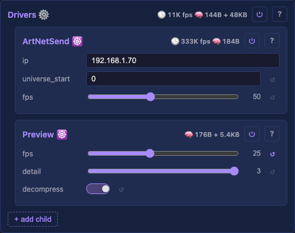

# Drivers

Top-level container for one or more drivers. The consumer side of the pipeline — owns the shared output buffer (when memory allows) and performs blend+map from every layer's buffer into it each frame.

> **Naming convention.** Capital `Drivers` is the container class; lowercase "driver"/"drivers" is the English singular/plural for individual `DriverBase` children. Capitalisation disambiguates "the Drivers container" from "two drivers running". Same rule for `Layouts`/layout and `Layers`/layer.

## Shared output buffer

The shared output buffer is necessary because blend+map writes to arbitrary physical positions (via LUT) — the output is not filled sequentially. A driver cannot read chunk-by-chunk until the full buffer is populated.

Exception: when memory is tight AND mapping is 1:1 unshuffled (single layer, grid layout, no serpentine), Drivers can skip its own buffer and let drivers read directly from the layer's buffer at the cost of parallelism. See [architecture.md § Parallelism](../../architecture.md#parallelism).

It uses the same `Buffer` type a Layer does, sized by the Layouts container.

## Output correction

The Drivers container owns the shared output-correction state and exposes two controls; each *physical* driver child (ArtNet today, future LED drivers) applies it per-light as it reads the source buffer. Preview ignores it (shows the raw logical buffer).

| Control | Type | Description |
|---|---|---|
| `brightness` | uint8 (0–255) | Global brightness. Scales every channel through a 256-entry LUT (`(v × brightness) / 255`). Changing it rebuilds only the LUT on the cheap `onUpdate` tier — no pipeline realloc, so the slider is fluent. Gamma / white-balance fold into this LUT later as a per-channel R/G/B split. |
| `lightPreset` | select | The physical wire format: channel order and whether the light is RGBW. Options: `RGB`, `RBG`, `GRB`, `GBR`, `BRG`, `BGR`, `RGBW`, `GRBW`. Defaults to `GRB` — the WS2812/SK6812 wire order, so a strip shows correct colours out of the box (PreviewDriver reads the RGB source buffer directly and is unaffected). RGBW presets make each driver emit 4 channels per light with white derived as `min(R,G,B)` from the (brightness-scaled) RGB. |

The state lives on `Correction` (`src/light/drivers/Correction.h`): a brightness LUT, channel-order table, output channel count, derive-white flag. `Drivers::onUpdate` rebuilds it on a `brightness`/`lightPreset` change and hands each child a `const Correction*`. Every driver currently sees the same blended output of the active layer; per-driver layer assignment is a [backlog](../../backlog/README.md) item that lands with multi-layer composition.

## Prior art

### MoonLight — PhysicalLayer ([source](https://github.com/MoonModules/MoonLight/blob/main/src/MoonLight/Layers/PhysicalLayer.h))

Owns `channelsD` (display buffer). `compositeLayers()` maps virtualChannels → channelsD. Parallelism via semaphore: driver signals completion, compositor writes.

### projectMM v1 — DriverLayer ([source](https://github.com/ewowi/projectMM-v1/blob/54b50bc/src/modules/layers/DriverLayer.h))

Container for driver modules. Receives pixel data from EffectsLayer.

### projectMM v2 — DataRegistry ([source](https://github.com/ewowi/projectMM-v2/blob/main/src/core/DataRegistry.h))

Type-erased buffer directory. Producers declare, consumers resolve by id. Decouples effects from drivers.

## Source

[Drivers.h](../../../src/light/drivers/Drivers.h)
