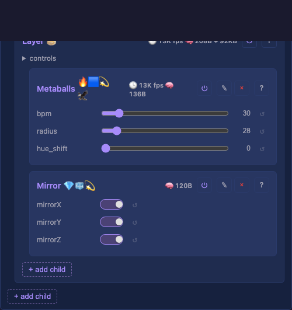

# Layers

Top-level container for one or more layers. Each layer renders independently into its own buffer; the Drivers container composes those buffers downstream.

> **Naming convention.** Capital `Layers` is the container class; lowercase "layer"/"layers" is the English singular/plural for individual `Layer` children. Capitalisation disambiguates "the Layers container" from "two layers stacked". Same rule for `Layouts`/layout and `Drivers`/driver.

## Why a container

Multi-layer composition (alpha-blend, additive, layered overlays) needs a place to walk every layer in order and merge their buffers before drivers consume the result. Layers is that place. Today the boot pipeline creates **one layer inside Layers**, so the container is a thin pass-through: `loop()` runs the single child and returns; behaviour is byte-identical to the previous single-layer pipeline.

The container itself owns no buffer. Each layer owns its own buffer; the Drivers container owns the composed output buffer (today: blend+map from the active layer; tomorrow: blend from every layer).

## API

- `addChild(layer)` — add a layer (heap-allocated list, grows on demand).
- `setLayouts(Layouts*)` — wire the shared Layouts and propagate it to every layer so each can size its buffer. Idempotent — call again after adding a layer to wire the new one.
- `layouts()` — accessor for the wired Layouts pointer.
- `activeLayer()` — placeholder for the single-layer pipeline: returns the first enabled layer (or the first child if none are enabled). The Drivers container reads it for buffer + dimensions. Replaced by composition in the follow-up.
- `loop()` — walks every enabled layer in order, timing each one. Per-layer timing surfaces in the card's stats line.

## Follow-up: composition

The composition step lives in [Drivers](Drivers.md), not here — Layers iterates and the Drivers container blends, mirroring the engine's separation between producers (Layers) and consumers (Drivers). When composition lands:

- Drivers' `loop()` walks every layer in the Layers container, blends their buffers into the shared output buffer (alpha-over by default; modes per layer), then runs each driver.
- Each layer's [`startX/Y/Z` and `endX/Y/Z` controls](Layer.md#start-end-controls) become active — a layer with `endX < layout width` paints into a sub-region, and the rest of the output stays at whatever the previous layer wrote (or black if none).
- The single-layer fast path still applies when only one layer is enabled.

Tracked in [docs/plan.md](../../plan.md) as "Multi-Layer composition (pending)".

## Prior art

### MoonLight — VirtualLayer / PhysicalLayer ([source](https://github.com/MoonModules/MoonLight/blob/main/src/MoonLight))

MoonLight's `PhysicalLayer` runs N `VirtualLayer`s and composites their buffers into the display channel. Same idea, different shape: Drivers (not Layers) does the compositing here.

### projectMM v1/v2

Single-layer designs. No prior container for multiple layers.
