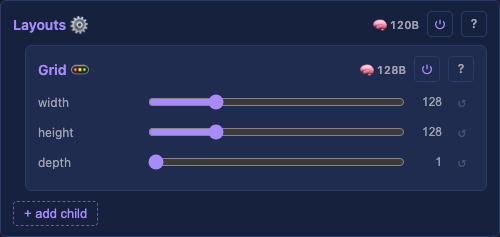

# Layouts

Top-level container for one or more layouts. Shared by every layer in the Layers container — defines the physical light topology of the installation.

> **Naming convention.** Capital `Layouts` is the container class; lowercase "layout"/"layouts" is the English singular/plural for individual `LayoutBase` children. Capitalisation disambiguates "the Layouts container" from "two layouts stacked". Same rule for `Layers`/layer and `Drivers`/driver.

## API

- `addChild(layout)` — add a layout (heap-allocated list, grows on demand).
- `totalLightCount()` — sum of every layout's light count. Read by Layer and by the Drivers container for buffer allocation.
- `forEachCoord(callback, ctx)` — iterate all coordinates across every layout, offsetting physical indices so they don't overlap.

`forEachCoord` is a Layouts method, not a Layer method. A layer **uses** the Layouts container's coordinates to build its LUT, but the iteration itself is owned by Layouts.

## Layout interface

Layouts inherit from `LayoutBase` and implement the virtual interface directly — no adapter or wrapper boilerplate. `forEachCoord` is a virtual method, not a template.

- `lightCount()` — number of lights this layout defines.
- `forEachCoord(callback, ctx)` — yield (idx, x, y, z) for each light.

Callback signature uses the platform typedefs: `void(void* ctx, nrOfLightsType idx, lengthType x, lengthType y, lengthType z)`.

## Multiple layouts combined

A Layouts container can hold multiple layouts. Example: 16 LED strips making up a panel. Physical indices are offset so they don't overlap between layouts.

## Disabling a layout

Disabling a layout child (the `enabled` toggle in the UI) removes its lights from the LUT entirely. Indices of any layouts after it shift down to close the gap: with two grids of 4 and 2 lights, disabling the first leaves the second at indices 0–1, and `totalLightCount` drops from 6 to 2. A `Scheduler::buildState()` fires from the HTTP handler so the LUT, layer buffer, and driver output buffer reallocate.

Side effect: ArtNet universe assignments shift with the indices. To keep driver-to-fixture mapping stable across enable changes, disable the driver instead of the layout.

## What needs improvement

- Layout control changes must propagate to every layer (LUT rebuild) and to the Drivers container (output buffer reallocation). Mechanism: [architecture.md § Rebuild propagation](../../architecture.md#rebuild-propagation).
- Runtime add / remove / reorder of layouts.
