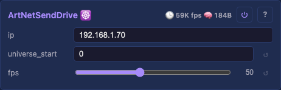
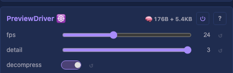

# Drivers

A driver reads its window of the [Drivers](moxygen/Drivers.md) container's shared buffer, applies the shared [output correction](moxygen/Drivers.md) per light, and sends the result out — a wire protocol (WS2812), the network (Art-Net / E1.31 / DDP), a smart-light hub (Hue), or the web UI (Preview). Drivers are added per board through the catalog ([`deviceModels.json`](../../../web-installer/deviceModels.json)); `PreviewDriver` is the one boot-wired driver. Every driver shares the `start` / `count` [source-window](moxygen/DriverBase.md) controls (the slice `[start, start+count)` it sends). Each card links to a detail page and, where it doesn't fit the table, a **⌄ details** section below.

**Jump to:** [LED output](#led-output-drivers) · [Network](#network-drivers) · [Smart light](#smart-light-drivers) · [Preview](#preview-drivers)

## LED output drivers

### LED output 💫 · wire

Addressable WS2812B-class LEDs over a wire, one GPIO per strand. Three peripherals do this — pick by chip: **RMT** (single/few strands, any ESP32), **LCD_CAM** (8 parallel strands, S3), **Parlio** (1–8 parallel strands, P4). Same controls, same wire contract; they differ only in how many strands clock out at once and on which chip.

- `pins` — data GPIO list, e.g. `18,17,16` (one strand each). Empty idles until set; changing it re-inits live.
- `ledsPerPin` — lights per pin, matched by position; empty or short = even split of the remainder.
- `chipset` - wire timing profile, currently `WS2812B` or `SK6812 RGBW`.
- `backend` - display-only output backend, e.g. `RMT DMA` when DMA streaming is active.
- `loopbackTest` — on/off TX→RX loopback self-test (jumper the first pin to `loopbackRxPin`); verdict in the status field.
- `loopbackTxPin` / `loopbackRxPin` — optional TX override + the RX pin for the self-test. Shown only while `loopbackTest` is on.

Origin: WS2812B on FastLED / hpwit / WLED prior art ([analysis](../../backlog/leddriver-analysis-top-down.md))

[Tests](../../tests/unit-tests.md#rmtleddriver)

Detail: [RMT](moxygen/RmtLedDriver.md) · [LCD](moxygen/LcdLedDriver.md) · [Parlio](moxygen/ParlioLedDriver.md)

## Network drivers

### Network Send 💫 · UDP

Streams the buffer over UDP as **Art-Net**, **E1.31 / sACN**, or **DDP** — one burst per frame, compatible with Falcon/Advatek controllers, xLights, and LedFx.

- `protocol` — Art-Net / E1.31 / DDP (default Art-Net); the destination port follows automatically.
- `ip` — destination (default `255.255.255.255` broadcast reaches every LAN receiver; set a unicast address to target one).
- `universe_start` — first universe for Art-Net / E1.31 (DDP is byte-addressed, ignores it).
- `fps` — frame-rate limit (default 50, 1–120).

Origin: MoonLight D_NetworkOut; Art-Net 4 / E1.31 / DDP specs

[Tests](../../tests/unit-tests.md#networksenddriver)

Detail: [technical](moxygen/NetworkSendDriver.md)

## Smart light drivers

### Hue 💫 · bridge

Drives **Philips Hue bulbs as pixels**: each colour bulb in the driver's window becomes one pixel, pushed to the bridge over its HTTP API. Paced to the bridge's ~10 cmd/s limit — smooth ambient colour, not strobing.

- `bridgeIp` — the bridge's LAN IPv4.
- `appKey` — the Hue app key; filled by `pair`, persisted.
- `pair` — button: press it, then the bridge's physical link button within ~30 s to claim a key.
- `room` / `light` — dropdowns narrowing which colour lights are driven (both default `All`).

Origin: projectMM, on the [Hue v1 CLIP API](https://developers.meethue.com/develop/hue-api/)

[Tests](../../tests/unit-tests.md#huedriver)

Detail: [technical](moxygen/HueDriver.md)

## Preview drivers

### Preview 💫 · web UI

Streams a true-shape 3D preview to the web UI over WebSocket as a **point list** — only the real lights at their real positions, so a sphere/ring/arbitrary map shows in its true shape. The one boot-wired driver.

- `fps` — preview stream rate (default 24, 1–60; independent of the render loop).

Origin: projectMM, on [MoonLight](https://github.com/ewowi/MoonLight/blob/main/src/MoonLight/Layers/PhysicalLayer.h)'s PhysicalLayer model

[Tests](../../tests/unit-tests.md#previewdriver)

Detail: [technical](moxygen/PreviewDriver.md)

## LED output — details

The three LED-output peripherals, compared. All drive WS2812B/SK6812-class strips with the same `pins` / `ledsPerPin` / `chipset` / `loopback*` controls and the same wire contract; they differ in parallelism and chip.

| Peripheral | Chip | Strands | Notes |
|------------|------|---------|-------|
| **RMT** ([RmtLedDriver.md](moxygen/RmtLedDriver.md)) | any ESP32 (classic 8 ch, S3 4, P4 4 DMA) | one per RMT TX channel | the general single-/few-strand output; default for classic + S3 board entries. Adds `loopbackFrame` — a whole-frame variant of the self-test (bit-verifies a full frame, catching frame-rate / RF corruption a 24-bit burst misses). |
| **LCD_CAM** ([LcdLedDriver.md](moxygen/LcdLedDriver.md)) | ESP32-S3 | **exactly 8** parallel (one DMA transfer) | the S3's scale path where RMT tops out at 4. Adds `clockPin` (10) / `dcPin` (11) — i80 bus lines the LEDs ignore. Give unused lanes `0`. |
| **Parlio** ([ParlioLedDriver.md](moxygen/ParlioLedDriver.md)) | ESP32-P4 | **1–8** parallel (one DMA transfer) | the P4's parallel path (Parlio generates its own pixel clock — no clock/dc pins). On P4-NANO a known-good set is `20,21,22,23,24,25,26,27`. |

The detail pages carry each peripheral's wire contract, buffer slicing, memory sizing, and the loopback self-test.
