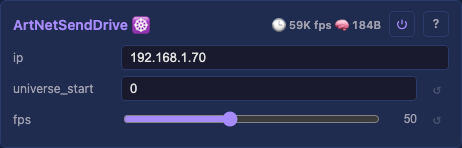

# Network Send Driver

Streams the light buffer over UDP in one of three industry protocols, selected by a control: **ArtNet**, **E1.31/sACN**, or **DDP**. Reads the Drivers container's buffer, applies the shared [Correction](Correction.md) (brightness / channel order / RGBW white) per light, chunks the corrected bytes per the selected protocol, and sends the whole frame as one burst at the configured rate. The single-node-multiple-protocols shape follows MoonLight's D_NetworkOut (architecture studied, not copied). Compatible with industry receivers — pixel controllers (Falcon, Advatek), xLights, LedFx, and ArtNet-controllable software.

## Controls

- `protocol` (select: ArtNet / E1.31 / DDP, default ArtNet) — the wire protocol; the destination port follows it automatically (6454 / 5568 / 4048). Changing it re-targets the socket live.
- `ip` (IPv4, default 192.168.1.70) — unicast destination. Changing it re-binds live; E1.31 multicast is deliberately not implemented (see Interop below).
- `universe_start` (uint16_t, default 0) — first universe for ArtNet and E1.31; DDP is byte-addressed and ignores it.
- `fps` (uint8_t, default 50, range 1-120) — frame rate limit. Without it the loop would re-send on every render tick; receivers expect a steady frame cadence.

## Chunking per protocol

| Protocol | Port | Chunk | Lights/packet (RGB) | Frame at 128×128 |
|---|---|---|---|---|
| ArtNet | 6454 | 510-channel universes | 170 | 97 packets |
| E1.31 | 5568 | 510-channel universes | 170 | 97 packets |
| DDP | 4048 | 1440-byte chunks, byte offset + push on last | 480 | 35 packets |

ArtNet and E1.31 split at **510 channels per universe** — whole RGB lights, the xLights/Falcon convention; consecutive universes from `universe_start`. **DDP is the fast path**: per-packet cost dominates the wire time (~280 µs/packet Ethernet, ~1140 µs WiFi), so 480 lights per packet cuts a 128×128 WiFi frame from ~110 ms to ~40 ms.

E1.31 framing facts an integrator needs: CID is stable per device (derived from the MAC), source name `projectMM`, priority 100, one frame-level sequence stamped on every universe of a frame. The full byte layouts live in [E131Packet.h](../../../../src/light/E131Packet.h), [DdpPacket.h](../../../../src/light/DdpPacket.h) and [ArtNetPacket.h](../../../../src/light/ArtNetPacket.h) — shared with the receiver so the two sides cannot drift.

## Interop notes

- **Universe rule (both ends):** buffer offset = (universe − `universe_start`) × 510, and the sender emits from `universe_start` verbatim — no hidden 1-based adjustment for E1.31. Strict sACN gear reserves universe 0, so set `universe_start ≥ 1` on **both** ends when talking to it; the matching default of 0 on our own receiver keeps device↔device pairs aligned out of the box.
- **Unicast only.** E1.31 multicast (group 239.255.x.x) is deferred — the platform has no IGMP join yet; MoonLight ships unicast-only too. See the backlog entry.

## Synchronous send (blocks the render tick)

The whole frame goes out inline in `loop()` — ~35 ms over Ethernet / ~90 ms over WiFi at 128×128 with ArtNet (DDP proportionally less). The dedicated send task that decouples the wire from the render tick is a backlog item gated on PSRAM ([backlog](../../../backlog/backlog.md)). FPS limiting plus the all-universes-in-one-burst shape is what receivers expect.

## Cross-domain wiring

Added as a child of the `Drivers` container in `main.cpp`, wired by code (a persistence load can't drop it): receives `setSourceBuffer` / `setCorrection` from `Drivers::passBufferToDrivers` and applies the shared `const Correction*` before every send — the same correction the RMT LED driver applies, so network and wired outputs show identical colours.

## Tests

[Unit tests: NetworkSendDriver](../../../tests/unit-tests.md#networksenddriver) — exact wire layouts for all three protocols (the byte offsets strict receivers validate), universe splitting, and the no-allocation-in-loop contract per protocol path.

Live tier: `uv run scripts/scenario/run_network_live.py` ([MoonDeck.md § run_network_live](../../../../scripts/MoonDeck.md#run_network_live)) relays between real boards with the protocol control cycled round-robin.

## Prior art

MoonLight's D_NetworkOut (ArtNet/E1.31/DDP in one node) and the v1/v2 ArtNet senders; protocol specs: Art-Net 4 (Artistic Licence), ANSI E1.31-2016, DDP (3waylabs). Studied for the lessons, never copied.

## Source

[NetworkSendDriver.h](../../../../src/light/drivers/NetworkSendDriver.h)
