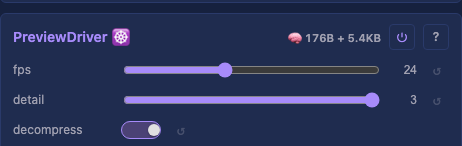

# Preview Driver

Streams a true-shape 3D preview to the web UI over WebSocket. The preview is a **point list** — only the real lights, at their real positions — not a dense grid. So a sphere, ring, or arbitrary fixture map shows in its true shape, and the per-frame data is just the lights that exist (much less than a padded bounding box).

## Controls

- `fps` (uint8_t, default 24, range 1-60) — preview stream rate (independent of the render loop)

## Protocol

PreviewDriver owns both wire formats end to end and pushes the bytes to a `BinaryBroadcaster` (the core [HttpServerModule](../../core/HttpServerModule.md) implements it via `broadcastBinary`). The HTTP server only writes the bytes to its WebSocket clients — it has no knowledge of the preview, the light domain, or the formats below. `main.cpp` wires the driver's broadcaster to the HTTP server instance. This mirrors MoonLight's model: positions sent once at mapping time, channels per frame.

Two binary message types (first byte selects):

- **`0x03` coordinate table** — sent on every LUT rebuild (layout add/replace/remove, resize, modifier change) and re-broadcast ~once per second so a newly-connected client catches up. Layout:

  `[0x03][count:u32][bx:u8][by:u8][bz:u8][stride:u16][ (x:u8, y:u8, z:u8) × count ]`  (10-byte header)

  `count` = points actually sent (**u32** — a HUB75 wall can exceed 65535 lights; matches `nrOfLightsType`); `bx/by/bz` = bounding-box extent (the browser centres the cloud on it); positions are **1 byte per axis** (a layout's bounding box is ≤255/axis in practice; scaled on build if larger). `stride` carries the **downscale factor** (1 = full resolution; >1 = the per-axis lattice step — see Large layouts), which the browser shows as `preview 1/N · link limited`.

- **`0x02` per-frame channels** — RGB, one triple per sent point, in coordinate-table order:

  `[0x02][count:u32][stride:u16][ (r, g, b) × count ]`  (7-byte header)

  The browser colours coordinate-table entry `i` with RGB triple `i`. It **skips a `0x02` frame whose `count` ≠ the current `0x03` count** (a rebuild is mid-flight — the colours would map to the wrong positions); they realign within ~1 frame. The device likewise withholds colour frames until the matching `0x03` has been accepted by the transport, so the two never desync.

## Sparse layouts & where the data comes from

The driver reads the **sparse driver buffer** — the `Layer`'s `MappingLUT` extracts the real lights from the dense render grid into a buffer of exactly `Layouts::totalLightCount()` entries (a radius-4 sphere → 210, not its 9×9×9 = 729 box). That same buffer is what ArtNet sends. PreviewDriver reads it flat by light index and builds the coordinate table from `Layouts::forEachCoord` (same driver order), so RGB index `i` and coordinate `i` always refer to the same light. See [Layer](../Layer.md) / [MappingLUT](../MappingLUT.md) for the box→driver mapping.

## Large layouts (spatial downsample + adaptive)

A preview frame is **staged once and drained across transport-poll ticks** — `HttpServerModule::broadcastBinary` copies the frame into a single staging buffer and returns (never blocking the render task on the socket); `drainWsSends()` (on the HTTP `loop20ms`) streams it to every client a slice at a time via non-blocking `writeSome`. So a frame larger than one `writev`/the lwIP send buffer no longer drops the connection — it just takes a few ticks to send. See [HttpServerModule](../../core/HttpServerModule.md) for the transport contract.

Two things bound the point count:

- **Static cap** — `MAX_PREVIEW_POINTS` is RAM-derived: `131072` on PSRAM boards, `16384` on no-PSRAM. Above the cap the driver downsamples on a **spatial lattice** — keep a light only when its grid position lands on a per-axis step (`x%s==0 && y%s==0 && z%s==0`), a regular sub-grid that generalises to 2D and 3D, with no diagonal moiré (the lattice samples *positions*, not flat indices). Sparse layouts (a sphere) and any grid under the cap send every light (`stride` = 1, exact).
- **Adaptive downscale** — the driver watches `broadcaster_->lastDrainTicks()` (how many ticks the last frame took to fully send). Sustained high latency → coarsen the lattice (`stride`++) so frames shrink; a low-latency stretch → refine back toward full resolution (hysteresis stops oscillation). The current factor rides the `0x03` `stride` field to the browser's status line.

Positions are 1 byte per axis. A layout whose bounding box exceeds 255 on any axis (e.g. a 512-wide grid) is **scaled** so the largest box edge maps to 255, preserving aspect ratio (the `0x03` header carries the scaled box extents, which the browser normalises against). Boxes ≤255/axis are sent at exact integer positions (scale factor 1), so large grids preview at their true proportions, not flattened onto the 255 plane.

## Tests

- [Unit tests: PreviewDriver](../../../tests/unit-tests.md#previewdriver) — coordinate table = real-light count (sphere → 210, not 729), per-frame RGB count matches the table, large layout strides down, small layout exact.
- [Scenario: scenario_Layer_base_pipeline](../../../tests/scenario-tests.md#scenario_layer_base_pipeline) — full pipeline including the preview driver.

## Prior art

### MoonLight — PhysicalLayer + WebSocket ([source](https://github.com/MoonModules/MoonLight/blob/main/src/MoonLight/Layers/PhysicalLayer.h))

The model this implements: virtual(logical grid) → physical(sparse lights) via a mapping table; light **positions sent once** at mapping time (`monitorPass`, `packCoord3DInto3Bytes` = 1 byte/axis, `isPositions` header state), **channels streamed per frame**. 3D WebGL renderer in the frontend.

### projectMM v1 — PreviewModule ([source](https://github.com/ewowi/projectMM-v1/blob/54b50bc/src/modules/drivers/PreviewModule.h))

Streamed via WebSocket binary frames. Control: `logEveryN` (slider 1-1000) for throttling.

### projectMM v2 — PreviewModule ([source](https://github.com/ewowi/projectMM-v2/blob/main/src/modules/lights/PreviewModule.h))

Same pattern, uses v2 DataBuffer for frame data.

## Source

[PreviewDriver.h](../../../../src/light/drivers/PreviewDriver.h)
