# Effects

Every effect, one block each: its preview, what it does, and what each control means: together. An effect writes per-pixel color into its [Layer](moxygen/Layer.md)'s buffer each tick; [modifiers](modifiers.md) reshape the result and a [driver](moxygen/PreviewDriver.md) sends it out. Effects that name an index color read the global palette (the `palette` control on [Drivers](moxygen/Drivers.md)) via `colorFromPalette`. Each block's emoji are its `tags()` (origin/creator/audio: see the [tag emoji legend](../../explanation/architecture/index.md#tag-emoji-legend)); **Dim** is its native axes ([Layer](moxygen/Layer.md) extrudes a lower-dim effect onto a bigger grid). Effects are grouped into sections by origin, and each block carries that effect's preview, behavior, and control descriptions together. How the layout here maps to the source and asset folders is the [folder-structure decision](../../contributing/documentation-standards.md#module-pages).

Effects are built from the shared [power functions](power-functions.md): the drawing, field and motion routines every effect composes; that page lists each one with its callers.

**Jump to:** [MoonLight](#moonlight-effects) · [MoonModules](#moonmodules-effects) · [WLED](#wled-effects) · [FastLED](#fastled-effects) · [projectMM-native](#projectmm-native-effects)

> Some WLED-origin effects show a preview gif from [WLED-Utils](https://github.com/scottrbailey/WLED-Utils) by scottrbailey (the canonical WLED effect gif set, cross-linked with credit); these show WLED's rendering. Effects with a local `../../assets/…` gif show our own output.

## MoonLight effects

### ColorTrails 💫🖌️💨🌫️ · 3D

Emitters pouring color into a flow that carries and folds it. There is no velocity field: one noise value shifts each row sideways, one shifts each column, and the two shears compose into a swirling current. A large grid is steered by a few hundred numbers, which is why it runs where a solver does not.

- `speed`: how fast the emitters travel.
- `flow`: how far a row or column is pushed: the current's strength.
- `flowSpeed`: how fast the flow itself drifts and reverses.
- `scale`: the flow's spatial frequency: a few broad bands or many fine ones.
- `persistence`: how long color survives, as a half-life.
- `colorSpeed`: how fast the emitters walk the palette.
- `size`: the orbit's radius and the Lissajous figure's reach.
- `mode`: all three emitters, or one at a time to see what each contributes.

Compare with [Fluid](#fluid): the solver when the medium is the subject, this when the color is.

Origin: MoonLight · concept by [Stefan Petrick](https://github.com/StefanPetrick), composition by Jeff (mindful_stone / [4wheeljive](https://github.com/4wheeljive)) in [FlowFields](https://github.com/4wheeljive/FlowFields/blob/main/src/flows/flow_noise.h) · via [MoonLight](https://github.com/MoonModules/MoonLight/blob/main/src/MoonLight/Nodes/Effects/E_FastLED.h)

### DistortionWaves 💫 · 2D

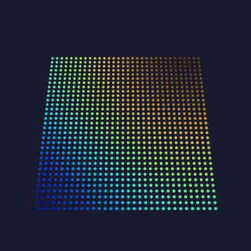

Two interfering sine waves beat against each other into a moiré color field.

- `freq_x` / `freq_y`: horizontal/vertical wave frequency (1–8).
- `speed`: animation rate (0 = frozen).

Origin: WLED · by ldirko & blazoncek (WLED port) · [gallery](https://editor.soulmatelights.com/gallery/1089-distorsion-waves) · via [MoonLight](https://github.com/MoonModules/MoonLight/blob/main/src/MoonLight/Nodes/Effects/E_WLED.h)

Detail: [technical](moxygen/DistortionWavesEffect.md)

[Tests](../../reference/tests/unit-tests.md#distortionwaveseffect)

### FixedRectangle 💫 · 3D

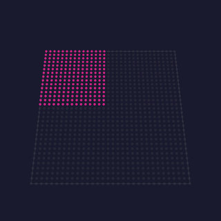

A solid color filling a positioned box within the grid, with an optional alternating-white checker on the box's pixels.

- `red` / `green` / `blue` / `white`: the box color.
- `X position` / `Y position` / `Z position`: the box's origin corner.
- `Rectangle width` / `height` / `depth`: the box extent on each axis.
- `alternateWhite`: alternate box pixels to white in a checker pattern.

Origin: MoonLight · by [limpkin](https://github.com/limpkin) · via [MoonLight](https://github.com/MoonModules/MoonLight/blob/main/src/MoonLight/Nodes/Effects/E_MoonLight.h)

Detail: [technical](moxygen/FixedRectangleEffect.md)

[Tests](../../reference/tests/unit-tests.md#fixedrectangleeffect)

### FreqSaws 💫🎶 · 2D

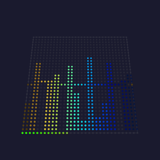

Audio-reactive sawtooth waves: each column maps to a frequency band whose magnitude drives a per-band oscillator speed, so louder bands sweep their sawtooth up the column faster, with three phase methods.

- `fade`: background decay per frame.
- `increaser`: how fast a band's speed ramps up with its magnitude.
- `decreaser`: how fast a silent band's speed decays.
- `bpmMax`: ceiling on a band's oscillation speed.
- `invert`: flip alternate columns vertically.
- `keepOn`: keep oscillating even when a band is silent.
- `method`: phase model (`Chaos`, `Chaos fix`, `BandPhases`).

Origin: MoonLight (audio) · by [@TroyHacks](https://github.com/troyhacks) · via [MoonLight](https://github.com/MoonModules/MoonLight/blob/main/src/MoonLight/Nodes/Effects/E_MoonLight.h)

Detail: [technical](moxygen/FreqSawsEffect.md)

[Tests](../../reference/tests/unit-tests.md#freqsawseffect)

### LavaLamp 💫🦅 · 2D

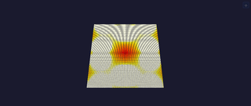

Three slow blobs through a black→red→orange→yellow→white ramp: atmospheric lava look.

- `bpm`: blob drift speed.
- `radius`: blob influence radius.
- `intensity`: field gain into the black→red→orange→yellow→white ramp.

Origin: projectMM original (metaball lava lamp)

Detail: [technical](moxygen/LavaLampEffect.md)

[Tests](../../reference/tests/unit-tests.md#spiraleffect)

### Lines 💫 · 3D 

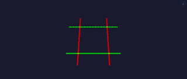

Sweeps axis-aligned planes in sync; red/green/blue name the X/Y/Z axis: a preview-orientation test pattern.

- `speed`: sweep BPM.
- `axis`: which plane sweeps (`all`, `x (red)`, `y (green)`, `z (blue)`).

Origin: MoonLight · via [MoonLight](https://github.com/MoonModules/MoonLight/blob/main/src/MoonLight/Nodes/Effects/E_MoonLight.h)

Detail: [technical](moxygen/LinesEffect.md)

### Metaballs 💫🦅 · 2D

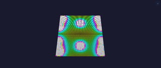

`count` blobs orbit via integer sin/cos; metaball field per pixel: bright HSV merge/split.

- `bpm`: orbit speed.
- `radius`: blob influence radius.
- `count`: number of orbiting balls (1–8).
- `hue_shift`: rotate the palette index.

Origin: projectMM original (metaballs)

Detail: [technical](moxygen/MetaballsEffect.md)

[Tests](../../reference/tests/unit-tests.md#metaballseffect)

### Particles 💫🦅✨ · 2D

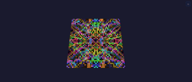

A swarm of drifting particles with persistent fading trails.

- `count`: number of particles (1–255).
- `speed`: drift velocity.
- `fade`: trail persistence (higher = longer tails).
- `hue_shift`: rotate every particle's hue.

Origin: MoonLight · by WildCats08 / [@Brandon502](https://github.com/Brandon502) · via [MoonLight](https://github.com/MoonModules/MoonLight/blob/main/src/MoonLight/Nodes/Effects/E_MoonLight.h)

Detail: [technical](moxygen/ParticlesEffect.md)

[Tests](../../reference/tests/unit-tests.md#particleseffect)

### Plasma 💫🦅 · 2D/3D

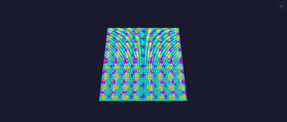

Summed sine waves on orthogonal + diagonal axes; large rolling blobs (3D on volumetric layouts).

- `bpm`: roll speed.
- `scale_x` / `scale_y`: blob size on each axis; larger is bigger and calmer.
- `hue_shift`: rotate the palette index.

Origin: FastLED / WLED lineage (classic plasma)

Detail: [technical](moxygen/PlasmaEffect.md)

[Tests](../../reference/tests/unit-tests.md#plasmaeffect)

### Praxis 💫 · 2D

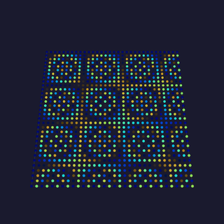

An algorithmic palette pattern driven by two beat oscillators (a macro and a micro mutator) whose frequencies and ranges reshape the hue field over time.

- `macroMutatorFreq` / `Min` / `Max`: the coarse mutator's beat rate and range.
- `microMutatorFreq` / `Min` / `Max`: the fine mutator's beat rate and range.

Origin: MoonLight · by MONSOONO / @Flavourdynamics · via [MoonLight](https://github.com/MoonModules/MoonLight/blob/main/src/MoonLight/Nodes/Effects/E_MoonLight.h)

Detail: [technical](moxygen/PraxisEffect.md)

[Tests](../../reference/tests/unit-tests.md#praxiseffect)

### Rainbow 💫 · 2D

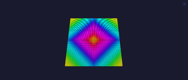

Diagonal animated rainbow: always-visible default/test effect.

- `speed`: animation BPM (one full hue cycle per beat).

Origin: FastLED · Mark Kriegsman (rainbow) · via [MoonLight](https://github.com/MoonModules/MoonLight/blob/main/src/MoonLight/Nodes/Effects/E_FastLED.h)

Detail: [technical](moxygen/RainbowEffect.md)

[Tests](../../reference/tests/unit-tests.md#rainboweffect)

### Random 💫✨ · 3D

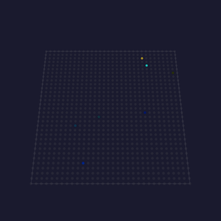

Lights one random light per frame in a random palette color over a fading background: a sparse, palette-tinted sparkle.

- `fade`: how fast prior sparkles fade to black.

Origin: MoonLight · via [MoonLight](https://github.com/MoonModules/MoonLight/blob/main/src/MoonLight/Nodes/Effects/E_MoonLight.h)

Detail: [technical](moxygen/RandomEffect.md)

[Tests](../../reference/tests/unit-tests.md#randomeffect)

### Rings 💫🦅🖌️🎡 · 2D

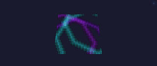

Expanding concentric rings from random centers, additive overlap (calm defaults).

- `count`: number of concentric rings (1–255).
- `speed`: expansion rate.
- `thickness`: ring band width.
- `hue_shift`: rotate every ring's hue.

Origin: projectMM original (concentric rings)

Detail: [technical](moxygen/RingsEffect.md)

[Tests](../../reference/tests/unit-tests.md#spiraleffect)

### Ripples 💫🦅 · 3D

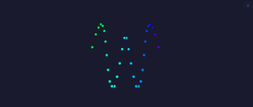

Distance-from-center sets a per-column wave phase; the lit surface ripples like water.

- `speed`: wave animation rate (0 = frozen, 99 = fast).
- `interval`: wavefront spacing (low = tight rings, high = wide).

Origin: MoonLight · via [MoonLight](https://github.com/MoonModules/MoonLight/blob/main/src/MoonLight/Nodes/Effects/E_MoonLight.h)

Detail: [technical](moxygen/RipplesEffect.md)

[Tests](../../reference/tests/unit-tests.md#spiraleffect)

### RubiksCube 💫 · 3D

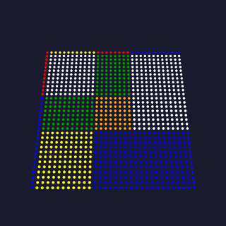

A 3D Rubik's Cube projected onto the volume: it scrambles, then plays its solution back one turn at a time, the six faces in their standard colors.

- `turnsPerSecond`: how fast the cube turns.
- `cubeSize`: the cube order (2×2 up to 8×8).
- `randomTurning`: turn endlessly at random instead of scramble-then-solve.
- `usePalette`: color the faces from the palette, not the classic colors.

Origin: MoonLight · by WildCats08 / [@Brandon502](https://github.com/Brandon502) · via [MoonLight](https://github.com/MoonModules/MoonLight/blob/main/src/MoonLight/Nodes/Effects/E_MoonLight.h)

Detail: [technical](moxygen/RubiksCubeEffect.md)

[Tests](../../reference/tests/unit-tests.md#rubikscubeeffect)

### Fireworks 💫✨ · 2D

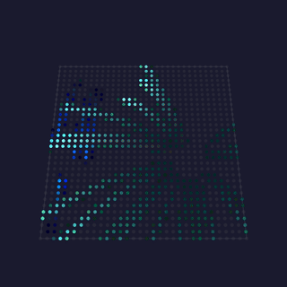

Shells rise, stall, and burst into sparks that arc over and fall. Nothing schedules the apex: the shell decelerates under gravity and bursts when its vertical velocity crosses zero, so a faster launch bursts higher without a second control.

- `launchRate`: how often a new shell goes up.
- `launchSpeed`: how hard it is thrown, and so how high it bursts.
- `gravity`: how fast everything falls, per 60 Hz of simulated time.
- `sparks`: sparks per burst.
- `sparkLife`: how long a spark survives.
- `drag`: air resistance flattening the arc.
- `fade`: trail length (the Layer's decay, not the pool's).

Physics runs on elapsed time, so the same settings behave identically at any frame rate.

Origin: projectMM original, on the WLED Particle System's firework family by Damian Schneider / [@DedeHai](https://github.com/DedeHai)

### Fish Tank 💫🎶✨👾 · 2D

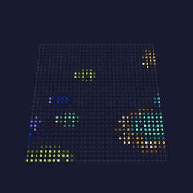

An aquarium on a light wall: fish of three shapes swim across a dark tank, each in its own color from the active palette, tails beating. The art carries shade roles rather than fixed colors, and each fish fills them from its own place on the palette, so one drawing yields as many colorways as there are fish.

- `fish`: how many broad tropical fish (0-8).
- `slim`: how many slender fish (0-8).
- `school`: how many tiny schooling fish (0-8).
- `speed`: swim rate in body-lengths, the same on any grid.
- `spriteSize`: integer magnification; 0 is auto, scaling with the grid.
- `audioReactive`: each sprite follows its own band, so the scene breathes.

Uses the global palette, each fish's band a paler version of its own body color.

Origin: projectMM original; inspired by the aquarium screensavers of the After Dark era, the pixel art drawn fresh for this effect

### Flying Toasters 💫🎶✨👾 · 2D

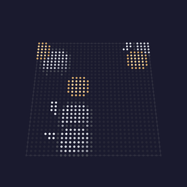

The classic screensaver on a light wall: chrome toasters with flapping wings and slices of toast drift diagonally across the dark, forever. The wing flap carries a per-toaster offset, so the flock never falls into sync.

- `toasters`: how many fly (1–12).
- `toast`: how many slices trail along (0–8).
- `speed`: drift rate in sprite-widths, the same on any grid.
- `spriteSize`: integer magnification for toasters and toast; 0 is auto.
- `audioReactive`: each sprite follows its own band, so the scene breathes.

The sprites carry their own colors (chrome, wing, crust), so the global palette does not apply. Needs a grid at least the toaster's size (12×9).

Origin: projectMM original; inspired by After Dark's Flying Toasters (Berkeley Systems, 1989), suggested by Frank ([softhack007](https://github.com/softhack007)): the pixel art here is drawn fresh for this effect

### FixedPoint 💫🖌️ · 2D

Shapes placed between pixels rather than on them. A clock hand drawn on whole pixels jumps a pixel at a time and reads as broken; the same hand at a fractional position moves smoothly, because a pixel's brightness carries the fraction its position cannot.

- `demo`: which figure, or `all` to cycle them.
    Eleven figures, from a geared clock through a spirograph to boids and a swaying tree.
- `bpm`: how fast the orbits and curves run; the clock keeps its own.
- `fade`: how much of the previous frame survives, which leaves the trail.
- `dwell`: seconds each demo holds before `all` moves on.
- `drift`: how far the scene wanders from center, in pixels; 0 pins it.
- `zoom`: the camera pushes in and settles back; 0 holds it fixed.

Origin: MoonLight (Sutaburosu)

Detail: [technical](moxygen/FixedPointEffect.md)

[Tests](../../reference/tests/unit-tests.md#fixedpointeffect)

### MovingHead 💫🎶🎯 · 1D

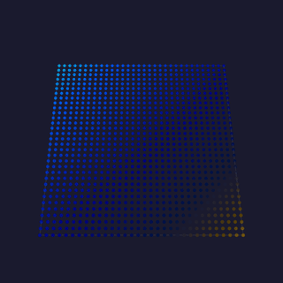

Aims a rig of moving heads as one instrument. Pan and tilt sweep at different rates, so a beam traces a path rather than a line, and `formation` decides how the heads relate.

The first effect that aims a fixture rather than only coloring it.

- `formation`: how the heads relate:
    **fan**, **mirror**, **chase**, **cross** and **unison**.
- `panBpm` / `tiltBpm`: sweep rates. Differing rates trace a path, not a line.
- `panRange` / `tiltRange`: how much of the fixture's travel to use.
- `panCenter` / `tiltCenter`: where the sweep is centered; 128 is the middle.
- `audioReactive`: the beam widens with the room, each head on its own band.
- `gobo` / `rotate`: the beam's wheels, as raw bytes; see the manual.
- `goboOnBeat`: roll a new gobo on a bass hit, then hold it a moment.

A fixture chain is one-dimensional, so lay the rig out as a **1 x N** grid.

Origin: projectMM original

### Pacman 💫🎶✨👾 · 2D

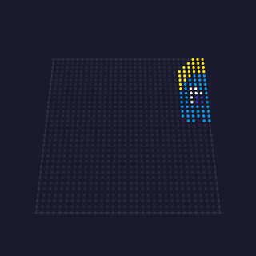

The arcade cast crossing a light wall: Pacman chomps his way along while the four ghosts drift past, each in its own color, wrapping around the edges forever.

In this first iteration the characters travel independently and do not notice each other. The maze, the pellets and the chase are the next step.

- `pacmen`: how many Pacmen (0-4).
- `ghosts`: how many ghosts (0-8); the arcade cast is four.
- `speed`: travel rate in sprite-widths, the same on any grid.
- `spriteSize`: integer magnification; 0 is auto, scaling with the grid.
- `audioReactive`: each sprite follows its own band, so the scene breathes.

Pacman keeps his yellow; the ghosts take their colors from the active palette.

Origin: projectMM original; inspired by Namco's Pac-Man (1980), the pixel art drawn fresh for this effect

### Space Invaders 💫🎵👾 · 2D

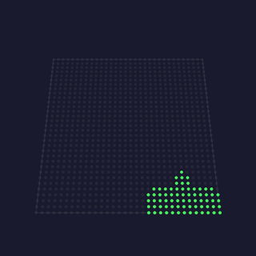

The 1978 formation marching down the wall: five ranks stepping sideways in the two-frame wiggle, dropping a row and reversing at each wall, and speeding up as the ranks thin. That acceleration is the defining mechanic. Invaders fire down, the cannon fires back, and a landing resets the board.

- `marchBpm`: steps per minute when full; it speeds up as the ranks thin.
- `stepX`: how far a step moves the formation sideways, in pixels.
- `dropY`: how far a wall turn drops it, in pixels.
- `size`: magnification per art pixel; 1 on a matrix, 2 or more on a wall.
- `audioReactive`: the formation steps on transients, locking to the track.

The invaders take their body color from the active palette.

Origin: projectMM original, after Taito's Space Invaders (1978)

### Sprite Fountain 💫🎶✨👾 · 2D

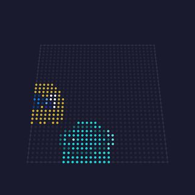

A fountain that throws the project's whole sprite cast: fish, Pacman and his ghosts, toasters and toast, and the three invaders, launched from the floor on a sweeping nozzle and falling back under gravity. The art is shared with the effects that introduced it, so a fix to a fish fixes it in both places.

- `lift`: how hard the nozzle throws; it scales with the grid.
- `pull`: gravity. 3 gives a two-second arc, long enough to read a toaster.
- `rate`: sprites launched per beat of the emit clock.
- `emitBpm`: launches per minute, so the plume's density is a choice.
- `size`: integer magnification per art pixel.
- `audioReactive`: one sprite per band, so the cast maps onto the spectrum.

Colors come from the active palette, one per sprite, held for its whole flight.

Origin: projectMM original

### Pong 💫🎵👾 · 2D

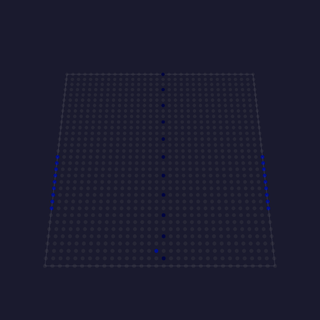

Two paddles rallying a ball, the attract mode of the 1972 original where both players are the machine. A perfect tracker would rally forever and never look like a game, so each paddle has a reaction delay and a small aiming error, re-rolled every exchange. That is what produces the occasional point.

- `rallyBpm`: ball crossings per minute, the same time on any grid.
- `paddle`: length as a percentage of the court; short paddles miss more.
- `reflex`: how sharply a paddle chases. Below full it lags a fast ball.
- `size`: integer magnification, when the ball is a sprite.
- `spriteBall`: swap the square for a sprite, re-picked on every hit.
- `audioReactive`: the ball advances only on the beat, in time with the track.

Uses the global palette.

Origin: projectMM original, after Atari's Pong (1972)

### Aurora 💫🖌️🌫️🎡 · 3D

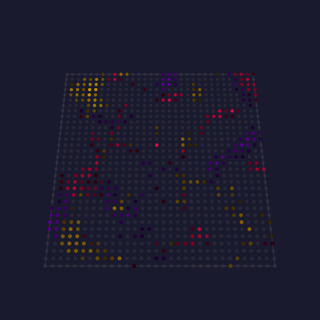

Several noise fields, each on its own clock, read in polar coordinates and composited into curtains of light. Nothing is simulated: layers of one field at different scales interfere, and that is what reads as curtains folding through one another. The strongest layer at each pixel wins, so they stay distinct rather than averaging into haze.

- `speed`: master rate; every layer scales from it, and 0 freezes it.
- `scale`: noise cells across the grid; low is broad, high is fine.
- `layers`: how many fields are composited, and the main cost knob.
- `warp`: how far the field displaces its own angle, folding a curtain over.
- `twist`: how much the radius shears the angle, giving the curtains their lean.
- `segments`: kaleidoscope wedges; 1 leaves the composition unfolded.
- `contrast`: how much of the field lights; low is cloud, high is sharp.
- `octaves`: detail within each layer, multiplying the cost knob.
- `polarTable`, `polarTable16`: as PolarNoise above.

Origin: projectMM original, in the shader vocabulary Stefan Petrick made recognizable in the LED world

### Ballpit 💫✨ · 2D

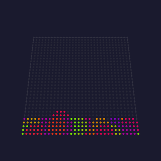

Falling balls that pile up and shove each other aside. The heap is emergent: gravity pulls, the floor stops, and contact between neighbors makes the shape. `tilt` turns the pit into a slope and the pile slides and re-settles.

- `balls`: how many share the pit.
- `gravity`: how hard they fall.
- `size`: contact radius in pixels: how far apart balls sit when touching.
- `bounce`: restitution: how much speed a contact keeps.
- `tilt`: sideways force, turning the pit into a slope.
- `drag`: damping, so the heap settles instead of sloshing.

Collisions are the one non-linear part of the particle kernel, so the pool is small.

Origin: projectMM original, on the WLED Particle System's ballpit family by Damian Schneider / [@DedeHai](https://github.com/DedeHai)

### Dissolve 💫 · 2D

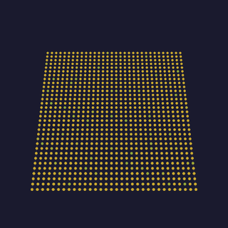

Two color fields trade places pixel by pixel in an order that looks random but is computed, so the transition needs no per-pixel state and no shuffled index list. Two devices rendering the same frame dissolve identically without exchanging anything.

- `bpm`: how fast one transition completes.
- `spread`: how long pixels spend mid-flight; 0 gives a hard edge.
- `eased`: ease the progress instead of sweeping linearly.
- `scatter`: random order; off gives a positional wipe from the same code.

Origin: projectMM original, on the classic dissolve transition in its position-addressed (shader) form

### Echo 💫✨ · 2D

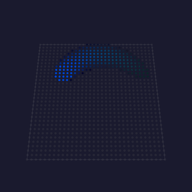

The previous frame fed back through a zoom and rotation, dimmed, with a bright source drawn on top: trails that spiral away from themselves, like a camera pointed at its own monitor.

- `bpm`: how fast the source orbits.
- `zoom`: how much the feedback grows each frame.
- `rotate`: rotation per frame, which turns the trail into a spiral.
- `decay`: how fast the echo fades; higher is a shorter trail.
- `size`: radius of the bright source.

Shows that feedback is not a primitive: once the grid can be read as a texture (`sampleWrap`), the whole family of trails, zoom blur and smear is a few lines.

Origin: projectMM original, on video feedback and the standard texture-feedback shader shape

### Spectrum 💫🎶 · 2D

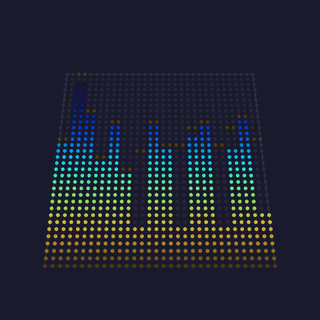

An audio analyser with real meter ballistics: bars rise fast enough to catch a transient and fall slowly enough to read, and a peak dot marks the recent maximum and drifts down.

- `attack`: how fast a bar rises toward a new level.
- `release`: how fast it falls back.
- `peakDecay`: how fast the peak dot drifts down.
- `showPeaks`: draw the floating peak dots.
- `colorByColumn`: color per band instead of by height.

The asymmetry is the whole point; a symmetric follower either misses the hit or flickers.

Origin: projectMM original, on standard VU/PPM meter ballistics and WLED's GEQ band mapping

### Truchet 💫🖌️ · 2D

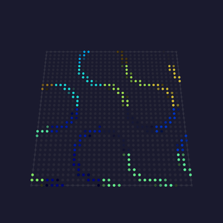

A maze of interlocking arcs that never repeats, drawn without storing a single tile. Randomly turned tiles join into continuous winding paths across the surface: the pattern looks designed, and nothing designed it.

- `bpm`: how fast the pattern drifts.
- `scale`: tiles across the short side.
- `thickness`: how fat the arcs are.
- `softness`: edge softness: the anti-aliasing width.
- `shuffle`: reshuffles which way the tiles face.
- `drift`: slide the pattern instead of holding still.

**The representative 2D shader**: no 3D, no rays, no float, and cheap on any target.

Origin: projectMM original, on Sébastien Truchet's 1704 tiling and the standard shader fract/hash/smoothstep idiom

### Fluid 💫🖌️🌊💨 · 3D

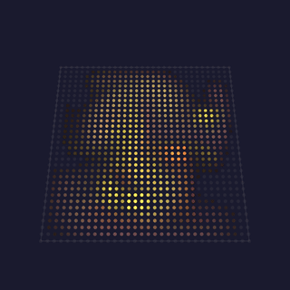

Light poured into a simulated medium and carried by it. Every other flow here is a function of position and time; this one is state, so a jet fired now changes where everything downstream goes for seconds afterwards.

- `jets`: how many places light is poured in.
- `force`: how hard each one pushes the medium.
- `swirl`: how fast the jets sweep, which is what stirs vortices.
- `viscosity`: how much the medium drags on itself; high is syrup, low smoke.
- `persistence`: how long dye survives, as a half-life.
- `iterations`: pressure-solve effort, and the cost knob.

On a cube every depth slice is its own medium, so the slices differ. Sized for the desktop and the P4.

Origin: projectMM original, after Stam 1999 "Stable Fluids"

### Nebula 💫🖌️💨🌫️ · 3D

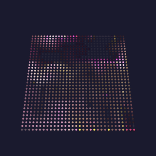

A noise field decides where light is born, a curl flow decides where it goes, and between them the cloud keeps folding into itself. The emitter is a field rather than a handful of dots, so light enters everywhere at once and the flow shapes a whole cloud instead of drawing trails.

- `speed`: how fast the medium moves, and with it the whole cloud.
- `scale`: the field's cell size; low is broad clouds, high is wisps.
- `contrast`: what fraction of the field is bright enough to be born.
- `persistence`: how long light survives once it is in the flow, as a half-life.
- `octaves`: detail within the field, and its cost knob.
- `fieldScale`: compute the field at half or quarter resolution and stretch it.
- `fieldRate`: recompute the field every N frames; the flow still runs each one.

Held at 16 bits and dithered on the way out, which keeps a slow fade smooth.

Origin: projectMM original, composing the noise-field and curl-flow kernels: the contrast window is Aurora's, in the shader vocabulary Stefan Petrick made recognizable in the LED world, and the flow is Bridson's curl noise (SIGGRAPH 2007)

### Trails 💫🖌️💨🌫️ · 3D

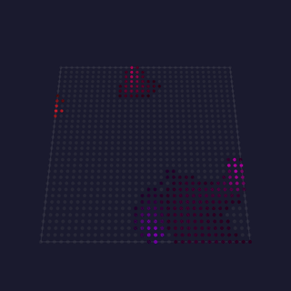

Dots thrown into a moving medium, leaving tails the flow carries and bends. Nothing draws a tail: it is the previous frames' dots, transported along a velocity field and dimmed, which is why the flow's shape is visible in it. On a cube each depth slice gets its own flow.

- `speed`: how fast the medium moves, and with it every tail.
- `dots`: how many emitters are throwing light in.
- `scale`: the flow field's cell size; low is broad sweeps, high is eddies.
- `persistence`: how long a tail survives, as a half-life.
- `breathe`: how much the flow's strength rises and falls.

The trail plane is 16-bit, which is what lets a tail fade smoothly rather than stepping.

Origin: projectMM original, in the flow-field idiom (4wheeljive's FlowFields, from a Stefan Petrick concept), with Stam's backward advection for the transport

### Tunnel 💫🖌️🌫️🎡 · 3D

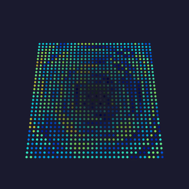

A texture mapped onto the inside of an infinite tube, so the viewer appears to fly down it forever. Nothing is 3D: the angle around the center is one texture coordinate and the reciprocal of the distance is the other, which is perspective for the price of a divide.

- `bpm`: how fast the tunnel flies past.
- `depth`: texture scale along the tunnel; higher is finer rings.
- `twist`: rotation per unit depth, so the tunnel corkscrews.
- `segments`: kaleidoscope the wall; 1 leaves it plain.
- `octaves`: wall texture detail, and the cost knob.
- `vignette`: darken toward the vanishing point so it reads as receding.

Origin: projectMM original, on the standard demoscene tunnel

### VectorBalls 💫🖌️ · 2D

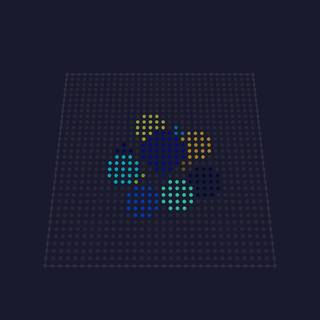

A rotating 3D object drawn as shaded spheres, the demoscene classic that named the technique. The smallest complete demonstration of putting 3D on a panel: rotate, project, sort back to front, shade by distance, draw.

- `bpm`: rotation speed.
- `size`: ball radius at the object's center, in pixels.
- `spread`: how far apart the balls sit.
- `distance`: how far the object is from the viewer.
- `fade`: dim the far balls, which is what reads as depth.

Without painter's ordering a far ball paints over a near one and the object turns inside out.

Origin: projectMM original, on the Amiga-era demoscene vector-ball effect

### WaterRipple 💫🧬 · 2D

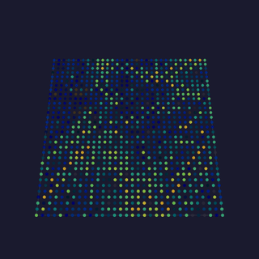

A propagating wave simulation: drops land, their rings spread outward, reflect off the edges and interfere where they cross. The crossing is what a drawn ripple cannot fake, because two rings meeting have to add and cancel.

- `speed`: simulation steps per second: how fast the water itself moves.
- `dropRate`: how often drops land, in time rather than per frame.
- `damping`: how fast waves lose energy; higher is calmer water.
- `strength`: how hard a drop hits.
- `colorByHeight`: color by height, so crests and troughs read differently.
- `hueBase` / `hueSpread`: where the still surface sits, and how far waves go.

Distinct from [Ripples](#ripples), which draws clean concentric circles; this behaves like water.

Origin: projectMM original, on Hugo Elias's water surface algorithm

### Raymarch 💫🖌️ · 2D

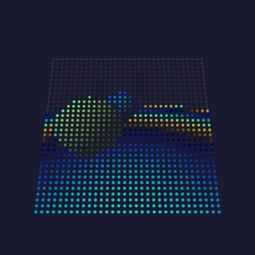

A lit 3D scene rendered by marching a ray through a distance field, one ray per pixel. Nothing draws a sphere: the scene is a function returning the distance to the nearest surface, and the spheres emerge where each ray stops.

- `bpm`: how fast the scene animates.
- `steps`: ray marching steps: the quality and cost knob.
- `blend`: how much the two spheres melt into each other.
- `cameraY`: camera height above the floor.
- `showFloor`: include the ground plane.

Compiled only where the chip has a hardware FPU. Cost is per pixel, so `steps` trades quality against it.

Origin: projectMM original, on Iñigo Quilez's raymarching and distance-function articles

### PolarNoise 💫🖌️🌫️🎡 · 3D

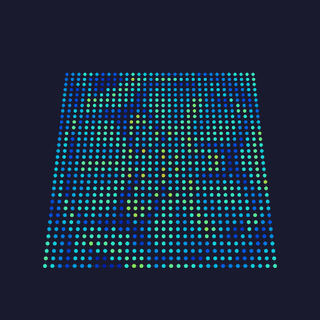

A warped noise field addressed by angle and radius, folded into a kaleidoscope. The field turns and breathes around the center rather than scrolling past it.

- `bpm`: how fast the field drifts.
- `scale`: noise cells across the grid; low is broad, high is fine detail.
- `segments`: kaleidoscope wedges; 1 disables the fold.
- `warp`: domain-warp strength; 0 gives a plain field.
- `octaves`: fbm octaves, and the main cost knob.
- `twist`: how much the radius shears the angle, setting the spiral.
- `polarTable`: read each pixel's angle and radius from a table, 2 bytes each.
- `polarTable16`: hold that table at full precision, at 4 bytes per pixel.

Cost scales with `octaves` and `warp`: at `warp` > 0 and `octaves` 2 it is roughly 4 noise samples per pixel. On a large wall set `octaves` to 1 or `warp` to 0, which degrades to a plain polar noise that still reads well.

Origin: projectMM original, after Stefan Petrick's polar/noise vocabulary and Iñigo Quilez's domain warping

### SdfShapes 💫🖌️ · 2D

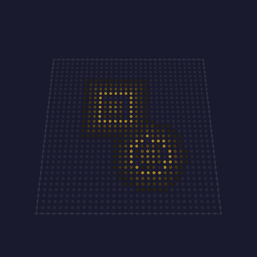

A circle and a box orbit and melt into each other, drawn as signed distance fields rather than outlines. One distance per pixel yields three looks at once: a smooth fill, an outline, and a glow falling off into the field.

- `bpm`: orbit speed.
- `radius`: circle radius, as a fraction of the short side.
- `boxSize`: box half-extent, same scale.
- `blend`: melt radius; 0 unions the shapes hard.
- `outline`: 0 fills the shape; higher draws an outline of that width.
- `glow`: tint the field around the shape by distance.

Measured on an ESP32-S3 at 128×128: 20 fps, 728 cycles/pixel using the true-distance form, alongside StarSky (692) and Metaballs (647) at the same size.

Origin: projectMM original, after Iñigo Quilez's distance-function catalogue and polynomial smooth-minimum (iquilezles.org)

### Solid 💫 · 3D

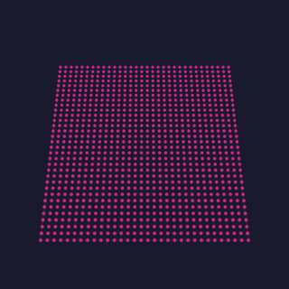

A flat fill with five color modes: a plain RGB(W) color, the active palette spread across the lights, an RMS-averaged single palette color, or the palette banded along the grid's rows or columns.

- `red` / `green` / `blue` / `white`: the flat color in `RGB(W)` mode.
- `brightness`: scales the flat and palette-spread output.
- `colorMode`: flat `RGB(W)`, or the palette spread, averaged, or banded.
- `minRGB`: in the band modes, drop palette entries darker than this floor.
- `randomColors`: in the band modes, shuffle the surviving palette entries.

Origin: MoonLight · via [MoonLight](https://github.com/MoonModules/MoonLight/blob/main/src/MoonLight/Nodes/Effects/E_MoonLight.h)

Detail: [technical](moxygen/SolidEffect.md)

[Tests](../../reference/tests/unit-tests.md#solideffect)

### SphereMove 💫 · 3D

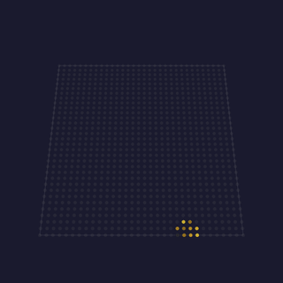

A hollow spherical shell that bounces through the 3D volume, its surface colored from the palette, leaving no trail.

- `speed`: how fast the sphere moves through the volume.

Origin: MoonLight · via [MoonLight](https://github.com/MoonModules/MoonLight/blob/main/src/MoonLight/Nodes/Effects/E_MoonLight.h)

Detail: [technical](moxygen/SphereMoveEffect.md)

[Tests](../../reference/tests/unit-tests.md#spheremoveeffect)

### Spiral 💫🦅🖌️🎡 · 2D

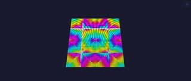

Rotating spiral from angle + distance (`atan2_8`/`dist8`).

- `bpm`: rotation speed.
- `twist`: how tightly the arm winds (hue gain per unit of distance).
- `hue_shift`: rotate the palette index.

Origin: projectMM original (rotating spiral)

Detail: [technical](moxygen/SpiralEffect.md)

[Tests](../../reference/tests/unit-tests.md#spiraleffect)

### StarField 💫🖌️ · 2D

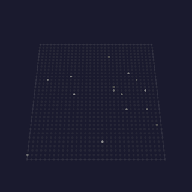

A perspective starfield: stars approach the viewer from a vanishing point, brightening as they near, then respawn at depth.

- `speed`: how fast stars approach (frame throttle).
- `numStars`: how many stars are active.
- `blur`: motion-trail fade per frame.
- `usePalette`: color the stars from the palette instead of white.

Origin: MoonLight · by [@Brandon502](https://github.com/Brandon502), inspired by Daniel Shiffman / [Coding Train](https://www.youtube.com/watch?v=17WoOqgXsRM) · via [MoonLight](https://github.com/MoonModules/MoonLight/blob/main/src/MoonLight/Nodes/Effects/E_MoonLight.h)

Detail: [technical](moxygen/StarFieldEffect.md)

[Tests](../../reference/tests/unit-tests.md#starfieldeffect)

### StarSky 💫 · 3D

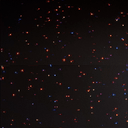

Twinkling stars at random light positions, each fading in and out independently over a dark background.

- `speed`: fade rate per frame (how fast each star brightens/dims).
- `star_fill_ratio`: how many stars (as a fraction of the light count).
- `usePalette`: color the stars from the active palette instead of white.

Origin: MoonLight · by [limpkin](https://github.com/limpkin) · via [MoonLight](https://github.com/MoonModules/MoonLight/blob/main/src/MoonLight/Nodes/Effects/E_MoonLight.h)

Detail: [technical](moxygen/StarSkyEffect.md)

[Tests](../../reference/tests/unit-tests.md#starskyeffect)

### Text 💫 · 2D

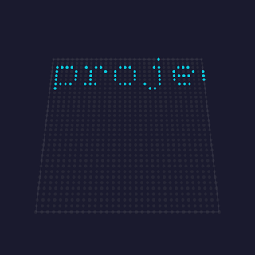

Renders a multi-line string in a bitmap font. Static by default (laid out top-left, each newline dropping one font-height, clipped where it runs off the grid); turn on `scroll` to march the whole block leftwards as a wrapping marquee. Text color comes from the active palette.

- `text`: the string to show; each line renders on its own row.
- `scroll`: off (default) = static; on = horizontal marquee.
- `font`: glyph size (`4x6` compact, `6x8` larger).
- `speed`: marquee speed (only used when `scroll` is on).
- `hue`: palette index for the text color.

Origin: projectMM original, on MoonLight's Scrolling Text · via [MoonLight](https://github.com/MoonModules/MoonLight/blob/main/src/MoonLight/Nodes/Effects/E_MoonLight.h)

Detail: [technical](moxygen/TextEffect.md)

[Tests](../../reference/tests/unit-tests.md#texteffect)

## MoonModules effects

### GameOfLife 💫🌙🧬 · 2D/3D

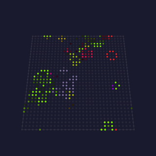

Conway's cellular automaton generalized to 2D and 3D, with selectable rulesets and custom `B#/S#`. Cells inherit a neighbor's palette color on birth, dead cells blur toward the background, and the board wraps toroidally. A stasis check respawns a pentomino or glider when the board goes static.

- `backgroundColorR` / `G` / `B`: the color dead cells fade toward.
- `ruleset`: the birth and survive rule: Conway, HighLife, Maze and others.
- `customRuleString`: a custom `B#/S#` rule, read only when `ruleset` = Custom.
- `GameSpeed (FPS)`: generation rate (0–100, 100 = uncapped).
- `startingLifeDensity`: % of cells alive at start (10–90).
- `mutationChance`: % chance a newborn gets a random color (0–100).
- `wrap`: toroidal edges (cells wrap around).
- `disablePause`: skip the 1.5 s settle pause between boards.
- `colorByAge`: age from green to red, not a neighbor's palette color.
- `infinite`: respawn on stasis (R-pentomino/glider) instead of resetting.
- `blur`: dead-cell fade strength toward the background color.

Origin: MoonModules · by Ewoud Wijma (2022), mods by Brandon Butler / [@Brandon502](https://github.com/Brandon502) · [natureofcode](https://natureofcode.com/book/chapter-7-cellular-automata/) · via [MoonLight](https://github.com/MoonModules/MoonLight/blob/main/src/MoonLight/Nodes/Effects/E_MoonModules.h)

Detail: [technical](moxygen/GameOfLifeEffect.md)

[Tests](../../reference/tests/unit-tests.md#gameoflifeeffect)

### GEQ 💫🐙🎶 · 2D

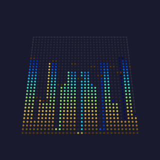

 <!-- preview: WLED-Utils (scottrbailey), WLED FX 139; replace with our own capture once bench-verified -->

A flat graphic equaliser: the 16 audio bands rise as vertical bars from the bottom, with optional smoothing between bars, per-bar palette coloring, and falling peak markers.

- `fadeOut`: how fast bars fade each frame.
- `ripple`: falling-peak marker decay.
- `colorBars`: color each bar from the palette by band instead of by row.
- `smoothBars`: blend neighboring bands for smoother bar heights.

Origin: WLED (audio) · by Andrew Tuline (WLED-SR) · via [MoonLight](https://github.com/MoonModules/MoonLight/blob/main/src/MoonLight/Nodes/Effects/E_WLED.h)

Detail: [technical](moxygen/GEQEffect.md)

[Tests](../../reference/tests/unit-tests.md#geqeffect)

### GEQ3D 💫🌙🎶 · 2D

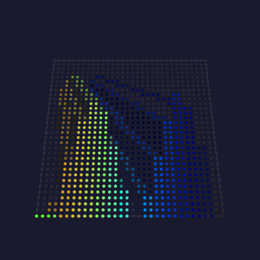

A 3D-perspective graphic equaliser: audio bands rise as bars with faked depth, their side/top lines drawn toward a "projector" vanishing point (sweeping left↔right) and shortened by `depth`. Bands left of the projector are painted right-to-left, bands right of it left-to-right; per-face darkening (side/top/front) and optional `borders`.

- `speed`: projector sweep rate (1–10, higher = faster).
- `frontFill`: bar front-face fill strength (0–255).
- `horizon`: vanishing-point row the projector sits on.
- `depth`: how far the side/top perspective lines reach toward the projector.
- `numBands`: bands shown (2–16, fewer = wider bars).
- `borders`: outline each bar.

Origin: MoonModules (audio) · by [@TroyHacks](https://github.com/troyhacks) (GPLv3) · via [MoonLight](https://github.com/MoonModules/MoonLight/blob/main/src/MoonLight/Nodes/Effects/E_MoonModules.h)

Detail: [technical](moxygen/GEQ3DEffect.md)

[Tests](../../reference/tests/unit-tests.md#geq3deffect)

### PaintBrush 💫🌙🎶 · 3D

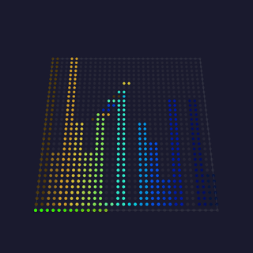

Audio-reactive brush strokes: lines whose 3D endpoints oscillate on the beat (`beatsin8`, audio-band timebase), each stroke shortened to a band-magnitude length so the moving tip sweeps a curve over the fading field.

- `oscillatorOffset`: phase-spread between the oscillating endpoints (0–16).
- `numLines`: parallel animated strokes (2–255).
- `fadeRate`: background decay per frame (0–128, higher = shorter strokes).
- `minLength`: a stroke draws only if longer than this, so quiet bands stay off.
- `color_chaos`: per-line random hue vs a per-band gradient.
- `phase_chaos`: random per-frame phase jitter.

Origin: MoonModules (audio) · by [@TroyHacks](https://github.com/troyhacks) (GPLv3) · via [MoonLight](https://github.com/MoonModules/MoonLight/blob/main/src/MoonLight/Nodes/Effects/E_MoonModules.h)

Detail: [technical](moxygen/PaintBrushEffect.md)

[Tests](../../reference/tests/unit-tests.md#paintbrusheffect)

### Tetrix 💫🌙✨ · 2D

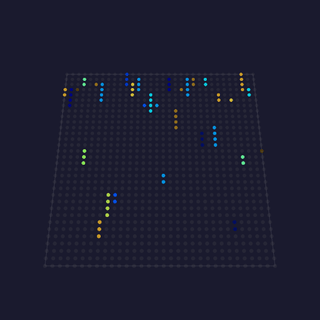

Falling Tetris-style blocks: each column drops a brick that lands on the growing stack, fills the column, then clears and restarts.

- `speed`: fall speed (0 = randomised per brick).
- `width`: brick height (0 = randomised).
- `oneColor`: one advancing palette color for every brick, not one each.

Origin: WLED · by Andrew Tuline (WLED-SR) · via [MoonLight](https://github.com/MoonModules/MoonLight/blob/main/src/MoonLight/Nodes/Effects/E_WLED.h)

Detail: [technical](moxygen/TetrixEffect.md)

[Tests](../../reference/tests/unit-tests.md#tetrixeffect)

## WLED effects

### Blurz 🐙🎶 · 2D

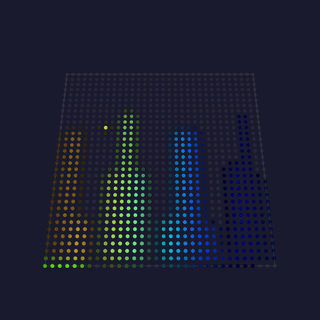

 <!-- preview: WLED-Utils (scottrbailey), WLED FX 163; replace with our own capture once bench-verified -->

Audio-reactive blurred dots: one frequency band per frame lights a dot whose position maps to that band (or to the major-peak frequency), then the whole frame is blurred for soft trails.

- `fadeRate`: background decay per frame.
- `blur`: blur strength applied each frame.
- `freqMap`: place the dot by the major-peak frequency, not by scanning.
- `geqScanner`: scan the dot across the strip in a GEQ-like sweep.

Origin: WLED (audio) · by Andrew Tuline (WLED-SR), enhancements by [@softhack007](https://github.com/softhack007) · via [MoonLight](https://github.com/MoonModules/MoonLight/blob/main/src/MoonLight/Nodes/Effects/E_WLED.h)

Detail: [technical](moxygen/BlurzEffect.md)

[Tests](../../reference/tests/unit-tests.md#blurzeffect)

### BouncingBalls 💫🐙 · 2D

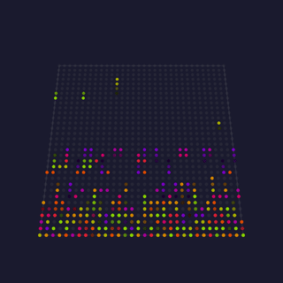

 <!-- preview: WLED-Utils (scottrbailey), WLED FX 91; replace with our own capture once bench-verified -->

A row of balls per column bounce under gravity, each losing energy on impact and relaunching when it stops, palette-colored by ball index over a fading background.

- `grav`: gravity strength (higher = faster fall, snappier bounce).
- `numBalls`: balls per column (1–16).

Origin: WLED · by Andrew Tuline (WLED-SR) · via [MoonLight](https://github.com/MoonModules/MoonLight/blob/main/src/MoonLight/Nodes/Effects/E_WLED.h)

Detail: [technical](moxygen/BouncingBallsEffect.md)

[Tests](../../reference/tests/unit-tests.md#bouncingballseffect)

### FreqMatrix 🐙🎶 · 1D

 <!-- preview: WLED-Utils (scottrbailey), WLED FX 138; replace with our own capture once bench-verified -->

A 1D scrolling frequency display: each frame shifts the strip and injects a new pixel at one end whose hue comes from the dominant frequency and whose brightness from the volume.

- `speed`: scroll rate.
- `fx`: sound-effect intensity (scales the injected brightness).
- `lowBin` / `highBin`: the frequency window mapped across the hue range.
- `sensitivity`: input gain (10–100).
- `audioSpeed`: let the volume modulate the scroll speed.

Origin: WLED (audio) · by Andrew Tuline (WLED-SR) · via [MoonLight](https://github.com/MoonModules/MoonLight/blob/main/src/MoonLight/Nodes/Effects/E_WLED.h)

Detail: [technical](moxygen/FreqMatrixEffect.md)

[Tests](../../reference/tests/unit-tests.md#freqmatrixeffect)

### Lissajous 🐙 · 2D

 <!-- preview: WLED-Utils (scottrbailey), WLED FX 176; replace with our own capture once bench-verified -->

A Lissajous curve traced across the grid from two phase-shifted `sin8`/`cos8` sweeps, palette-colored along its length, with a fading trail.

- `xFrequency`: the x-axis sweep frequency (sets the curve's lobe count).
- `fadeRate`: trail fade per frame.
- `speed`: how fast the curve's phase advances.

Origin: WLED · by Andrew Tuline (WLED-SR) · via [MoonLight](https://github.com/MoonModules/MoonLight/blob/main/src/MoonLight/Nodes/Effects/E_WLED.h)

Detail: [technical](moxygen/LissajousEffect.md)

[Tests](../../reference/tests/unit-tests.md#lissajouseffect)

### NoiseMeter 🐙🎵🌫️ · 3D

 <!-- preview: WLED-Utils (scottrbailey), WLED FX 136; replace with our own capture once bench-verified -->

An audio VU meter rendered as a noise bar: the volume sets how many rows light from the bottom, each row colored by drifting Perlin noise, filling the full width and depth.

- `fadeRate`: trail decay per frame (200–254).
- `width`: how strongly the volume drives the bar height.

Origin: WLED (audio) · by Andrew Tuline (WLED-SR) · via [MoonLight](https://github.com/MoonModules/MoonLight/blob/main/src/MoonLight/Nodes/Effects/E_WLED.h)

Detail: [technical](moxygen/NoiseMeterEffect.md)

[Tests](../../reference/tests/unit-tests.md#noisemetereffect)

### Wave 💫🌫️ · 2D

An oscilloscope waveform scrolls across the grid with a fading trail; six selectable shapes.

- `bpm`: travel speed (phase advance per minute).
- `fade`: trail fade per frame (0 = instant clear, 255 = long tail).
- `type`: waveform shape: sawtooth, triangle, sine, square, sin3 or noise.

Origin: MoonLight · by Ewoud Wijma · via [MoonLight](https://github.com/MoonModules/MoonLight/blob/main/src/MoonLight/Nodes/Effects/E_MoonLight.h)

Detail: [technical](moxygen/WaveEffect.md)

[Tests](../../reference/tests/unit-tests.md#waveeffect)

## FastLED effects

### Fire ⚡️🦅🧬 · 2D

A Fire2012-style heat field: sparks at the base rise and cool through the active palette, coldest at its low end. The spark count scales with the width.

- `cooling`: how fast heat dissipates as it rises (higher = shorter flames).
- `sparking`: chance of a new spark at the base each frame; higher is livelier.

The flame color comes from the **active palette**. For the classic fire look pick the **Lava** palette (black→red→orange→yellow→white: the recommended default); any palette works, so an Ocean or Forest palette turns the flame blue or green.

Origin: FastLED / MoonLight · Mark Kriegsman's Fire2012; MoonLight adapts [MatrixFireFast](https://github.com/toggledbits/MatrixFireFast) (toggledbits)

Detail: [technical](moxygen/FireEffect.md)

[Tests](../../reference/tests/unit-tests.md#fireeffect)

### Noise ⚡️💫🌙🐙🌫️ · 1D/2D/3D

A gradient-noise field indexed straight into the palette: the plainest way to turn the field into light, and the effect every other noise effect is a variation on.

- `motion`: `drift` slides the field across the fixture, `morph` changes it.
- `scale`: spatial frequency: low is broad blobs, high is fine detail.
- `bpm`: how fast it moves.

Origin: FastLED · inoise field (Mark Kriegsman); the `morph` form from WLED via [MoonLight](https://github.com/MoonModules/MoonLight/blob/main/src/MoonLight/Nodes/Effects/E_WLED.h), which shipped it as a separate Noise2D effect until the two were merged

Detail: [technical](moxygen/NoiseEffect.md)

[Tests](../../reference/tests/unit-tests.md#noiseeffect)

## projectMM-native effects

### MoonLive 📝 · any

An effect you write as text on the running device, compiled to native code on the next tick. Pick a script from the library or write your own, and it renders at the speed of a compiled effect. The language is [MoonLive](moonlive.md).

- `script`: which `.mle` file runs, picked from the library and edited here.
- Every control the script declares, editable live without a recompile.

Origin: projectMM original, on the native-codegen approach of [ESPLiveScript](https://github.com/hpwit/ESPLiveScript) by Yves Bazin

Detail: [technical](moxygen/MoonLiveEffect.md) · [what the card reports](#moonlive-details)

[Tests](../../reference/tests/unit-tests.md#moonlive)

### AudioSpectrum 💫🎶

The 16 mic frequency bands spread across X, each column lit bottom-up by its magnitude.

- `colorMode`: bars colored by `height`, the VU look, or `per-band`, a rainbow.

Origin: projectMM original, on the WLED-SR GEQ / spectrum concept (Andrew Tuline) · via [MoonLight](https://github.com/MoonModules/MoonLight/blob/main/src/MoonLight/Nodes/Effects/E_WLED.h)

Detail: [technical](moxygen/AudioSpectrumEffect.md)

[Tests](../../reference/tests/unit-tests.md#audioservice)

### BeatRipples 💫🎶🖌️ · 2D

Every beat is a stone dropped in water. A real wave simulation, which gives what a drawn expanding circle cannot: ripples that pass through each other, reflect off the walls and interfere into standing patterns. The loudest band decides where the stone lands, so a bass hit falls near the center and a treble hit out at the rim, and its strength sets how deep.

- `damping`: how long the water keeps ringing.
- `drop`: how deep a beat's stone falls.
- `rain`: idle drops when there is no music, so the surface is alive in silence.
- `shine`: how strongly the slope lights the surface.

Origin: projectMM original, the two-buffer water simulation (Gomez 2000) driven by the onset detector

### VuMeters 💫🎶🖌️ · 3D

Sixteen needles, one per band, each with real mass. What makes a VU meter beautiful is not the dial, it is the needle: it overshoots a peak, swings back and settles, which is why a mechanical meter reads as alive where a bar graph reads as a readout.

The bass needles are heavier than the treble ones, so the low end swings and the high end flickers.

- `damping`: how much the needle overshoots; high is a studio meter.
- `response`: how hard the needle chases the signal at all.
- `peakHold`: how long the peak marker stays up, as a half-life.
- `smooth`: drive from the meter ballistic rather than the raw band.

Origin: projectMM original, on the VU ballistics of IEC 60268-17

### RadialSpectrum 💫🎶🖌️🎡 · 3D

The spectrum as ripples. Each band owns a sector around the center, mirrored left and right with the bass at top and bottom. Sound is born at the center and travels outward, so the radius is time and a ring's length is that band's recent history. Every sector is one band, so a band that is stuck shows as a sector that never moves. On a cube the ripples are expanding shells.

- `speed`: how fast sound travels outward, a ring every 10 to 105 ms.
- `persistence`: how far out a ripple stays visible.
- `smooth`: read the meter ballistic rather than the raw bands.
- `beat`: a white shockwave born at the center on every onset.
- `polarTable`, `polarTable16`, `mapping`: the polar address, and its shape.

Origin: projectMM original, the radial spectrogram on `PolarLut` and the onset detector

### DemoReel 💫 · 3D

Plays every other registered effect in turn, auto-advancing on a timer, so one Layer cycles the whole library hands-free. New effects are picked up automatically. It can pick a fresh palette each cycle and overlay the playing effect's name, and the status line says which is playing. It never hosts itself, and it plays in sequence rather than compositing.

- `interval`: seconds each effect plays before advancing (1–120).
- `shuffle`: jump to a random next effect instead of registry order.
- `randomPalette`: pick a random palette on each cycle; on by default.
- `showName`: overlay the playing effect's name in a small font; default on.

Origin: FastLED · Mark Kriegsman's [DemoReel100](https://github.com/FastLED/FastLED/blob/master/examples/DemoReel100/DemoReel100.ino); projectMM reel

Detail: [technical](moxygen/DemoReelEffect.md)

[Tests](../../reference/tests/unit-tests.md#demoreeleffect)

### NetworkReceive 📡🌙

Receives lights over UDP and writes them into the layer: the receive side for Resolume, Madrix, xLights and LedFx.

- `universe_start`: the first incoming universe to map, mirroring the sender.
- `channels_per_universe`: bytes each universe maps to; 510 or 512.

Origin: projectMM original (E1.31 / Art-Net receive)

Detail: [technical](moxygen/NetworkReceiveEffect.md)

[Tests](../../reference/tests/unit-tests.md#networkreceiveeffect)

Listens for Art-Net, E1.31 and DDP at once. The end-to-end pair with [Network Send](drivers.md).

### Sine 💫 · 3D

R/G/B each follow a sine along one axis at 120° phase offset: a glowing, scrolling color box.

- `frequency`: spatial frequency, waves across the box (1–20).
- `amplitude`: peak brightness (0–255, 255 = full).
- `bpm`: scroll speed.

Origin: MoonLight (Sinus, AI-generated) · via [MoonLight](https://github.com/MoonModules/MoonLight/blob/main/src/MoonLight/Nodes/Effects/E_MoonLight.h)

Detail: [technical](moxygen/SineEffect.md)

[Tests](../../reference/tests/unit-tests.md#sineeffect)

### Aurora 💫🖌️🌫️🎡 · 3D

Layers of one noise field at different scales, moved by different oscillators and composited. The interference between them reads as curtains folding through each other. No aurora is simulated: this is the shader idiom rather than a picture.

- `speed`: how fast the layers move.
- `scale`: the field's spatial frequency.
- `layers`: how many are composited.
- `warp`: how far the field bends before sampling.
- `twist`: rotation applied with radius.
- `segments`: kaleidoscopic repeats around the center.
- `contrast`: how hard the composite pushes toward black and white.
- `octaves`: how much fine detail the field carries.

Origin: projectMM original, on the shader vocabulary Stefan Petrick made recognizable in the LED world

Detail: [technical](moxygen/AuroraEffect.md)

[Tests](../../reference/tests/unit-tests.md#auroraeffect)

### Ballpit 💫✨ · 2D

Falling balls that pile up and push each other aside. Gravity pulls them down, the floor stops them, and contact between neighbors does the rest, so the heap's shape is whatever the collisions produce.

- `balls`: how many are in play.
- `gravity`: downward acceleration.
- `size`: ball radius.
- `bounce`: how much energy a collision returns.
- `tilt`: which way the floor leans.
- `drag`: how fast motion bleeds away.

Origin: projectMM original, on the WLED Particle System's ballpit family

Detail: [technical](moxygen/BallpitEffect.md)

### BeatRipples 💫🎶🖌️ · 2D

A wave surface where every detected beat drops a stone. Ripples pass through each other, reflect off the walls and interfere into standing patterns, and between beats the surface keeps ringing on its own.

- `damping`: how fast the surface settles.
- `drop`: the size of a beat's stone.
- `rain`: stones dropped without a beat.
- `shine`: how hard the slope reads as light.

Origin: projectMM original, on the two-buffer water effect the demoscene settled on (Gomez, 2000)

Detail: [technical](moxygen/BeatRipplesEffect.md)

[Tests](../../reference/tests/unit-tests.md#beatrippleseffect)

### Dissolve 💫 · 2D

Two color fields trading places pixel by pixel. The order looks random but is computed: each pixel asks a hash of its own position for a threshold and compares it against the progress, so there is no array, no shuffle and no per-pixel state.

- `bpm`: how fast the two fields trade.
- `spread`: how wide the transition front is.
- `eased`: soften the progress curve.
- `scatter`: how scrambled the order looks.

Origin: projectMM original, on the classic dissolve in its position-addressed shader form

Detail: [technical](moxygen/DissolveEffect.md)

### Echo 💫✨ · 2D

The previous frame fed back through a zoom and a rotation, dimmed, with a bright source drawn on top. The trail spirals away from itself, as a camera pointed at its own monitor does.

- `bpm`: how fast the source moves.
- `zoom`: how much each pass scales.
- `rotate`: how much each pass turns.
- `decay`: how fast the trail fades.
- `size`: the source's size.

Origin: projectMM original, on video feedback, a demoscene and video-art staple

Detail: [technical](moxygen/EchoEffect.md)

### Fireworks 💫✨ · 2D

Shells that rise, stall, and burst into falling sparks. A shell is spawned with upward velocity and gravity acts on it every frame, so the burst fires when its vertical velocity crosses zero and the physics decides where.

- `launchRate`: how often a shell goes up.
- `launchSpeed`: how hard it is thrown.
- `gravity`: downward acceleration.
- `sparks`: how many a burst produces.
- `sparkLife`: how long they last.
- `drag`: how fast they slow.
- `fade`: how they dim over their life.

Origin: projectMM original, on the WLED Particle System's firework family

Detail: [technical](moxygen/FireworksEffect.md)

### Fluid 💫🖌️🌊💨 · 3D

Dye poured into a simulated fluid and carried by the flow the medium itself works out. The jets push the fluid, and where the dye goes is the simulation's answer rather than a path anything drew.

- `jets`: how many are injecting.
- `force`: how hard they push.
- `swirl`: how much rotation they add.
- `viscosity`: how thick the medium is.
- `persistence`: how long dye lingers.
- `iterations`: how hard the solver works per frame.

Origin: projectMM original, on the stable-fluids method (Stam, 1999)

Detail: [technical](moxygen/FluidEffect.md)

### MovingHead 💫🎶🎯 · 3D

Aims a rig of moving heads, with formations and an audio-reactive mode. The fixtures sweep as a set rather than individually, so a formation reads as one gesture across the rig.

- `formation`: which pattern the rig traces.
- `panBpm`: how fast it sweeps horizontally.
- `tiltBpm`: how fast it sweeps vertically.
- `panRange`: how far the sweep travels.
- `tiltRange`: how far it travels vertically.
- `panCenter`: where the sweep is centered.
- `tiltCenter`: its vertical center.
- `audioReactive`: drive the aim from the audio.
- `gobo`: which pattern the beam carries.
- `rotate`: spin the pattern.
- `goboOnBeat`: change it on a detected beat.

Origin: projectMM original

Detail: [technical](moxygen/MovingHeadEffect.md)

[Tests](../../reference/tests/unit-tests.md#movingheadeffect)

### Nebula 💫🖌️💨🌫️ · 3D

A noise field births light, a curl flow carries it, and the two make a folding cloud. The flow is divergence-free, so the cloud folds into itself rather than spreading out.

- `speed`: how fast the cloud evolves.
- `scale`: the field's spatial frequency.
- `contrast`: how hard it pushes toward black and white.
- `persistence`: how long light lingers.
- `octaves`: how much fine detail it carries.
- `fieldScale`: the flow's spatial frequency.
- `fieldRate`: how fast the flow itself changes.

Origin: projectMM original

Detail: [technical](moxygen/NebulaEffect.md)

### PolarNoise 💫🖌️🌫️🎡 · 3D

A warped, kaleidoscopic noise field in polar coordinates. Every pixel is addressed by its angle and radius, so the pattern turns and repeats around the center rather than across a grid.

- `bpm`: how fast the field moves.
- `scale`: its spatial frequency.
- `segments`: kaleidoscopic repeats around the center.
- `warp`: how far it bends before sampling.
- `octaves`: how much fine detail it carries.
- `twist`: rotation applied with radius.

Origin: projectMM original

Detail: [technical](moxygen/PolarNoiseEffect.md)

### Pong 💫🎵👾 · 2D

Two self-playing paddles rallying a ball across the grid. The paddles track the ball with a delay, so a rally has rhythm rather than being perfect.

- `rallyBpm`: how fast the ball travels.
- `paddle`: paddle size.
- `reflex`: how quickly a paddle reacts.
- `size`: ball size.
- `spriteBall`: draw the ball as a sprite.
- `audioReactive`: drive the rally from the audio.

Origin: projectMM original, on the 1972 original

Detail: [technical](moxygen/PongEffect.md)

### RadialSpectrum 💫🎶🖌️🎡 · 3D

The spectrum as ripples: one sector per band, radius as time, and a shockwave per beat. The newest sample sits at the center and travels outward, so the ring shows the recent past at a glance.

- `speed`: how fast a ripple travels out.
- `persistence`: how long it stays visible.
- `smooth`: how much the bands are smoothed.
- `beat`: how strong a beat's shockwave is.

Origin: projectMM original

Detail: [technical](moxygen/RadialSpectrumEffect.md)

### SdfShapes 💫🖌️ · 2D

Two signed-distance shapes orbiting and melting together, with a soft edge and an outline. The blend is a smooth minimum of the two distances, so they merge like liquid rather than overlapping.

- `bpm`: how fast they orbit.
- `radius`: the circle's size.
- `boxSize`: the box's size.
- `blend`: how readily they melt together.
- `outline`: how strong the edge line is.
- `glow`: how far the soft edge reaches.

Origin: projectMM original, on the signed-distance-field vocabulary Inigo Quilez documented

Detail: [technical](moxygen/SdfShapesEffect.md)

### Spectrum 💫🎶 · 2D

A bar per frequency band, rising with the music and falling back under its own decay, with an optional peak marker riding the top of each bar.

- `attack`: how fast a bar rises.
- `release`: how fast it falls.
- `peakDecay`: how fast the peak marker sinks.
- `showPeaks`: draw the peak markers.
- `colorByColumn`: color each bar by its position rather than its height.

Origin: projectMM original

Detail: [technical](moxygen/SpectrumEffect.md)

### SpriteFountain 💫🎶✨👾 · 2D

A fountain of sprites thrown up from the floor and falling back under gravity. Each is a small bitmap rather than a point, so the spray has texture.

- `lift`: how hard they are thrown.
- `pull`: downward acceleration.
- `rate`: how many are emitted.
- `emitBpm`: how often a burst is emitted.
- `size`: sprite size.
- `audioReactive`: drive the emission from the audio.

Origin: projectMM original

Detail: [technical](moxygen/SpriteFountainEffect.md)

### Trails 💫🖌️💨🌫️ · 3D

Bright dots thrown into a flowing medium, leaving tails the flow carries and bends. The dots do not steer: the field moves them, and the tail records where the field took them.

- `speed`: how fast the flow moves.
- `dots`: how many are in play.
- `scale`: the flow's spatial frequency.
- `persistence`: how long a tail lingers.
- `breathe`: how much the flow pulses.

Origin: projectMM original

Detail: [technical](moxygen/TrailsEffect.md)

### Truchet 💫🖌️ · 2D

Randomly-turned arc tiles that join into endless winding paths. Each tile carries two quarter-arcs, and because their ends always meet at the tile edges, any arrangement connects.

- `bpm`: how fast tiles re-shuffle.
- `scale`: tile size.
- `thickness`: how wide an arc is.
- `softness`: how soft its edge is.
- `shuffle`: how often a tile turns.
- `drift`: how fast the whole field slides.

Origin: projectMM original, on Truchet's 1704 tiling

Detail: [technical](moxygen/TruchetEffect.md)

### Tunnel 💫🖌️🌫️🎡 · 3D

A texture-mapped tunnel flying toward a vanishing point. Angle and inverse radius address the texture, which is the classic demoscene trick that makes a flat grid read as depth.

- `bpm`: how fast you fly.
- `depth`: how far the tunnel reaches.
- `twist`: how much it spirals.
- `segments`: repeats around the wall.
- `octaves`: how much detail the wall carries.
- `vignette`: how dark the far end goes.

Origin: projectMM original, on the demoscene tunnel

Detail: [technical](moxygen/TunnelEffect.md)

### VectorBalls 💫🖌️ · 2D

A rotating 3D object of shaded spheres, drawn with real perspective. The spheres are sorted back to front so nearer ones cover the ones behind, which is what sells the depth.

- `bpm`: how fast it rotates.
- `size`: sphere size.
- `spread`: how far apart they sit.
- `distance`: how far the object is from the camera.
- `fade`: how much distance dims a sphere.

Origin: projectMM original, on the demoscene vector-ball routine

Detail: [technical](moxygen/VectorBallsEffect.md)

### VuMeters 💫🎶🖌️ · 3D

Sixteen needles with real mass, one per band, with peak-hold and a red zone. A needle is simulated rather than positioned, so it overshoots and settles the way a real meter does.

- `damping`: how fast a needle settles.
- `response`: how hard the signal drives it.
- `peakHold`: how long the peak marker stays.
- `smooth`: how much the bands are smoothed.

Origin: projectMM original

Detail: [technical](moxygen/VuMetersEffect.md)

### WaterRipple 💫🧬 · 2D

A propagating water surface where drops ripple, reflect and interfere. The height field is a real wave simulation, so two ripples crossing add rather than overwrite.

- `speed`: how fast waves travel.
- `dropRate`: how often a drop lands.
- `damping`: how fast the surface settles.
- `strength`: how big a drop is.
- `colorByHeight`: color the surface by its height.
- `hueBase`: where the color range starts.
- `hueSpread`: how wide it runs.

Origin: projectMM original

Detail: [technical](moxygen/WaterRippleEffect.md)

## MoonLive, details

#### What the card reports

Three numbers, and they measure different things. `status` is the size of the compiled program in bytes, which is what a script author asks and nothing else answers. The memory figure is what the module costs the device: its own fixed size, plus the executable block holding the compiled code and the control arena. `tickTimeUs` is the per-tick cost of running the compiled function, measured the way every module's is.

A third allocation exists and appears nowhere. Compiling needs a staging buffer, sized from the script's token count, and it is freed the moment the compile returns. Three scripted modules compiling in sequence each borrow and return it, so what persists per module is only the executable block.

#### The five walls

A script can exhaust ten limits, and five are ones an author can act on.

| limit | ceiling | what to do |
|---|---|---|
| code size | 16 KB | split or simplify the script |
| controls | 8 | remove an `addControl` |
| members | 8 | shares the budget with controls |
| functions | 8 | merge two helpers |
| string bytes | 128 | shorter control labels |

The other five follow from code size or loop nesting, so a number for them is noise. The card shows the tightest of the five and only past half full, since the others by definition have more room.
