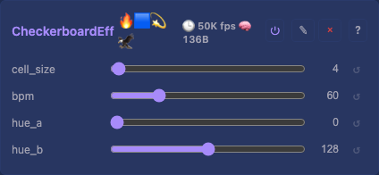
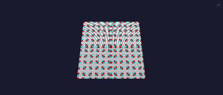

# Checkerboard 2D Effect

Animated checker pattern with two configurable hues.

## Controls

- `enabled` (bool) — from `EffectBase`
- `cell_size` (uint8_t, default 4, range 1-32) — cell width/height in grid units
- `bpm` (uint8_t, default 60, range 1-255) — phase shift speed (cells appear to move)
- `hue_a` (uint8_t, default 0) — colour of even cells
- `hue_b` (uint8_t, default 128) — colour of odd cells

## Rendering

Checker bit from `(x/cell + y/cell + phase) & 1`. `dynamicBytes()` = 0.

## Tests

[Unit tests: CheckerboardEffect](../../../tests/unit-tests.md#checkerboardeffect) — non-zero output, spatial variation. The file also covers other stateless effects via a shared macro.
