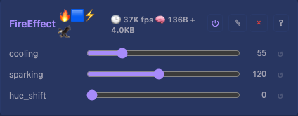
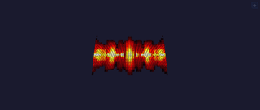

# Fire 2D Effect

Classic demoscene fire simulation on the XY plane. Maintains a `width x height` heat field; sparks spawn at the bottom row, drift upward with cooling, and are mapped to a black-red-yellow-white palette.

## Controls

- `enabled` (bool, default true) — inherited from `EffectBase`
- `cooling` (uint8_t, default 55, range 10-200) — heat loss per frame (higher = shorter flames)
- `sparking` (uint8_t, default 120, range 50-255) — probability of new sparks at the bottom row
- `hue_shift` (uint8_t, default 0, range 0-255) — rotate the fire palette around the colour wheel (0 = classic fire, 96 = green ghost-fire, 160 = blue plasma-fire)

## Rendering

Per frame (in this order):

1. **Cool** every cell by a small random amount.
2. **Rise** — each row averages from the row below (4-tap neighbourhood), heat propagates from `y = h-1` up toward `y = 0`.
3. **Sparks** — up to 4 random sparks at the bottom row each frame, gated by `sparking`.
4. **Render** the heat field to RGB via the fire palette (or hue-rotated HSV when `hue_shift != 0`).

Integer-only, no floats. Internal PRNG (LCG) avoids `rand()`.

## Memory

Allocates `width * height` bytes for the heat buffer in `onBuildState()` when `enabled` is true. Freed in `teardown()` and when disabled. Toggling `enabled` triggers a scheduler rebuild that (re)allocates.

| Logical size | Heat buffer |
|--------------|-------------|
| 64x64        | 4 KB        |
| 128x128      | 16 KB       |

`dynamicBytes()` reports the live size.

## Tests

[Module test: FireEffect](../../../testing.md#fire) — buffer becomes non-zero after several frames of sparking.

## Prior art

Standard demoscene fire (Lode's tutorials, FastLED's `Fire2012`). Adapted to the integer-only, no-Arduino style of this codebase.
