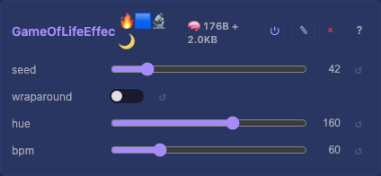
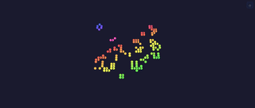

# Game of Life Effect

Conway's Game of Life (B3/S23) on the XY plane. A D2 effect: it simulates the
z=0 plane and `Layer::extrude` fills z on 3D layers.

## Controls

- `seed` — PRNG seed for the first initial state. Later re-seeds continue the
  same PRNG stream, so each revival is a fresh soup rather than a replay.
- `wraparound` — when on, the grid edges wrap (a torus); when off, off-grid
  neighbours count as dead.
- `hue` — base hue of living cells; a per-cell spatial offset is added so the
  colony shows a gradient rather than a flat colour.
- `bpm` — generation rate. Roughly `bpm / 8` generations per second (bpm 8 ≈
  1/s for watching gliders move, 255 ≈ as fast as the frame rate allows). The
  step is time-gated, so the speed is independent of the device's tick rate.

## Rendering

Two `width × height` byte grids (cur/nxt) hold one cell each. The step reads
cur, applies B3/S23 (birth on exactly 3 live neighbours, survival on 2 or 3),
writes nxt, then swaps. Living cells render as
`hsvToRgb(hue + x*3 + y*5, 200, 255)`; dead cells are black.

**Keeping it lively.** A random Conway soup always decays toward sparse
still-lifes plus a few blinkers — visually frozen, even though a plain
"nothing changed" check never fires (the blinkers keep flipping). So the grid
re-seeds when it goes **extinct**, **thins below ~3% density**, or **stops
growing for ~32 generations** (the live count barely moving). That keeps fresh
gliders and chaos coming. MoonLight does the richer version (pentomino
injection + CRC cycle detection); this is the minimal equivalent.

## Memory

`2 × width × height` bytes, allocated in `onBuildState` (PSRAM-first via
`platform::alloc`, like `FireEffect`'s heat grid) and reallocated when the
layer's dimensions change. At 128×128 that is 32 KB. Freed in `teardown` and the
destructor. Reported via `setDynamicBytes` so the per-effect heap figure is
honest.

## Extension seams

The simulation step and the colouring are decoupled: the rule lives in one
predicate (B3/S23 — birth on 3 neighbours, survival on 2 or 3) and the colour
in one render line (`hsvToRgb`). A different birth/survival mask drops into the
predicate without touching the rest; a palette lookup drops into the render
line in place of `hsvToRgb`. Nothing else is coupled to either.

## Tests

[Unit tests: GameOfLifeEffect](../../../tests/unit-tests.md#gameoflifeeffect) — B3/S23 rule (blinker oscillates, block is a still-life, lone cell dies), wraparound, grid (re)allocation and free, 0×0 survival, bpm pacing, and the renders-every-frame regression.

## Prior art

- **MoonLight `E_MoonModules.h` GameOfLife** — the feature-rich origin
  (rulesets, palette colouring, blur, mutation, pentomino seeding, CRC stasis
  detection). We take the proven algorithm and re-seed idea, not the structure.
  ([source](https://github.com/MoonModules/MoonLight/blob/main/src/MoonLight/Nodes/Effects/E_MoonModules.h),
  Ewoud Wijma 2022 / Brandon Butler 2024).
- **projectMM v1 — GameOfLifeEffect**
  ([source](https://github.com/ewowi/projectMM-v1/blob/54b50bc/src/modules/effects/GameOfLifeEffect.h)) —
  used PSRAM grids and exposed `setCell` / `getCell` / `liveCount` test helpers
  for deterministic rule testing without rendering; mirrored here.

## Source

[GameOfLifeEffect.h](../../../../src/light/effects/GameOfLifeEffect.h)
