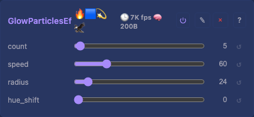
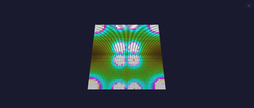

# Glow Particles 2D Effect

Soft-glowing particles rendered as a metaball field. Particles move with independent velocities and bounce off the edges; the per-pixel field summation produces chaotic organic blobs — like `MetaballsEffect` with more freedom of movement.

## Controls

- `count` (uint8_t, default 5, range 1-8) — number of glow sources
- `speed` (uint8_t, default 60, range 1-255) — movement speed
- `radius` (uint8_t, default 24, range 4-64) — influence radius (larger = more merging)
- `hue_shift` (uint8_t, default 0, range 0-255) — global hue rotation

Same metaball field as [MetaballsEffect](MetaballsEffect.md), but the sources move freely (12.4 fixed-point, edge-bouncing) instead of orbiting. Fixed particle array, no heap.

## Tests

[Unit tests: CheckerboardEffect](../../../tests/unit-tests.md#checkerboardeffect) (GlowParticlesEffect shares the same baseline assertions — non-zero output, spatial variation — alongside other effects).

## Source

[GlowParticlesEffect.h](../../../../src/light/effects/GlowParticlesEffect.h)
