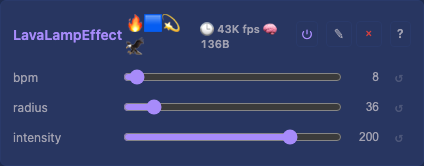

# Lava Lamp 2D Effect

Three slow blobs whose summed field is mapped through a black → red → orange → yellow → white palette. Atmospheric, fluid look — like a real lava lamp rather than the bright HSV of `MetaballsEffect`.

## Controls

- `bpm` (uint8_t, default 8, range 1-64) — orbit speed in beats per minute
- `radius` (uint8_t, default 36, range 8-80) — blob influence radius
- `intensity` (uint8_t, default 200, range 64-255) — how strongly the field maps into the palette

Three orbiting blobs share [MetaballsEffect](MetaballsEffect.md)'s field sum, but `intensity` maps it through a black→red→orange→yellow→white palette (flash table) for the atmospheric look instead of bright HSV. No heap.

## Tests

[Unit tests: CheckerboardEffect](../../../tests/unit-tests.md#checkerboardeffect) — LavaLampEffect is included in the shared baseline coverage: non-zero output, spatial variation.

## Source

[LavaLampEffect.h](../../../../src/light/effects/LavaLampEffect.h)
