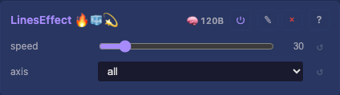
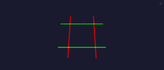

# LinesEffect

Sweeps one or more axis-aligned planes across the grid in sync at a given BPM. Each plane is a distinct colour: red (YZ, sweeps along X), green (XZ, sweeps along Y), blue (XY, sweeps along Z). Useful for verifying preview axis orientation — each colour names the axis it sweeps.

Port of MoonLight's Lines effect.

## Controls

- **speed** — sweep rate in BPM (1–240). Default 30.
- **axis** — which plane(s) to draw: `all`, `x (red)`, `y (green)`, `z (blue)`. Default `all`.

## Notes

On a 1D layout only the red plane is active (width > 1 check). On a 2D layout blue is suppressed (depth = 1). On a 3D layout all three sweep simultaneously.

## Source

[LinesEffect.h](../../../../src/light/effects/LinesEffect.h)
