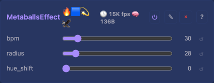

# Metaballs 2D Effect

Four "blobs" moving on the XY plane via integer sin/cos, with a metaball field summation per pixel. Visually similar to a lava lamp — blobs fluidly merge and separate.

## Controls

- `bpm` (uint8_t, default 30, range 1-255) — orbit speed in beats per minute
- `radius` (uint8_t, default 28, range 4-64) — ball influence radius (larger = more merging)
- `hue_shift` (uint8_t, default 0, range 0-255) — rotate the resulting hue

Four `sin8`-driven balls orbit the XY plane (phase-accumulator, so `bpm` changes don't jump); a metaball field sum per pixel drives both brightness and hue. No floats, no heap.

## Tests

[Unit tests: MetaballsEffect](../../../tests/unit-tests.md#metaballseffect) — non-zero output, spatial variation.

## Prior art

Classic demoscene effect (1980s). Same integer field-summation technique as countless WLED ports.

## Source

[MetaballsEffect.h](../../../../src/light/effects/MetaballsEffect.h)
