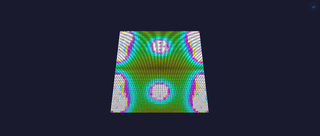

# Metaballs 2D Effect

Four "blobs" moving on the XY plane via integer sin/cos, with a metaball field summation per pixel. Visually similar to a lava lamp — blobs fluidly merge and separate.

## Controls

- `enabled` (bool, default true) — inherited from `EffectBase`
- `bpm` (uint8_t, default 30, range 1-255) — orbit speed in beats per minute
- `radius` (uint8_t, default 28, range 4-64) — ball influence radius (larger = more merging)
- `hue_shift` (uint8_t, default 0, range 0-255) — rotate the resulting hue

## Rendering

Per frame:
- Compute 4 ball positions `(bx, by)` using `sin8()` at different phases and orbit speeds. Stateless apart from a phase accumulator (BPM-stable).

Per pixel:
- For each ball: `field += (radius^2 * 64) / (dx^2 + dy^2 + 1)`
- Brightness = clamped `field`; hue = `(field >> 1) + hue_shift`
- Output via `hsvToRgb(hue, 240, brightness)`

Four divisions per pixel — acceptable for desktop and ESP32 LX7. No floats, no heap (`dynamicBytes()` = 0).

## Tests

[Module test: MetaballsEffect](../../../testing.md#metaballs) — non-zero output, spatial variation.

## Prior art

Classic demoscene effect (1980s). Same integer field-summation technique as countless WLED ports.
