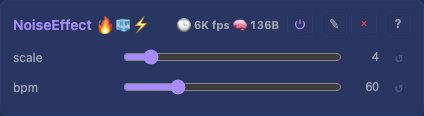

# Noise Effect

Smooth animated noise. Samples a 2D field on flat (`depth == 1`) layouts and a true 3D field on volumetric (`depth > 1`) layouts, so a cube renders as a varied volume rather than stacked identical slices.

## Controls

- `scale` (slider, default 4, range 1-32) — spatial frequency (higher = finer detail)
- `bpm` (slider, default 60, range 1-255) — animation speed in beats per minute

## Design notes

The effect picks the 2D (`depth == 1`) or 3D path per `loop()`. The noise value drives **hue, not brightness** — driving brightness would leave most lights near-black; full brightness keeps the field visible. Time is applied as a coordinate offset into the field (smooth drift, not a per-frame hash reseed), scaled by panel width so a 16-wide and 128-wide panel look equally fast at the same `bpm`; in 3D the z-axis scrolls at 1/5 the x-rate so the field flows rather than slides flat. `scale` defaults low (4) so the pattern reads on small grids; higher suits larger panels.

## Tests

[Unit tests: NoiseEffect](../../../tests/unit-tests.md#noiseeffect) — non-zero output, spatial variation, differs from rainbow.

[Scenario: scenario_MultiplyModifier_pipeline](../../../tests/scenario-tests.md#scenario_multiplymodifier_pipeline) — full pipeline with noise + multiply/mirror, performance bounds.

## Prior art

### MoonLight — E_MoonLight.h ([source](https://github.com/ewowi/MoonLight/blob/main/src/MoonLight/Nodes/Effects/E_MoonLight.h))

Multiple noise effects (Noise2D, Noise3D variants). Uses FastLED noise functions. Time via `millis()`.

### projectMM v2 — Noise2DEffect ([source](https://github.com/ewowi/projectMM-v2/blob/main/src/modules/lights/effects/Noise2DEffect.h))

Same hash-based value noise as v1. Uses PixelEffectBase spine.

### projectMM v1 — NoiseEffect2D ([source](https://github.com/ewowi/projectMM-v1/blob/54b50bc/src/modules/effects/NoiseEffect2D.h))

Hash-based value noise with trilinear interpolation. Controls: scale (1-32), speed (0-255). Uses `timeMicros()` for animation. v1 ran scale 4 with a 0.1x multiplier (effective 0.4) — projectMM's default of 4 is informed by this.

## Source

[NoiseEffect.h](../../../../src/light/effects/NoiseEffect.h)
