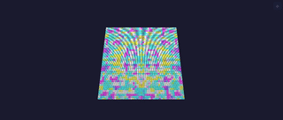

# Noise Effect

Smooth animated noise. Samples a 2D field on flat (`depth == 1`) layouts and a true 3D field on volumetric (`depth > 1`) layouts, so a cube renders as a varied volume rather than stacked identical slices.

## Controls

- `scale` (slider, default 4, range 1-32) — spatial frequency (higher = finer detail)
- `bpm` (slider, default 60, range 1-255) — animation speed in beats per minute

## Rendering

Value noise with smoothstep-eased interpolation. 2D path uses bilinear interpolation over 4 cell corners (`noise2d`); 3D path uses trilinear interpolation over 8 cube corners (`noise3d`). Maps the noise value to hue via `hsvToRgb(n, 200, 255)` — fixed saturation, full brightness.

The effect picks the path at every `loop()` based on `depth()`; `depth == 1` is byte-identical to the previous 2D-only output (no perf regression on flat panels).

Animation: time scrolls the noise coordinate space (smooth drift). The scroll speed is scaled by panel width so the perceived speed is the same on any display size — a 16-wide and 128-wide panel look equally fast at the same BPM. In 3D the z axis scrolls at 1/5 the x-rate so the field flows rather than slides flat.

## Design notes

- The noise value drives hue, not brightness — lights render at full brightness (v=255) so the field stays visible. Driving brightness from the noise value leaves most lights near-black.
- `scale` defaults to 4 (low spatial frequency) so the pattern reads well on small grids; higher values suit larger panels.
- Time is applied as a coordinate offset into the noise field, not as a hash seed — this scrolls the field smoothly instead of producing random per-frame jumps.

## Tests

[Unit tests: NoiseEffect](../../../tests/unit-tests.md#noiseeffect) — non-zero output, spatial variation, differs from rainbow.

[Scenario: scenario_MultiplyModifier_pipeline](../../../tests/scenario-tests.md#scenario_multiplymodifier_pipeline) — full pipeline with noise + multiply/mirror, performance bounds.

## Prior art

### MoonLight — E_MoonLight.h ([source](https://github.com/MoonModules/MoonLight/blob/main/src/MoonLight/Nodes/Effects/E_MoonLight.h))

Multiple noise effects (Noise2D, Noise3D variants). Uses FastLED noise functions. Time via `millis()`.

### projectMM v2 — Noise2DEffect ([source](https://github.com/ewowi/projectMM-v2/blob/main/src/modules/lights/effects/Noise2DEffect.h))

Same hash-based value noise as v1. Uses PixelEffectBase spine.

### projectMM v1 — NoiseEffect2D ([source](https://github.com/ewowi/projectMM-v1/blob/54b50bc/src/modules/effects/NoiseEffect2D.h))

Hash-based value noise with trilinear interpolation. Controls: scale (1-32), speed (0-255). Uses `timeMicros()` for animation. v1 ran scale 4 with a 0.1x multiplier (effective 0.4) — projectMM's default of 4 is informed by this.
