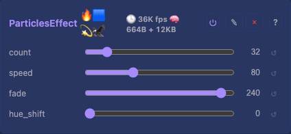
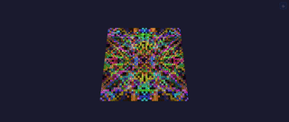

# Particles 2D Effect

A swarm of particles drifting on the XY plane with persistent trails. Each particle has fixed-point position, velocity, and hue. A private RGB trail buffer is faded each frame, particles are drawn on top, and the trail buffer is copied to the layer buffer (which the Layer clears every frame).

## Controls

- `enabled` (bool, default true) — inherited from `EffectBase`
- `count` (uint8_t, default 32, range 1-64) — number of active particles
- `speed` (uint8_t, default 80, range 1-255) — velocity multiplier
- `fade` (uint8_t, default 240, range 200-255) — trail persistence (255 = no fade, 200 = quick fade)
- `hue_shift` (uint8_t, default 0, range 0-255) — rotate all particle hues

## Rendering

Per frame:

1. **Fade** every byte in the trail buffer via `scale8(byte, fade)` (integer multiply, no float).
2. **Update + draw** — for each active particle: advance position using 12.4 fixed-point math, bounce off edges, draw RGB into the trail buffer.
3. **Copy** the trail buffer into the layer buffer.

Maximum particles is `MAX_PARTICLES = 64` (a compile-time constant). Particle state is a fixed array — no heap allocation for the particle list itself.

## Memory

Allocates `width * height * channelsPerLight` bytes for the persistent trail buffer in `onAllocateMemory()` when `enabled` is true. Freed in `teardown()` and when disabled.

| Logical size | Trail buffer (RGB) |
|--------------|--------------------|
| 64x64        | 12 KB              |
| 128x128      | 48 KB              |

Particle list (`64 * 8` bytes) is part of `sizeof(ParticlesEffect)`, not `dynamicBytes()`. `dynamicBytes()` reports only the trail buffer.

## Tests

[Module test: ParticlesEffect](../../../testing.md#particles) — buffer becomes non-zero after one frame (particles draw immediately).

## Prior art

Classic "snow"/"stars"/"fireflies" effect from many LED firmwares. The fade-and-draw approach (a.k.a. *afterimage*) matches FastLED's `fadeToBlackBy` idiom.
