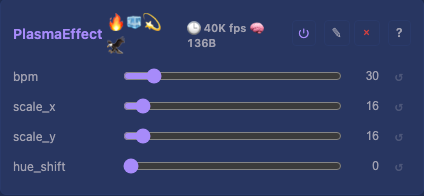
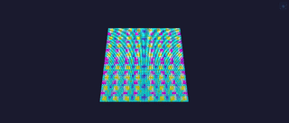

# Plasma Effect

Animated plasma pattern from summed sine waves on orthogonal and diagonal axes. Default effect in the desktop and ESP32 pipeline. 2D on flat (`depth == 1`) layouts, 3D on volumetric (`depth > 1`) layouts so a cube renders as a varied volume.

## Controls

- `bpm` (uint8_t, default 30, range 1-255) — animation speed in beats per minute
- `scale_x` (uint8_t, default 16, range 1-64) — horizontal wave length in grid cells (`step = 256 / scale_x`)
- `scale_y` (uint8_t, default 16, range 1-64) — vertical wave length in grid cells
- `hue_shift` (uint8_t, default 0, range 0-255) — rotates the entire color wheel

## Rendering

`sin8` lookups per pixel (256-byte constexpr LUT in flash, no float, no heap). Waves:

- Horizontal: `sin8(x * step_x + t1)`
- Vertical: `sin8(y * step_y + t2)` — hoisted per row
- Diagonal: `sin8(x * step_x + y * step_x - t3)`
- Anti-diagonal: `sin8(x * step_y + 128 - y * step_y + t1)`
- Depth (3D path only): `sin8(z * step_z + t1)` — hoisted per z-slice; `step_z` reuses `scale_y` for spatial frequency

On `depth == 1` the four 2D sines are averaged via `>> 2` (byte-identical to the previous 2D-only output). On `depth > 1` the fifth z-sine joins the sum and it is averaged via `/5`. `hue_shift` is added; `hsvToRgb(hue, 255, 255)` produces RGB.

### Performance

- No division or modulo in the inner loop — `step_x`/`step_y` computed once per frame
- Nested `for (y) for (x)` with row pointer — no `i % w` per pixel
- Y-dependent terms hoisted outside the x-loop
- `dynamicBytes()` = 0 — no `onBuildState` override

Phase accumulator matches NoiseEffect pattern — BPM changes do not jump the animation.

## Tests

[Unit tests: PlasmaEffect](../../../tests/unit-tests.md#plasmaeffect) — non-zero output, spatial variation, differs from NoiseEffect.

Default pipeline uses Plasma + MirrorModifier (see `src/main.cpp`).

## Prior art

Classic demoscene plasma effect (sum of sines). Integer sin8 LUT approach matches FastLED-style tables. No direct v1/v2 module port — simpler than NoiseEffect (no hash/bilinear).
