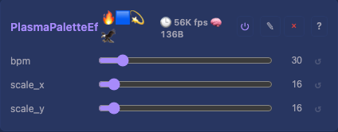
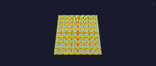

# Plasma Palette 2D Effect

Same four-sine plasma field as `PlasmaEffect`, but colours come from a 256-entry fire-ocean RGB palette in flash instead of `hsvToRgb`.

## Controls

- `bpm` (uint8_t, default 30, range 1-255)
- `scale_x` (uint8_t, default 16, range 1-64)
- `scale_y` (uint8_t, default 16, range 1-64)

## Tests

[Unit tests: CheckerboardEffect](../../../tests/unit-tests.md#checkerboardeffect) (PlasmaPaletteEffect is one of the stateless effects covered) — non-zero output, spatial variation.

## Source

[PlasmaPaletteEffect.h](../../../../src/light/effects/PlasmaPaletteEffect.h)
