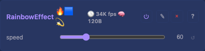

# Rainbow 2D Effect

Diagonal rainbow pattern across a 2D grid, animated over time. Good default/test effect — always produces visible, colorful output.

## Controls

- `speed` (uint8_t, default 60, range 1-255) — animation speed in BPM (beats per minute). 60 = 1 full cycle per second.

## Rendering

Writes directly to `uint8_t*` buffer using channel offsets. For RGB: computes hue from `x + y + elapsed_bpm_phase`, converts via `hsvToRgb(hue, 255, 255)`, writes R,G,B at the correct offsets. Always full brightness (v=255) and full saturation (s=255).

Time-based animation via elapsed millis, converted to BPM phase internally.

## Tests

[Unit tests: RainbowEffect](../../../tests/unit-tests.md#rainboweffect) — non-zero output, valid RGB, spatial variation.

[Scenario: scenario_Layer_base_pipeline](../../../tests/scenario-tests.md#scenario_layer_base_pipeline) — full pipeline with rainbow effect, performance bounds.

## Design notes

- Test effect. Dead simple — proves the pipeline works.
- No palette, no variants. Rainbow is visually recognizable, which makes it easy to spot in tests.
