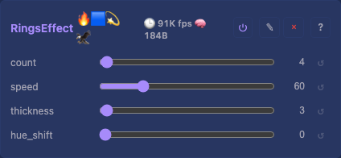

# Rings 2D Effect

Expanding concentric rings from random centre points. Each ring grows outward and respawns once it has expanded past the visible area. Multiple rings overlap with additive blending.

(This concentric-rings effect is "Rings"; the name "Ripples" belongs to the MoonLight sine-wave water-surface effect.)

## Controls

- `count` (uint8_t, default 4, range 1-8) — number of simultaneously active rings
- `speed` (uint8_t, default 60, range 1-255) — expansion rate
- `thickness` (uint8_t, default 3, range 1-16) — ring thickness in pixels
- `hue_shift` (uint8_t, default 0, range 0-255) — global hue rotation

An age-based fade makes old, wide rings disappear softly. Per-ring state (position + radius + hue) lives in a fixed array — no heap.

## Tests

[Unit tests: CheckerboardEffect](../../../tests/unit-tests.md#checkerboardeffect) — shared rendering/smoke coverage: non-zero output, spatial variation. (RingsEffect carries per-ring mutable state — position, radius, hue — with random respawn; that behaviour isn't unit-tested today.)

## Source

[RingsEffect.h](../../../../src/light/effects/RingsEffect.h)
