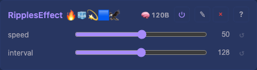

# Ripples 3D Effect

3D dancing sine-wave ripples — a reimplementation of MoonLight's Ripples. For each `(x, z)` column on the floor plane, the distance from the centre sets a wave phase, and one pixel per column is lit at the height `y = floor(h/2 · (1 + sin(dist / interval + time)))`. The lit surface ripples like water filling the volume, with the hue cycling over time and position.

Genuinely 3D (`Dim::D3`): it writes a height across the y-axis. On a flat 2D layout (depth 1) it degenerates to a single rippling y-row, which is honest for a flat grid.

## Controls

- `speed` (uint8_t, default 50, range 0-99) — animation speed; 0 = frozen, 99 = fast
- `interval` (uint8_t, default 128, range 1-254) — wavefront spacing; low = tight rings, high = wide

## Prior art

Ported from [MoonLight](https://github.com/MoonModules/MoonLight)'s Ripples (via projectMM-v1), studied and rewritten against this project's `EffectBase` — we read the approach and implemented our own, reusing `core/color.h`'s `hsvToRgb` rather than MoonLight's inlined HSV. The wavefront math (distance → phase → sine height, the `1.3·(255−interval)/128·√h` spacing and `millis/(100−speed)/6.4` time base) follows MoonLight's so the look matches.

Float trig (`sinf`/`sqrtf`) in the loop is consistent with the existing wave effects (Plasma, LavaLamp); the hot-path integer-math preference is for per-light colour work, not the handful of transcendental ops a wavefront needs.

## Tests

[Unit tests: CheckerboardEffect](../../../tests/unit-tests.md#checkerboardeffect) — shared rendering/smoke coverage: non-zero output, spatial variation, plus a 0×0×0 grid robustness check.

## Source

[RipplesEffect.h](../../../../src/light/effects/RipplesEffect.h)
