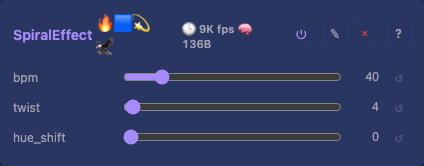
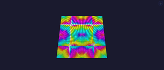

# Spiral 2D Effect

Rotating spiral from angle + distance. Uses shared `atan2_8` and `dist8` in `core/color.h`.

## Controls

- `enabled` (bool) — from `EffectBase`
- `bpm` (uint8_t, default 40, range 1-255) — rotation speed
- `twist` (uint8_t, default 4, range 1-16) — tightness of spiral arms
- `hue_shift` (uint8_t, default 0, range 0-255) — colour offset

## Rendering

Centre at `(w/2, h/2)`. `hue = atan2_8(dy,dx) + dist*twist - t + hue_shift`. `dynamicBytes()` = 0.

## Tests

[Unit tests: CheckerboardEffect](../../../tests/unit-tests.md#checkerboardeffect) (SpiralEffect is one of the stateless effects covered) — non-zero output, spatial variation.
