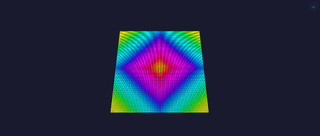
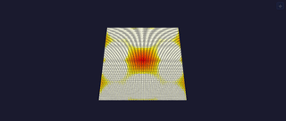
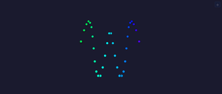

# Effects

Every effect, one compact row each. An effect writes per-pixel colour into its [Layer](../Layer.md)'s buffer each tick; [modifiers](../modifiers/modifiers.md) reshape the result and a [driver](../drivers/) sends it out. Effects that name an index colour read the global palette (the `palette` control on [Drivers](../Drivers.md)) via `colorFromPalette`.

Columns: **Name** (with its `tags()` emoji — see the [tag emoji legend](../../../architecture.md#tag-emoji-legend)), **Preview**, **Dim** (native axes; [Layer](../Layer.md) extrudes a lower-dim effect onto a bigger grid), **Description**, **Controls**, **Tests**. Origin is grouped into sections; the per-row tags carry the full (often blended) lineage and creator credit. The per-library file split is future work — see the [folder-structure decision](../../../backlog/folder-structure-proposal.md).

## MoonLight effects

| Name | Preview | Dim | Description | Controls | Tests |
|---|---|---|---|---|---|
| **Rainbow** 💫 |  | 2D | Diagonal animated rainbow — always-visible default/test effect. | `speed` | [tests](../../../tests/unit-tests.md#rainboweffect) |
| **Plasma** 💫🦅 |  | 2D/3D | Summed sine waves on orthogonal + diagonal axes; large rolling blobs (3D on volumetric layouts). | `bpm`, `scale_x`, `scale_y`, `hue_shift` | [tests](../../../tests/unit-tests.md#plasmaeffect) |
| **Spiral** 💫🦅 |  | 2D | Rotating spiral from angle + distance (`atan2_8`/`dist8`). | `bpm`, `twist`, `hue_shift` | [tests](../../../tests/unit-tests.md#spiraleffect) |
| **DistortionWaves** 💫 | — | 2D | Two interfering sine waves beat against each other into a moiré colour field. | `freq_x`, `freq_y`, `speed` | [tests](../../../tests/unit-tests.md#distortionwaveseffect) |
| **Metaballs** 💫🦅 |  | 2D | `count` blobs orbit via integer sin/cos; metaball field per pixel — bright HSV merge/split. | `bpm`, `radius`, `count`, `hue_shift` | [tests](../../../tests/unit-tests.md#metaballseffect) |
| **LavaLamp** 💫🦅 |  | 2D | Three slow blobs through a black→red→orange→yellow→white ramp — atmospheric lava look. | `bpm`, `radius`, `intensity` | [tests](../../../tests/unit-tests.md#spiraleffect) |
| **Particles** 💫🦅 |  | 2D | A swarm of drifting particles with persistent fading trails. | `count`, `speed`, `fade`, `hue_shift` | [tests](../../../tests/unit-tests.md#particleseffect) |
| **Rings** 💫🦅 |  | 2D | Expanding concentric rings from random centres, additive overlap (calm defaults). | `count`, `speed`, `thickness`, `hue_shift` | [tests](../../../tests/unit-tests.md#spiraleffect) |
| **Ripples** 💫🟦🦅 |  | 3D | Distance-from-centre sets a per-column wave phase; the lit surface ripples like water. | `speed`, `interval` | [tests](../../../tests/unit-tests.md#spiraleffect) |
| **Lines** 💫 |  | — | Sweeps axis-aligned planes in sync; red/green/blue name the X/Y/Z axis — a preview-orientation test pattern. | `speed`, `axis` | — |

## WLED effects

| Name | Preview | Dim | Description | Controls | Tests |
|---|---|---|---|---|---|
| **Wave** 🌊 | — | 2D | An oscilloscope waveform scrolls across the grid with a fading trail; six selectable shapes. | `bpm`, `fade`, `type` | [tests](../../../tests/unit-tests.md#waveeffect) |

## FastLED effects

| Name | Preview | Dim | Description | Controls | Tests |
|---|---|---|---|---|---|
| **Fire** ⚡️🦅 |  | 2D | Fire2012-style heat field — sparks at the base rise and cool through a black→red→yellow→white ramp; spark count scales with width. | `cooling`, `sparking`, `hue_shift` | [tests](../../../tests/unit-tests.md#fireeffect) |
| **Noise** ⚡️ |  | 2D/3D | Smooth animated value noise; true 3D field on volumetric layouts. | `scale`, `bpm` | [tests](../../../tests/unit-tests.md#noiseeffect) |

## projectMM-native effects

| Name | Preview | Dim | Description | Controls | Tests |
|---|---|---|---|---|---|
| **Sine** 🌀 | — | 3D | R/G/B each follow a sine along one axis at 120° phase offset — a glowing, scrolling colour box. | `frequency`, `amplitude`, `bpm` | [tests](../../../tests/unit-tests.md#sineeffect) |
| **AudioVolume** 🔊 | — | — | A whole-grid VU meter: every light pulses with the mic level, colour indexing the palette by loudness. | `brightness` | [tests](../../../tests/unit-tests.md#audiomodule) |
| **AudioSpectrum** 📊 | — | — | The 16 mic frequency bands spread across X, each column lit bottom-up by its magnitude. | `colorMode` | [tests](../../../tests/unit-tests.md#audiomodule) |
| **NetworkReceive** 📡🌙 | — | — | Receives lights-over-UDP (Art-Net, E1.31/sACN, DDP) and writes it into the layer — the receive side for Resolume/Madrix/xLights/LedFx. See the wire contract below. | `universe_start`, `channels_per_universe` | [tests](../../../tests/unit-tests.md#networkreceiveeffect) |

**NetworkReceive wire contract:** listens for [Art-Net](https://art-net.org.uk/downloads/art-net.pdf), [E1.31 / sACN](https://tsp.esta.org/tsp/documents/docs/ANSI_E1-31-2018.pdf), and [DDP](http://www.3waylabs.com/ddp/) simultaneously; `universe_start` + `channels_per_universe` map incoming universes onto the layer buffer. The end-to-end pair with [NetworkSendDriver](../drivers/NetworkSendDriver.md).

## Source

- [AudioSpectrumEffect.h](../../../../src/light/effects/AudioSpectrumEffect.h)
- [AudioVolumeEffect.h](../../../../src/light/effects/AudioVolumeEffect.h)
- [DistortionWavesEffect.h](../../../../src/light/effects/DistortionWavesEffect.h)
- [FireEffect.h](../../../../src/light/effects/FireEffect.h)
- [LavaLampEffect.h](../../../../src/light/effects/LavaLampEffect.h)
- [LinesEffect.h](../../../../src/light/effects/LinesEffect.h)
- [MetaballsEffect.h](../../../../src/light/effects/MetaballsEffect.h)
- [NetworkReceiveEffect.h](../../../../src/light/effects/NetworkReceiveEffect.h)
- [NoiseEffect.h](../../../../src/light/effects/NoiseEffect.h)
- [ParticlesEffect.h](../../../../src/light/effects/ParticlesEffect.h)
- [PlasmaEffect.h](../../../../src/light/effects/PlasmaEffect.h)
- [RainbowEffect.h](../../../../src/light/effects/RainbowEffect.h)
- [RingsEffect.h](../../../../src/light/effects/RingsEffect.h)
- [RipplesEffect.h](../../../../src/light/effects/RipplesEffect.h)
- [SineEffect.h](../../../../src/light/effects/SineEffect.h)
- [SpiralEffect.h](../../../../src/light/effects/SpiralEffect.h)
- [WaveEffect.h](../../../../src/light/effects/WaveEffect.h)
