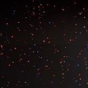

# Effects

Every effect, one block each: its preview, what it does, and what each control means — together. An effect writes per-pixel colour into its [Layer](../Layer.md)'s buffer each tick; [modifiers](../modifiers/modifiers.md) reshape the result and a [driver](../drivers/PreviewDriver.md) sends it out. Effects that name an index colour read the global palette (the `palette` control on [Drivers](../Drivers.md)) via `colorFromPalette`. Each block's emoji are its `tags()` (origin/creator/audio — see the [tag emoji legend](../../../architecture.md#tag-emoji-legend)); **Dim** is its native axes ([Layer](../Layer.md) extrudes a lower-dim effect onto a bigger grid). Effects are grouped into sections by origin, and each block carries that effect's preview, behaviour, and control descriptions together. (For how this page maps to the source/asset folders, see the [folder-structure decision](../../../backlog/folder-structure-proposal.md).)

**Jump to:** [MoonLight](#moonlight-effects) · [MoonModules](#moonmodules-effects) · [WLED](#wled-effects) · [FastLED](#fastled-effects) · [projectMM-native](#projectmm-native-effects)

> Some WLED-origin effects show a preview gif from [WLED-Utils](https://github.com/scottrbailey/WLED-Utils) by scottrbailey (the canonical WLED effect gif set, cross-linked with credit); these show WLED's rendering. Effects with a local `../../../assets/…` gif show our own output.

## MoonLight effects

### DistortionWaves 💫 · 2D

Two interfering sine waves beat against each other into a moiré colour field.

- `freq_x` / `freq_y` — horizontal/vertical wave frequency (1–8).
- `speed` — animation rate (0 = frozen).

Origin: WLED · by ldirko & blazoncek (WLED port) · [gallery](https://editor.soulmatelights.com/gallery/1089-distorsion-waves) · via [MoonLight](https://github.com/MoonModules/MoonLight/blob/main/src/MoonLight/Nodes/Effects/E_WLED.h) · source [DistortionWavesEffect.h](../../../../src/light/effects/DistortionWavesEffect.h)

[Tests](../../../tests/unit-tests.md#distortionwaveseffect)

### FixedRectangle 💫 · 3D

A solid colour filling a positioned box within the grid, with an optional alternating-white checker on the box's pixels.

- `red` / `green` / `blue` / `white` — the box colour.
- `X position` / `Y position` / `Z position` — the box's origin corner.
- `Rectangle width` / `Rectangle height` / `Rectangle depth` — the box extent on each axis.
- `alternateWhite` — alternate box pixels to white in a checker pattern.

Origin: MoonLight · by [limpkin](https://github.com/limpkin) · via [MoonLight](https://github.com/MoonModules/MoonLight/blob/main/src/MoonLight/Nodes/Effects/E_MoonLight.h) · source [FixedRectangleEffect.h](../../../../src/light/effects/FixedRectangleEffect.h)

[Tests](../../../tests/unit-tests.md#fixedrectangleeffect)

### FreqSaws 💫📊 · 2D

Audio-reactive sawtooth waves: each column maps to a frequency band whose magnitude drives a per-band oscillator speed, so louder bands sweep their sawtooth up the column faster, with three phase methods.

- `fade` — background decay per frame.
- `increaser` — how fast a band's speed ramps up with its magnitude.
- `decreaser` — how fast a silent band's speed decays.
- `bpmMax` — ceiling on a band's oscillation speed.
- `invert` — flip alternate columns vertically.
- `keepOn` — keep oscillating even when a band is silent.
- `method` — phase model (`Chaos`, `Chaos fix`, `BandPhases`).

Origin: MoonLight (audio) · by [@TroyHacks](https://github.com/troyhacks) · via [MoonLight](https://github.com/MoonModules/MoonLight/blob/main/src/MoonLight/Nodes/Effects/E_MoonLight.h) · source [FreqSawsEffect.h](../../../../src/light/effects/FreqSawsEffect.h)

[Tests](../../../tests/unit-tests.md#freqsawseffect)

### LavaLamp 💫🦅 · 2D

Three slow blobs through a black→red→orange→yellow→white ramp — atmospheric lava look.

- `bpm` — blob drift speed.
- `radius` — blob influence radius.
- `intensity` — field gain into the black→red→orange→yellow→white ramp.

Origin: projectMM original (metaball lava lamp) · source [LavaLampEffect.h](../../../../src/light/effects/LavaLampEffect.h)

[Tests](../../../tests/unit-tests.md#spiraleffect)

### Lines 💫 · —

Sweeps axis-aligned planes in sync; red/green/blue name the X/Y/Z axis — a preview-orientation test pattern.

- `speed` — sweep BPM.
- `axis` — which plane sweeps (`all`, `x (red)`, `y (green)`, `z (blue)`).

Origin: MoonLight · via [MoonLight](https://github.com/MoonModules/MoonLight/blob/main/src/MoonLight/Nodes/Effects/E_MoonLight.h) · source [LinesEffect.h](../../../../src/light/effects/LinesEffect.h)

### Metaballs 💫🦅 · 2D

`count` blobs orbit via integer sin/cos; metaball field per pixel — bright HSV merge/split.

- `bpm` — orbit speed.
- `radius` — blob influence radius.
- `count` — number of orbiting balls (1–8).
- `hue_shift` — rotate the palette index.

Origin: projectMM original (metaballs) · source [MetaballsEffect.h](../../../../src/light/effects/MetaballsEffect.h)

[Tests](../../../tests/unit-tests.md#metaballseffect)

### Particles 💫🦅 · 2D

A swarm of drifting particles with persistent fading trails.

- `count` — number of particles (1–255).
- `speed` — drift velocity.
- `fade` — trail persistence (higher = longer tails).
- `hue_shift` — rotate every particle's hue.

Origin: MoonLight · by WildCats08 / [@Brandon502](https://github.com/Brandon502) · via [MoonLight](https://github.com/MoonModules/MoonLight/blob/main/src/MoonLight/Nodes/Effects/E_MoonLight.h) · source [ParticlesEffect.h](../../../../src/light/effects/ParticlesEffect.h)

[Tests](../../../tests/unit-tests.md#particleseffect)

### Plasma 💫🦅 · 2D/3D

Summed sine waves on orthogonal + diagonal axes; large rolling blobs (3D on volumetric layouts).

- `bpm` — roll speed.
- `scale_x` / `scale_y` — blob size on each axis (larger = bigger, calmer blobs, lower spatial frequency).
- `hue_shift` — rotate the palette index.

Origin: FastLED / WLED lineage (classic plasma) · source [PlasmaEffect.h](../../../../src/light/effects/PlasmaEffect.h)

[Tests](../../../tests/unit-tests.md#plasmaeffect)

### Praxis 💫 · 2D

An algorithmic palette pattern driven by two beat oscillators (a macro and a micro mutator) whose frequencies and ranges reshape the hue field over time.

- `macroMutatorFreq` / `macroMutatorMin` / `macroMutatorMax` — the coarse mutator's beat frequency and its oscillation range.
- `microMutatorFreq` / `microMutatorMin` / `microMutatorMax` — the fine mutator's beat frequency and range.

Origin: MoonLight · by MONSOONO / @Flavourdynamics · via [MoonLight](https://github.com/MoonModules/MoonLight/blob/main/src/MoonLight/Nodes/Effects/E_MoonLight.h) · source [PraxisEffect.h](../../../../src/light/effects/PraxisEffect.h)

[Tests](../../../tests/unit-tests.md#praxiseffect)

### Rainbow 💫 · 2D

Diagonal animated rainbow — always-visible default/test effect.

- `speed` — animation BPM (one full hue cycle per beat).

Origin: FastLED · Mark Kriegsman (rainbow) · via [MoonLight](https://github.com/MoonModules/MoonLight/blob/main/src/MoonLight/Nodes/Effects/E_FastLED.h) · source [RainbowEffect.h](../../../../src/light/effects/RainbowEffect.h)

[Tests](../../../tests/unit-tests.md#rainboweffect)

### Random 💫 · 3D

Lights one random light per frame in a random palette colour over a fading background — a sparse, palette-tinted sparkle.

- `fade` — how fast prior sparkles fade to black.

Origin: MoonLight · via [MoonLight](https://github.com/MoonModules/MoonLight/blob/main/src/MoonLight/Nodes/Effects/E_MoonLight.h) · source [RandomEffect.h](../../../../src/light/effects/RandomEffect.h)

[Tests](../../../tests/unit-tests.md#randomeffect)

### Rings 💫🦅 · 2D

Expanding concentric rings from random centres, additive overlap (calm defaults).

- `count` — simultaneous rings (1–8 active).
- `speed` — expansion rate.
- `thickness` — ring band width.
- `hue_shift` — rotate every ring's hue.

Origin: projectMM original (concentric rings) · source [RingsEffect.h](../../../../src/light/effects/RingsEffect.h)

[Tests](../../../tests/unit-tests.md#spiraleffect)

### Ripples 💫🟦🦅 · 3D

Distance-from-centre sets a per-column wave phase; the lit surface ripples like water.

- `speed` — wave animation rate (0 = frozen, 99 = fast).
- `interval` — wavefront spacing (low = tight rings, high = wide).

Origin: MoonLight · via [MoonLight](https://github.com/MoonModules/MoonLight/blob/main/src/MoonLight/Nodes/Effects/E_MoonLight.h) · source [RipplesEffect.h](../../../../src/light/effects/RipplesEffect.h)

[Tests](../../../tests/unit-tests.md#spiraleffect)

### RubiksCube 💫🧊 · 3D

A 3D Rubik's Cube projected onto the volume: it scrambles, then plays its solution back one turn at a time, the six faces in their standard colours.

- `turnsPerSecond` — how fast the cube turns.
- `cubeSize` — the cube order (2×2 up to 8×8).
- `randomTurning` — turn endlessly at random instead of scramble-then-solve.

Origin: MoonLight · by WildCats08 / [@Brandon502](https://github.com/Brandon502) · via [MoonLight](https://github.com/MoonModules/MoonLight/blob/main/src/MoonLight/Nodes/Effects/E_MoonLight.h) · source [RubiksCubeEffect.h](../../../../src/light/effects/RubiksCubeEffect.h)

[Tests](../../../tests/unit-tests.md#rubikscubeeffect)

### Solid 💫 · 3D

A flat fill with five colour modes: a plain RGB(W) colour, the active palette spread across the lights, an RMS-averaged single palette colour, or the palette banded along the grid's rows or columns.

- `red` / `green` / `blue` / `white` — the flat colour in `RGB(W)` mode (ignored in the palette modes).
- `brightness` — scales the flat and palette-spread output.
- `colorMode` — `RGB(W)`, `Palette` (spread across the lights), `Palette avg` (RMS mean of the palette), `Palette rows`, `Palette cols` (palette banded along that axis).
- `minRGB` — in the band modes, drops palette entries whose every channel is below this floor.
- `randomColors` — in the band modes, deterministically shuffles the surviving palette entries.

Origin: MoonLight · via [MoonLight](https://github.com/MoonModules/MoonLight/blob/main/src/MoonLight/Nodes/Effects/E_MoonLight.h) · source [SolidEffect.h](../../../../src/light/effects/SolidEffect.h)

[Tests](../../../tests/unit-tests.md#solideffect)

### SphereMove 💫🧊 · 3D

A hollow spherical shell that bounces through the 3D volume, its surface coloured from the palette, leaving no trail.

- `speed` — how fast the sphere moves through the volume.

Origin: MoonLight · via [MoonLight](https://github.com/MoonModules/MoonLight/blob/main/src/MoonLight/Nodes/Effects/E_MoonLight.h) · source [SphereMoveEffect.h](../../../../src/light/effects/SphereMoveEffect.h)

[Tests](../../../tests/unit-tests.md#spheremoveeffect)

### Spiral 💫🦅 · 2D

Rotating spiral from angle + distance (`atan2_8`/`dist8`).

- `bpm` — rotation speed.
- `twist` — how tightly the arm winds (hue gain per unit of distance).
- `hue_shift` — rotate the palette index.

Origin: projectMM original (rotating spiral) · source [SpiralEffect.h](../../../../src/light/effects/SpiralEffect.h)

[Tests](../../../tests/unit-tests.md#spiraleffect)

### StarField 💫 · 2D

A perspective starfield: stars approach the viewer from a vanishing point, brightening as they near, then respawn at depth.

- `speed` — how fast stars approach (frame throttle).
- `numStars` — how many stars are active.
- `blur` — motion-trail fade per frame.
- `usePalette` — colour the stars from the palette instead of white.

Origin: MoonLight · by [@Brandon502](https://github.com/Brandon502), inspired by Daniel Shiffman / [Coding Train](https://www.youtube.com/watch?v=17WoOqgXsRM) · via [MoonLight](https://github.com/MoonModules/MoonLight/blob/main/src/MoonLight/Nodes/Effects/E_MoonLight.h) · source [StarFieldEffect.h](../../../../src/light/effects/StarFieldEffect.h)

[Tests](../../../tests/unit-tests.md#starfieldeffect)

### StarSky 💫 · 3D

Twinkling stars at random light positions, each fading in and out independently over a dark background.

- `speed` — fade rate per frame (how fast each star brightens/dims).
- `star_fill_ratio` — how many stars (as a fraction of the light count).
- `usePalette` — colour the stars from the active palette instead of white.

Origin: MoonLight · by [limpkin](https://github.com/limpkin) · via [MoonLight](https://github.com/MoonModules/MoonLight/blob/main/src/MoonLight/Nodes/Effects/E_MoonLight.h) · source [StarSkyEffect.h](../../../../src/light/effects/StarSkyEffect.h)

[Tests](../../../tests/unit-tests.md#starskyeffect)

### Text 💫 · 2D

Renders a multi-line string in a bitmap font. Static by default (laid out top-left, each newline dropping one font-height, clipped where it runs off the grid); turn on `scroll` to march the whole block leftwards as a wrapping marquee. Text colour comes from the active palette.

- `text` — the string to show; a **multi-line text area** (each line renders on its own row).
- `scroll` — off (default) = static; on = horizontal marquee.
- `font` — glyph size (`4x6` compact, `6x8` larger).
- `speed` — marquee speed (only used when `scroll` is on).
- `hue` — palette index for the text colour.

Origin: projectMM original, on MoonLight's Scrolling Text · via [MoonLight](https://github.com/MoonModules/MoonLight/blob/main/src/MoonLight/Nodes/Effects/E_MoonLight.h) · source [TextEffect.h](../../../../src/light/effects/TextEffect.h)

[Tests](../../../tests/unit-tests.md#texteffect)

## MoonModules effects

### GameOfLife 💫🌙 · 2D/3D

Conway's cellular automaton generalised to 2D/3D: selectable rulesets (+ custom `B#/S#`), cells that inherit a neighbour's palette colour on birth, optional green→red age colouring, a dead-cell blur fading toward the background colour, toroidal `wrap`, a 1.5 s settle pause, and 3-CRC stasis self-respawn (R-pentomino/glider) when the board goes static.

- `backgroundColorR` / `backgroundColorG` / `backgroundColorB` — the colour dead cells fade toward (0–255 each).
- `ruleset` — the birth/survive rule (Conway, HighLife, InverseLife, Maze, Mazecentric, DrighLife, or Custom).
- `customRuleString` — a custom `B#/S#` rule, read only when `ruleset` = Custom.
- `GameSpeed (FPS)` — generation rate (0–100, 100 = uncapped).
- `startingLifeDensity` — % of cells alive at start (10–90).
- `mutationChance` — % chance a newborn gets a random colour (0–100).
- `wrap` — toroidal edges (cells wrap around).
- `disablePause` — skip the 1.5 s settle pause between boards.
- `colorByAge` — green→red aging instead of inheriting a neighbour's palette colour.
- `infinite` — respawn on stasis (R-pentomino/glider) instead of resetting.
- `blur` — dead-cell fade strength toward the background colour.

Origin: MoonModules · by Ewoud Wijma (2022), mods by Brandon Butler / [@Brandon502](https://github.com/Brandon502) · [natureofcode](https://natureofcode.com/book/chapter-7-cellular-automata/) · via [MoonLight](https://github.com/MoonModules/MoonLight/blob/main/src/MoonLight/Nodes/Effects/E_MoonModules.h) · source [GameOfLifeEffect.h](../../../../src/light/effects/GameOfLifeEffect.h)

[Tests](../../../tests/unit-tests.md#gameoflifeeffect)

### GEQ 💫🐙📊 · 2D

 <!-- preview: WLED-Utils (scottrbailey), WLED FX 139; replace with our own capture once bench-verified -->

A flat graphic equaliser: the 16 audio bands rise as vertical bars from the bottom, with optional smoothing between bars, per-bar palette colouring, and falling peak markers.

- `fadeOut` — how fast bars fade each frame.
- `ripple` — falling-peak marker decay.
- `colorBars` — colour each bar from the palette by band instead of by row.
- `smoothBars` — blend neighbouring bands for smoother bar heights.

Origin: WLED (audio) · by Andrew Tuline (WLED-SR) · via [MoonLight](https://github.com/MoonModules/MoonLight/blob/main/src/MoonLight/Nodes/Effects/E_WLED.h) · source [GEQEffect.h](../../../../src/light/effects/GEQEffect.h)

[Tests](../../../tests/unit-tests.md#geqeffect)

### GEQ3D 💫🌙📊 · 2D

A 3D-perspective graphic equaliser: audio bands rise as bars with faked depth, their side/top lines drawn toward a "projector" vanishing point (sweeping left↔right) and shortened by `depth`. Bands left of the projector are painted right-to-left, bands right of it left-to-right; per-face darkening (side/top/front) and optional `borders`.

- `speed` — projector sweep rate (1–10, higher = faster).
- `frontFill` — bar front-face fill strength (0–255).
- `horizon` — vanishing-point row the projector sits on.
- `depth` — how far the side/top perspective lines reach toward the projector.
- `numBands` — bands shown (2–16, fewer = wider bars).
- `borders` — outline each bar.

Origin: MoonModules (audio) · by [@TroyHacks](https://github.com/troyhacks) (GPLv3) · via [MoonLight](https://github.com/MoonModules/MoonLight/blob/main/src/MoonLight/Nodes/Effects/E_MoonModules.h) · source [GEQ3DEffect.h](../../../../src/light/effects/GEQ3DEffect.h)

[Tests](../../../tests/unit-tests.md#geq3deffect)

### Noise2D 💫🌙🐙 · 2D

A smoothly drifting value-noise field: each pixel samples 3D noise (grid position × `scale`, time on the Z axis) and indexes the palette directly, giving an organic plasma wash that morphs over time.

- `speed` — how fast the field morphs (time-flow rate).
- `scale` — noise zoom (higher = finer, more detailed).

Origin: WLED · via [MoonLight](https://github.com/MoonModules/MoonLight/blob/main/src/MoonLight/Nodes/Effects/E_WLED.h) · source [Noise2DEffect.h](../../../../src/light/effects/Noise2DEffect.h)

[Tests](../../../tests/unit-tests.md#noise2deffect)

### PaintBrush 💫🌙📊 · 3D

Audio-reactive brush strokes: lines whose 3D endpoints oscillate on the beat (`beatsin8`, audio-band timebase), each stroke shortened to a band-magnitude length so the moving tip sweeps a curve over the fading field.

- `oscillatorOffset` — phase-spread between the oscillating endpoints (0–16).
- `numLines` — parallel animated strokes (2–255).
- `fadeRate` — background decay per frame (0–128, higher = shorter strokes).
- `minLength` — a stroke draws only if longer than this, so quiet bands stay dark.
- `color_chaos` — per-line random hue vs a per-band gradient.
- `phase_chaos` — random per-frame phase jitter.

Origin: MoonModules (audio) · by [@TroyHacks](https://github.com/troyhacks) (GPLv3) · via [MoonLight](https://github.com/MoonModules/MoonLight/blob/main/src/MoonLight/Nodes/Effects/E_MoonModules.h) · source [PaintBrushEffect.h](../../../../src/light/effects/PaintBrushEffect.h)

[Tests](../../../tests/unit-tests.md#paintbrusheffect)

### Tetrix 💫🌙 · 2D

Falling Tetris-style blocks: each column drops a brick that lands on the growing stack, fills the column, then clears and restarts.

- `speed` — fall speed (0 = randomised per brick).
- `width` — brick height (0 = randomised).
- `oneColor` — one advancing palette colour for all bricks instead of random per-brick colours.

Origin: WLED · by Andrew Tuline (WLED-SR) · via [MoonLight](https://github.com/MoonModules/MoonLight/blob/main/src/MoonLight/Nodes/Effects/E_WLED.h) · source [TetrixEffect.h](../../../../src/light/effects/TetrixEffect.h)

[Tests](../../../tests/unit-tests.md#tetrixeffect)

## WLED effects

### Blurz 🐙📊 · 2D

 <!-- preview: WLED-Utils (scottrbailey), WLED FX 163; replace with our own capture once bench-verified -->

Audio-reactive blurred dots: one frequency band per frame lights a dot whose position maps to that band (or to the major-peak frequency), then the whole frame is blurred for soft trails.

- `fadeRate` — background decay per frame.
- `blur` — blur strength applied each frame.
- `freqMap` — place the dot by the major-peak frequency instead of scanning bands.
- `geqScanner` — scan the dot across the strip in a GEQ-like sweep.

Origin: WLED (audio) · by Andrew Tuline (WLED-SR), enhancements by [@softhack007](https://github.com/softhack007) · via [MoonLight](https://github.com/MoonModules/MoonLight/blob/main/src/MoonLight/Nodes/Effects/E_WLED.h) · source [BlurzEffect.h](../../../../src/light/effects/BlurzEffect.h)

[Tests](../../../tests/unit-tests.md#blurzeffect)

### BouncingBalls 🐙 · 2D

 <!-- preview: WLED-Utils (scottrbailey), WLED FX 91; replace with our own capture once bench-verified -->

A row of balls per column bounce under gravity, each losing energy on impact and relaunching when it stops, palette-coloured by ball index over a fading background.

- `grav` — gravity strength (higher = faster fall, snappier bounce).
- `numBalls` — balls per column (1–16).

Origin: WLED · by Andrew Tuline (WLED-SR) · via [MoonLight](https://github.com/MoonModules/MoonLight/blob/main/src/MoonLight/Nodes/Effects/E_WLED.h) · source [BouncingBallsEffect.h](../../../../src/light/effects/BouncingBallsEffect.h)

[Tests](../../../tests/unit-tests.md#bouncingballseffect)

### FreqMatrix 🐙📊 · 1D

 <!-- preview: WLED-Utils (scottrbailey), WLED FX 138; replace with our own capture once bench-verified -->

A 1D scrolling frequency display: each frame shifts the strip and injects a new pixel at one end whose hue comes from the dominant frequency and whose brightness from the volume.

- `speed` — scroll rate.
- `fx` — sound-effect intensity (scales the injected brightness).
- `lowBin` / `highBin` — the frequency window mapped across the hue range.
- `sensitivity` — input gain (10–100).
- `audioSpeed` — let the volume modulate the scroll speed.

Origin: WLED (audio) · by Andrew Tuline (WLED-SR) · via [MoonLight](https://github.com/MoonModules/MoonLight/blob/main/src/MoonLight/Nodes/Effects/E_WLED.h) · source [FreqMatrixEffect.h](../../../../src/light/effects/FreqMatrixEffect.h)

[Tests](../../../tests/unit-tests.md#freqmatrixeffect)

### Lissajous 🐙 · 2D

 <!-- preview: WLED-Utils (scottrbailey), WLED FX 176; replace with our own capture once bench-verified -->

A Lissajous curve traced across the grid from two phase-shifted `sin8`/`cos8` sweeps, palette-coloured along its length, with a fading trail.

- `xFrequency` — the x-axis sweep frequency (sets the curve's lobe count).
- `fadeRate` — trail fade per frame.
- `speed` — how fast the curve's phase advances.

Origin: WLED · by Andrew Tuline (WLED-SR) · via [MoonLight](https://github.com/MoonModules/MoonLight/blob/main/src/MoonLight/Nodes/Effects/E_WLED.h) · source [LissajousEffect.h](../../../../src/light/effects/LissajousEffect.h)

[Tests](../../../tests/unit-tests.md#lissajouseffect)

### NoiseMeter 🐙📊 · 3D

 <!-- preview: WLED-Utils (scottrbailey), WLED FX 136; replace with our own capture once bench-verified -->

An audio VU meter rendered as a noise bar: the volume sets how many rows light from the bottom, each row coloured by drifting Perlin noise, filling the full width and depth.

- `fadeRate` — trail decay per frame (200–254).
- `width` — how strongly the volume drives the bar height.

Origin: WLED (audio) · by Andrew Tuline (WLED-SR) · via [MoonLight](https://github.com/MoonModules/MoonLight/blob/main/src/MoonLight/Nodes/Effects/E_WLED.h) · source [NoiseMeterEffect.h](../../../../src/light/effects/NoiseMeterEffect.h)

[Tests](../../../tests/unit-tests.md#noisemetereffect)

### Wave 🌊 · 2D

An oscilloscope waveform scrolls across the grid with a fading trail; six selectable shapes.

- `bpm` — travel speed (phase advance per minute).
- `fade` — trail fade per frame (0 = instant clear, 255 = long tail).
- `type` — waveform shape (`Sawtooth`, `Triangle`, `Sine`, `Square`, `Sin3`, `Noise`).

Origin: MoonLight · by Ewoud Wijma · via [MoonLight](https://github.com/MoonModules/MoonLight/blob/main/src/MoonLight/Nodes/Effects/E_MoonLight.h) · source [WaveEffect.h](../../../../src/light/effects/WaveEffect.h)

[Tests](../../../tests/unit-tests.md#waveeffect)

## FastLED effects

### Fire ⚡️🦅 · 2D

Fire2012-style heat field — sparks at the base rise and cool through the active palette (heat = palette index, cold at the low end, hottest at the high end); spark count scales with width.

- `cooling` — how fast heat dissipates as it rises (higher = shorter flames).
- `sparking` — chance of a new spark at the base each frame (higher = livelier fire).

The flame colour comes from the **active palette**. For the classic fire look pick the **Lava** palette (black→red→orange→yellow→white — the recommended default); any palette works, so an Ocean or Forest palette turns the flame blue or green.

Origin: FastLED / MoonLight · Mark Kriegsman's Fire2012; MoonLight adapts [MatrixFireFast](https://github.com/toggledbits/MatrixFireFast) (toggledbits) · source [FireEffect.h](../../../../src/light/effects/FireEffect.h)

[Tests](../../../tests/unit-tests.md#fireeffect)

### Noise ⚡️ · 2D/3D

Smooth animated value noise; true 3D field on volumetric layouts.

- `scale` — spatial frequency of the field (1–32, higher = finer detail).
- `bpm` — scroll speed (8 noise cells per beat).

Origin: FastLED · inoise field (Mark Kriegsman) · source [NoiseEffect.h](../../../../src/light/effects/NoiseEffect.h)

[Tests](../../../tests/unit-tests.md#noiseeffect)

## projectMM-native effects

### AudioSpectrum 📊

The 16 mic frequency bands spread across X, each column lit bottom-up by its magnitude.

- `colorMode` — bar colouring: `height` (green base → red top, the VU look) or `per-band` (each column its own hue, the rainbow analyser look).

Origin: projectMM original, on the WLED-SR GEQ / spectrum concept (Andrew Tuline) · via [MoonLight](https://github.com/MoonModules/MoonLight/blob/main/src/MoonLight/Nodes/Effects/E_WLED.h) · source [AudioSpectrumEffect.h](../../../../src/light/effects/AudioSpectrumEffect.h)

[Tests](../../../tests/unit-tests.md#audiomodule)

### AudioVolume 🔊

A whole-grid VU meter: every light pulses with the mic level, colour indexing the palette by loudness.

- `brightness` — overall brightness ceiling for the VU pulse (1–255).

Origin: projectMM original (VU meter) · source [AudioVolumeEffect.h](../../../../src/light/effects/AudioVolumeEffect.h)

[Tests](../../../tests/unit-tests.md#audiomodule)

### DemoReel 🎬 · 3D

A demo reel: plays every other registered effect in turn, auto-advancing on a timer, so one Layer cycles the whole library hands-free — the showcase/test tool for everything. It hosts a single live effect at a time (created from the effect registry, rendered into this Layer) and swaps to the next when the interval elapses — new effects are picked up automatically. It can also pick a fresh palette each cycle and overlay the playing effect's name. The `status` line shows which effect is playing (e.g. `playing: Plasma (3/20)`). It never hosts itself, and it plays effects in sequence rather than compositing them (layering is the [Layer](../Layer.md) stack's job).

- `interval` — seconds each effect plays before advancing (1–120).
- `shuffle` — jump to a random next effect instead of registry order.
- `randomPalette` — pick a random palette on each cycle (showcases the palette set); default on.
- `showName` — overlay the playing effect's name in a small font; default on.

Origin: FastLED · Mark Kriegsman's [DemoReel100](https://github.com/FastLED/FastLED/blob/master/examples/DemoReel100/DemoReel100.ino); projectMM reel · source [DemoReelEffect.h](../../../../src/light/effects/DemoReelEffect.h)

[Tests](../../../tests/unit-tests.md#demoreeleffect)

### NetworkReceive 📡🌙

Receives lights-over-UDP (Art-Net, E1.31/sACN, DDP) and writes it into the layer — the receive side for Resolume/Madrix/xLights/LedFx.

- `universe_start` — the first incoming universe to map onto the layer (mirrors the sender).
- `channels_per_universe` — bytes each universe maps to (510 = whole RGB lights per universe, the xLights/Falcon convention; 512 for Madrix-style senders that pack pixels across universe boundaries).

Origin: projectMM original (E1.31 / Art-Net receive) · source [NetworkReceiveEffect.h](../../../../src/light/effects/NetworkReceiveEffect.h)

[Tests](../../../tests/unit-tests.md#networkreceiveeffect)

**Wire contract:** listens for [Art-Net](https://art-net.org.uk/downloads/art-net.pdf), [E1.31 / sACN](https://tsp.esta.org/tsp/documents/docs/ANSI_E1-31-2018.pdf), and [DDP](http://www.3waylabs.com/ddp/) simultaneously; `universe_start` + `channels_per_universe` map incoming universes onto the layer buffer. The end-to-end pair with [NetworkSendDriver](../drivers/NetworkSendDriver.md).

### Sine 🌀 · 3D

R/G/B each follow a sine along one axis at 120° phase offset — a glowing, scrolling colour box.

- `frequency` — spatial frequency, waves across the box (1–20).
- `amplitude` — peak brightness (0–255, 255 = full).
- `bpm` — scroll speed.

Origin: MoonLight (Sinus, AI-generated) · via [MoonLight](https://github.com/MoonModules/MoonLight/blob/main/src/MoonLight/Nodes/Effects/E_MoonLight.h) · source [SineEffect.h](../../../../src/light/effects/SineEffect.h)

[Tests](../../../tests/unit-tests.md#sineeffect)

## Source

- [AudioSpectrumEffect.h](../../../../src/light/effects/AudioSpectrumEffect.h)
- [AudioVolumeEffect.h](../../../../src/light/effects/AudioVolumeEffect.h)
- [BlurzEffect.h](../../../../src/light/effects/BlurzEffect.h)
- [BouncingBallsEffect.h](../../../../src/light/effects/BouncingBallsEffect.h)
- [DemoReelEffect.h](../../../../src/light/effects/DemoReelEffect.h)
- [DistortionWavesEffect.h](../../../../src/light/effects/DistortionWavesEffect.h)
- [FireEffect.h](../../../../src/light/effects/FireEffect.h)
- [FixedRectangleEffect.h](../../../../src/light/effects/FixedRectangleEffect.h)
- [FreqMatrixEffect.h](../../../../src/light/effects/FreqMatrixEffect.h)
- [FreqSawsEffect.h](../../../../src/light/effects/FreqSawsEffect.h)
- [GEQ3DEffect.h](../../../../src/light/effects/GEQ3DEffect.h)
- [GEQEffect.h](../../../../src/light/effects/GEQEffect.h)
- [GameOfLifeEffect.h](../../../../src/light/effects/GameOfLifeEffect.h)
- [LavaLampEffect.h](../../../../src/light/effects/LavaLampEffect.h)
- [LinesEffect.h](../../../../src/light/effects/LinesEffect.h)
- [LissajousEffect.h](../../../../src/light/effects/LissajousEffect.h)
- [MetaballsEffect.h](../../../../src/light/effects/MetaballsEffect.h)
- [NetworkReceiveEffect.h](../../../../src/light/effects/NetworkReceiveEffect.h)
- [Noise2DEffect.h](../../../../src/light/effects/Noise2DEffect.h)
- [NoiseEffect.h](../../../../src/light/effects/NoiseEffect.h)
- [NoiseMeterEffect.h](../../../../src/light/effects/NoiseMeterEffect.h)
- [PaintBrushEffect.h](../../../../src/light/effects/PaintBrushEffect.h)
- [ParticlesEffect.h](../../../../src/light/effects/ParticlesEffect.h)
- [PlasmaEffect.h](../../../../src/light/effects/PlasmaEffect.h)
- [PraxisEffect.h](../../../../src/light/effects/PraxisEffect.h)
- [RainbowEffect.h](../../../../src/light/effects/RainbowEffect.h)
- [RandomEffect.h](../../../../src/light/effects/RandomEffect.h)
- [RingsEffect.h](../../../../src/light/effects/RingsEffect.h)
- [RipplesEffect.h](../../../../src/light/effects/RipplesEffect.h)
- [RubiksCubeEffect.h](../../../../src/light/effects/RubiksCubeEffect.h)
- [SineEffect.h](../../../../src/light/effects/SineEffect.h)
- [SolidEffect.h](../../../../src/light/effects/SolidEffect.h)
- [SphereMoveEffect.h](../../../../src/light/effects/SphereMoveEffect.h)
- [SpiralEffect.h](../../../../src/light/effects/SpiralEffect.h)
- [StarFieldEffect.h](../../../../src/light/effects/StarFieldEffect.h)
- [StarSkyEffect.h](../../../../src/light/effects/StarSkyEffect.h)
- [TetrixEffect.h](../../../../src/light/effects/TetrixEffect.h)
- [TextEffect.h](../../../../src/light/effects/TextEffect.h)
- [WaveEffect.h](../../../../src/light/effects/WaveEffect.h)
