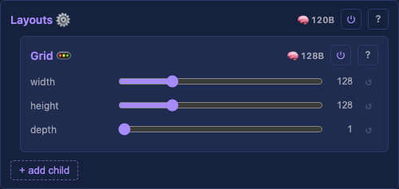
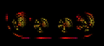
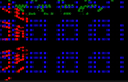
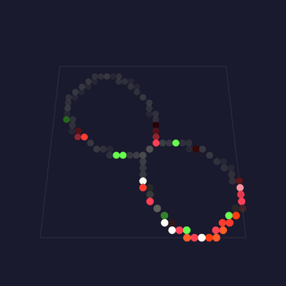

# Layouts

Every layout, one block each: what it does and what each control means — together. A layout maps light indices to physical `(x, y, z)` positions — it defines the *shape* an [effect](effects.md) draws onto and a [driver](drivers.md) sends out. The [Layouts](moxygen/Layouts.md) container holds one or more layout children and composes them into one coordinate space; a [Layer](moxygen/Layer.md) renders over that combined space. (For how this page maps to the source/asset folders, see the [folder-structure decision](../../contributing/documentation-standards.md#module-pages).)

## MoonLight layouts

### Car Lights

A pair of concentric-ring "headlight" clusters (nested rings of 1/8/12/16/24 LEDs) positioned to mimic a car's front lights — a fixed arrangement composed from [Ring](#ring) geometry.

- `scale` — overall size scale (1–10).

Origin: Eric Marciniak (Discord) — custom car-lights fixture

Detail: [technical](moxygen/CarLightsLayout.md)

### Cube

A 3D cube volume, `width`×`height`×`depth`, wired in a configurable axis order with optional per-axis serpentine — the 3D generalisation of Panel.

- `width` / `height` / `depth` — cube extent per axis (1–128).
- `wiringOrder` — the axis nesting order the strip follows.
- `X++` / `Y++` / `Z++` — count up (vs down) along that axis.
- `snakeX` / `snakeY` / `snakeZ` — serpentine (alternate rows/columns reverse) on that axis.

Origin: MoonLight · via [MoonLight](https://github.com/MoonModules/MoonLight/blob/main/src/MoonLight/Nodes/Layouts/L_MoonLight.h)

Detail: [technical](moxygen/CubeLayout.md)

### Human-Sized Cube

A hollow walk-in cube built from five LED-curtain faces (front, back, top, left, right), each a `width`×`height`×`depth` curtain — for large/room-scale cube installations.

- `width` / `height` / `depth` — cube extent per axis (1–20).

Origin: MoonLight · via [MoonLight](https://github.com/MoonModules/MoonLight/blob/main/src/MoonLight/Nodes/Layouts/L_MoonLight.h)

Detail: [technical](moxygen/HumanSizedCubeLayout.md)

### Panel

A 2D matrix panel with full wiring control: choose the axis order, per-axis direction, and serpentine — the general matrix layout ([Grid](#grid) is the simple case).

- `panelWidth` / `panelHeight` — panel size in lights (1–512).
- `wiringOrder` — `XY` (rows) or `YX` (columns) nesting.
- `X++` / `Y++` — count up vs down along that axis.
- `snake` — serpentine wiring (alternate lines reverse).

Origin: MoonLight · via [MoonLight](https://github.com/MoonModules/MoonLight/blob/main/src/MoonLight/Nodes/Layouts/L_MoonLight.h)

Detail: [technical](moxygen/PanelLayout.md)

### Panels

Tiles an M×N grid of full matrix panels into one large display: an outer walk over the panel grid plus an inner walk over each panel's lights, both independently wired — for multi-panel video walls.

- `horizontalPanels` / `verticalPanels` — panel-grid size (1–32 each).
- `wiringOrderP` / `X++P` / `Y++P` / `snakeP` — the panel-to-panel wiring (order, direction, serpentine).
- `panelWidth` / `panelHeight` — each panel's size (1–512).
- `wiringOrder` / `X++` / `Y++` / `snake` — the per-panel light wiring.

Origin: MoonLight · via [MoonLight](https://github.com/MoonModules/MoonLight/blob/main/src/MoonLight/Nodes/Layouts/L_MoonLight.h)

Detail: [technical](moxygen/PanelsLayout.md)

### Ring

A single ring of LEDs evenly spaced around a circle — `nrOfLEDs` points, starting at `angleFirst`, spanning `rotation` degrees.

- `nrOfLEDs` — LEDs around the ring (1–255).
- `angleFirst` — starting angle in degrees.
- `rotation` — arc spanned (360 = full circle).
- `clockwise` — direction of travel.
- `scale` — spacing/radius scale.

Origin: MoonLight · via [MoonLight](https://github.com/MoonModules/MoonLight/blob/main/src/MoonLight/Nodes/Layouts/L_MoonLight.h)

Detail: [technical](moxygen/RingLayout.md)

### Rings 241

The classic 241-LED concentric-ring disc: nested rings of 1, 8, 12, 16, 24, 32, 40, 48, 60 LEDs sharing a center.

- `scale` — overall radius scale (1–10).
- `outside in`: light 0 on the outer ring, wired inward, instead of at the center wired outward. The direction around each ring is unchanged.
- `angleFirst`: where light 0 of each ring sits, in degrees from the bottom (0-359), the same control [Ring](#ring) has. A disc is soldered with its first LED wherever the builder started, so this turns the image to match the hardware rather than re-wiring it. 0 is the unrotated placement.

Origin: MoonLight · via [MoonLight](https://github.com/MoonModules/MoonLight/blob/main/src/MoonLight/Nodes/Layouts/L_MoonLight.h)

Detail: [technical](moxygen/Rings241Layout.md)

### Single Column

A vertical line of LEDs at a fixed X — the 1D column primitive.

- `starting Y` — the column's start row.
- `height` — LEDs in the column (1–1000).
- `X position` — the column's x.
- `reversed order` — wire top-to-bottom instead of bottom-to-top.

Origin: MoonLight · via [MoonLight](https://github.com/MoonModules/MoonLight/blob/main/src/MoonLight/Nodes/Layouts/L_MoonLight.h)

Detail: [technical](moxygen/SingleColumnLayout.md)

### Single Row

A horizontal line of LEDs at a fixed Y — the 1D row primitive.

- `starting X` — the row's start column.
- `width` — LEDs in the row (1–1000).
- `Y position` — the row's y.
- `reversed order` — wire right-to-left instead of left-to-right.

Origin: MoonLight · via [MoonLight](https://github.com/MoonModules/MoonLight/blob/main/src/MoonLight/Nodes/Layouts/L_MoonLight.h)

Detail: [technical](moxygen/SingleRowLayout.md)

### Spiral

A conical spiral: `ledCount` LEDs winding up a cone from `bottomRadius` to a point over `height`.

- `ledCount` — LEDs along the spiral (1–2048).
- `bottomRadius` — radius at the base.
- `height` — spiral height.

Origin: MoonLight · via [MoonLight](https://github.com/MoonModules/MoonLight/blob/main/src/MoonLight/Nodes/Layouts/L_MoonLight.h)

Detail: [technical](moxygen/SpiralLayout.md)

### Toronto Bar Gourds

Maps a set of decorative "gourd" objects (a specific bar installation), each rendered at one of three granularities — one light per gourd, per side, or per LED.

- `granularity` — `One Gourd One Light`, `One Side One Light`, or `One LED One Light`.
- `nrOfLightsPerGourd` — LEDs per gourd in the coarsest mode (1–128).

Origin: [troyhacks](https://github.com/troyhacks/WLED) — custom Toronto bar gourd installation

Detail: [technical](moxygen/TorontoBarGourdsLayout.md)

### Tubes

Parallel vertical tubes: `nrOfTubes` columns of `ledsPerTube` LEDs, spaced `tubeDistance` apart.

- `nrOfTubes` — number of tubes (1–64).
- `ledsPerTube` — LEDs per tube (1–255).
- `tubeDistance` — spacing between tubes.
- `reversed` — reverse the wiring order.

Origin: MoonLight · via [MoonLight](https://github.com/MoonModules/MoonLight/blob/main/src/MoonLight/Nodes/Layouts/L_MoonLight.h)

Detail: [technical](moxygen/TubesLayout.md)

## projectMM-native layouts

### MoonLive

Where the lights physically are, written as text on the running device. A layout is the one part of the pipeline that differs for every build: a ring, a spiral staircase, a costume sewn last night. A script means the person who hung the lights describes where they went, and sees it immediately. The language is [MoonLive](moonlive.md).

- `script`: which `.mll` file runs, picked from the library and edited here.
- Everything the script declares appears as a real control.

Origin: projectMM original

Detail: [technical](moxygen/MoonLiveLayout.md) · [how the count is known](#moonlive-details)

[Tests](../../reference/tests/unit-tests.md#moonlivelayout)

### Grid

A dense 3D grid, row-major (x fastest, then y, then z); every position maps to a light.

- `width` / `height` / `depth` — grid extent on each axis in lights (1–512).
- `serpentine` — boustrophedon-wire alternate rows (every other row runs in reverse, matching a snaked strip).

Origin: MoonLight · via [MoonLight](https://github.com/MoonModules/MoonLight/blob/main/src/MoonLight/Nodes/Layouts/L_MoonLight.h)

Detail: [technical](moxygen/GridLayout.md)

[Tests](../../reference/tests/unit-tests.md#gridlayout)

### GridBlacks

A [Grid](#grid) with **mid-strand dark columns (a spacer)**. Columns `[blackStart, blackStart+blackCount)` are held black in every row, for a sealed/continuous panel that must stay dark down a strip, or a slat wall. A dark column is still a physical wire position the driver clocks, so WS2812 data flows *through* the unlit LEDs to reach the lit columns beyond; the lit columns keep their true positions (the picture is holed, not squeezed), so an effect maps straight across the gap. Use plain [Grid](#grid) when you need no dark columns.

- `width` / `height` / `depth` — grid extent on each axis in lights (1–512).
- `serpentine` — boustrophedon-wire alternate rows.
- `blackCount` — number of dark columns; `0` (the default) means no gap, so it renders exactly like a Grid.
- `blackStart` — first dark column (shown only once `blackCount` is set).

Origin: projectMM

Detail: [technical](moxygen/GridBlacksLayout.md)

[Tests](../../reference/tests/unit-tests.md#gridblackslayout)

### Sphere

Lights on the surface of a hollow sphere — a one-light-thick shell inside a `(2·radius+1)³` box, no interior lights.

- `radius` — surface radius in light-units (1–64); the shell is every cell whose distance from the center rounds to `radius`.

Origin: MoonLight · via [MoonLight](https://github.com/MoonModules/MoonLight/blob/main/src/MoonLight/Nodes/Layouts/L_MoonLight.h)

Detail: [technical](moxygen/SphereLayout.md)

[Tests](../../reference/tests/unit-tests.md#spherelayout)

### Wheel

A bicycle-wheel: `spokes` straight rows radiate from a center hub, each carrying `ledsPerSpoke` LEDs spaced one unit apart outward.

- `spokes` — number of spokes radiating from the hub (2–64).
- `ledsPerSpoke` — LEDs along each spoke, spaced one unit apart from the center outward.

Origin: MoonLight · via [MoonLight](https://github.com/MoonModules/MoonLight/blob/main/src/MoonLight/Nodes/Layouts/L_MoonLight.h)

Detail: [technical](moxygen/WheelLayout.md)

[Tests](../../reference/tests/unit-tests.md#wheellayout)

The [Layouts](moxygen/Layouts.md) container itself takes no controls — see its page for coordinate iteration, reordering, and rebuild propagation.

## MoonLive, details

#### How the light count is known

A layout answers how many lights before it produces a single coordinate, because the Layer sizes its buffer from that number and only then asks where each light is. A script cannot be asked how many without running it.

So it runs twice. The first pass counts what `addLight` places, and the second emits each position. Same script and same arithmetic, so a deterministic script agrees with itself, which is what the compiled layouts do for the same reason.

Nothing is stored between the passes. Staging 16,384 coordinates costs 48 KB, which a classic ESP32 driving that many lights does not have spare. Running the script again is cheaper than remembering what it said.

A script calling `random16` breaks that determinism. The passes disagree on the count when a random value decides a loop bound, while a random coordinate keeps the count right and places the lights elsewhere on the second pass.

#### What a layout script is given

`addLight(x, y, z)` places the next light along the strand. There is no index, because the order the script calls it in is the strand order.

`t` is the one system variable a layout reads, and it is always 0: the script runs twice per rebuild and must agree with itself. `width`, `height` and `depth` read 0, since a layout is upstream of the grid it defines.

A script names its own size controls, such as `cols` and `rows`. The pipeline derives the bounding box from the coordinates actually placed, so a size passed in from outside would be a second answer that could disagree with the first.
