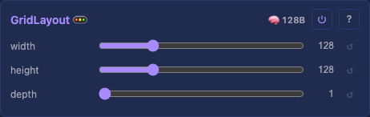

# Grid Layout

Arranges lights in a 3D grid (row-major: x varies fastest, then y, then z). Full-density mapping — every position maps to a light.

## Controls

- `width`, `height` (default `defaultGridSize` = 16, range 1–512)
- `depth` (default 1, range 1–512)

## Coordinate Iterator

Yields `(physicalIndex, x, y, z)` for each light in row-major order (X then Y then Z).

## Mapping

Grid with default settings (no serpentine, X-then-Y order) is **1:1 unshuffled** — `oneToOneMapping` flag set, mapping table skipped entirely. Layer buffer and driver buffer are separate when memory allows (for parallelism), shared when memory is tight.

## Edge cases

- Width or height = 0: prevented by min=1 on controls.
- Very large grids may exceed available memory for buffer allocation.

## Tests

[Unit tests: GridLayout](../../../tests/unit-tests.md#gridlayout) — row-major coordinate iteration, 3D grids, Layouts multi-layout offset.

## Prior art

### MoonLight — L_MoonLight.h Panel ([source](https://github.com/MoonModules/MoonLight/blob/main/src/MoonLight/Nodes/Layouts/L_MoonLight.h))

Panel layout with serpentine, multiple panel arrangements. Uses `addLight()` to define each position.

### projectMM v1 — GridLayout ([source](https://github.com/ewowi/projectMM-v1/blob/54b50bc/src/modules/layouts/GridLayout.h))

Width/height/depth/serpentine controls. Mapping rebuilt in onUpdate(), parent notified via onChildrenReady().

### projectMM v2 — GridLayoutModule ([source](https://github.com/ewowi/projectMM-v2/blob/main/src/modules/lights/GridLayoutModule.h))

Same controls. Uses LayoutModule base class.
