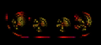
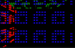

# Layouts

Every layout, one block each: what it does and what each control means — together. A layout maps light indices to physical `(x, y, z)` positions — it defines the *shape* an [effect](../effects/effects.md) draws onto and a [driver](../drivers/) sends out. The [Layouts](../Layouts.md) container holds one or more layout children and composes them into one coordinate space; a [Layer](../Layer.md) renders over that combined space. (For how this page maps to the source/asset folders, see the [folder-structure decision](../../../backlog/folder-structure-proposal.md).)

## MoonLight layouts

### Car Lights

A pair of concentric-ring "headlight" clusters (nested rings of 1/8/12/16/24 LEDs) positioned to mimic a car's front lights — a fixed arrangement composed from [Ring](#ring) geometry.

- `scale` — overall size scale (1–10).

### Cube

A 3D cube volume, `width`×`height`×`depth`, wired in a configurable axis order with optional per-axis serpentine — the 3D generalisation of Panel.

- `width` / `height` / `depth` — cube extent per axis (1–128).
- `wiringOrder` — the axis nesting order the strip follows.
- `X++` / `Y++` / `Z++` — count up (vs down) along that axis.
- `snakeX` / `snakeY` / `snakeZ` — serpentine (alternate rows/columns reverse) on that axis.

### Human-Sized Cube

A hollow walk-in cube built from five LED-curtain faces (front, back, top, left, right), each a `width`×`height`×`depth` curtain — for large/room-scale cube installations.

- `width` / `height` / `depth` — cube extent per axis (1–20).

### Panel

A 2D matrix panel with full wiring control: choose the axis order, per-axis direction, and serpentine — the general matrix layout ([Grid](#grid) is the simple case).

- `panelWidth` / `panelHeight` — panel size in lights (1–512).
- `wiringOrder` — `XY` (rows) or `YX` (columns) nesting.
- `X++` / `Y++` — count up vs down along that axis.
- `snake` — serpentine wiring (alternate lines reverse).

### Panels

Tiles an M×N grid of full matrix panels into one large display: an outer walk over the panel grid plus an inner walk over each panel's lights, both independently wired — for multi-panel video walls.

- `horizontalPanels` / `verticalPanels` — panel-grid size (1–32 each).
- `wiringOrderP` / `X++P` / `Y++P` / `snakeP` — the panel-to-panel wiring (order, direction, serpentine).
- `panelWidth` / `panelHeight` — each panel's size (1–512).
- `wiringOrder` / `X++` / `Y++` / `snake` — the per-panel light wiring.

### Ring

A single ring of LEDs evenly spaced around a circle — `nrOfLEDs` points, starting at `angleFirst`, spanning `rotation` degrees.

- `nrOfLEDs` — LEDs around the ring (1–255).
- `angleFirst` — starting angle in degrees.
- `rotation` — arc spanned (360 = full circle).
- `clockwise` — direction of travel.
- `scale` — spacing/radius scale.

### Rings 241

The classic 241-LED concentric-ring disc: nested rings of 1, 8, 12, 16, 24, 32, 40, 48, 60 LEDs sharing a centre.

- `scale` — overall radius scale (1–10).

### Single Column

A vertical line of LEDs at a fixed X — the 1D column primitive.

- `starting Y` — the column's start row.
- `height` — LEDs in the column (1–1000).
- `X position` — the column's x.
- `reversed order` — wire top-to-bottom instead of bottom-to-top.

### Single Row

A horizontal line of LEDs at a fixed Y — the 1D row primitive.

- `starting X` — the row's start column.
- `width` — LEDs in the row (1–1000).
- `Y position` — the row's y.
- `reversed order` — wire right-to-left instead of left-to-right.

### Spiral

A conical spiral: `ledCount` LEDs winding up a cone from `bottomRadius` to a point over `height`.

- `ledCount` — LEDs along the spiral (1–2048).
- `bottomRadius` — radius at the base.
- `height` — spiral height.

### Toronto Bar Gourds

Maps a set of decorative "gourd" objects (a specific bar installation), each rendered at one of three granularities — one light per gourd, per side, or per LED.

- `granularity` — `One Gourd One Light`, `One Side One Light`, or `One LED One Light`.
- `nrOfLightsPerGourd` — LEDs per gourd in the coarsest mode (1–128).

### Tubes

Parallel vertical tubes: `nrOfTubes` columns of `ledsPerTube` LEDs, spaced `tubeDistance` apart.

- `nrOfTubes` — number of tubes (1–64).
- `ledsPerTube` — LEDs per tube (1–255).
- `tubeDistance` — spacing between tubes.
- `reversed` — reverse the wiring order.

## projectMM-native layouts

### Grid

A dense 3D grid, row-major (x fastest, then y, then z); every position maps to a light.

- `width` / `height` / `depth` — grid extent on each axis in lights (1–512).
- `serpentine` — boustrophedon-wire alternate rows (every other row runs in reverse, matching a snaked strip).

[Tests](../../../tests/unit-tests.md#gridlayout)

### Sphere

Lights on the surface of a hollow sphere — a one-light-thick shell inside a `(2·radius+1)³` box, no interior lights.

- `radius` — surface radius in light-units (1–64); the shell is every cell whose distance from the centre rounds to `radius`.

[Tests](../../../tests/unit-tests.md#spherelayout)

### Wheel

A bicycle-wheel: `spokes` straight rows radiate from a centre hub, each carrying `ledsPerSpoke` LEDs spaced one unit apart outward.

- `spokes` — number of spokes radiating from the hub (2–64).
- `ledsPerSpoke` — LEDs along each spoke, spaced one unit apart from the centre outward.

[Tests](../../../tests/unit-tests.md#wheellayout)

The [Layouts](../Layouts.md) container itself takes no controls — see its page for coordinate iteration, reordering, and rebuild propagation.

## Source

- [CarLightsLayout.h](../../../../src/light/layouts/CarLightsLayout.h)
- [CubeLayout.h](../../../../src/light/layouts/CubeLayout.h)
- [GridLayout.h](../../../../src/light/layouts/GridLayout.h)
- [HumanSizedCubeLayout.h](../../../../src/light/layouts/HumanSizedCubeLayout.h)
- [PanelLayout.h](../../../../src/light/layouts/PanelLayout.h)
- [PanelsLayout.h](../../../../src/light/layouts/PanelsLayout.h)
- [RingLayout.h](../../../../src/light/layouts/RingLayout.h)
- [Rings241Layout.h](../../../../src/light/layouts/Rings241Layout.h)
- [SingleColumnLayout.h](../../../../src/light/layouts/SingleColumnLayout.h)
- [SingleRowLayout.h](../../../../src/light/layouts/SingleRowLayout.h)
- [SphereLayout.h](../../../../src/light/layouts/SphereLayout.h)
- [SpiralLayout.h](../../../../src/light/layouts/SpiralLayout.h)
- [TorontoBarGourdsLayout.h](../../../../src/light/layouts/TorontoBarGourdsLayout.h)
- [TubesLayout.h](../../../../src/light/layouts/TubesLayout.h)
- [WheelLayout.h](../../../../src/light/layouts/WheelLayout.h)
